# 🚪 Ports and protocols

### *The numbers you have to know on sight — and the insecure/secure pairs*

📌 *Pure memorisation, and therefore free marks. Learn the table until recall is instant, then learn which protocols have a secure replacement.*

---

## 🧸 The big idea

The village's one main hall handles grain requests, healing requests, and outgoing messages, all
at the same address — "the main hall." But the hall has a different window for each: the grain
window, the healer's door, the message slot. Knowing the hall's address gets you to the right
**building**. Knowing which window gets you to the right **person inside** it.

That's the whole idea. An IP address gets traffic to the right **machine**. A **port number**
gets it to the right **program** on that machine.

One server can run a website, a mail service and a file transfer service simultaneously. All
three share one IP address. The port number is how the machine knows which program an arriving
packet belongs to: port 443 goes to the web server, port 25 to the mail server.

Ports live at **layer 4**, the transport layer, alongside TCP and UDP.

Here's the second layer worth noticing: shouting your grain request through an open window means
anyone standing nearby hears exactly what you asked for and what you got back. Passing a sealed,
coded note through a private slot instead means nobody outside can read it even if they see it
change hands. **Most of the classic protocols were designed without encryption and have a secure
replacement.** FTP has SFTP. HTTP has HTTPS. Telnet has SSH. Knowing those pairs answers a whole
class of question — "which protocol should replace this one?"

---

## 📖 Words you will keep seeing

| Word | What it means on this exam |
|---|---|
| **Port** | A 16-bit number identifying a specific service or application on a host. Layer 4. |
| **Well-known ports** | **0–1023.** Reserved for standard services. |
| **Registered ports** | **1024–49151.** Assigned to specific applications on request. |
| **Dynamic / ephemeral ports** | **49152–65535.** Temporary, used by clients for outbound connections. |
| **Socket** | An IP address and port together — `192.0.2.10:443`. |
| **Protocol** | An agreed set of rules for communication. |
| **Cleartext protocol** | One transmitting data unencrypted, readable by anyone in the path. |

---

## 🔢 The port ranges

> 🎯 **0–1023 is well-known.** That boundary is asked directly. The other two ranges are worth
> recognising but are tested far less often.

---

## 📋 The ports to memorise

Learn this table cold. It is the highest ratio of marks to effort anywhere on the exam.

| Port | Protocol | What it does | TCP/UDP | Secure? |
|:--:|---|---|:--:|:--:|
| **20, 21** | **FTP** | File transfer | TCP | ❌ cleartext |
| **22** | **SSH / SFTP / SCP** | Secure remote shell and file transfer | TCP | ✅ |
| **23** | **Telnet** | Remote terminal | TCP | ❌ **cleartext — never use** |
| **25** | **SMTP** | Sending email | TCP | ❌ |
| **53** | **DNS** | Name resolution | **UDP** (and TCP) | ❌ |
| **67, 68** | **DHCP** | Automatic IP configuration | UDP | ❌ |
| **69** | **TFTP** | Trivial file transfer | UDP | ❌ |
| **80** | **HTTP** | Web | TCP | ❌ cleartext |
| **110** | **POP3** | Retrieving email (downloads) | TCP | ❌ |
| **143** | **IMAP** | Retrieving email (stays on server) | TCP | ❌ |
| **161, 162** | **SNMP** | Network device management | UDP | ❌ (v1/v2) |
| **389** | **LDAP** | Directory services | TCP | ❌ |
| **443** | **HTTPS** | Web over TLS | TCP | ✅ |
| **445** | **SMB** | Windows file sharing | TCP | — |
| **636** | **LDAPS** | LDAP over TLS | TCP | ✅ |
| **3389** | **RDP** | Windows remote desktop | TCP | — |

Read it as a sentence: **the IP address finds the machine, and the port number finds the program
on it.** One address, many doors.

### The essential dozen

If time is short, these are the ones that appear most:

**21 FTP · 22 SSH · 23 Telnet · 25 SMTP · 53 DNS · 80 HTTP · 110 POP3 · 143 IMAP · 389 LDAP ·
443 HTTPS · 445 SMB · 3389 RDP**

---

## 🔒 The insecure / secure pairs

A recurring question type: *"which protocol should replace X?"*

| Insecure | Port | Replace with | Port |
|---|:--:|---|:--:|
| Telnet | 23 | **SSH** | 22 |
| FTP | 21 | **SFTP** | 22 |
| HTTP | 80 | **HTTPS** | 443 |
| LDAP | 389 | **LDAPS** | 636 |
| SNMPv1/v2 | 161 | **SNMPv3** | 161 |
| POP3 | 110 | POP3S | 995 |
| IMAP | 143 | IMAPS | 993 |

> [!IMPORTANT]
> **Telnet is the exam's favourite example of a protocol that should never be used.** It
> transmits credentials in cleartext. If a question describes an administrator connecting to a
> device over Telnet, the problem is cleartext credentials and the answer is SSH.

> ⚠️ **SFTP and FTPS are different things.** **SFTP** is file transfer over SSH, on port 22.
> **FTPS** is FTP with TLS added, on ports 989/990. If both appear, SFTP over SSH is the more
> commonly expected answer.

---

## 🔬 How you actually check what's listening

**`nmap` finds open ports by exploiting the three-way handshake itself.** A default SYN scan
sends a bare SYN to each port and reads the reply: a **SYN-ACK** means something is genuinely
listening (**open**) — and nmap simply never completes the handshake, so no application ever
even sees a connection. An immediate **RST** (reset) means nothing is listening there
(**closed**). And **silence, or an ICMP "unreachable" message**, usually means a firewall is
dropping the packet outright rather than the port being empty (**filtered**) — a distinction
that matters because "filtered" tells you a control exists, while "closed" tells you it doesn't
need one.

**Checking your *own* machine uses a completely different, non-probing method.** `netstat -tulnp`
(or the newer `ss -tulnp` on Linux) asks the operating system directly which processes have
which ports open right now — no packets sent anywhere, just reading the kernel's own table of
active sockets. This is the tool behind "what's actually running on this server" audits, and
it's how an administrator would confirm, for example, that Telnet on port 23 truly is disabled
rather than just believing a configuration file that says so.

---

## ⚖️ Told apart

| | Means | Not to be confused with |
|---|---|---|
| **Port 22** | SSH — and SFTP and SCP, which run over SSH. | **Port 23**, Telnet, which is the insecure one. Adjacent numbers, opposite security properties. |
| **Port 80** | HTTP, cleartext. | **Port 443**, HTTPS, encrypted with TLS. |
| **POP3 (110)** | Downloads mail to the client, typically removing it from the server. | **IMAP (143)**, which leaves mail on the server and syncs across devices. |
| **SMTP (25)** | **Sends** mail. | **POP3 and IMAP**, which **retrieve** it. SMTP out, POP/IMAP in. |
| **SFTP** | File transfer over **SSH**, port 22. | **FTPS**, which is FTP with TLS, ports 989/990. |
| **Port** | Identifies the application on a host. Layer 4. | **IP address**, which identifies the host. Layer 3. |
| **DNS on 53** | Uses **UDP** for normal queries. | TCP, which DNS uses for zone transfers and large responses. UDP is the expected answer. |

**One arrow out, two arrows back.** If a question says mail cannot be *sent*, it is SMTP; if it
cannot be *received*, it is POP3 or IMAP.

> 🎯 **SMTP sends, POP and IMAP receive.** A question about a user unable to *send* mail points at
> SMTP; unable to *receive* points at POP3 or IMAP.

---

## ⚠️ Where your instinct is wrong

> [!WARNING]
> **In the job:** services run on whatever port you configure, and assuming 443 means HTTPS is
> exactly how people miss things.
>
> **On the exam:** the standard assignment is the answer. Port 443 is HTTPS, port 22 is SSH. Do
> not reason about non-standard configurations unless the question describes one.

> [!WARNING]
> **In the job:** nobody memorises port numbers — you look them up.
>
> **On the exam:** you cannot look them up, and these are among the easiest marks available.
> The table above is worth genuine rote learning.

> [!WARNING]
> **In the job:** DNS over TCP is common, and the UDP/TCP distinction is a detail.
>
> **On the exam:** **DNS is UDP port 53.** TCP is the exception for zone transfers and oversized
> responses. Answer UDP.

---

## 🧠 How to remember it

🧠 **The security pairs are adjacent or memorable:**
**22 secure, 23 insecure** — SSH and Telnet, one apart.
**80 open, 443 closed** — HTTP and HTTPS.

🧠 **Mail, in order of number, in order of use:**
**25 SMTP** (send) → **110 POP3** (fetch and remove) → **143 IMAP** (fetch and keep).

🧠 **LDAP 389 → LDAPS 636.** Both directory, one encrypted.

🧠 **Under 1024 is well-known.** One-oh-two-three is the ceiling.

🧠 **53 is DNS, and DNS is UDP.** Five-three, name-to-address.

---

## ✅ Check you actually got it

Answer all five before expanding anything.

**Q1.** An administrator manages network switches using Telnet. What is the PRIMARY security
concern, and what should be used instead?

- **A.** Telnet is slow; SNMP should be used instead
- **B.** Telnet transmits credentials in cleartext; SSH on port 22 should be used
- **C.** Telnet uses UDP and is unreliable; FTP should be used instead
- **D.** Telnet requires a client installation; RDP should be used instead

<b>Answer</b>

**B — Telnet transmits credentials in cleartext; SSH should replace it.** Anyone able to capture
traffic between administrator and switch can read the username and password directly.

- **A** describes a performance concern rather than a security one, and SNMP is a management
  protocol, not a remote terminal replacement.
- **C** is wrong on the facts — Telnet uses TCP — and FTP is a file transfer protocol that is also
  cleartext, so it would fix nothing.
- **D** raises a deployment inconvenience, and RDP is a graphical desktop protocol rather than a
  terminal replacement for network devices.

**Q2.** Which port does HTTPS use?

- **A.** 80
- **B.** 143
- **C.** 443
- **D.** 8080

<b>Answer</b>

**C — 443.** HTTPS is HTTP over TLS, on TCP port 443.

- **A** is plain HTTP, unencrypted.
- **B** is IMAP, for retrieving email.
- **D** is a common alternative HTTP port used by proxies and application servers, but it is not
  the standard HTTPS assignment.

**Q3.** A user can receive email but cannot send it. Which protocol is MOST likely affected?

- **A.** POP3 on port 110
- **B.** IMAP on port 143
- **C.** SMTP on port 25
- **D.** DNS on port 53

<b>Answer</b>

**C — SMTP on port 25.** SMTP is the sending protocol; the stem describes sending failing while
receiving works.

- **A** and **B** are both *retrieval* protocols. Since the user can receive mail, these are
  evidently working.
- **D** could break mail entirely if name resolution failed, but it would generally affect both
  directions rather than sending alone.

The memory hook does the work here: **SMTP sends, POP and IMAP receive.**

**Q4.** Which range is designated as the well-known ports?

- **A.** 0–1023
- **B.** 1024–49151
- **C.** 49152–65535
- **D.** 0–65535

<b>Answer</b>

**A — 0–1023.** These are reserved for standard services such as HTTP, SSH and DNS.

- **B** is the registered range, assigned to specific applications on request.
- **C** is the dynamic or ephemeral range, used temporarily by clients for outbound connections.
- **D** is the entire 16-bit port space, not a designated range within it.

**Q5.** Which pairing of protocol and port is INCORRECT?

- **A.** SSH — 22
- **B.** DNS — 53
- **C.** RDP — 3389
- **D.** LDAP — 636

<b>Answer</b>

**D — LDAP is port 389**, not 636. Port **636** is **LDAPS**, the TLS-protected version. The stem
is inverted, so you are hunting the one wrong pairing among three correct ones.

- **A** is correct: SSH, and SFTP and SCP which run over it, use port 22.
- **B** is correct: DNS uses port 53, primarily over UDP.
- **C** is correct: RDP uses TCP port 3389.

Note the inverted stem — three statements are true and one is false, which is the highest-error
question type on any exam.

---

## 🎓 The grown-up version

<b>Extra depth — open this on a second read, never needed for the pass</b>

**Why the insecure protocols still exist.** FTP, Telnet and SNMPv1 date from an era when networks
were small, trusted and academic, and encryption was computationally expensive. They survive
because of embedded devices, industrial equipment and legacy systems whose vendors are long gone.
This is a large part of why network segmentation matters so much in operational technology
environments — the protocols cannot be fixed, so the network around them has to compensate. That
is a compensating control in the exact sense of the term.

**Port numbers are a convention, not an enforcement.** Nothing stops an administrator running SSH
on port 443, and attackers routinely place command-and-control traffic on 443 precisely because it
is almost never blocked outbound. This is why port-based firewall rules alone are weak, and why
application-aware inspection exists — it identifies the protocol by its behaviour rather than
trusting the port number. The exam works in the convention-based model.

**Changing a port is not security.** Moving SSH from 22 to 2222 reduces log noise from
opportunistic scanners and is sometimes worth doing for that reason alone. It does not defend
against anyone who scans the full range, which takes seconds. It is obscurity, not a control, and
in an exam context an option offering "change the default port" as a security solution is a
distractor.

**SMTP's authentication history.** Original SMTP had no authentication at all, which is why open
relays were once ubiquitous and why email spoofing remains trivially easy at the protocol level.
The whole apparatus of SPF, DKIM and DMARC exists to retrofit sender verification onto a protocol
that never had it. Modern mail submission uses port 587 with authentication, while port 25 is
increasingly reserved for server-to-server relay — a distinction worth knowing operationally,
though CC works with port 25 as "SMTP".

**Ephemeral ports and firewall state.** When your browser connects to a web server on port 443, it
uses a random high port as the *source*. Return traffic arrives at that ephemeral port, and a
stateful firewall permits it because it remembers the outbound connection. That state table is
what makes modern firewalls usable, and exhausting it is what some denial-of-service attacks
target.

---

## 📝 Cram lines

Destined for [`EXAM-DAY.md`](../../EXAM-DAY.md):

- **20/21 FTP · 22 SSH/SFTP · 23 Telnet · 25 SMTP · 53 DNS · 67/68 DHCP · 69 TFTP · 80 HTTP**
- **110 POP3 · 143 IMAP · 161/162 SNMP · 389 LDAP · 443 HTTPS · 445 SMB · 636 LDAPS · 3389 RDP**
- **Well-known ports = 0–1023.** Registered 1024–49151. Dynamic 49152–65535.
- **Replace: Telnet(23)→SSH(22) · FTP(21)→SFTP(22) · HTTP(80)→HTTPS(443) · LDAP(389)→LDAPS(636)**
- **Telnet = cleartext credentials.** The exam's favourite "never use this".
- **SMTP sends (25). POP3 (110) and IMAP (143) receive.** POP3 downloads and removes; IMAP leaves it on the server.
- **DNS is UDP 53.**
- **SFTP = over SSH, port 22. FTPS = FTP with TLS, 989/990.** Different things.
- **Ports are layer 4.** IP address = the machine; port = the program.

---

<a href="../README.md">← back to 04 · Networking and Cloud Security Concepts</a> &nbsp;·&nbsp; <a href="../network-threats/">next: Network threats →</a>

