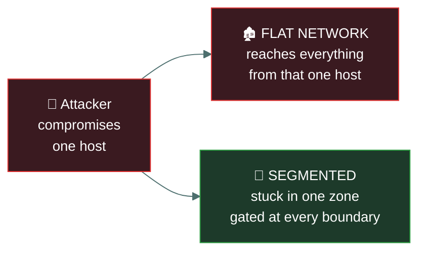
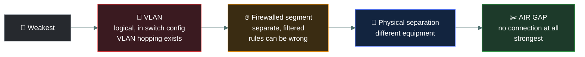

# 🧱 Segmentation and the DMZ

### *Dividing the network so one compromise does not become all of them*

📌 *Why a flat network is dangerous, what a DMZ is for, and the three-word answer to most segmentation questions: limits lateral movement.*

---

## 🧸 The big idea

A village with no internal doors at all — just one outer gate, then open ground all the way to
the chief's own treasure hut — is a **flat network.** Slip past the one gate, and you can walk
straight into everything, including the treasure.

Now put internal walls between the market, the living huts, and the treasure hut, each with its
own gate. Someone who sneaks past the outer gate into the market is still stuck there — the next
wall is gated too. That's **segmentation.** The attacker who lands in one zone finds the next one
gated.

Segmentation does not stop the initial compromise. It **limits the damage** — it constrains
**lateral movement**, the attacker's sideways spread from their first foothold towards what they
actually want.

> 🎯 **"Limits lateral movement" is the answer to most segmentation questions.** If an option says
> segmentation prevents intrusion, it is wrong — it contains one.

Outside traders never enter the real village at all — they only ever reach a separate trading
post built just outside the walls, close enough to be useful but structurally apart. Even if
bandits somehow overrun the trading post, they still haven't breached the village itself. That
trading post is a **DMZ**: a buffer zone for servers that must be reachable from the internet,
positioned so that compromising one does not deliver the internal network.

---

## 📖 Words you will keep seeing

| Word | What it means on this exam |
|---|---|
| **Segmentation** | Dividing a network into separate zones with controlled traffic between them. |
| **Flat network** | An unsegmented network where any host can reach any other. |
| **Lateral movement** | An attacker moving sideways between systems after an initial compromise. |
| **VLAN** — Virtual LAN | A logical network segment created in switch configuration rather than by physical separation. |
| **DMZ** — Demilitarised Zone | A network segment holding internet-facing services, isolated from the internal network. Also called a **screened subnet** or **perimeter network**. |
| **Screened subnet** | The current preferred term for a DMZ. |
| **Bastion host** | A hardened, exposed host specifically built to withstand attack. |
| **Microsegmentation** | Segmentation down to individual workloads. |
| **Air gap** | Complete physical isolation from other networks. |
| **Defence in depth** | Layering independent controls so no single failure is fatal. |
| **Jump box / jump server** | A controlled host through which administrators reach sensitive segments. |

---

## 🔍 Why segmentation matters

**What segmentation buys you:**

- **Contains a breach** to one zone
- **Limits lateral movement** — the key phrase
- **Reduces the scope of compliance** — card data in its own segment means the rest of the network
  is out of scope for PCI DSS
- **Isolates what cannot be secured** — legacy systems that cannot be patched
- **Improves monitoring**, since traffic crossing a boundary is a natural inspection point

> 🎯 **Segmentation is a compensating control for unpatchable systems.** A legacy device the vendor
> no longer supports is isolated on its own segment because the correct control — patching — is
> unavailable.

---

## 🌐 The DMZ

A **DMZ** holds services that must be reachable from the internet: web servers, public mail
relays, public DNS. It sits between the internet and the internal network, with firewall rules on
both sides.

**The rule that defines it:**

> The internet may reach the DMZ. The DMZ may **not** freely reach the internal network.

That asymmetry is the whole point. A web server in the DMZ *will* eventually be compromised —
it is exposed by design. When it is, the attacker finds another firewall between them and
anything valuable, rather than an open internal network.

| Zone | Trust | Reachable from internet |
|---|---|---|
| **Internet** | Untrusted | — |
| **DMZ / screened subnet** | **Semi-trusted** | ✅ Yes |
| **Internal network** | Trusted | ❌ **No** |

> ⚠️ **"Screened subnet" is the modern term for a DMZ.** Both appear in exam material and mean the
> same thing.

**A bastion host** is a hardened system deliberately exposed to attack — stripped of unnecessary
services, tightly configured, heavily monitored. DMZ hosts should be built this way.

---

## 🔀 VLANs

A **VLAN** creates logical segments on shared physical switching. Devices on different VLANs
cannot communicate directly even when plugged into the same switch; traffic between them must
pass through a router or firewall, where it can be filtered.

**Why VLANs are used:** segmentation without rewiring, separating departments or device classes
(guest wi-fi, voice, cameras, building systems), and reducing broadcast traffic.

> ⚠️ **VLANs are a logical boundary, not a strong security boundary.** **VLAN hopping** attacks
> exist, so a VLAN is not equivalent to physical separation. Where isolation genuinely matters,
> the exam expects physical separation or an air gap.

Left to right, isolation gets **stronger and less convenient.** A VLAN is a configuration an
attacker may defeat; an air gap is an absence of cable.

**An air gap** is complete physical isolation — no network connection at all. It is the strongest
isolation available and used for the most critical systems, at a heavy cost in usability. It is
also not absolute: removable media crosses air gaps, which is how notable incidents against
isolated systems occurred.

---

## 🔬 Micro-segmentation

Traditional segmentation (VLANs, firewall zones) divides the network into a handful of large
zones — a "trusted" internal zone, a DMZ, a guest zone. **Micro-segmentation goes much finer**:
enforcing access policy **between individual workloads**, sometimes down to a single server or
container, regardless of which broad zone they sit in.

| | Traditional segmentation | Micro-segmentation |
|---|---|---|
| **Granularity** | Zone-level (departments, VLANs, DMZ) | Workload-level (individual servers, containers) |
| **Enforced where** | At the network perimeter/gateway between zones | Often at the host or hypervisor, next to each workload |
| **Stops** | An attacker moving between broad zones | An attacker moving **laterally** between workloads *inside* the same zone |

> 🎯 **Why it matters:** once an attacker compromises one server inside a "trusted" zone,
> traditional segmentation does nothing to stop them reaching every other server in that same
> zone. Micro-segmentation enforces least privilege *between workloads*, not just at the
> network edge — the same underlying idea as Zero Trust, applied to network communication.

---

## 🧱 Defence in depth

Segmentation is one expression of a broader principle: **layer independent controls so that no
single failure is fatal.**

The layers must be **independent**. Three controls that all fail when the same directory service
fails are one control wearing three hats.

---

## 🔬 VLAN hopping and the cloud version of a DMZ

**A VLAN's isolation lives in a 4-byte tag inserted into the Ethernet frame** — the **802.1Q**
tag, carrying a VLAN ID from 1–4094. Every switch port checks that tag before deciding where a
frame is allowed to go. **Double-tagging VLAN hopping** exploits how some switches process this:
an attacker crafts a frame with two stacked 802.1Q tags. The first switch strips off the outer
tag (matching the attacker's own, legitimate VLAN) and forwards what's left — which still has
the *second*, inner tag naming the target VLAN — straight onto a trunk link, letting the frame
reach a VLAN the attacker was never actually connected to. This is the literal mechanism behind
"VLAN hopping," not just an abstract warning.

**In AWS or Azure, the DMZ concept is built from a public subnet plus security groups, not a
physical box.** A **public subnet** (one with a route to an internet gateway) hosts the web
tier — the modern DMZ. A **private subnet** has no such route at all; nothing on the internet
can reach it directly, full stop, which is actually a stronger guarantee than a firewall rule
that could be misconfigured. A **security group** attached to the private subnet's instances
then explicitly allows inbound traffic only from the public subnet's specific security group on
the specific port needed — the exact same "DMZ may not freely reach internal" asymmetry,
expressed as reviewable, version-controlled configuration instead of a physical cable plan.

---

## ⚖️ Told apart

| | Means | Not to be confused with |
|---|---|---|
| **Segmentation** | Dividing the network into controlled zones. **Limits lateral movement.** | **Prevention of intrusion.** Segmentation contains a breach; it does not stop one. |
| **DMZ** | A semi-trusted zone for internet-facing services. | **The internal network**, which must never be freely reachable from the DMZ. |
| **DMZ** | The traditional term. | **Screened subnet**, the current term. Same thing. |
| **VLAN** | A **logical** segment in switch configuration. | **Physical separation**, which is stronger. VLAN hopping attacks exist. |
| **Air gap** | Complete physical isolation. | **A firewalled segment**, which still has a connection. |
| **Bastion host** | A hardened, deliberately exposed host. | **A jump box**, used by administrators to *reach* a sensitive segment. Both hardened, different purpose. |
| **Microsegmentation** | Isolation down to individual workloads. | **VLAN segmentation**, which is much coarser. |
| **Defence in depth** | Multiple **independent** layers. | Multiple controls of the same type, which share failure modes. |

---

## ⚠️ Where your instinct is wrong

> [!WARNING]
> **In the job:** the DMZ is a legacy architecture; workloads are in cloud VPCs with security
> groups and there is no "inside".
>
> **On the exam:** the two-firewall DMZ model is examined directly. Know the zones, their trust
> levels, and the rule that the DMZ must not freely reach the internal network.

> [!WARNING]
> **In the job:** VLANs are how you segment, and you would call them a security boundary.
>
> **On the exam:** a VLAN is a **logical** boundary and is **not** equivalent to physical
> separation. VLAN hopping is the reason. Where the question stresses genuine isolation, physical
> separation or an air gap is the stronger answer.

> [!WARNING]
> **In the job:** segmentation is a network design decision driven by performance and management.
>
> **On the exam:** its purpose is **security** — containing breaches and limiting lateral
> movement. Reduced broadcast traffic is a real benefit and rarely the answer.

---

## 🧠 How to remember it

🧠 **Segmentation limits lateral movement.** Three words that answer most questions here.

🧠 **The DMZ rule, one line:** *in from the internet, never freely onward to the inside.*

🧠 **DMZ = screened subnet = perimeter network.** Three names, one thing.

🧠 **VLAN is logical, air gap is physical.** Logical is weaker.

---

## ✅ Check you actually got it

Answer all five before expanding anything.

**Q1.** What is the PRIMARY security benefit of network segmentation?

- **A.** It prevents attackers from gaining initial access to the network
- **B.** It limits an attacker's lateral movement after a compromise
- **C.** It encrypts traffic between network zones
- **D.** It eliminates the need for host-based security controls

<b>Answer</b>

**B — it limits lateral movement after a compromise.** Segmentation is a containment control: it
assumes something will be compromised and constrains how far the attacker can spread.

- **A** overstates it. Segmentation does nothing about the initial foothold, which typically
  arrives by phishing or an exposed service. It governs what happens next.
- **C** is wrong — segmentation controls *reachability* between zones. Encryption is a separate
  control.
- **D** is wrong and contains the flawed logic that a single layer removes the need for others,
  which is the opposite of defence in depth.

**Q2.** A company hosts a public web server. Where should it be placed?

- **A.** On the internal network, protected by the perimeter firewall
- **B.** In a DMZ, isolated from the internal network by a second firewall
- **C.** Directly on the internet with no firewall, to avoid filtering issues
- **D.** On an air-gapped network segment

<b>Answer</b>

**B — in a DMZ, isolated from the internal network by a second firewall.** The server must be
reachable from the internet and will therefore be attacked; the DMZ ensures that compromising it
does not hand over the internal network.

- **A** is the dangerous option. Opening an internet path into the internal network means a
  compromise of the web server places the attacker inside the trusted zone.
- **C** leaves the server entirely unprotected and provides no containment whatsoever.
- **D** is self-defeating — an air-gapped system has no network connection, so a public web server
  could not serve anyone.

**Q3.** Which statement about VLANs is correct?

- **A.** VLANs provide the same level of isolation as physically separate networks
- **B.** VLANs are a logical separation and can be subject to VLAN hopping attacks
- **C.** VLANs encrypt traffic between segments
- **D.** VLANs operate at layer 3 using IP addressing

<b>Answer</b>

**B — VLANs are a logical separation and can be subject to VLAN hopping attacks.** They are
created in switch configuration, so a misconfiguration or an attack against the tagging mechanism
can cross the boundary.

- **A** is the common overstatement this question targets. Logical separation is weaker than
  physical separation, which is exactly why VLAN hopping exists as an attack class.
- **C** is wrong — VLANs segment traffic; they do not encrypt it.
- **D** is wrong: VLANs are a layer 2 construct implemented in switching. Traffic between VLANs
  requires a layer 3 device, which is a different point.

**Q4.** A legacy industrial system cannot be patched because the vendor no longer exists. The
organisation places it on an isolated segment with strict firewall rules and enhanced monitoring.
What kind of control is this?

- **A.** A preventive control that eliminates the vulnerability
- **B.** A compensating control, because the primary control is unavailable
- **C.** A corrective control that repairs the system
- **D.** A deterrent control that discourages attackers

<b>Answer</b>

**B — a compensating control.** Patching is the correct control and is not available, so an
alternative provides comparable protection by another route. That substitution is what defines a
compensating control.

- **A** is wrong twice: the vulnerability still exists in the unpatched system, and "eliminates"
  is an absolute.
- **C** is wrong — nothing is repaired or restored. The system remains exactly as vulnerable as
  before; it is simply harder to reach.
- **D** is wrong: an attacker is not discouraged by segmentation, and would generally not know it
  was there.

**Q5.** Which traffic flow should a properly configured DMZ **prevent**?

- **A.** Internet users reaching the DMZ web server
- **B.** DMZ servers freely initiating connections into the internal network
- **C.** Internal users reaching the internet
- **D.** Administrators managing DMZ servers through controlled paths

<b>Answer</b>

**B — DMZ servers freely initiating connections into the internal network.** This is the
asymmetry that makes a DMZ worth having: an exposed server that is compromised must not become a
route inward.

- **A** is the DMZ's entire purpose. Blocking it would make the public web server pointless.
- **C** is normal outbound business traffic and is unrelated to the DMZ's function.
- **D** is legitimate and expected, through tightly controlled and monitored paths — typically a
  jump box. The word doing the work in the correct answer is **freely**.

---

## 🎓 The grown-up version

<b>Extra depth — open this on a second read, never needed for the pass</b>

**Why flat networks persisted so long.** Segmentation costs money and operational friction: more
firewall rules, more troubleshooting, more change requests, and applications that break in ways
nobody predicted because an undocumented dependency crossed a boundary. Flat networks are easier
to run, and the cost only materialises during an incident. Several of the largest breaches on
record turned on exactly this — an attacker entering through a peripheral system and reaching
payment or customer data because nothing sat in between.

**Microsegmentation and where it came from.** Traditional segmentation is coarse: a handful of
zones defined by subnet. Microsegmentation applies policy per workload, so two servers on the same
subnet can be prevented from talking to each other. It became practical through virtualisation and
software-defined networking, where policy is enforced at the virtual interface rather than by a
physical device in the path. It is the natural implementation of zero trust inside a data centre.

**Cloud changes the shape, not the principle.** There is no cable to unplug in a cloud
environment, and segmentation is expressed through VPCs, subnets, security groups and network
ACLs. The reasoning is unchanged — limit reachability so a compromise is contained — but the
controls are API-driven and can be reasoned about as code. This is a genuine improvement:
segmentation policy in a repository is reviewable and testable in a way that firewall rules
accumulated over fifteen years are not.

**The DMZ's dissolution.** With applications in SaaS, workloads in cloud, and staff working
remotely, the notion of a single perimeter with an inside and an outside has weakened
considerably. Zero trust is the response — treat every request as untrusted regardless of origin
and verify it explicitly. The DMZ concept survives because the underlying logic survives: put the
exposed thing where its compromise does not hand over everything else.

**Air gaps leak.** Stuxnet is the canonical demonstration that physical isolation is not absolute:
removable media, maintenance laptops, and supply chains all cross the gap. Research has also
demonstrated data exfiltration from isolated machines through acoustic, thermal and
electromagnetic channels. Air gapping raises the cost of attack enormously and does not reduce it
to zero — which is the same thing that is true of every control, and worth remembering whenever
something is described as completely secure.

---

## 📝 Cram lines

Destined for [`EXAM-DAY.md`](../../EXAM-DAY.md):

- **Segmentation LIMITS LATERAL MOVEMENT.** It contains a breach; it does not prevent one.
- **DMZ = screened subnet = perimeter network.** Same thing, three names.
- **DMZ rule: the internet may reach the DMZ; the DMZ must NOT freely reach the internal network.**
- **Trust levels: internet = untrusted · DMZ = semi-trusted · internal = trusted.**
- **DMZ holds internet-facing services** — web, public mail relay, public DNS.
- **VLAN = LOGICAL separation**, layer 2, weaker than physical. **VLAN hopping** exists.
- **Air gap = complete physical isolation.** Strongest, and still not absolute (removable media).
- **Bastion host** = hardened exposed host. **Jump box** = controlled route in for admins.
- **Segmentation is the compensating control for unpatchable legacy systems.**
- **Micro-segmentation = workload-level policy**, stopping lateral movement *inside* a zone, not just between zones.
- **Defence in depth needs INDEPENDENT layers**, not several of the same type.

---

<a href="../README.md">← back to 04 · Networking and Cloud Security Concepts</a> &nbsp;·&nbsp; <a href="../vpn-and-remote-access/">next: VPNs and remote access →</a>

