# 🧱 Segmentation and DMZ

### *Walls inside the network, so one break-in doesn't become every break-in*

📌 *Segmentation limits lateral movement; it doesn't prevent the break-in. Know the DMZ rule (in from the internet, never freely onward), that a VLAN is only a logical wall, and that an air gap is the strongest isolation.*

---

## 🧸 The big idea

A ship is built with **watertight compartments**. If the hull is holed, water floods one
compartment and the doors hold it there, so the ship stays afloat. Build the same ship as one big
open hold, and a single hole sinks it.

A network with no internal walls is that open hold: a **flat network**. Once an attacker gets in
anywhere, they can reach everything. **Segmentation** builds the compartments, so an attacker who
gets into one zone finds the next one closed.

Segmentation doesn't stop the hole being made. It **limits how far the water spreads**. In security
terms, it limits **lateral movement**: the attacker's sideways spread from the first machine they
took towards what they actually want.

Some things have to face the outside world, like a public website. A bank solves this with a
**public banking hall**: customers walk in freely, but the vault is behind another locked door.
Trouble in the hall still isn't trouble in the vault. That hall is a **DMZ**: a zone for
internet-facing servers, set apart so that losing one of them doesn't hand over the internal
network.

---

## 📖 Words you will keep seeing

| Word | What it means on this exam |
|---|---|
| **Segmentation** | Dividing a network into separate zones, with controlled traffic between them. |
| **Flat network** | A network with no internal zones, where any machine can reach any other. |
| **Lateral movement** | An attacker moving sideways from machine to machine after getting in. |
| **VLAN** (Virtual LAN) | A network segment created in switch settings rather than with separate cables. |
| **DMZ** (demilitarised zone) | A zone for internet-facing services, kept apart from the internal network. |
| **Screened subnet** | The current name for a DMZ. **Perimeter network** means the same. |
| **Bastion host** | A hardened server that is deliberately exposed and built to withstand attack. |
| **Jump box** (jump server) | A tightly controlled machine that administrators go through to reach a sensitive zone. |
| **Micro-segmentation** | Segmentation right down to individual servers or workloads. |
| **Air gap** | Complete physical isolation: no connection to any other network. |

---

## 🔍 The explanation

### Why segment?

**What segmentation gives you:**

- **It contains a breach** to one zone.
- **It limits lateral movement.** This is the key phrase.
- **It shrinks the scope of compliance.** Put card-payment systems in their own segment, and the
  rest of the network falls outside the card-industry (PCI DSS) audit.
- **It isolates what can't be secured**, such as old systems that can no longer be patched.
- **It makes monitoring easier**, because traffic crossing a boundary is a natural place to
  inspect.

> 🎯 **"Limits lateral movement" answers most segmentation questions.** If an option says
> segmentation *prevents* intrusion, it's wrong. Segmentation contains a break-in; it doesn't stop
> one.

> 🎯 **Segmentation is the compensating control for systems that can't be patched.** When a vendor
> no longer supports an old device, the right control (patching) isn't available, so the device is
> walled off in its own segment instead.

Segmentation is one layer of **defence in depth**: it assumes the outer defences will sometimes
fail, and makes sure a single failure isn't total.

### 🌐 The DMZ

A **DMZ** holds the services that must be reachable from the internet: web servers, public mail
relays and public DNS. It sits between the internet and the internal network, with a firewall on
each side.

**The rule that defines a DMZ:**

> The internet may reach the DMZ. The DMZ may **not** freely reach the internal network.

That one-way rule is the whole point. A web server in the DMZ is exposed on purpose, so sooner or
later it will be attacked. If it falls, the attacker still faces another firewall before anything
valuable, instead of an open internal network.

| Zone | Trust | Reachable from the internet? |
|---|---|---|
| **Internet** | Untrusted | — |
| **DMZ / screened subnet** | **Semi-trusted** | ✅ Yes |
| **Internal network** | Trusted | ❌ **No** |

> ⚠️ **"Screened subnet" is the modern name for a DMZ.** Both names appear in exam material and
> mean the same thing.

A **bastion host** is a server that is deliberately exposed and hardened to match: unneeded
services removed, tightly configured and closely monitored. DMZ servers should be built this way.

### 🔀 VLANs

A **VLAN** splits one physical switch into separate logical networks. Devices on different VLANs
can't talk directly, even when plugged into the same switch. Their traffic has to go through a
router or firewall, where it can be filtered.

**Why VLANs are used:** they segment without rewiring. They separate departments or device types
(guest Wi-Fi, phones, cameras, building systems), and they cut down broadcast traffic.

> ⚠️ **A VLAN is a logical wall, not a strong one.** Attacks called **VLAN hopping** can cross it,
> so a VLAN is not the same as physical separation. Where isolation really matters, the exam
> expects physical separation or an air gap.

From left to right, isolation gets **stronger and less convenient**. A VLAN is a setting an attacker
may get around; an air gap is the absence of a cable.

An **air gap** is used for the most critical systems, at a heavy cost in convenience. Even it isn't
perfect: USB drives and maintenance laptops can carry data across it.

### 🧩 Micro-segmentation

Traditional segmentation divides the network into a handful of big zones: internal, DMZ, guest.
**Micro-segmentation goes much finer.** It puts a policy around each individual workload, sometimes
a single server or container, wherever it sits.

| | Traditional segmentation | Micro-segmentation |
|---|---|---|
| **How fine** | Zones: departments, VLANs, DMZ | Individual servers and containers |
| **Enforced where** | At the boundary between zones | Usually on the host or hypervisor, next to each workload |
| **Stops** | An attacker moving between zones | An attacker moving between machines **inside** the same zone |

> 🎯 **Why it matters:** once an attacker takes one server inside a "trusted" zone, zone walls do
> nothing to stop them reaching the other servers in that zone. Micro-segmentation applies least
> privilege **between workloads**, not only at the edge.

---

## ⚖️ Told apart

| | Means | Not to be confused with |
|---|---|---|
| **Segmentation** | Dividing the network into controlled zones. **Limits lateral movement.** | **Preventing intrusion.** Segmentation contains a break-in; it doesn't stop one. |
| **DMZ** | A semi-trusted zone for internet-facing services. | **The internal network**, which the DMZ must never reach freely. |
| **DMZ** | The traditional name. | **Screened subnet** — the current name for the same thing. |
| **VLAN** | A **logical** segment, set in switch configuration. | **Physical separation** — stronger. VLAN hopping attacks exist. |
| **Air gap** | Complete physical isolation. | **A firewalled segment** — still connected. |
| **Bastion host** | A hardened server that is exposed on purpose. | **A jump box** — the controlled route administrators use to *reach* a sensitive zone. Both hardened, different jobs. |
| **Micro-segmentation** | Walls around individual workloads. | **VLAN segmentation** — much coarser zones. |

---

## ⚠️ Where your instinct is wrong

> [!WARNING]
> **In the job:** the DMZ feels old-fashioned. Workloads live in cloud networks with security
> groups, and there is no real "inside".
>
> **On the exam:** the two-firewall DMZ is tested directly. Know the zones, their trust levels, and
> the rule that the DMZ must not freely reach the internal network.

> [!WARNING]
> **In the job:** VLANs are how you segment, and you'd call them a security boundary.
>
> **On the exam:** a VLAN is a **logical** boundary and is **not** as strong as physical
> separation, because of VLAN hopping. When a question stresses real isolation, physical
> separation or an air gap is the stronger answer.

> [!WARNING]
> **In the job:** segmentation is often a design decision about performance and manageability.
>
> **On the exam:** its purpose is **security**: containing breaches and limiting lateral movement.
> Less broadcast traffic is a real benefit, but it is rarely the answer.

---

## 🧠 How to remember it

**Watertight compartments:** the hole still happens; the flooding stops at the door. Segmentation
**limits lateral movement**.

**The DMZ in one line:** *in from the internet, never freely on to the inside.*

**DMZ = screened subnet = perimeter network.** Three names, one thing.

**VLAN is a setting, an air gap is a missing cable.** The setting is weaker.

---

## ✅ Check you actually got it

Answer all five before expanding anything.

**Q1.** What is the PRIMARY security benefit of network segmentation?

- **A.** It prevents attackers from gaining initial access to the network
- **B.** It limits an attacker's lateral movement after a compromise
- **C.** It encrypts traffic between network zones
- **D.** It eliminates the need for host-based security controls

<b>Answer</b>

**B — it limits lateral movement after a compromise.** Segmentation is a containment control. It
assumes something will be compromised and limits how far the attacker can spread.

- **A** claims too much. Segmentation does nothing about the first foothold, which usually comes
  through phishing or an exposed service. It controls what happens next.
- **C** is wrong: segmentation controls which zones can reach each other. Encryption is a separate
  control.
- **D** is wrong, and its logic is flawed: one layer never removes the need for the others.

**Q2.** A company hosts a public web server. Where should it be placed?

- **A.** On the internal network, protected by the perimeter firewall
- **B.** In a DMZ, isolated from the internal network by a second firewall
- **C.** Directly on the internet with no firewall, to avoid filtering issues
- **D.** On an air-gapped network segment

<b>Answer</b>

**B — in a DMZ, separated from the internal network by a second firewall.** The server must be
reachable from the internet, so it will be attacked. The DMZ makes sure that losing it doesn't hand
over the internal network.

- **A** is the dangerous option. It opens a path from the internet into the internal network, so a
  compromised web server puts the attacker inside the trusted zone.
- **C** leaves the server completely unprotected, with no containment at all.
- **D** defeats itself: an air-gapped system has no network connection, so a public web server
  couldn't serve anyone.

**Q3.** Which statement about VLANs is correct?

- **A.** VLANs provide the same level of isolation as physically separate networks
- **B.** VLANs are a logical separation and can be subject to VLAN hopping attacks
- **C.** VLANs encrypt traffic between segments
- **D.** VLANs operate at layer 3 using IP addressing

<b>Answer</b>

**B — VLANs are a logical separation and can be hit by VLAN hopping.** They exist in switch
configuration, so a misconfiguration or an attack on the tagging can cross the boundary.

- **A** is the overstatement this question is testing. Logical separation is weaker than physical
  separation, which is exactly why VLAN hopping exists.
- **C** is wrong: VLANs separate traffic; they don't encrypt it.
- **D** is wrong: VLANs are a layer 2 feature of switches. Traffic *between* VLANs needs a layer 3
  device, but that is a different point.

**Q4.** A legacy industrial system cannot be patched because the vendor no longer exists. The
organisation places it on an isolated segment with strict firewall rules and enhanced monitoring.
What kind of control is this?

- **A.** A preventive control that eliminates the vulnerability
- **B.** A compensating control, because the primary control is unavailable
- **C.** A corrective control that repairs the system
- **D.** A deterrent control that discourages attackers

<b>Answer</b>

**B — a compensating control.** Patching is the right control but isn't available, so something else
gives similar protection another way. That substitution is what makes it a compensating control.

- **A** is wrong twice: the weakness is still there in the unpatched system, and "eliminates" is an
  absolute.
- **C** is wrong: nothing is repaired. The system is exactly as vulnerable as before; it's just
  harder to reach.
- **D** is wrong: segmentation doesn't discourage an attacker, who usually wouldn't even know it
  was there.

**Q5.** Which traffic flow should a properly configured DMZ **prevent**?

- **A.** Internet users reaching the DMZ web server
- **B.** DMZ servers freely initiating connections into the internal network
- **C.** Internal users reaching the internet
- **D.** Administrators managing DMZ servers through controlled paths

<b>Answer</b>

**B — DMZ servers freely starting connections into the internal network.** This one-way rule is what
makes a DMZ worth having: a compromised exposed server must not become a way in.

- **A** is the DMZ's whole purpose. Blocking it would make the public web server pointless.
- **C** is normal outbound business traffic and has nothing to do with the DMZ's job.
- **D** is legitimate and expected, through tightly controlled and monitored paths, usually a jump
  box. The word doing the work in the right answer is **freely**.

---

## 🎓 The grown-up version

<b>Extra depth — open this on a second read, never needed for the pass</b>

**Why flat networks lasted so long.** Segmentation costs money and effort: more firewall rules, more
troubleshooting, more change requests, and applications that break because a dependency nobody
documented crossed a boundary. Flat networks are easier to run, and their cost only shows up during
an incident. Several of the largest breaches on record came down to exactly this. The attacker got
in through a minor system and reached payment or customer data because nothing stood in between.

**How VLAN hopping actually works.** A VLAN's identity lives in a 4-byte **802.1Q tag** inside each
Ethernet frame, carrying a VLAN number from 1 to 4094. In a **double-tagging** attack, the attacker
sends a frame with two tags stacked. The first switch strips the outer tag (the attacker's own VLAN)
and forwards the rest onto a trunk link, where the inner tag now steers the frame into a VLAN the
attacker was never connected to.

**Micro-segmentation's origins.** It became practical with virtualisation and software-defined
networking, where policy is enforced at each virtual network card rather than by a box in the path.
It is how zero trust gets applied inside a data centre.

**The cloud version of a DMZ.** In AWS or Azure there is no cable to unplug. A **public subnet**, one
with a route to the internet gateway, holds the web tier: that's the DMZ. A **private subnet** has no
such route at all, so nothing on the internet can reach it directly. That is a stronger guarantee
than a firewall rule that could be misconfigured. **Security groups** then let the private tier
accept traffic only from the web tier, on only the port it needs. It's the same "DMZ may not freely
reach inside" rule, written as reviewable configuration instead of a cabling plan.

**The perimeter is fading.** With applications in SaaS, workloads in the cloud and staff working
remotely, the idea of one perimeter with an inside and an outside has weakened. Zero trust is the
response: treat every request as untrusted wherever it comes from, and verify it. The DMZ idea
survives because its logic does: put the exposed thing where losing it doesn't lose everything.

**Air gaps leak.** Stuxnet showed that physical isolation isn't absolute: removable media,
maintenance laptops and supply chains all cross the gap. Researchers have even pulled data off
isolated machines through sound, heat and radio emissions. An air gap raises the cost of an attack
enormously, but not to infinity. The same is true of every control, which is worth remembering
whenever something is described as completely secure.

---

## 📝 Cram lines

Destined for [`EXAM-DAY.md`](../../EXAM-DAY.md):

- **Segmentation LIMITS LATERAL MOVEMENT.** It contains a breach; it doesn't prevent one.
- **DMZ = screened subnet = perimeter network.** Holds internet-facing services: web, public mail relay, public DNS.
- **DMZ rule: the internet may reach the DMZ; the DMZ must NOT freely reach the internal network.**
- **Trust: internet = untrusted · DMZ = semi-trusted · internal = trusted.**
- **VLAN = LOGICAL separation** (layer 2), weaker than physical. **VLAN hopping** exists.
- **Air gap = complete physical isolation.** The strongest, and still not absolute (removable media).
- **Bastion host** = hardened, exposed on purpose. **Jump box** = the controlled route in for admins.
- **Segmentation = the compensating control for systems that can't be patched.**
- **Micro-segmentation = a wall around each workload**, stopping lateral movement *inside* a zone.

---

<a href="../README.md">← back to 04 · Networking and Cloud Security Concepts</a> &nbsp;·&nbsp; <a href="../vpn-and-remote-access/">next: VPNs and remote access →</a>

