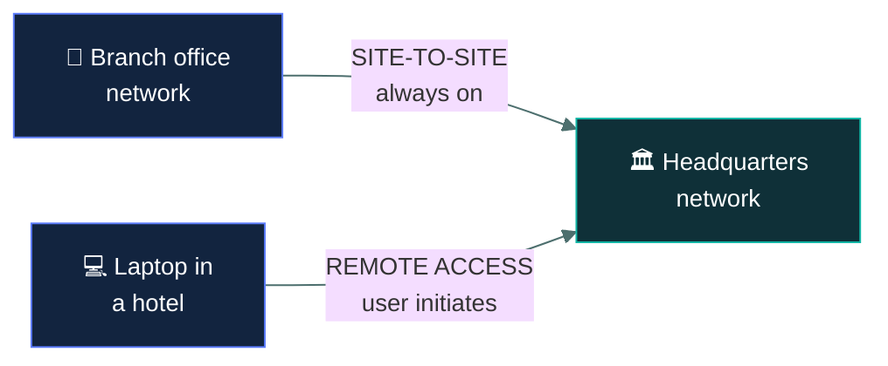
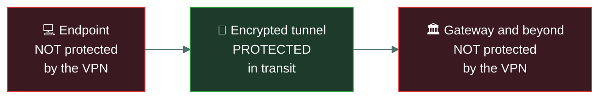

# 🔐 VPNs and remote access

### *A private tunnel across a public network — and what it does not protect*

📌 *Site-to-site versus remote access, what a tunnel actually covers, and the wireless security ladder that sits alongside it.*

---

## 🧸 The big idea

A **VPN** creates an encrypted tunnel across an untrusted network, so two parties can communicate
as though they were on a private link.

The word doing the work is **tunnel**. The original traffic is wrapped inside another packet and
encrypted, so anyone watching the public network sees only that an encrypted conversation is
happening between two endpoints — not what is inside it.

Two deployments, and the exam wants them apart:

- **Site-to-site** — connects two *networks*. A branch office to headquarters. Always on, users
  unaware of it.
- **Remote access** — connects one *device* to a network. A laptop in a hotel to the office.
  Established by the user when needed.

> [!IMPORTANT]
> **A VPN protects data in transit between the two tunnel endpoints, and nothing else.** It does
> not protect the endpoints themselves. A compromised laptop connected over VPN is a compromised
> device with a clean encrypted path onto your network — arguably worse than no VPN at all.

---

## 📖 Words you will keep seeing

| Word | What it means on this exam |
|---|---|
| **VPN** — Virtual Private Network | An encrypted tunnel across an untrusted network. |
| **Tunnelling** | Encapsulating one protocol's traffic inside another. |
| **Site-to-site VPN** | Connects two **networks**. Always on, transparent to users. |
| **Remote access VPN** | Connects one **device** to a network. Initiated by the user. |
| **IPSec** | A protocol suite securing IP traffic. Operates at **layer 3**. |
| **Tunnel mode** | IPSec mode encrypting the **entire original packet**. Used for site-to-site. |
| **Transport mode** | IPSec mode encrypting only the **payload**, leaving the original header. |
| **TLS/SSL VPN** | A VPN using TLS, often through a browser. |
| **Split tunnelling** | Only traffic bound for the corporate network goes through the tunnel; the rest goes direct. |
| **Full tunnelling** | **All** traffic goes through the tunnel, including internet browsing. |
| **WPA2 / WPA3** | Wireless security protocols. |
| **Evil twin** | A rogue access point impersonating a legitimate wireless network. |

---

## 🔍 The two VPN types

| | **Site-to-site** | **Remote access** |
|---|---|---|
| Connects | Two **networks** | One **device** to a network |
| Endpoints | Firewalls or VPN gateways | Client software and a gateway |
| Who starts it | Always on | **The user**, when needed |
| Users aware? | No — transparent | Yes |
| Typical use | Branch to head office | Home or travelling staff |

---

## 🔒 What a VPN protects

| A VPN does | A VPN does **not** |
|---|---|
| Encrypt traffic **between the two endpoints** | Protect a compromised endpoint |
| Protect data crossing untrusted networks | Encrypt data **at rest** |
| Authenticate the connecting party | Stop malware on the connecting device |
| Hide traffic content from anyone in the path | Protect traffic **after** it leaves the far endpoint |

> 🎯 **The endpoint question is the exam's favourite here.** A device infected with malware and
> connected by VPN gives the malware an encrypted, authenticated route into the network. Endpoint
> health checking exists precisely for this.

### Split versus full tunnelling

| | Means | Trade-off |
|---|---|---|
| **Split tunnelling** | Only corporate traffic goes through the tunnel; internet traffic goes direct | Better performance, less load on the gateway — but internet traffic **bypasses corporate inspection** |
| **Full tunnelling** | **All** traffic goes through the tunnel | Everything is inspected and logged — at the cost of performance and gateway capacity |

> ⚠️ **Full tunnelling is the more secure option** because all traffic passes corporate controls.
> Split tunnelling is the more performant one. If a question asks which is more secure, it is full.

### IPSec modes

| Mode | Encrypts | Used for |
|---|---|---|
| **Tunnel mode** | The **entire original packet**, wrapped in a new one | **Site-to-site** VPNs |
| **Transport mode** | Only the **payload**; the original IP header remains | Host-to-host within a trusted network |

> 🧠 **Tunnel mode wraps the whole thing.** Transport mode leaves the header showing.

---

## 📶 Wireless security

Wireless appears alongside remote access because the risk is similar: traffic crossing a medium
anyone can listen to.

| Protocol | Status |
|---|---|
| **WEP** | **Broken.** Trivially cracked. Never acceptable |
| **WPA** | Superseded and weak |
| **WPA2** | Widely deployed; uses AES. Acceptable |
| **WPA3** | **Current and strongest.** The expected answer |

> 🎯 **WEP is the exam's "never use this" for wireless**, exactly as Telnet is for remote terminals.
> If a question describes a network using WEP, the problem is that WEP is cryptographically broken.

**Wireless attacks worth recognising:**

| Attack | Means |
|---|---|
| **Evil twin** | A rogue access point impersonating a legitimate SSID so victims connect to the attacker |
| **Rogue access point** | An unauthorised AP attached to the network, often by a well-meaning employee |
| **War driving** | Searching for wireless networks while moving through an area |
| **Deauthentication attack** | Forcing clients to disconnect, often to capture the reconnection or push them to an evil twin |

> ⚠️ **Hiding the SSID and MAC filtering are not security controls.** A hidden SSID is still
> broadcast by connecting clients, and MAC addresses are trivially spoofed. Both are obscurity. If
> an option offers either as the way to secure a wireless network, it is a distractor — the answer
> is strong encryption, meaning WPA2 or WPA3.

---

## ⚖️ Told apart

| | Means | Not to be confused with |
|---|---|---|
| **Site-to-site VPN** | Connects two **networks**, always on. | **Remote access VPN**, connecting one **device**, user-initiated. |
| **VPN** | Protects data **in transit** between endpoints. | Protection of the endpoints themselves, or data **at rest**. |
| **Split tunnelling** | Only corporate traffic tunnelled. Faster, less visibility. | **Full tunnelling**, all traffic tunnelled. Slower, more secure. |
| **IPSec tunnel mode** | Encrypts the **whole packet**. Site-to-site. | **Transport mode**, which encrypts only the payload. |
| **IPSec** | Layer 3. | **TLS**, layer 6 in the OSI model used by this exam. |
| **Evil twin** | A rogue AP **impersonating a legitimate SSID**. | A **rogue access point**, which is simply unauthorised — it need not impersonate anything. |
| **WPA2** | Acceptable, AES-based. | **WPA3**, current and strongest, and **WEP**, broken. |
| **Hidden SSID / MAC filtering** | Obscurity. | **Encryption**, which is the actual control. |

---

## ⚠️ Where your instinct is wrong

> [!WARNING]
> **In the job:** split tunnelling is standard practice, because full tunnelling melts the gateway
> and users complain about video calls.
>
> **On the exam:** **full tunnelling is more secure**, because all traffic passes corporate
> inspection. The performance argument is real and is not what the question is asking.

> [!WARNING]
> **In the job:** a VPN is how remote staff work securely, and it is treated as the control that
> makes remote access safe.
>
> **On the exam:** a VPN protects **the link**, not the device. An infected endpoint on a VPN is an
> encrypted path for the infection. Expect endpoint posture checking as the accompanying control.

> [!WARNING]
> **In the job:** hiding an SSID is a reasonable small extra step.
>
> **On the exam:** SSID hiding and MAC filtering are **obscurity, not security**, and offering
> either as the way to secure wireless is a distractor. Encryption is the answer.

---

## 🧠 How to remember it

🧠 **Site-to-site joins Sites. Remote access joins a Roamer.**

🧠 **A VPN protects the pipe, not the ends.**

🧠 **Full tunnel = full inspection = more secure. Split = split off from inspection.**

🧠 **Tunnel mode wraps the whole packet. Transport mode carries just the payload.**

🧠 **WEP is Weak. WPA3 is current.**

---

## ✅ Check you actually got it

Answer all five before expanding anything.

**Q1.** An employee connects to the corporate network from a hotel using a VPN. Their laptop is
infected with malware. What is the security implication?

- **A.** The VPN encryption prevents the malware from communicating
- **B.** The malware now has an encrypted, authenticated path into the corporate network
- **C.** The VPN will detect and quarantine the malware
- **D.** There is no implication, since VPN traffic is inspected at the gateway

<b>Answer</b>

**B — the malware now has an encrypted, authenticated path into the corporate network.** A VPN
protects the link; it says nothing about the health of the device at either end. This is exactly
why endpoint posture checking exists.

- **A** inverts what encryption does. It protects traffic from observation — including the
  malware's traffic — rather than preventing communication.
- **C** attributes a function to a VPN that it does not have. A VPN establishes and encrypts a
  tunnel; malware detection is an endpoint control.
- **D** is wrong on two counts: encrypted tunnel traffic is not automatically inspected, and
  inspection at the gateway would not address an already-compromised device.

**Q2.** Which VPN configuration connects two office networks permanently, transparently to users?

- **A.** Remote access VPN
- **B.** Site-to-site VPN
- **C.** Split tunnel VPN
- **D.** TLS VPN

<b>Answer</b>

**B — a site-to-site VPN.** It links two networks through gateway devices, stays up continuously,
and users are unaware it exists.

- **A** connects a single device to a network and is initiated by the user when needed.
- **C** describes how traffic is *routed* within a tunnel, not what the tunnel connects. A
  site-to-site VPN could itself be split or full.
- **D** names the protocol used rather than the deployment model.

**Q3.** Which tunnelling configuration is MORE secure, and why?

- **A.** Split tunnelling, because it reduces load on the VPN gateway
- **B.** Split tunnelling, because less traffic is exposed to interception
- **C.** Full tunnelling, because all traffic passes through corporate security controls
- **D.** They are equally secure; the difference is only performance

<b>Answer</b>

**C — full tunnelling, because all traffic passes through corporate security controls.** Every
request, including general internet browsing, is filtered, inspected and logged.

- **A** states a real benefit of split tunnelling, but it is a *performance* benefit, and the
  question asks about security.
- **B** reverses the logic. Under split tunnelling the non-corporate traffic is not protected by
  the tunnel at all, and it bypasses inspection entirely.
- **D** is wrong. There is a genuine security difference; the trade-off is against performance.

**Q4.** An attacker sets up a wireless access point broadcasting the same SSID as a coffee shop's
legitimate network. What is this attack called?

- **A.** War driving
- **B.** Evil twin
- **C.** Deauthentication attack
- **D.** Rogue access point

<b>Answer</b>

**B — an evil twin.** The defining detail is **impersonating a legitimate SSID** so victims
connect believing it is the real network.

- **A** is searching for wireless networks while travelling through an area — reconnaissance, not
  impersonation.
- **C** forces clients off their current connection. It is often used *alongside* an evil twin to
  push victims onto it, but it is not what the stem describes.
- **D** is the broader category: any unauthorised access point, including one an employee plugs in
  with no malicious intent. An evil twin is a rogue AP that specifically impersonates — and the
  more precise answer wins.

**Q5.** Which approach ACTUALLY secures a wireless network?

- **A.** Disabling SSID broadcast so the network is hidden
- **B.** Enabling MAC address filtering to permit only known devices
- **C.** Using WPA3 encryption with a strong passphrase
- **D.** Reducing transmitter power so the signal does not leave the building

<b>Answer</b>

**C — WPA3 encryption with a strong passphrase.** Strong encryption is the actual control; the
others are obscurity measures.

- **A** is ineffective. Connecting clients broadcast the SSID regardless, and any wireless scanner
  reveals a "hidden" network in moments.
- **B** is trivially defeated, because MAC addresses are transmitted in cleartext and can be
  spoofed in seconds.
- **D** is a reasonable supporting measure and not a control. Signal leakage is hard to contain,
  and a directional antenna extends an attacker's usable range considerably.

All three wrong options are things people genuinely do — which is what makes them good
distractors. They are defence in depth at best, never the answer to "what secures it".

---

## 🎓 The grown-up version

<b>Extra depth — open this on a second read, never needed for the pass</b>

**Split tunnelling won in practice.** The exam's position — full tunnelling is more secure — is
correct and was quietly abandoned by most organisations during mass remote working, because
backhauling every video call through a corporate gateway was neither affordable nor performant.
The compromise now common is split tunnelling combined with cloud-delivered security: traffic goes
direct to the internet but through a cloud proxy that applies the same policy. That achieves
inspection without the backhaul, and it is a large part of what SASE architectures are selling.

**Why a VPN is no longer the primary remote-access model.** A VPN grants network-level access: once
connected, the device is on the network and reachable. Zero trust network access inverts this,
brokering access to individual applications without placing the device on the network at all. A
compromised endpoint can then reach only what it was explicitly authorised for, rather than
everything the network route permits. This is the practical answer to the malware-on-the-VPN
problem this page describes.

**Consumer VPNs solve a different problem.** Commercial privacy VPNs shift *who can see your
traffic* from your internet provider to the VPN provider. They do not make you anonymous, do not
protect against a compromised device, and do not prevent tracking by the sites you visit. They
genuinely help against a hostile local network and against provider-level observation, which is a
narrower claim than the marketing makes.

**WPA3's improvements.** WPA2's four-way handshake is vulnerable to offline dictionary attacks
against a captured handshake, so a weak passphrase can be cracked at leisure. WPA3 replaces this
with Simultaneous Authentication of Equals, which resists offline cracking, and adds forward
secrecy so that compromising the passphrase later does not decrypt previously captured traffic.
It also provides opportunistic encryption on open networks, so public wi-fi is no longer
completely in the clear. Adoption has been slow because it requires hardware support at both ends.

**IPSec's complexity.** IPSec is a suite rather than a protocol: AH provides authentication and
integrity without encryption, ESP provides encryption, IKE negotiates the keys, and each can
operate in tunnel or transport mode. That flexibility is why IPSec interoperability between
different vendors' equipment has a long reputation for being painful, and part of why TLS-based
VPNs became popular for remote access — they work through a browser and traverse NAT without
special handling.

---

## 📝 Cram lines

Destined for [`EXAM-DAY.md`](../../EXAM-DAY.md):

- **A VPN protects data IN TRANSIT between two endpoints. It does NOT protect the endpoints, and NOT data at rest.**
- **An infected laptop on a VPN = an encrypted, authenticated path for the malware.**
- **Site-to-site** = two **networks**, always on, transparent. **Remote access** = one **device**, user-initiated.
- **Full tunnelling = more secure** (all traffic inspected). **Split tunnelling = faster**, bypasses inspection.
- **IPSec = layer 3.** **Tunnel mode** encrypts the **whole packet** (site-to-site); **transport mode** encrypts the payload only.
- **WEP is broken — never use.** **WPA2** acceptable (AES). **WPA3** current and strongest.
- **Evil twin** = rogue AP **impersonating a legitimate SSID**. **Rogue AP** = any unauthorised AP.
- **Hidden SSID and MAC filtering are OBSCURITY, not security.** The control is encryption.

---

<a href="../README.md">← back to 04 · Network Security</a> &nbsp;·&nbsp; <a href="../cloud-and-virtualisation/">next: Cloud and virtualisation →</a>

