# 🔐 VPNs and Remote Access

### *A private tunnel across a public network — and what it does not protect*

📌 *A VPN protects the link, not the ends. Tell site-to-site from remote access, know full tunnelling is the more secure choice, and that IPsec tunnel mode wraps the whole packet.*

---

## 🧸 The big idea

A **VPN is an armoured van on a public road.** Anyone can watch the van drive past, but nobody can
see or touch what's inside. The road is still public (the internet); the van makes the trip
private.

There are two ways to run the service:

- A **shuttle that runs all day** between two office buildings, which staff never even think
  about. That's **site-to-site**: two *networks*, always connected.
- A **van you call** when you personally need to send something from wherever you are. That's
  **remote access**: one *device*, connected when the user starts it.

And the catch: **the van protects the journey, not the cargo.** If something dangerous is loaded
at the start, the armoured van delivers it safely to head office. A VPN protects data **in transit
between its two ends, and nothing else**. An infected laptop on a VPN is still an infected laptop,
now with a private, encrypted road into your network.

---

## 📖 Words you will keep seeing

| Word | What it means on this exam |
|---|---|
| **VPN** (Virtual Private Network) | An encrypted tunnel across an untrusted network. |
| **Tunnelling** | Wrapping one packet inside another so it can travel through a different network. |
| **Site-to-site VPN** | Connects two **networks**. Always on; users don't notice it. |
| **Remote access VPN** | Connects one **device** to a network. The user starts it. |
| **IPsec** | A set of protocols that secures IP traffic. Works at **layer 3**. |
| **Tunnel mode** | IPsec encrypts the **whole original packet** and adds a new header. Used for site-to-site. |
| **Transport mode** | IPsec encrypts only the **data**; the original header stays readable. |
| **TLS VPN** (SSL VPN) | A VPN built on TLS, often used through a web browser. |
| **Split tunnelling** | Only company traffic goes through the tunnel; everything else goes straight to the internet. |
| **Full tunnelling** | **All** traffic goes through the tunnel, including ordinary web browsing. |
| **Posture check** | Checking a device is healthy (patched, protected) before letting it connect. |

---

## 🔍 The explanation

### The two kinds of VPN

| | **Site-to-site** | **Remote access** |
|---|---|---|
| Connects | Two **networks** | One **device** to a network |
| The two ends | Firewalls or VPN gateways | Software on the device, and a gateway |
| Who starts it | Nobody: it's always on | **The user**, when needed |
| Do users notice? | No | Yes |
| Typical use | Branch office to head office | Staff at home or travelling |

### What a VPN protects, and what it doesn't

| A VPN does | A VPN does **not** |
|---|---|
| Encrypt traffic **between its two ends** | Protect a device that is already infected |
| Protect data crossing untrusted networks | Encrypt data **stored** on the device (data at rest) |
| Check who is connecting | Stop malware on the connecting device |
| Hide the content from anyone along the way | Protect traffic **after** it leaves the far end |

> 🎯 **The infected-laptop question is the favourite here.** A laptop with malware that connects
> over a VPN gives the malware an encrypted, authenticated route into the network. That is exactly
> why **posture checks** exist: check the device before it gets in.

### Split versus full tunnelling

| | Means | Trade-off |
|---|---|---|
| **Split tunnelling** | Only company traffic goes through the tunnel; web browsing goes direct | Faster and lighter on the gateway, but that browsing **skips the company's inspection** |
| **Full tunnelling** | **All** traffic goes through the tunnel | Everything is inspected and logged, at a cost in speed and gateway capacity |

> ⚠️ **Full tunnelling is the more secure option**, because all traffic passes the company's
> controls. Split tunnelling is the faster one. If a question asks which is more secure, it's full.

### IPsec's two modes

| Mode | Encrypts | Used for |
|---|---|---|
| **Tunnel mode** | The **whole original packet**, wrapped inside a new one | **Site-to-site** VPNs |
| **Transport mode** | Only the **data**; the original header stays visible | Direct host-to-host links inside a trusted network |

> 🧠 **Tunnel mode wraps the whole parcel in a new box. Transport mode leaves the address label
> showing.**

**IPsec works at layer 3.** A **TLS VPN** uses the same TLS that protects websites, which puts it at
layer 6 in this exam's OSI model. TLS VPNs are popular for remote access because they work
through an ordinary browser.

---

## ⚖️ Told apart

| | Means | Not to be confused with |
|---|---|---|
| **Site-to-site VPN** | Joins two **networks**, always on. | **Remote access VPN** — joins one **device**, started by the user. |
| **VPN** | Protects data **in transit** between its two ends. | Protecting the devices themselves, or data **at rest**. |
| **Split tunnelling** | Only company traffic tunnelled. Faster, less visibility. | **Full tunnelling** — all traffic tunnelled. Slower, more secure. |
| **IPsec tunnel mode** | Encrypts the **whole packet**. Site-to-site. | **Transport mode** — encrypts only the data. |
| **IPsec** | Layer 3. | **TLS** — layer 6 in this exam's OSI model. |

---

## ⚠️ Where your instinct is wrong

> [!WARNING]
> **In the job:** split tunnelling is normal, because full tunnelling overloads the gateway and
> users complain about video calls.
>
> **On the exam:** **full tunnelling is more secure**, because all traffic passes the company's
> inspection. The performance argument is real, but it isn't what the question asks.

> [!WARNING]
> **In the job:** the VPN is treated as the thing that makes remote working safe.
>
> **On the exam:** a VPN protects **the link**, not the device. An infected laptop on a VPN is an
> encrypted path for the infection. Expect a **posture check** as the control that goes with it.

> [!WARNING]
> **In the job:** IPsec and TLS VPNs are both just "the VPN", and TLS runs on top of TCP, so you'd
> call it layer 4.
>
> **On the exam:** **IPsec = layer 3. TLS = layer 6** (presentation). Answer the model, not the
> implementation.

---

## 🧠 How to remember it

**Site-to-site joins Sites. Remote access joins a Roamer.**

**The van protects the road, not the cargo.** A VPN protects the pipe, not the ends.

**Full tunnel = full inspection = more secure. Split = split off from inspection.**

**Tunnel mode wraps the whole parcel. Transport mode shows the label.**

---

## ✅ Check you actually got it

Answer all five before expanding anything.

**Q1.** An employee connects to the corporate network from a hotel using a VPN. Their laptop is
infected with malware. What is the security implication?

- **A.** The VPN encryption prevents the malware from communicating
- **B.** The malware now has an encrypted, authenticated path into the corporate network
- **C.** The VPN will detect and quarantine the malware
- **D.** There is no implication, since VPN traffic is inspected at the gateway

<b>Answer</b>

**B — the malware now has an encrypted, authenticated path into the corporate network.** A VPN
protects the link. It says nothing about the health of the device at either end, which is exactly
why posture checks exist.

- **A** gets encryption backwards. Encryption hides traffic from observers, including the
  malware's traffic. It doesn't stop anything communicating.
- **C** gives the VPN a job it doesn't do. A VPN builds and encrypts a tunnel; finding malware is
  the job of controls on the device.
- **D** is wrong twice: tunnel traffic isn't automatically inspected, and inspecting at the gateway
  wouldn't fix an already-infected device.

**Q2.** Which VPN configuration connects two office networks permanently, transparently to users?

- **A.** Remote access VPN
- **B.** Site-to-site VPN
- **C.** Split tunnel VPN
- **D.** TLS VPN

<b>Answer</b>

**B — a site-to-site VPN.** It joins two networks through gateway devices, stays up all the time,
and users don't know it's there.

- **A** connects one device to a network, and the user starts it when needed.
- **C** describes which traffic goes *through* a tunnel, not what the tunnel connects. A
  site-to-site VPN could itself be split or full.
- **D** names the protocol used, not the way the VPN is deployed.

**Q3.** Which tunnelling configuration is MORE secure, and why?

- **A.** Split tunnelling, because it reduces load on the VPN gateway
- **B.** Split tunnelling, because less traffic is exposed to interception
- **C.** Full tunnelling, because all traffic passes through corporate security controls
- **D.** They are equally secure; the difference is only performance

<b>Answer</b>

**C — full tunnelling, because all traffic passes through the company's security controls.** Every
request, including ordinary web browsing, is filtered, inspected and logged.

- **A** is a real benefit of split tunnelling, but it's a *performance* benefit, and the question
  asks about security.
- **B** has the logic backwards. With split tunnelling, the non-company traffic isn't in the tunnel
  at all, and it skips inspection completely.
- **D** is wrong. There's a real security difference; the trade-off is against performance.

**Q4.** Which IPsec mode encrypts the entire original packet, including its header, and is
typically used for site-to-site VPNs?

- **A.** Transport mode
- **B.** Tunnel mode
- **C.** Split mode
- **D.** Full mode

<b>Answer</b>

**B — tunnel mode.** It encrypts the whole original packet and wraps it in a new header that runs
gateway to gateway, which is exactly what joining two networks needs.

- **A** encrypts only the data and leaves the original header readable. It's used for direct
  host-to-host links.
- **C** borrows the word from *split tunnelling*, which decides which traffic enters a tunnel. It
  isn't an IPsec mode.
- **D** borrows the word from *full tunnelling* in the same way. It isn't an IPsec mode either.

**Q5.** A laptop holds sensitive files on its hard drive. The user always connects to work through
a VPN. Which statement is correct?

- **A.** The files are protected, because the VPN encrypts the laptop's data
- **B.** The VPN protects the files only while they travel through the tunnel; the stored files need disk encryption
- **C.** The VPN makes the laptop part of the company network, so company backups protect the files
- **D.** The files are safe as long as full tunnelling is used

<b>Answer</b>

**B.** A VPN protects data **in transit**. Files sitting on the disk are data **at rest**, and they
need their own control, such as full-disk encryption, in case the laptop is lost or stolen.

- **A** is the misunderstanding being tested. The VPN encrypts traffic on the move, not files
  stored on the device.
- **C** confuses network access with protection. Being connected doesn't back anything up, and a
  backup wouldn't stop a thief reading the disk.
- **D** mixes things up: full tunnelling decides which *traffic* goes through the tunnel. It does
  nothing for files stored on the disk.

---

## 🎓 The grown-up version

<b>Extra depth — open this on a second read, never needed for the pass</b>

**Split tunnelling won in practice.** The exam's position, that full tunnelling is more secure, is
correct. Most organisations quietly dropped it during mass remote working anyway, because routing
every video call through a company gateway was neither affordable nor fast. The common compromise
now is split tunnelling plus cloud-delivered security: traffic goes straight to the internet, but
through a cloud proxy that applies the same policy. That gives inspection without the detour, and
it is much of what **SASE** products sell.

**Why the VPN is no longer the main remote-access model.** A VPN grants **network** access: once
connected, the device is on the network and can reach whatever the routes allow. **Zero trust
network access (ZTNA)** flips this. A broker sits between the user and each individual application.
A request to reach, say, the payroll app is checked (identity, device health, location), and only
that one connection is set up. The rest of the internal network stays invisible, with no route to
it at all. A compromised laptop can then misuse only the specific applications it was granted,
which is the practical answer to the malware-on-the-VPN problem.

**Consumer VPNs solve a different problem.** Commercial privacy VPNs move *who can see your traffic*
from your internet provider to the VPN provider. They don't make you anonymous, don't protect an
infected device, and don't stop websites tracking you. They do help on a hostile local network and
against provider-level snooping, which is a narrower claim than the adverts make.

**Why IPsec has a reputation for pain.** IPsec is a suite, not one protocol. **AH** gives
authentication and integrity without encryption, **ESP** adds encryption, **IKE** negotiates the
keys, and each can run in tunnel or transport mode. That flexibility is why getting two vendors'
IPsec equipment to talk has long been painful, and part of why TLS VPNs took over remote access:
they run through a browser and pass through NAT without special handling.

---

## 📝 Cram lines

Destined for [`EXAM-DAY.md`](../../EXAM-DAY.md):

- **A VPN protects data IN TRANSIT between its two ends. NOT the devices, and NOT data at rest.**
- **An infected laptop on a VPN = an encrypted, authenticated path for the malware.** The matching control is a posture check.
- **Site-to-site** = two **networks**, always on, invisible to users. **Remote access** = one **device**, started by the user.
- **Full tunnelling = more secure** (all traffic inspected). **Split tunnelling = faster**, skips inspection.
- **IPsec = layer 3.** **Tunnel mode** encrypts the **whole packet** (site-to-site); **transport mode** encrypts only the data.
- **TLS VPN = layer 6** in this exam's OSI model; works through a browser.

---

<a href="../README.md">← back to 04 · Networking and Cloud Security Concepts</a> &nbsp;·&nbsp; <a href="../cloud-and-virtualisation/">next: Cloud and virtualisation →</a>

