# 📶 Wireless and Bluetooth

### *When anyone in range can hear you, encrypt the air*

📌 *WEP is broken and WPA3 is best. Tell a rogue AP (inside) from an evil twin (outside), know Enterprise/802.1X lets you remove one person, and rank the Bluetooth attacks: jacking < snarfing < bugging.*

---

## 🧸 The big idea

A wired network is like a phone call: to listen in, someone has to get at the line. Wi-Fi is like
talking over a **radio**: anyone within range with a receiver can hear every word, whether you
meant them to or not.

You can't choose who's standing nearby. So the only real protection is to **talk in a code only
the right people understand**. That's what wireless security is: **encrypting the air**, because you
can't lock up a cable that doesn't exist.

Bluetooth is the same radio idea over a much shorter range, and it comes with its own short list
of named attacks.

---

## 📖 Words you will keep seeing

| Word | What it means on this exam |
|---|---|
| **SSID** | The name a Wi-Fi network broadcasts. |
| **WEP** | An old Wi-Fi encryption standard. **Broken.** Never acceptable. |
| **WPA2 / WPA3** | The current Wi-Fi security standards. WPA3 is the newer, stronger one. |
| **Rogue access point** | An unauthorised Wi-Fi access point connected to the network, usually by someone inside. |
| **Evil twin** | An attacker's access point pretending to be a real network by copying its name. |
| **War driving** | Travelling around an area looking for wireless networks to target. |
| **Deauthentication attack** | Forcing devices off a Wi-Fi network, often to capture their reconnection or push them to an evil twin. |
| **Personal (PSK)** | Wi-Fi where everyone shares **one passphrase**. For homes and small offices. |
| **Enterprise (802.1X)** | Wi-Fi where **each person has their own login**, checked by a RADIUS server. |
| **RADIUS server** | The central server that checks each person's Wi-Fi login in Enterprise mode. |
| **WIPS** | Wireless Intrusion Prevention System: watches the airwaves for rogue APs and evil twins. |
| **Bluejacking** | Sending unwanted messages to a nearby Bluetooth device. |
| **Bluesnarfing** | **Stealing data** from a Bluetooth device. |
| **Bluebugging** | **Taking control** of a Bluetooth device. |

---

## 🔍 The explanation

### Wi-Fi encryption, from worst to best

> 🎯 **WEP is the exam's "never use this" for wireless.** If a question describes a network using
> WEP, the problem is that WEP's encryption is broken.

> ⚠️ **Hiding the SSID and filtering by MAC address are not security controls.** Devices that
> connect still broadcast a hidden network's name, and MAC addresses are trivial to fake. Both are
> just obscurity. If an option offers either one as *the* way to secure Wi-Fi, it's a distractor.
> The answer is strong encryption: WPA2 or WPA3.

### Rogue access point or evil twin?

Both are unauthorised wireless ways in. **Where it comes from** is what tells them apart:

- A **rogue access point** comes from **inside**: an employee plugs one in for convenience and
  quietly bypasses every perimeter control.
- An **evil twin** comes from **outside**: an attacker broadcasts a familiar network name so
  people connect to them instead, exposing their traffic.

**Other wireless attacks to recognise:**

| Attack | Means |
|---|---|
| **War driving** | Driving or walking around looking for wireless networks. Reconnaissance |
| **Deauthentication attack** | Kicking devices off the network, often to capture their reconnection or steer them to an evil twin |

A **WIPS** watches the airwaves for rogue APs and evil twins, and can actively disrupt them. A
wired IDS/IPS can't do this, because it inspects network traffic, not the radio signals.

### Personal or Enterprise?

| | Personal (PSK) | Enterprise (802.1X) |
|---|---|---|
| **Login** | One shared passphrase | Each person's own username and password, or a certificate |
| **Checked by** | The access point | A **RADIUS server** |
| **Removing one person** | Change the passphrase for **everyone** | Disable **that one** account |
| **Typical use** | Homes, small offices, guest networks | Company networks |

> 🎯 **"Remove one person without disrupting everyone else" points to Enterprise / 802.1X.** A
> shared-passphrase network can't do that: the whole passphrase has to change.

**Guest Wi-Fi needs its own segment.** A guest network should sit on its own VLAN, with internet
access only and no route to internal systems.

### 🔵 Bluetooth: three named attacks, ranked

| Attack | Does | Severity |
|---|---|---|
| **Bluejacking** | Sends unwanted messages | A nuisance: no data taken, no control |
| **Bluesnarfing** | Steals data from the device | A confidentiality breach |
| **Bluebugging** | Takes control of the device (calls, messages, data) | The most severe: full control |

> 🎯 **Severity order: bluejacking < bluesnarfing < bluebugging.** The exam expects you to rank them,
> not just define them.

---

## ⚖️ Told apart

| | Means | Not to be confused with |
|---|---|---|
| **Rogue access point** | An unauthorised AP added from **inside**. | **Evil twin** — an attacker's AP copying a real network's name, from **outside**. |
| **Bluesnarfing** | Stealing data from a Bluetooth device. | **Bluebugging** — taking control of it. Worse than data theft. |
| **Bluejacking** | Unwanted messages. A nuisance. | **Bluesnarfing** — actually takes data. |
| **WPA2 / WPA3** | Current, acceptable Wi-Fi security. | **WEP** — broken, never acceptable. |
| **Personal (PSK)** | One shared passphrase; removing one user means changing it for all. | **Enterprise (802.1X)** — individual logins checked by RADIUS; remove one user alone. |
| **Hidden SSID / MAC filtering** | Obscurity. | **Encryption** — the actual control. |
| **WIPS** | Watches the airwaves for rogue APs and evil twins. | **A wired IDS/IPS** — inspects network traffic, not radio signals. |

---

## ⚠️ Where your instinct is wrong

> [!WARNING]
> **In the job:** a rogue AP feels like a rule-breaking employee problem and an evil twin like an
> attacker problem, so you'd treat them very differently.
>
> **On the exam:** both are the same *kind* of risk: an unauthorised wireless way in that bypasses
> the intended controls. **Where it comes from** (inside or outside) is the detail that separates
> them, not how serious it is.

> [!WARNING]
> **In the job:** hiding the SSID seems like a sensible small extra step.
>
> **On the exam:** hiding the SSID and MAC filtering are **obscurity, not security**. Offering
> either as the way to secure Wi-Fi is a distractor. Encryption is the answer.

> [!WARNING]
> **In the job:** Bluetooth attacks sound like old news from the days of flip phones.
>
> **On the exam:** they're named on the outline, and you're expected to **define and rank** all
> three.

---

## 🧠 How to remember it

**"Jack, snarf, bug": annoy, steal, control.** Alphabetical order matches severity order.

**WEP is Weak. WPA3 is current.**

**Rogue = an inside job. Twin = an outside impostor.**

**Personal = one key for everyone. Enterprise = a key each.**

**Hiding the name isn't locking the door.** Encryption is the lock.

---

## ✅ Check you actually got it

Answer all five before expanding anything.

**Q1.** An attacker sets up a wireless access point broadcasting the same SSID as a coffee shop's
legitimate network, hoping customers connect to it instead. What is this attack called?

- **A.** Rogue access point
- **B.** Evil twin
- **C.** War driving
- **D.** Deauthentication attack

<b>Answer</b>

**B — an evil twin.** The defining detail is **copying a real network's name** so victims connect,
believing it's the real thing.

- **A** is the broader idea of any unauthorised AP, usually one added from *inside* with no intent
  to impersonate. An evil twin specifically impersonates, and the more precise answer wins.
- **C** is searching for wireless networks while moving around: reconnaissance, not
  impersonation.
- **D** kicks devices off their current network. It's often used *alongside* an evil twin to push
  victims onto it, but it isn't what the question describes.

**Q2.** An employee connects an unauthorised access point to the corporate network for personal
convenience, without informing IT. What is this called?

- **A.** Evil twin
- **B.** Rogue access point
- **C.** Bluebugging
- **D.** War driving

<b>Answer</b>

**B — a rogue access point.** An unauthorised AP connected from inside the organisation.

- **A** is an outsider pretending to be a legitimate network, not an insider's own unapproved
  device.
- **C** is a Bluetooth attack.
- **D** is looking for networks to target, not adding one.

**Q3.** Ranking the three named Bluetooth attacks from least to most severe, which order is
correct?

- **A.** Bluesnarfing, bluejacking, bluebugging
- **B.** Bluejacking, bluesnarfing, bluebugging
- **C.** Bluebugging, bluesnarfing, bluejacking
- **D.** All three are equally severe

<b>Answer</b>

**B — bluejacking, bluesnarfing, bluebugging.** Unwanted messages, then data theft, then full
control of the device.

- **A** puts data theft below a nuisance message.
- **C** is the right list in reverse: most severe first.
- **D** ignores a clear difference in harm that the exam tests directly.

**Q4.** Which approach ACTUALLY secures a wireless network?

- **A.** Disabling SSID broadcast so the network is hidden
- **B.** Enabling MAC address filtering to permit only known devices
- **C.** Using WPA3 encryption with a strong passphrase
- **D.** Reducing transmitter power so the signal does not leave the building

<b>Answer</b>

**C — WPA3 encryption with a strong passphrase.** Strong encryption is the real control; the others
are obscurity.

- **A** doesn't work. Connecting devices broadcast the name anyway, and any wireless scanner finds a
  "hidden" network in moments.
- **B** is easily beaten, because MAC addresses travel unencrypted and can be faked in seconds.
- **D** can help a little, but it isn't a control. Signals are hard to contain, and a directional
  antenna greatly extends an attacker's range.

All three wrong options are things people really do, which is what makes them good distractors.
They're extra layers at best, never the answer to "what secures it".

**Q5.** A departed employee's device could still connect to the office Wi-Fi weeks after their last
day, because everyone on-site shares the same Wi-Fi passphrase. What network design choice would
MOST directly have prevented this?

- **A.** Upgrading from WPA2 to WPA3-Personal
- **B.** Deploying WPA2/WPA3-Enterprise with 802.1X, giving each employee individual credentials
- **C.** Hiding the SSID
- **D.** Enabling MAC filtering

<b>Answer</b>

**B — Enterprise mode with 802.1X and individual logins.** One account can be disabled when someone
leaves, without changing anything for anyone else.

- **A** is still a shared-passphrase model. A stronger standard doesn't fix "one passphrase for
  everyone".
- **C** and **D** are obscurity, not authentication, and neither removes the departed employee's
  actual access.

---

## 🎓 The grown-up version

<b>Extra depth — open this on a second read, never needed for the pass</b>

**Why WEP failed.** WEP used the RC4 cipher with a short, frequently reused starting value (the IV).
On a busy network, attackers could collect enough traffic to work out the key statistically within
minutes. WPA patched this with TKIP, WPA2 replaced it with AES-based CCMP, and WPA3 hardened the
handshake further.

**How a weak WPA2 passphrase gets cracked.** When a device joins a WPA2-Personal network, it and the
access point perform a **4-way handshake**. An attacker who records that handshake (and can force
one by sending a deauthentication frame, so the device reconnects) can take it away and test
passphrase guesses on their own computer. There's no lockout, because the guessing never touches
the real network. A short or common passphrase will fall; a long random one won't. **WPA3's SAE
handshake** ("Dragonfly") closes this gap: each guess needs a fresh exchange with the live access
point, so offline guessing stops working. WPA3 also adds **forward secrecy** (learning the
passphrase later doesn't decrypt traffic captured earlier) and encryption on open networks, so
public Wi-Fi is no longer completely in the clear.

**What happens inside 802.1X.** There are three roles. The **supplicant** (your device) wants access.
The **authenticator** (the access point or switch) is a relay that keeps its port shut until told
otherwise. The **RADIUS server** checks the login and decides. The device and RADIUS server talk
**EAP** through the relay. **EAP-TLS** uses a certificate on the device instead of a password,
which is stronger because there's no shared secret to steal. **PEAP** wraps a username and password
inside a TLS tunnel. The same 802.1X mechanism authenticates devices plugging into a **wired**
switch port, so it's a general "prove who you are before the port does anything" framework, not
a Wi-Fi-only one.

**Bluetooth pairing decides how exposed a device is.** "**Just Works**" pairing checks nothing about
the other device. It exists for gadgets with no screen or keypad, like headsets, and it's what makes
snarfing and bugging practical. **Passkey Entry** and **Numeric Comparison** make a human confirm
that a code matches on both devices, which defeats an attacker trying to slip into the pairing.
Modern Bluetooth Low Energy with proper pairing is much harder to attack than old Bluetooth Classic
devices, so these attacks now mostly hit older or badly configured hardware, but the vocabulary is
still examined.

---

## 📝 Cram lines

Destined for [`EXAM-DAY.md`](../../EXAM-DAY.md):

- **WEP = broken, never use. WPA = weak. WPA2 = acceptable (AES). WPA3 = current and strongest.**
- **Rogue AP = unauthorised, from INSIDE. Evil twin = copies a real network's name, from OUTSIDE.**
- **War driving** = hunting for networks. **Deauthentication** = kicking devices off (to capture a handshake or push them to a twin).
- **Hidden SSID and MAC filtering are OBSCURITY, not security.** The control is encryption.
- **Personal (PSK) = one shared passphrase. Enterprise (802.1X + RADIUS) = individual logins**, removable one at a time.
- **Bluejacking (messages) < bluesnarfing (data) < bluebugging (control).**
- **WPA3's SAE handshake stops WPA2's offline passphrase guessing.**

---

<a href="../README.md">← back to 04 · Networking and Cloud Security Concepts</a> &nbsp;·&nbsp; <a href="../iot-and-ics/">next: IoT and ICS →</a>

