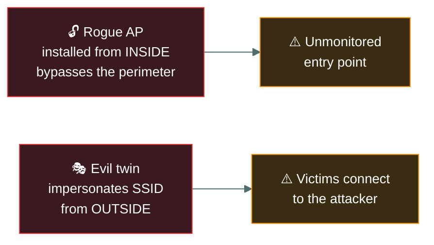

# 📶 Wireless and Bluetooth

### *The two short-range technologies the live outline names by name*

📌 *Wi-Fi security basics, Personal vs Enterprise authentication, and Bluetooth's own short list of named attacks — new, explicit content on the live outline.*

---

## 🧸 The big idea

A note passed hand to hand only ever reaches the one person holding the next hand. But a message
*shouted* across the village square can be heard by anyone standing within earshot — whether
they were meant to hear it or not. Since you can't control who's standing nearby, the only real
option is to shout in a code that only the right ears can actually understand.

That's the whole idea. Wired networking assumes a cable defines who can listen. **Wireless
removes that assumption** — anyone within range can receive the signal, whether or not they were
meant to. Wireless security is therefore built around **encrypting the air**, not the cable, and
Bluetooth adds its own short list of named attacks worth recognising by name.

---

## 📖 Words you will keep seeing

| Word | What it means on this exam |
|---|---|
| **SSID** | The broadcast name of a Wi-Fi network. |
| **WPA2 / WPA3** | Wi-Fi Protected Access — the current encryption/authentication standards for Wi-Fi. WPA3 is the newer, stronger standard. |
| **WEP** | Wired Equivalent Privacy — an old, broken Wi-Fi encryption standard. If a question treats WEP as acceptable, the question is wrong. |
| **Rogue access point** | An unauthorised Wi-Fi access point connected to the network, often installed without IT's knowledge. |
| **Evil twin** | A malicious access point impersonating a legitimate one's SSID to intercept traffic. |
| **Bluejacking** | Sending unsolicited messages to a Bluetooth device. |
| **Bluesnarfing** | Unauthorised **access to data** on a Bluetooth device. |
| **Bluebugging** | Unauthorised **control** of a Bluetooth device's functions. |
| **WPA2/WPA3-Personal** | Authentication with a single **shared passphrase (PSK)** — home and small-office use. |
| **WPA2/WPA3-Enterprise** | Authentication against a **RADIUS server using 802.1X**, giving each user their own credentials. |
| **4-way handshake** | The process a WPA2 client and AP use to prove they both know the shared key and derive a session key, without sending the key itself over the air. |
| **SAE (Simultaneous Authentication of Equals)** | WPA3's replacement handshake ("Dragonfly"), resistant to the offline password-guessing attacks that work against WPA2's handshake. |
| **WIPS** — Wireless Intrusion Prevention System | Monitors the RF spectrum for rogue APs and evil twins, and can actively disrupt them. |
| **Guest network** | A Wi-Fi network segmented away from the internal network, typically with internet access only. |

---

## 🔍 Wi-Fi: what the exam actually wants

A villager sets up their own unofficial second shouting-post because it's convenient, without
telling the chief — that's a **rogue access point**, a risk introduced from *inside*. A stranger
from outside instead mimics the exact voice and call-sign of the real village crier, so travellers
approach and talk to the impostor instead — that's an **evil twin**, the same idea from *outside*.

- **Use WPA2 or WPA3, never WEP or open networks** for anything sensitive. WEP's encryption is
  broken and considered obsolete.
- **A rogue access point** is an availability and confidentiality risk introduced from
  *inside* — an employee plugging in an unauthorised AP for convenience, bypassing every
  perimeter control.
- **An evil twin** is the same idea from *outside* — an attacker's AP broadcasting a familiar
  SSID so victims connect to it instead of the real network, exposing their traffic.

## 🏢 Personal versus Enterprise, and why organisations pick one

One household shares a single secret whistle among every family member — fine for a home, weak
for a whole village, because everyone who ever learned that one whistle (including someone who
moved away years ago) can still get in, until the entire village changes the whistle for
**everyone at once**. A village that instead gives every single person their own unique whistle,
checked against a central record-keeper, can simply strike one person's whistle off the list the
day they leave — nobody else is affected at all.

A home network shares **one passphrase** among every device — fine for a household, weak for
an office, because everyone who ever learned the passphrase (including a departed employee)
can still get on the network until it is changed for **everyone at once**.

| | Personal (PSK) | Enterprise (802.1X) |
|---|---|---|
| **Credential** | One shared passphrase | Individual username/password or certificate per user |
| **Authenticates against** | The AP itself | A **RADIUS server** |
| **Revoking one user** | Requires changing the passphrase for **everyone** | Disable **that one** account |
| **Typical use** | Home, small office, guest networks | Corporate networks |

> 🎯 **"Revoke one person without disrupting everyone else" is the tell for Enterprise/802.1X.**
> A PSK network cannot do this — the whole passphrase has to change.

**Guest networks are a segmentation problem, not just a Wi-Fi one.** A guest SSID should sit on
its own VLAN with no route to internal resources — the same segmentation principle from
[`segmentation-and-dmz/`](../segmentation-and-dmz/), applied to wireless.

---

## 🔍 Bluetooth: three named attacks, told apart by severity

A stranger a few feet away shouting a rude prank at you as you pass — annoying, but he learned
nothing and took nothing. A stranger who secretly reaches into your belt pouch and reads what's
inside without you noticing — now something private is gone. And a stranger who somehow takes
control of your own arms and makes you walk where he wants — the worst of the three by far.
Three very different levels of harm, all from someone nearby.

| Attack | Does what | Severity |
|---|---|---|
| **Bluejacking** | Sends unsolicited messages | Nuisance — no data access, no control |
| **Bluesnarfing** | Steals data from the device | Confidentiality breach |
| **Bluebugging** | Takes control of device functions (calls, data) | Most severe — full device control |

> 🎯 **Order of severity: Bluejacking < Bluesnarfing < Bluebugging.** The exam expects you to
> rank these, not just define them.

---

## ⚖️ Told apart

| | Means | Not to be confused with |
|---|---|---|
| **Rogue access point** | Unauthorised AP added from inside the organisation. | **Evil twin**, an attacker's AP impersonating a legitimate SSID from outside. |
| **Bluesnarfing** | Stealing data from a Bluetooth device. | **Bluebugging**, taking control of the device's functions — a more severe outcome than data theft alone. |
| **WPA2/WPA3** | Current, acceptable Wi-Fi security standards. | **WEP**, an obsolete standard whose encryption is broken and should never be presented as adequate. |
| **Personal (PSK)** | One shared passphrase, revoking one user means changing it for everyone. | **Enterprise (802.1X)**, individual credentials against RADIUS — revoke one user without touching anyone else. |
| **WIPS** | Actively monitors and can disrupt rogue APs/evil twins over the air. | A **wired IDS/IPS**, which inspects network traffic rather than the RF spectrum itself. |

---

## ⚠️ Where your instinct is wrong

> [!WARNING]
> **In the job:** you'd flag a rogue AP as a rule-breaking employee problem and an evil twin as
> an attacker problem, and treat them very differently in tone.
>
> **On the exam:** both are tested as the same *category* of risk — an unauthorised wireless
> entry point bypassing intended controls — with the origin (inside vs. outside) as the
> distinguishing detail, not the severity.

---

## 🧠 How to remember it

🧠 **"Jack, snarf, bug — in that order."** Bluejacking annoys, bluesnarfing steals, bluebugging
controls. Alphabetical order happens to match severity order here.

---

## ✅ Check you actually got it

Answer all five before expanding anything.

**Q1.** An attacker sets up a wireless access point broadcasting the same SSID as a coffee
shop's legitimate network, hoping customers connect to it instead. What is this called?

- **A.** Rogue access point
- **B.** Evil twin
- **C.** Bluejacking
- **D.** Bluesnarfing

<b>Answer</b>

**B — evil twin.** An attacker impersonates a legitimate SSID from outside the organisation to
intercept victim traffic.

- **A** describes an unauthorised AP added from *inside* the organisation, not an
  outsider's impersonation.
- **C** and **D** are Bluetooth attacks, unrelated to Wi-Fi SSID impersonation.

**Q2.** An employee connects an unauthorised access point to the corporate network for
personal convenience, without informing IT. What is this called?

- **A.** Evil twin
- **B.** Rogue access point
- **C.** Bluebugging
- **D.** WPA3 misconfiguration

<b>Answer</b>

**B — rogue access point.** An unauthorised AP connected from inside the organisation.

- **A** describes an outsider's impersonation of a legitimate SSID, not an insider's own
  unauthorised device.
- **C** is a Bluetooth attack.
- **D** invents a specific misconfiguration not described in the scenario.

**Q3.** Which of the following BEST describes bluebugging?

- **A.** Sending unsolicited messages to a nearby Bluetooth device
- **B.** Reading contact and message data from a Bluetooth device without authorisation
- **C.** Gaining unauthorised control over a Bluetooth device's functions
- **D.** Broadcasting a fake Wi-Fi SSID

<b>Answer</b>

**C — gaining unauthorised control over device functions.** This is the most severe of the
three named Bluetooth attacks.

- **A** describes bluejacking, a nuisance-level attack with no data or control access.
- **B** describes bluesnarfing, data theft rather than device control.
- **D** describes an evil twin, a Wi-Fi attack, not a Bluetooth one.

**Q4.** Which Wi-Fi security standard should be treated as obsolete and inadequate for any
sensitive network?

- **A.** WPA2
- **B.** WPA3
- **C.** WEP
- **D.** 802.1X

<b>Answer</b>

**C — WEP.** Its encryption is broken and it should never be presented as adequate protection.

- **A** and **B** are the current acceptable standards.
- **D** is a port-based authentication standard, not a Wi-Fi encryption protocol, and is not
  obsolete.

**Q5.** Ranking the three named Bluetooth attacks from least to most severe, which order is
correct?

- **A.** Bluesnarfing, bluejacking, bluebugging
- **B.** Bluejacking, bluesnarfing, bluebugging
- **C.** Bluebugging, bluesnarfing, bluejacking
- **D.** All three are equally severe

<b>Answer</b>

**B — bluejacking, bluesnarfing, bluebugging.** Nuisance messaging, then data theft, then full
device control.

- **A** and **C** both misorder the sequence.
- **D** ignores a clear and frequently tested severity distinction between the three.

**Q6.** A departed employee's device could still connect to the office Wi-Fi weeks after their
last day, because everyone on-site shares the same Wi-Fi passphrase. What network design
choice would MOST directly have prevented this?

- **A.** Upgrading from WPA2 to WPA3-Personal
- **B.** Deploying WPA2/WPA3-Enterprise with 802.1X, giving each employee individual credentials
- **C.** Hiding the SSID
- **D.** Enabling MAC filtering

<b>Answer</b>

**B — Enterprise/802.1X with individual credentials.** A single account can be disabled at
departure without changing anything for other users.

- **A** stays a shared-passphrase (PSK) model — a stronger standard doesn't fix the
  one-passphrase-for-everyone problem.
- **C** and **D** are both obscurity measures, not authentication controls, and neither
  revokes the departed employee's actual access.

---

## 🎓 The grown-up version

<b>Extra depth — open this on a second read, never needed for the pass</b>

**Why WEP failed.** WEP's flaw was in its use of the RC4 stream cipher with a short,
frequently-reused initialisation vector, which let attackers statistically recover the key from
captured traffic within minutes on a busy network. WPA and WPA2 addressed this with TKIP and
then AES-based CCMP; WPA3 further strengthens the handshake against offline password-guessing
attacks.

**Bluetooth's attack surface has shrunk with the protocol's own evolution.** Modern Bluetooth
Low Energy implementations with proper pairing (not "Just Works" mode on sensitive devices)
are considerably harder to bluesnarf or bluebug than older Bluetooth Classic devices, which is
why these attacks are now more associated with older or poorly configured hardware than with
current flagship devices — though the vocabulary remains exam-relevant regardless.

**Why WPA2's handshake was crackable offline (KRACK, and passphrase guessing).** WPA2-Personal's
4-way handshake exchanges enough information for an attacker who has captured it to attempt an
offline dictionary attack against the passphrase, with no rate limiting because the guessing
happens on the attacker's own hardware rather than against the live AP. This is precisely the
weakness WPA3's SAE handshake was designed to close — each guess now requires a fresh
interaction with the AP, so offline guessing no longer works. It is also why passphrase
strength matters far more on WPA2 than people assume: a short or common passphrase is
recoverable after capture, given time.

**802.1X is the same technology in three different places.** The port-based authentication
framework behind Wi-Fi Enterprise mode is the identical mechanism used to authenticate devices
plugging into a **wired** switch port, which is why 802.1X appears in both wired and wireless
network-access-control discussions — it is a general "prove who you are before the port
does anything for you" framework, not a wireless-specific technology.

---

## 📝 Cram lines

Destined for [`EXAM-DAY.md`](../../EXAM-DAY.md):

- **Rogue AP = unauthorised, from inside.** **Evil twin = impersonation, from outside.**
- **Bluejacking (messages) < Bluesnarfing (data) < Bluebugging (control).**
- **WEP is obsolete. WPA2/WPA3 are current.**
- **Personal (PSK) = one shared passphrase for everyone.** **Enterprise (802.1X/RADIUS) = individual credentials**, revocable one at a time.
- **WPA3's SAE handshake closes WPA2's offline-guessing weakness.**

---

<a href="../README.md">← back to 04 · Networking and Cloud Security Concepts</a> &nbsp;·&nbsp; <a href="../iot-and-ics/">next: IoT and ICS →</a>

</content>
