# 🚦 Zero Trust

### *Never trust, always verify — plus the agreements that set trust with third parties*

📌 *Zero trust removes trust based on network location. Know its three principles (verify explicitly, least privilege, assume breach), and the agreement vocabulary: SLA, MOU, MOA, MSA, SOW, NDA.*

---

## 🧸 The big idea

In an old-style office, you show your badge at the front door, and after that nobody asks again.
You can wander into any room, the server room included. Getting past the front door once is
enough. That's the **castle-and-moat** model: whoever is inside is trusted.

A modern hotel works differently. Your key card is checked at **every** door you try. It opens
**only your room** (and perhaps the gym), and it **stops working at checkout**. Being inside the
hotel earns you nothing on its own.

That's **zero trust**:

> **Never trust, always verify.**

Being on the company network earns nothing. Every request is checked afresh, based on who is
asking, which device they're using and what they're asking for.

---

## 📖 Words you will keep seeing

| Word | What it means on this exam |
|---|---|
| **Zero trust** | No user, device or request is trusted by default, wherever it comes from. |
| **Implicit trust** | Assuming anything inside the network is trustworthy. Zero trust removes this. |
| **Verify explicitly** | Check every request, using every signal available. |
| **Assume breach** | Design as if an attacker is already inside. |
| **Micro-segmentation** | Walls around individual workloads, not just between big zones. |
| **Continuous verification** | Checking trust again during a session, not only at login. |
| **SLA** (Service Level Agreement) | A contract setting the service levels a provider must meet, with remedies if it doesn't. |
| **MOU** (Memorandum of Understanding) | A statement of intent between parties. **Usually not legally binding.** |
| **MOA** (Memorandum of Agreement) | More formal than an MOU; sets out each party's specific responsibilities. |
| **MSA** (Master Service Agreement) | The overall contract that sets the general terms of a relationship. |
| **SOW** (Statement of Work) | The specific work, deliverables and deadlines under an MSA. |
| **NDA** (Non-Disclosure Agreement) | A contract protecting confidential information the parties share. |

---

## 🔍 The explanation

### The shift

The weakness of castle-and-moat is plain: phish one password, and the attacker is inside the
trusted zone, where nobody checks anything again.

### The three principles

| Principle | Means | In the hotel |
|---|---|---|
| **Verify explicitly** | Check every request, using identity, device health, location and behaviour | The card is checked at every door |
| **Least privilege** | Give the minimum access needed, for the minimum time | The card opens only your room, until checkout |
| **Assume breach** | Design as if an attacker is already inside: segment, monitor, limit the damage | A thief with a stolen card still gets into only one room |

### How a zero trust decision is made

Every request is judged afresh, and a "yes" opens one **application**, never the whole network:

### What it looks like in practice

- **Strong authentication everywhere**, usually MFA, for every access, not just at the edge
- **Device health checks** before access: patched, encrypted, managed
- **Micro-segmentation**, so workloads are walled off from each other
- **Continuous verification**: checking again during a session, not trusting it until logout
- **Thorough logging**, because every request is a decision worth recording
- **Access to specific applications**, instead of putting a device on the network

> 🎯 **Zero trust is an architecture and a way of thinking, not a product.** An option about buying
> a zero trust appliance is a distractor. You get zero trust by combining identity, segmentation,
> device checks and monitoring.

> ⚠️ **Zero trust doesn't mean distrusting employees.** It means network *location* earns no trust.
> The name misleads people, and questions sometimes play on that.

### 🤝 Third-party agreements

This vocabulary sits in the same part of the syllabus because it's also about trust that has to
be set up explicitly rather than assumed. These are straight definition questions.

| Agreement | What it is | Legally binding? |
|---|---|---|
| **SLA** | Sets **service levels** (uptime, response times, support) and remedies if they're missed | ✅ Yes |
| **MOU** | A **statement of intent** to work together. Broad and cooperative | ❌ **Usually not** |
| **MOA** | More formal than an MOU; sets out **each party's specific responsibilities** | Generally yes |
| **MSA** | The **overall** contract with the general terms of an ongoing relationship | ✅ Yes |
| **SOW** | The **specific work**, deliverables and deadlines under an MSA | ✅ Yes |
| **NDA** | Protects **confidential information** the parties share | ✅ Yes |

> [!IMPORTANT]
> **The SLA is tested most.** It sets measurable service levels and what happens when the provider
> misses them. If a question asks which document guarantees uptime or response times, the answer is
> the SLA.

> ⚠️ **MOU versus MSA is the common mix-up.** An **MOU** states **intent** and is usually not legally
> binding. An **MSA** is a **binding master contract**, with **SOWs** under it for each specific job.

---

## ⚖️ Told apart

| | Means | Not to be confused with |
|---|---|---|
| **Zero trust** | No trust based on **network location**. | Distrusting people. It's about where a request comes from, not who sends it. |
| **Zero trust** | An architecture and a way of thinking. | A product you can buy. |
| **Assume breach** | A design stance: act as if an attacker is already in. | Believing you have actually been breached. |
| **Micro-segmentation** | Walls around each workload. | **VLAN segmentation** — much coarser zones. |
| **SLA** | Measurable service levels, with remedies. | **MOU** — a non-binding statement of intent. |
| **MSA** | The binding master contract. | **SOW** — the specific work *under* an MSA. |
| **MOU** | Intent. Usually **not binding**. | **MOA** — more formal, sets out responsibilities. |

---

## ⚠️ Where your instinct is wrong

> [!WARNING]
> **In the job:** "zero trust" is a marketing label stuck on whatever product is being sold.
>
> **On the exam:** it's a defined model with three principles: verify explicitly, least privilege,
> assume breach. Answer the model.

> [!WARNING]
> **In the job:** a VPN is how remote access is secured, and that feels close enough to zero trust.
>
> **On the exam:** a VPN grants **network-level** access, which is exactly the implicit trust zero
> trust removes. Once connected, you're on the network. Zero trust grants access to **specific
> applications** instead.

> [!WARNING]
> **In the job:** "MOU" and "contract" get used loosely for any signed document.
>
> **On the exam:** **an MOU is usually not legally binding.** That's its defining property, and it's
> what gets tested.

---

## 🧠 How to remember it

**"Never trust, always verify."** The one sentence that carries the topic.

**The hotel key card: checked at every door, opens only your room, dies at checkout.** Verify
explicitly, least privilege, and trust that doesn't last forever.

**Zero trust removes trust in the network, not in the person.**

**SLA = Service Levels Agreed.** Uptime and response times, with penalties.

**MOU = Merely Our Understanding.** Intent, not binding.

**MSA is the umbrella; SOW is the job.**

---

## ✅ Check you actually got it

Answer all five before expanding anything.

**Q1.** What is the core assumption of a zero trust architecture?

- **A.** Internal network traffic can be trusted; external traffic cannot
- **B.** No user or device is trusted by default, regardless of location
- **C.** All employees are potential malicious insiders
- **D.** Perimeter firewalls should be replaced with intrusion prevention systems

<b>Answer</b>

**B — no user or device is trusted by default, wherever it is.** Being on the company network earns
no trust; every request is checked.

- **A** describes the old castle-and-moat model, which is exactly what zero trust replaces.
- **C** is the common misreading of the name. Zero trust removes trust based on **network
  location**, not trust in people.
- **D** describes swapping one product for another. Zero trust is built from identity,
  segmentation, device checks and monitoring, not one box replacing another.

**Q2.** Which document specifies guaranteed uptime and response times, with remedies if they are
not met?

- **A.** MOU — Memorandum of Understanding
- **B.** NDA — Non-Disclosure Agreement
- **C.** SLA — Service Level Agreement
- **D.** SOW — Statement of Work

<b>Answer</b>

**C — the SLA.** It sets measurable service levels and what happens if they're missed.

- **A** is a broad statement of intent, usually not legally binding, with no measurable service
  levels in it.
- **B** protects shared confidential information and says nothing about service performance.
- **D** sets out the specific work, deliverables and deadlines: *what* will be done, not the service
  levels it must meet.

**Q3.** Which statement about a Memorandum of Understanding is correct?

- **A.** It is a legally binding contract with enforceable penalties
- **B.** It expresses intent to cooperate and is usually not legally binding
- **C.** It defines specific deliverables and payment terms
- **D.** It replaces the need for a Master Service Agreement

<b>Answer</b>

**B — it states an intention to cooperate and is usually not legally binding.** That's the defining
feature of an MOU, and the reason it's tested.

- **A** describes a binding contract, such as an MSA or SLA. An MOU's lack of binding force is its
  whole point.
- **C** describes a Statement of Work.
- **D** is wrong: an MOU is weaker than an MSA, not a replacement. Where enforceable obligations are
  needed, the tool is an MSA with SOWs.

**Q4.** An organisation implements MFA for every application, checks device health before granting
access, and isolates workloads from each other. Which model is being implemented?

- **A.** Defence in depth
- **B.** Zero trust
- **C.** Castle and moat
- **D.** Separation of duties

<b>Answer</b>

**B — zero trust.** Checking every request, checking device health and walling off workloads are the
defining practices of the model.

- **A** is the strongest distractor. Defence in depth means layering independent controls in
  general. Zero trust uses layers too, but this specific combination names zero trust.
- **C** is the perimeter model this approach rejects.
- **D** stops one person completing a sensitive process alone. It has nothing to do with what's
  described.

**Q5.** Why is a traditional VPN inconsistent with zero trust principles?

- **A.** VPNs do not encrypt traffic strongly enough
- **B.** VPNs grant network-level access, creating the implicit trust zero trust removes
- **C.** VPNs cannot be used with multi-factor authentication
- **D.** VPNs are only suitable for site-to-site connections

<b>Answer</b>

**B — VPNs grant network-level access, which creates implicit trust.** Once connected, the device is
on the network and can reach whatever the routing and firewall rules allow. Zero trust grants access
to individual applications, so a compromised device reaches only what it was explicitly allowed.

- **A** is wrong: modern VPN encryption is strong. The problem is what happens *after* the tunnel is
  up, not the tunnel itself.
- **C** is wrong. VPNs often use MFA, and doing so is good practice.
- **D** is wrong: remote access VPNs for single devices are extremely common.

---

## 🎓 The grown-up version

<b>Extra depth — open this on a second read, never needed for the pass</b>

**Where it came from.** The idea of dropping implicit network trust is older than the label. The
best-documented large rollout is Google's **BeyondCorp**, built after a major intrusion and
published from 2014. Its premise: the company network should be trusted no more than the public
internet, and every access decision should depend on the user and device, not network position.
**NIST SP 800-207** later gave a vendor-neutral description of the architecture.

**The parts inside the policy engine.** NIST SP 800-207 splits the decision in two. A **Policy
Enforcement Point (PEP)** sits in the path of the traffic. It has no judgement of its own: it asks a
**Policy Decision Point (PDP)** "should this go through?" and obeys the answer. Splitting them is
deliberate. The PDP can be updated and audited in one place, while PEPs are cheap enough to put in
front of every application, not just at one perimeter.

**Machines verify each other too.** Between services, the usual mechanism is **mutual TLS (mTLS)**.
In a service mesh such as Istio or Linkerd, every service gets its own short-lived certificate, and
before service A can call service B, *both* prove who they are. Ordinary HTTPS only proves the
server's identity. A service on the "trusted" internal network gets no benefit from its location
if it can't show a valid certificate.

**It happens slowly.** Nobody switches to zero trust in one project. It usually starts with strong
identity and MFA everywhere, then device checks, then application-level access for the most
valuable systems, while the flat internal network shrinks over years. For most organisations, the
realistic end state is a much smaller trusted zone rather than none at all.

**The hard parts.** Old applications that can't do modern authentication, services that were never
designed to authenticate to each other, and industrial equipment that predates the idea of
identity. These are the systems that most need the model and can least adopt it, so they end up
behind gateways and in isolated segments, as compensating controls.

**Why the agreements belong here.** Trust in suppliers has the same shape as trust in network
location: it should be set up explicitly and checked, not assumed. **Vendor risk management** is
the organisational version of verifying every request: assess a supplier's security before signing,
write requirements into the contract, and reassess regularly. A supply chain attack exploits trust
that was granted once and never looked at again.

**SLAs are weaker than they look.** The credit for missed uptime is usually a percentage of the fee,
which rarely comes close to what the outage cost the customer. Treat an SLA as a statement of
expected performance and a trigger for escalation, not real financial protection. If continuity
truly matters, the answer is redundancy and an exit plan, not a tougher clause.

---

## 📝 Cram lines

Destined for [`EXAM-DAY.md`](../../EXAM-DAY.md):

- **Zero trust = "never trust, always verify."** No trust based on **network location**.
- **Three principles: verify explicitly · least privilege · assume breach.**
- **An ARCHITECTURE, not a product:** identity, MFA, device checks, micro-segmentation, logging. It does **not** mean distrusting employees.
- **A VPN grants NETWORK-level access** = implicit trust = the thing zero trust removes.
- **SLA** = measurable **service levels** (uptime, response) with remedies. **Binding.** The most tested.
- **MOU** = statement of **intent**, **usually NOT legally binding.** **MOA** = more formal, sets responsibilities.
- **MSA** = the binding **master** contract (the umbrella). **SOW** = the **specific work** under it. **NDA** = protects shared secrets.

---

<a href="../README.md">← back to 04 · Networking and Cloud Security Concepts</a> &nbsp;·&nbsp; <a href="../defence-in-depth/">next: Defence in depth →</a>

