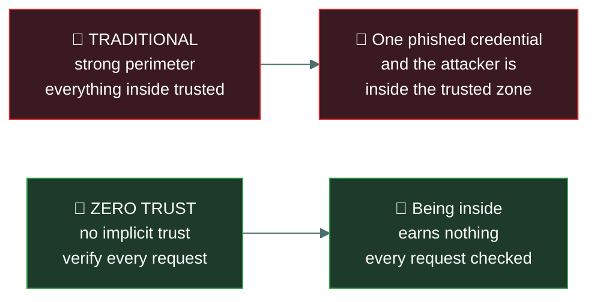

# 🚦 Zero trust

### *Never trust, always verify — and the service-agreement terms that travel beside it*

📌 *One core assumption to learn, plus the third-party agreement vocabulary — SLA, MOU, MSA — that ISC2 groups into this part of the domain.*

---

## 🧸 The big idea

The traditional model was a **castle and moat**: build a strong perimeter, and trust everything
inside it. Once you were on the network, you were trusted.

That model fails for reasons that are now obvious. Staff work from anywhere. Applications live in
someone else's data centre. Attackers who phish one credential are *inside*, and everything
inside trusts everything else. The perimeter stopped being a meaningful boundary.

**Zero trust removes the assumption that location implies trust.**

> **Never trust, always verify.**

Every request is treated as though it came from an untrusted network, regardless of where it
originated. Being on the corporate LAN earns you nothing. Every access decision is made freshly,
based on who is asking, what device they are using, and what they are asking for.

---

## 📖 Words you will keep seeing

| Word | What it means on this exam |
|---|---|
| **Zero trust** | A model in which no user, device or request is trusted by default, regardless of location. |
| **Implicit trust** | The assumption that something inside the perimeter is trustworthy. Zero trust removes this. |
| **Verify explicitly** | Authenticate and authorise every request using all available signals. |
| **Assume breach** | Design as though an attacker is already inside. |
| **Microsegmentation** | Segmentation down to individual workloads. |
| **Least privilege** | Granting only the access a role requires and no more. |
| **Continuous verification** | Re-evaluating trust throughout a session, not only at login. |
| **SLA** — Service Level Agreement | A contract specifying the service levels a provider must meet, with consequences for failure. |
| **MOU** — Memorandum of Understanding | A statement of intent between parties. **Not usually legally binding.** |
| **MOA** — Memorandum of Agreement | More formal than an MOU; sets out specific responsibilities. |
| **MSA** — Master Service Agreement | An overarching contract governing the general terms of a relationship. |
| **SOW** — Statement of Work | Defines the specific work, deliverables and timelines under an MSA. |
| **NDA** — Non-Disclosure Agreement | A contract protecting confidential information shared between parties. |

---

## 🔍 The shift

### The three principles

| Principle | Means |
|---|---|
| **Verify explicitly** | Authenticate and authorise on every request, using identity, device health, location and behaviour |
| **Use least privilege** | Grant the minimum access required, for the minimum time |
| **Assume breach** | Design as though an attacker is already inside — segment, monitor, limit blast radius |

### What zero trust looks like in practice

- **Strong authentication everywhere**, typically MFA, for every access — not just at the perimeter
- **Device health checks** before access is granted: patched, encrypted, managed
- **Microsegmentation**, so workloads are isolated from one another
- **Continuous verification**, re-evaluating during a session rather than trusting it until logout
- **Comprehensive logging**, because every request is a decision point worth recording
- **Access to specific applications**, rather than placing a device on the network

> 🎯 **Zero trust is an architecture and a philosophy, not a product.** If an option describes
> buying a zero trust appliance, it is a distractor. It is achieved by combining identity,
> segmentation, device posture and monitoring.

> ⚠️ **Zero trust does not mean distrusting employees.** It means not granting trust based on
> *network location*. The name misleads people, and questions occasionally play on it.

---

## 🤝 Third-party agreements

ISC2 groups this vocabulary alongside zero trust because both concern trust that has to be
established rather than assumed. These are straight definition questions.

| Agreement | What it is | Binding? |
|---|---|---|
| **SLA** | Specifies **service levels** — uptime, response times, support — with remedies if missed | ✅ Yes |
| **MOU** | A **statement of intent** to work together. Broad, cooperative | ❌ **Usually not** |
| **MOA** | More formal than an MOU; sets out **specific responsibilities** of each party | Generally yes |
| **MSA** | An **overarching** contract setting general terms for an ongoing relationship | ✅ Yes |
| **SOW** | Defines the **specific work**, deliverables and timelines under an MSA | ✅ Yes |
| **NDA** | Protects **confidential information** shared between the parties | ✅ Yes |

> [!IMPORTANT]
> **The SLA is the one tested most.** It defines measurable service levels and what happens when
> the provider misses them. If a question asks which document specifies guaranteed uptime or
> response times, the answer is SLA.

> ⚠️ **MOU versus MSA is the common confusion.** An **MOU** expresses **intent** and is usually not
> legally binding. An **MSA** is a **binding master contract**, with an **SOW** underneath it
> defining each specific piece of work.

> 🎯 **MSA is the umbrella; SOW is the specific job.** One MSA governs many SOWs.

---

## ⚖️ Told apart

| | Means | Not to be confused with |
|---|---|---|
| **Zero trust** | No implicit trust based on **network location**. | Distrusting people. It is about where a request comes from, not who sends it. |
| **Zero trust** | An architecture and philosophy. | A product you can purchase. |
| **Assume breach** | Design as though an attacker is already inside. | Assuming you have been breached specifically — it is a design stance. |
| **Microsegmentation** | Isolation per workload. | **VLAN segmentation**, which is far coarser. |
| **SLA** | Measurable service levels with remedies. | **MOU**, a non-binding statement of intent. |
| **MSA** | The binding master contract. | **SOW**, which defines specific work *under* an MSA. |
| **MOU** | Intent. Usually **not binding**. | **MOA**, which is more formal and sets out responsibilities. |

---

## ⚠️ Where your instinct is wrong

> [!WARNING]
> **In the job:** zero trust is a vendor marketing term attached to whatever product is being sold.
>
> **On the exam:** it is a defined architectural model with three principles — verify explicitly,
> least privilege, assume breach. Answer the model.

> [!WARNING]
> **In the job:** a VPN is how remote access is secured, and that is broadly zero-trust-adjacent.
>
> **On the exam:** a VPN grants **network-level** access, which is the implicit trust zero trust
> removes. Once connected you are on the network. Zero trust brokers access to **specific
> applications** instead.

> [!WARNING]
> **In the job:** MOU and contract are used loosely for any signed document.
>
> **On the exam:** **an MOU is usually not legally binding.** That is its defining property and it
> is what gets tested.

---

## 🧠 How to remember it

🧠 **"Never trust, always verify."** The one sentence that carries the topic.

🧠 **Three principles: Verify explicitly · Least privilege · Assume breach.**

🧠 **Zero trust removes trust in the network, not in the person.**

🧠 **SLA = Service **L**evels **A**greed** — uptime and response times, with penalties.

🧠 **MOU = **M**erely **O**ur **U**nderstanding** — intent, not binding.

🧠 **MSA is the umbrella, SOW is the job.**

---

## ✅ Check you actually got it

Answer all five before expanding anything.

**Q1.** What is the core assumption of a zero trust architecture?

- **A.** Internal network traffic can be trusted; external traffic cannot
- **B.** No user or device is trusted by default, regardless of location
- **C.** All employees are potential malicious insiders
- **D.** Perimeter firewalls should be replaced with intrusion prevention systems

<b>Answer</b>

**B — no user or device is trusted by default, regardless of location.** Being on the corporate
network confers no trust; every request is verified explicitly.

- **A** describes the traditional castle-and-moat model, which is exactly what zero trust replaces.
- **C** is the common misreading of the name. Zero trust removes trust based on **network
  location**, not trust in people. It is an architectural stance, not a statement about staff.
- **D** describes a product swap. Zero trust is an architecture built from identity,
  segmentation, device posture and monitoring — not one device replacing another.

**Q2.** Which document specifies guaranteed uptime and response times, with remedies if they are
not met?

- **A.** MOU — Memorandum of Understanding
- **B.** NDA — Non-Disclosure Agreement
- **C.** SLA — Service Level Agreement
- **D.** SOW — Statement of Work

<b>Answer</b>

**C — the SLA.** It defines measurable service levels and the consequences of missing them.

- **A** is a broad statement of intent between parties, usually not legally binding, and it
  specifies no measurable service levels.
- **B** protects confidential information shared between parties and says nothing about service
  performance.
- **D** defines the specific work, deliverables and timelines for a piece of work — what will be
  done, rather than the service levels it will be delivered to.

**Q3.** Which statement about a Memorandum of Understanding is correct?

- **A.** It is a legally binding contract with enforceable penalties
- **B.** It expresses intent to cooperate and is usually not legally binding
- **C.** It defines specific deliverables and payment terms
- **D.** It replaces the need for a Master Service Agreement

<b>Answer</b>

**B — it expresses intent to cooperate and is usually not legally binding.** That is the defining
characteristic of an MOU and the reason it is tested.

- **A** describes a binding contract such as an MSA or SLA. The absence of binding force is the
  whole point of an MOU.
- **C** describes a Statement of Work.
- **D** is wrong: an MOU is weaker than an MSA, not a substitute. Where enforceable obligations
  are needed, an MSA with SOWs is the instrument.

**Q4.** An organisation implements MFA for every application, checks device health before granting
access, and isolates workloads from each other. Which model is being implemented?

- **A.** Defence in depth
- **B.** Zero trust
- **C.** Castle and moat
- **D.** Separation of duties

<b>Answer</b>

**B — zero trust.** Explicit verification of every request, device posture checking, and
microsegmentation are the defining practices of the model.

- **A** is the strongest distractor and describes layering independent controls generally. Zero
  trust uses defence in depth, but the specific combination described — verify every request,
  check device health, isolate workloads — names zero trust.
- **C** is the perimeter-based model this approach explicitly rejects.
- **D** is an access control principle preventing one person from completing a sensitive process
  alone. Unrelated to what is described.

**Q5.** Why is a traditional VPN inconsistent with zero trust principles?

- **A.** VPNs do not encrypt traffic strongly enough
- **B.** VPNs grant network-level access, creating the implicit trust zero trust removes
- **C.** VPNs cannot be used with multi-factor authentication
- **D.** VPNs are only suitable for site-to-site connections

<b>Answer</b>

**B — VPNs grant network-level access, creating implicit trust.** Once connected, the device is on
the network and can reach whatever routing and firewall rules permit. Zero trust instead brokers
access to individual applications, so a compromised device reaches only what it was explicitly
authorised for.

- **A** is wrong — modern VPN encryption is strong. The issue is what happens *after* the tunnel
  is established, not the tunnel itself.
- **C** is wrong. VPNs commonly use MFA, and doing so is good practice.
- **D** is wrong: remote access VPNs for individual devices are extremely common.

---

## 🎓 The grown-up version

<b>Extra depth — open this on a second read, never needed for the pass</b>

**Where the term came from.** The idea of removing implicit network trust predates the branding by
some years, and the best-documented large implementation is Google's BeyondCorp, developed after a
major intrusion and published from 2014 onward. Its premise was that the corporate network should
be no more trusted than the public internet, with access decisions made per request based on
device and user rather than network position. NIST SP 800-207 later provided a vendor-neutral
architecture description, which is the reference worth knowing exists.

**Implementation is incremental and slow.** No organisation switches to zero trust in a project.
It typically starts with strong identity and MFA everywhere, then device posture, then
application-level access brokering for the highest-value systems, with the flat internal network
shrinking over years. The realistic end state for most organisations is a much-reduced trusted
zone rather than its elimination — which is why "we are doing zero trust" usually means "we are
partway through a multi-year identity and segmentation programme".

**The hard parts.** Legacy applications that cannot do modern authentication, service-to-service
communication that was never designed to authenticate, and operational technology that predates
the idea of identity. These are precisely the systems most in need of the model and least able to
adopt it, so they end up behind gateways and in isolated segments — compensating controls again.

**Why the agreements sit here.** Trust in third parties has the same shape as trust in network
location: it should be established explicitly and verified rather than assumed. Vendor risk
management — assessing a supplier's security before onboarding, writing requirements into the
contract, and reassessing periodically — is the organisational counterpart to verifying every
request. A supply chain compromise is an attacker exploiting trust that was granted once and never
re-examined.

**SLAs are weaker than they look.** Service credits for missed uptime typically refund a
percentage of fees, which rarely approaches the cost of the outage to the customer. An SLA is
therefore better understood as a statement of expected performance and a trigger for escalation
than as meaningful financial protection. If continuity genuinely matters, the answer is redundancy
and an exit plan, not a stronger clause.

---

## 📝 Cram lines

Destined for [`EXAM-DAY.md`](../../EXAM-DAY.md):

- **Zero trust = "never trust, always verify."** No trust based on **network location**.
- **Three principles: verify explicitly · least privilege · assume breach.**
- **It is an ARCHITECTURE, not a product.** Built from identity, MFA, device posture, microsegmentation, logging.
- **It does not mean distrusting employees** — it means location earns no trust.
- **A VPN grants NETWORK-level access** = implicit trust = the thing zero trust removes.
- **SLA** = measurable **service levels** (uptime, response) with remedies. **Binding.** Most-tested.
- **MOU** = statement of **intent**, **usually NOT legally binding.** **MOA** = more formal, sets responsibilities.
- **MSA** = binding **master** contract (the umbrella). **SOW** = the **specific work** under it.
- **NDA** = protects confidential information shared between parties.

---

<a href="../README.md">← back to 04 · Network Security</a> &nbsp;·&nbsp; <a href="../../03-access-control/README.md">next domain: 03 · Access Control →</a>

