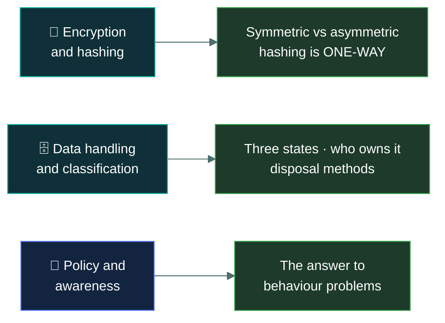

# ⚙️&nbsp; 05 · Security Operations

### *The daily job, as the textbook describes it.*

---

## 👋 01 · Read this first

18% of the paper, and the **broadest** domain — it touches data, cryptography, system
configuration, monitoring, policy and people. It is also the **shallowest**: each subject gets a
definition and a purpose, and almost nothing goes deeper than that.

That breadth is the thing to plan around. There is no single concept here that carries the
domain the way the four models carry Domain 3. The marks are spread thinly across nine topics,
so skipping any one of them costs you about two questions.

Two areas carry more weight than the rest:

- **Encryption and hashing.** The symmetric/asymmetric distinction, what each is actually for,
  and the fact that **hashing is not encryption** because it is one-way. Expect several
  questions.
- **Data handling.** The three states of data, who owns classification decisions, and the
  disposal methods — which have precise definitions the exam tests directly.

A theme runs through the whole domain, and it is the same one from Domain 1: **policy and people
come before technology.** When a question asks how to address an organisation-wide behaviour,
the expected answer is a policy plus awareness training, not a technical control.

---

## 📂 02 · The 9 topics

Work top to bottom. The data topics set up the encryption ones.

| | Topic | What you will be able to do afterwards |
|:--:|---|---|
| &#9744; | 🗄️ [`data-handling/`](data-handling/) | Name the data lifecycle stages, the three states of data, and the disposal methods precisely. |
| &#9744; | 🏷️ [`data-classification/`](data-classification/) | Say who classifies data, who protects it, and what a label obliges you to do. |
| &#9744; | 🔐 [`encryption-concepts/`](encryption-concepts/) | Separate symmetric from asymmetric and say which is used for what, and why. |
| &#9744; | #️⃣ [`hashing-and-integrity/`](hashing-and-integrity/) | Explain why hashing is not encryption, and what salting and signatures add. |
| &#9744; | 🔩 [`system-hardening/`](system-hardening/) | Describe baselines, patching and least functionality as the exam defines them. |
| &#9744; | 📐 [`configuration-management/`](configuration-management/) | Walk the change control process and say why inventory comes first. |
| &#9744; | 📊 [`logging-and-monitoring/`](logging-and-monitoring/) | Say what to log, what a SIEM does, and why log integrity matters. |
| &#9744; | 📜 [`security-policies/`](security-policies/) | Recognise AUP, BYOD, change management and privacy policies by their purpose. |
| &#9744; | 🎓 [`security-awareness-training/`](security-awareness-training/) | Tell awareness, training and education apart, and know why this is the social engineering answer. |

---

## 🎯 03 · Where the marks are

---

## ⏭️ 04 · Where to go next

When all nine boxes are ticked, go to [`02-bc-dr-ir/`](../02-bc-dr-ir/README.md) — 10%, the
smallest domain, and the last one.

---

<a href="../README.md">← back to the repo index</a>

