# ⚙️&nbsp; 05 · Security Operations and Incident Response

### *The daily job, plus what happens once it goes wrong.*

---

## 👋 01 · Read this first

**17.3% of the paper** under the live outline — tied with Domain 2 for smallest, but now
noticeably **broader** than it used to be, because **incident response moved in** from the old
Domain 2, alongside four brand-new sub-areas: event triage/CTI, quantum-resistant
cryptography, asset lifecycle/EOL, and security testing.

That breadth is the thing to plan around. The marks are spread across fourteen topics, so
skipping any one costs you real marks without any single topic dominating.

Areas that carry more weight than the rest:

- **Encryption and hashing.** The symmetric/asymmetric distinction, what each is actually for,
  and the fact that **hashing is not encryption** because it is one-way.
- **Data handling.** The three states of data, masking and sanitisation, and the disposal
  methods — which have precise definitions the exam tests directly.
- **Incident response phases**, now tested here rather than in the old BC/DR domain.
- **Security testing** — telling apart SAST, DAST, vulnerability scanning, threat modeling,
  and red/blue/purple team exercises.

> [!NOTE]
> **Incident response is here now, not in Domain 2.** If you studied the old outline, retrain
> that instinct — Domain 2 (Security Governance) keeps BC/DR, awareness and GRC; this domain
> owns the actual incident-handling content.

---

## 📂 02 · The 14 topics

Work top to bottom. The data topics set up the encryption ones.

| | Topic | What you will be able to do afterwards |
|:--:|---|---|
| &#9745; | 🗄️ [`data-handling/`](data-handling/) | Name the data lifecycle stages, the three states of data, masking, and the disposal methods precisely. |
| &#9745; | 🏷️ [`data-classification/`](data-classification/) | Say who classifies data, who protects it, and what a label obliges you to do. |
| &#9745; | 🔐 [`encryption-concepts/`](encryption-concepts/) | Separate symmetric from asymmetric and say which is used for what, and why. |
| &#9745; | #️⃣ [`hashing-and-integrity/`](hashing-and-integrity/) | Explain why hashing is not encryption, and what salting and signatures add. |
| &#9745; | 🔮 [`quantum-resistant-cryptography/`](quantum-resistant-cryptography/) | Explain "harvest now, decrypt later" and why migration starts before quantum computers can actually break encryption. |
| &#9745; | 📊 [`logging-and-monitoring/`](logging-and-monitoring/) | Say what to log, what a SIEM does, and why log integrity matters. |
| &#9745; | 🎯 [`event-triage-and-cti/`](event-triage-and-cti/) | Tell prioritisation from correlation, rank threat actors, and place CTI's three levels. |
| &#9745; | 🏷️ [`incident-terminology/`](incident-terminology/) | Tell event, alert, incident and breach apart without hesitating. |
| &#9745; | 🚑 [`incident-response-plan/`](incident-response-plan/) | Recite the phases **in order** and say who does what. |
| &#9745; | 🔩 [`system-hardening/`](system-hardening/) | Describe baselines, patching and least functionality as the exam defines them. |
| &#9745; | 📐 [`configuration-management/`](configuration-management/) | Walk the change control process and say why inventory comes first. |
| &#9745; | 📜 [`security-policies/`](security-policies/) | Recognise AUP, BYOD, change management and privacy policies by their purpose. |
| &#9745; | 📦 [`asset-lifecycle-and-eol/`](asset-lifecycle-and-eol/) | Explain why EOL risk grows indefinitely, and when compensating controls apply. |
| &#9745; | 🧪 [`security-testing-methods/`](security-testing-methods/) | Tell red/blue/purple apart, and SAST from DAST from vulnerability scanning from threat modeling. |
| &#9745; | 🏢 [`physical-penetration-testing/`](physical-penetration-testing/) | Name the exam's three physical test techniques: phishing, tailgating, impersonation. |

---

## 🎯 03 · Where the marks are

---

## ⏭️ 04 · Where to go next

When all fourteen boxes are ticked, go to
[`02-security-governance/`](../02-security-governance/README.md) — 17.3%, the last domain,
covering GRC, redundancy, awareness and measuring effectiveness.

---

<a href="../README.md">← back to the repo index</a>

</content>
