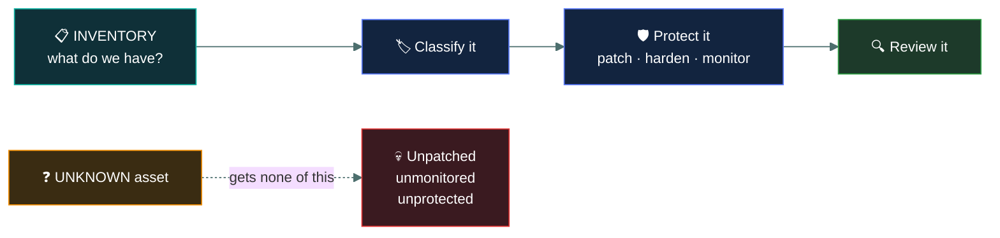
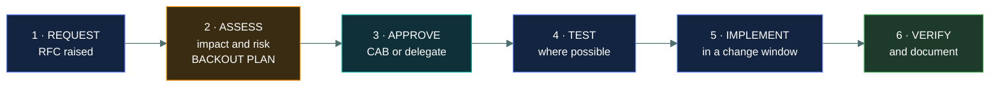
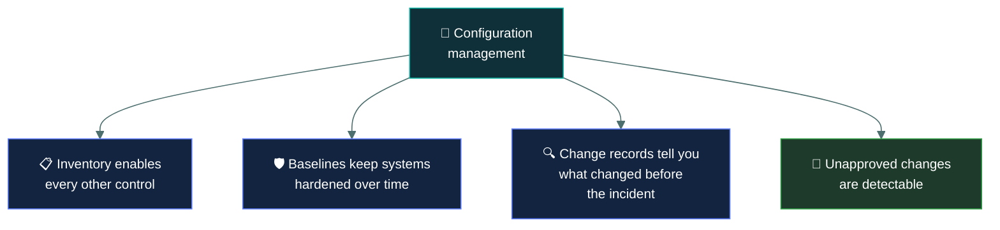

# 📐 Configuration management

### *Knowing what you have, and controlling how it changes*

📌 *Inventory comes first — you cannot protect what you do not know you have. Then change control, with a backout plan every time.*

---

## 🧸 The big idea

If a hunter quietly builds himself a lean-to out past the tree line without telling anyone, the
chief doesn't stock it before winter, nobody checks its roof before the first storm, and nobody
notices when something starts sleeping underneath it. Not because the chief doesn't care — because
she doesn't know it exists. Camp can only protect what's on its list.

And once camp knows what it has, the next question is who's allowed to change it. If anyone can
knock through a wall or reroute the stream feeding the water trough whenever they feel like it,
nobody can say what the camp actually looks like from one week to the next — and when the fence
falls over, nobody can say why.

Two questions sit underneath this whole topic:

> **What do we have?** — inventory.
> **How does it change?** — change control.

Neither is glamorous, and the first is the foundation of everything else in security.

**You cannot protect what you do not know you have.** An unknown server is not patched, not
monitored, not backed up and not hardened, because nobody knows to do any of those things to it.
Every other control in this repo assumes you have a list of what you are protecting.

**Change control** governs how things move from one known state to another. Most outages are
caused by changes — not attacks — and unmanaged change is also how hardened systems quietly stop
being hardened.

> 🎯 **If a question asks what comes FIRST in securing an environment, the answer is inventory or
> asset identification.** You cannot classify, patch, monitor or protect an unknown asset.

---

## 📖 Words you will keep seeing

| Word | What it means on this exam |
|---|---|
| **Configuration management** | Establishing and maintaining the known state of systems. |
| **Asset inventory** | The record of what hardware, software and data the organisation has. |
| **Configuration item (CI)** | Any component under configuration management. |
| **Baseline** | The approved configuration a system should match. |
| **Change control / change management** | The formal process for requesting, approving and applying changes. |
| **CAB** — Change Advisory Board | The group that reviews and approves significant changes. |
| **RFC** — Request for Change | The formal request initiating the process. |
| **Backout plan** | How to reverse a change if it fails. Also called a **rollback plan**. |
| **Emergency change** | An urgent change following an abbreviated process, documented afterwards. |
| **Version control** | Tracking successive versions of configuration or code. |
| **Configuration drift** | Systems gradually diverging from their baseline. |
| **Shadow IT** | Systems and services in use without the knowledge of IT or security. |

---

## 📋 Inventory first

Read it as a sentence: **everything security does begins with a list, and anything missing from
the list receives none of it.**

**An inventory should record:** what the asset is, where it is, who owns it, what it does, what
data it holds, its classification, and its configuration baseline.

> ⚠️ **Shadow IT is the inventory problem made concrete.** A department signs up for a cloud
> service with a corporate card, and it holds company data while being unknown to security —
> unmonitored, unassessed, and outside every control the organisation operates. It's the hunter's
> hidden lean-to: holding real goods, with nobody in camp watching its roof.

---

## 🔄 Change control

Before knocking through a wall or rerouting the stream that fills the water trough, the request
goes to the council of elders — not to slow the tribe down for its own sake, but because the very
next question is always "what could go wrong, and how do we put it back the way it was?"

Most outages are caused by changes. Change control exists to make changes deliberate, reviewed
and reversible.

| Stage | What matters |
|---|---|
| **Request** | A formal record exists, with a named requester and a reason |
| **Assess** | Impact, risk, affected systems — **and a backout plan** |
| **Approve** | By someone with the authority, typically a CAB for significant changes |
| **Test** | In a non-production environment wherever possible |
| **Implement** | In an agreed window, minimising business disruption |
| **Verify** | Confirm it worked, then **update the documentation and the baseline** |

> [!IMPORTANT]
> **Every change needs a backout plan.** The question "how do we undo this if it goes wrong" must
> be answered **before** approval, not discovered during the incident. If an option omits a
> rollback plan, it is incomplete.

> ⚠️ **Documentation is part of the change, not an afterthought.** A change that worked but was
> never recorded leaves the inventory and the baseline wrong, which is how drift begins.

### Emergency changes

Genuine emergencies — an active incident, a critical exploited vulnerability — need an
abbreviated path. The recognised handling is that an emergency change is **still approved**, by a
smaller group and faster, and **documented retrospectively** through the normal process. Mid-storm,
with the roof caving in, you don't wait for the full council — but the nearest elder still nods
before the repair starts, and the record gets written up the next morning regardless.

> 🎯 **An emergency change is an accelerated process, not an absent one.** Unapproved,
> undocumented changes are not emergency changes; they are unauthorised changes.

---

## 🔒 Why this is a security topic

Configuration management appears in a security exam for four concrete reasons.

| Reason | Means |
|---|---|
| **Inventory enables everything** | Patching, monitoring, classification and backup all need a list |
| **Baselines preserve hardening** | Without enforcement, hardened systems drift back to insecure |
| **Change records aid investigation** | "What changed just before this started?" is the first question in most incidents |
| **Unapproved change is a signal** | A configuration change nobody requested may be an attacker |

> 🎯 **"What changed?" is the first question in both incident response and troubleshooting.** A
> reliable change record turns that from an investigation into a lookup.

---

## ⚖️ Told apart

| | Means | Not to be confused with |
|---|---|---|
| **Configuration management** | Maintaining the known state of systems over time. | **Change control**, the process for altering that state. Change control is part of it. |
| **Asset inventory** | What you have. | **Baseline**, which is how each item should be configured. |
| **Baseline** | The approved configuration. | **Golden image**, a build template derived from it. |
| **Change control** | The formal approval process. | **Change** itself. Unapproved changes happen without it. |
| **Emergency change** | Accelerated approval, documented afterwards. | **Unauthorised change**, which has no approval at all. |
| **Backout plan** | How to reverse a change. | **Disaster recovery**, which restores after a disaster. A backout undoes a specific change. |
| **Configuration drift** | Gradual, cumulative divergence. | A single unauthorised change, which is discrete. |
| **Shadow IT** | Systems unknown to IT and security. | Approved systems that are poorly documented. |

---

## ⚠️ Where your instinct is wrong

> [!WARNING]
> **In the job:** small changes go in without a ticket, because the process costs more than the
> change.
>
> **On the exam:** **all changes go through change control.** Small undocumented changes are how
> configuration drift and unexplained outages happen.

> [!WARNING]
> **In the job:** during an incident you change things fast and write it up later, if at all.
>
> **On the exam:** an emergency change is **still approved** — by a smaller group, faster — and
> **documented retrospectively**. The process compresses; it does not vanish.

> [!WARNING]
> **In the job:** asset inventory is an IT asset management problem, not a security one.
>
> **On the exam:** **inventory is the first step in securing anything**, because unknown assets
> receive no controls at all.

---

## 🧠 How to remember it

🧠 **What do we have? How does it change?** The two questions of this topic.

🧠 **You cannot protect what you do not know you have.** Inventory first, always.

🧠 **Every change needs a way back.** Backout plan before approval.

🧠 **Emergency compresses the process; it does not remove it.**

🧠 **"What changed?" is the first question in every incident.**

---

## ✅ Check you actually got it

Answer all five before expanding anything.

**Q1.** What is the FIRST step in securing an organisation's systems?

- **A.** Deploying endpoint protection to all devices
- **B.** Creating and maintaining an accurate asset inventory
- **C.** Implementing multi-factor authentication
- **D.** Conducting a penetration test

<b>Answer</b>

**B — creating and maintaining an accurate asset inventory.** Every other control needs a list of
what it applies to. An asset nobody knows about is not patched, monitored, backed up or hardened.

- **A** cannot be deployed comprehensively without knowing what devices exist. You would protect
  the ones you know about and miss the rest.
- **C** is a valuable control and not the first step; it must be applied to identified systems.
- **D** tests what you know about. A test scoped from an incomplete inventory gives false
  assurance, because the systems most likely to be vulnerable are the ones nobody listed.

**Q2.** What must be defined before a change is approved?

- **A.** The exact time the change will complete
- **B.** A backout plan describing how to reverse the change
- **C.** The names of every user who will be affected
- **D.** A guarantee that the change will not cause disruption

<b>Answer</b>

**B — a backout plan.** "How do we undo this if it goes wrong" must be answered before approval,
not worked out during an outage under pressure.

- **A** cannot be known precisely, and an estimate is useful rather than essential.
- **C** is helpful for communication and is not a precondition of approval.
- **D** is impossible. No change can be guaranteed disruption-free, which is exactly why the
  backout plan matters.

**Q3.** A department subscribes to a cloud storage service using a corporate credit card, without
informing IT. What is this called, and why is it a concern?

- **A.** Configuration drift; the baseline has changed
- **B.** Shadow IT; the service holds company data outside the organisation's controls
- **C.** An emergency change; it bypassed the approval process
- **D.** Vendor lock-in; the organisation is now dependent on the provider

<b>Answer</b>

**B — shadow IT.** The service is unknown to IT and security, so it is outside every control the
organisation operates: not in the inventory, not assessed, not monitored, not covered by data
handling rules or the leaver process.

- **A** describes existing systems gradually diverging from their baseline. This is a wholly new
  service, not a drifting one.
- **C** misapplies the term. An emergency change is an approved change under an accelerated
  process; this had no approval at all.
- **D** is a genuine secondary concern and not why this is a security problem today.

**Q4.** During a major incident, an administrator makes urgent configuration changes to contain
the damage. What should happen regarding change control?

- **A.** Nothing — incident response is exempt from change control
- **B.** The changes follow an emergency change process and are documented retrospectively
- **C.** The changes must be reversed and resubmitted through the normal process
- **D.** Change control applies only to planned maintenance

<b>Answer</b>

**B — an emergency change process, documented retrospectively.** Approval is compressed to a
smaller group acting quickly, and the record is completed afterwards so the inventory and baseline
stay accurate.

- **A** treats incidents as a blanket exemption, which is how undocumented changes accumulate and
  how nobody can later explain the environment's state.
- **C** would undo containment and reintroduce the incident, which is plainly worse.
- **D** is wrong. Change control covers all changes; what varies is the speed and depth of the
  approval path.

**Q5.** Why is a change record valuable during incident investigation?

- **A.** It proves the organisation is compliant with regulations
- **B.** It answers "what changed immediately before this started", which is the first diagnostic question
- **C.** It allows the organisation to bill the responsible department
- **D.** It replaces the need for system logs

<b>Answer</b>

**B — it answers "what changed immediately before this started".** That is the first question in
both incident response and ordinary troubleshooting, and a reliable change record turns hours of
investigation into a lookup.

- **A** is a genuine secondary benefit and not the investigative value being asked about.
- **C** describes internal cost allocation, which is unrelated.
- **D** is wrong. Change records and system logs answer different questions and complement each
  other — one shows intended changes, the other shows what actually happened.

---

## 🎓 The grown-up version

<b>Extra depth — open this on a second read, never needed for the pass</b>

**Complete inventories are genuinely rare.** Most organisations cannot confidently list every
asset, because devices appear and disappear, cloud resources are created by API in seconds, staff
connect personal equipment, and acquisitions bring unknown estates. The practical approach
combines several imperfect sources — network discovery, endpoint agents, cloud provider APIs,
procurement records, directory data — and reconciles them, treating discrepancies as findings.
Anything appearing in one source and not another is interesting by definition.

**Infrastructure as code changes the nature of the problem.** When configuration is defined in
files held in version control, the inventory and the baseline become the same artefact: the code
*is* the intended state, every change is a reviewed commit with an author and a reason, and drift
is detectable by comparing reality against the definition. It also makes rollback a matter of
reverting a commit. This is the most significant improvement in configuration management in
decades, and it moves the discipline from documentation to engineering.

**Change control has a bad reputation it partly earned.** Heavyweight processes with weekly boards
and lengthy forms push teams towards working around them, which produces exactly the undocumented
changes the process existed to prevent. The response in modern practice is risk-tiered: standard
pre-approved changes proceed automatically, normal changes get proportionate review, and only
significant or risky changes reach a board. Research into software delivery performance
consistently finds that heavyweight approval correlates with *worse* stability, not better —
because it batches changes into larger, riskier releases.

**Drift detection is the enforcement half of baselines.** A baseline nobody measures against is a
document. Tools that continuously compare running configuration to the defined baseline, and either
alert or automatically remediate, are what make the baseline a control rather than an aspiration.
Automatic remediation is powerful and needs care, since a tool that reverts a legitimate emergency
fix at 3am creates its own incident.

**The security value of knowing what changed cannot be overstated.** In incident response, the
ability to diff the current environment against a known-good state is what distinguishes a
several-hour investigation from a several-week one. This is also why attackers who understand
mature environments try to make their changes look like routine administrative activity.

---

## 📝 Cram lines

Destined for [`EXAM-DAY.md`](../../EXAM-DAY.md):

- **Two questions: what do we have (inventory) and how does it change (change control).**
- **INVENTORY IS THE FIRST STEP** in securing anything. You cannot protect what you don't know you have.
- **An unknown asset is unpatched, unmonitored, unclassified and unprotected.**
- **Shadow IT** = services in use without IT/security's knowledge — company data outside every control.
- **Change process: request → assess → approve → test → implement → verify and DOCUMENT.**
- **EVERY change needs a BACKOUT PLAN, defined before approval.**
- **Emergency change = ACCELERATED approval + retrospective documentation.** Not an absent process.
- **Unapproved + undocumented = an unauthorised change**, not an emergency one.
- **Update the baseline and documentation after the change** — skipping this is how drift starts.
- **"What changed?" is the first question in every incident.**

---

<a href="../README.md">← back to 05 · Security Operations and Incident Response</a> &nbsp;·&nbsp; <a href="../security-policies/">next: Security policies →</a>

