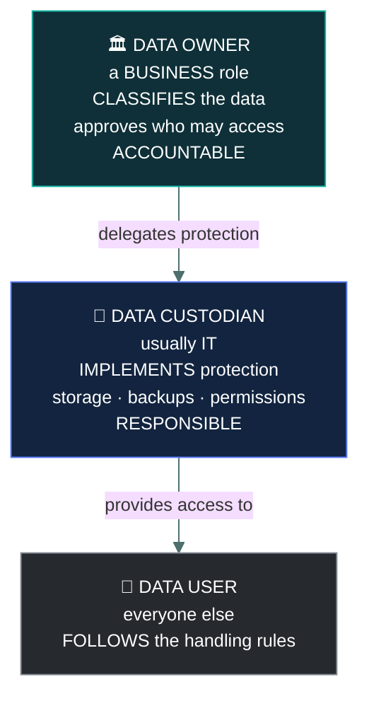
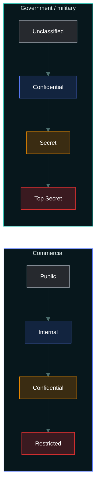
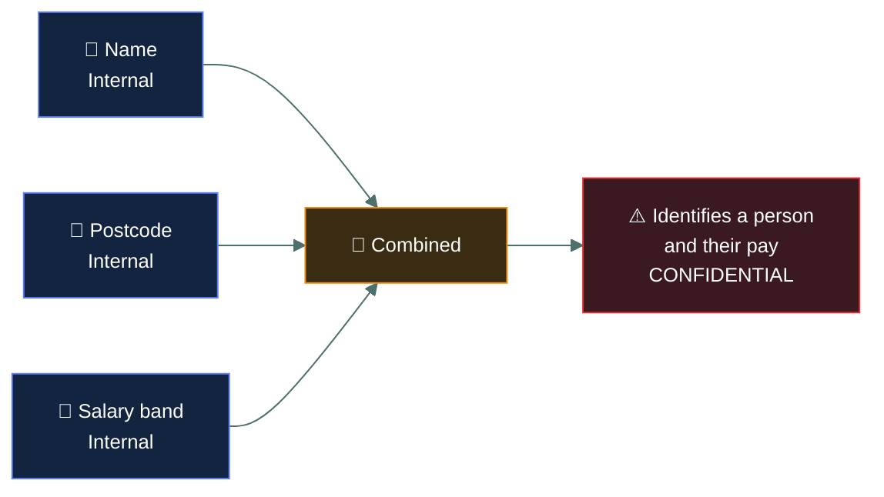

# 🏷️ Data classification

### *Labelling data by sensitivity — and who is allowed to decide*

📌 *The roles question — owner, custodian, user — is asked more than anything else here. Owner decides; custodian implements.*

---

## 🧸 The big idea

You cannot protect everything equally. Some data would be catastrophic if disclosed; some is
already on your public website. **Classification sorts data by sensitivity so that protection
can be proportionate.**

Once data carries a label, the label **obliges** specific handling: how it is stored, who may
see it, whether it may leave the organisation, how it is transmitted, and how it must be
destroyed. The label is not a description — it is an instruction.

The part the exam tests hardest is **who decides**. The answer never changes:

> **The data owner classifies. The custodian implements. The user follows the rules.**

An IT administrator who runs the database, takes the backups and sets the permissions is the
**custodian** — never the owner, however much they know about the system.

---

## 📖 Words you will keep seeing

| Word | What it means on this exam |
|---|---|
| **Data classification** | Categorising data by sensitivity so protection is proportionate. |
| **Data owner** | The **business** role accountable for a data set — classifies it and approves access. |
| **Data custodian** | Implements the protection day to day — storage, backups, access enforcement. Usually IT. |
| **Data steward** | Responsible for data quality and meaning within a business area. |
| **Data user** | Anyone who accesses the data and must follow its handling rules. |
| **Data processor** | A party processing data on the owner's or controller's behalf. |
| **Labelling** | Marking data with its classification. |
| **Handling requirements** | The rules a classification imposes — storage, transmission, disposal. |
| **Aggregation** | Combining low-sensitivity items into something more sensitive. |
| **Reclassification** | Changing a label as sensitivity changes over time. |
| **Declassification** | Lowering a classification when data is no longer sensitive. |

---

## 👥 Who does what

| Role | Decides? | Typical person |
|---|---|---|
| **Data owner** | ✅ **Yes** — classification and access | A business manager: head of HR owns personnel data |
| **Data custodian** | ❌ No — implements what the owner decided | A system or database administrator |
| **Data steward** | Manages quality and meaning, not sensitivity | A business analyst or subject expert |
| **Data user** | ❌ No — follows the rules | Anyone with access |

> [!IMPORTANT]
> **Owner decides, custodian implements.** This single sentence answers most role questions in
> this topic and in Domain 1's privacy material. The administrator who manages the system does
> **not** classify its data.

> ⚠️ **Accountability sits with the owner and cannot be delegated.** The custodian is *responsible*
> for carrying out the protection; the owner remains *accountable* for whether it was right.

---

## 🏷️ Classification schemes

There is no single universal scheme. The exam expects you to recognise both common families.

**Classification is driven by impact:** how much harm would result if this data were disclosed,
altered or lost? That question — not the data's format or volume — decides the label.

> 🎯 **Fewer levels work better.** A scheme with eight classifications is one nobody applies
> correctly. Three or four is the practical range, and simplicity is a legitimate design goal.

---

## 📋 What a label obliges

A classification is only useful if it carries **handling requirements**. An illustrative scheme:

| | **Public** | **Internal** | **Confidential** | **Restricted** |
|---|---|---|---|---|
| Who may see it | Anyone | All staff | Named groups | Named individuals |
| Storage | No restriction | Corporate systems | **Encrypted** | **Encrypted**, restricted location |
| Email | Freely | Internal only | Encrypted only | Generally prohibited |
| Removable media | Yes | With approval | Encrypted only | Prohibited |
| Disposal | Ordinary | Ordinary | **Shredding / secure wipe** | **Certified destruction** |

> ⚠️ **The label sets the floor, not the ceiling.** Data labelled Confidential must receive at
> least Confidential handling. Nothing stops stronger protection.

---

## ➕ Aggregation

**Combining low-sensitivity items can produce something more sensitive than any of them.**

A name is not sensitive. A postcode is not sensitive. A job title is not sensitive. Together they
identify an individual, and combined with a salary figure they become a serious disclosure.

> 🎯 **A dataset takes the classification of its most sensitive element, or higher if aggregation
> raises it.** This is why reports and exports are so often mishandled — each field looked
> harmless on its own.

---

## 🔄 Reclassification

Sensitivity changes over time, and labels should follow.

- **Declassification** — a merger announcement is highly confidential before release and public
  afterwards.
- **Increasing classification** — data becomes more sensitive as it accumulates or as
  circumstances change.

Both are the **data owner's** decision, and both should be reviewed periodically rather than
left to drift.

---

## ⚖️ Told apart

| | Means | Not to be confused with |
|---|---|---|
| **Data owner** | **Business** role. **Classifies** and approves access. **Accountable.** | **Data custodian**, who implements protection. IT is the custodian. |
| **Data custodian** | Implements storage, backups, permissions. **Responsible.** | **Data owner.** Managing the system confers no authority to classify it. |
| **Data steward** | Data quality and meaning. | **Data owner**, who decides sensitivity. |
| **Classification** | The label, based on **impact of disclosure**. | **Categorisation** by format, department or volume. |
| **Labelling** | Marking data with its classification. | **Classification**, the decision itself. Labelling records it. |
| **Aggregation** | Combined items become more sensitive. | Each item's individual classification. The whole can exceed the parts. |
| **Declassification** | Lowering a label as sensitivity falls. | Deleting the data. |

---

## ⚠️ Where your instinct is wrong

> [!WARNING]
> **In the job:** the team that runs the system decides how its data is protected, because they
> understand it best.
>
> **On the exam:** **the business data owner classifies.** IT is the custodian and implements the
> decision. Options placing an administrator in the deciding seat are distractors.

> [!WARNING]
> **In the job:** more classification levels give finer control.
>
> **On the exam:** **fewer levels are better**, because a scheme people cannot apply correctly is
> worse than a simple one they can. Three or four levels is the practical answer.

> [!WARNING]
> **In the job:** you assess a field's sensitivity on its own merits.
>
> **On the exam:** **aggregation** matters. Harmless fields combined can require a higher
> classification than any of them individually.

---

## 🧠 How to remember it

🧠 **Owner decides. Custodian implements. User obeys.**

🧠 **Classification is about IMPACT** — how much harm if this got out?

🧠 **The whole can be worth more than the parts.** That is aggregation.

🧠 **Owner is Accountable, Custodian is Responsible.** A before C, accountability before
responsibility.

---

## ✅ Check you actually got it

Answer all five before expanding anything.

**Q1.** Who is responsible for determining the classification level of a data set?

- **A.** The database administrator who manages the system
- **B.** The data owner
- **C.** The information security team
- **D.** The end users who access the data

<b>Answer</b>

**B — the data owner.** Classification is a business decision about the impact of disclosure, and
it belongs to the business role accountable for the data.

- **A** is the **custodian**. They implement the protection the owner's classification requires,
  and managing a system confers no authority to classify what is in it. This is the single most
  common wrong answer in the topic.
- **C** advises on the scheme and the controls, and does not own the business impact judgement.
- **D** follow the handling rules the classification imposes. They have no say in setting it.

**Q2.** A system administrator configures encryption and backups for a database containing
personnel records. Which role are they performing?

- **A.** Data owner
- **B.** Data steward
- **C.** Data custodian
- **D.** Data processor

<b>Answer</b>

**C — data custodian.** Implementing protection day to day — storage, encryption, backups, access
enforcement — is exactly the custodian's role.

- **A** would be the head of HR, who is accountable for personnel data and decides its
  classification.
- **B** concerns data quality and meaning within a business area, not technical protection.
- **D** is a party processing personal data on the controller's behalf, typically an external
  organisation such as a cloud provider.

**Q3.** A report combines employee names, postcodes and salary bands. Each field alone is
classified Internal. How should the report be classified?

- **A.** Internal, since all component fields are Internal
- **B.** Public, since none of the fields is individually sensitive
- **C.** Higher than Internal, because aggregation increases sensitivity
- **D.** It does not require classification as it is a derived report

<b>Answer</b>

**C — higher than Internal, because aggregation increases sensitivity.** Combined, the fields
identify individuals and reveal their pay, which is considerably more damaging than any field on
its own.

- **A** applies the component classification mechanically and misses the whole point of aggregation.
- **B** moves in the wrong direction entirely.
- **D** is wrong and is a genuine real-world failure — derived reports and exports frequently
  escape classification precisely because they are new artefacts nobody labelled.

**Q4.** What PRIMARILY determines the classification level assigned to data?

- **A.** The volume of data
- **B.** The potential impact of its disclosure, alteration or loss
- **C.** The department that created it
- **D.** The format it is stored in

<b>Answer</b>

**B — the potential impact of its disclosure, alteration or loss.** Classification exists to make
protection proportionate to harm, so harm is what sets the level.

- **A** is irrelevant. One highly sensitive record outranks a million public ones.
- **C** may correlate loosely with sensitivity and does not determine it — finance produces both
  published accounts and confidential forecasts.
- **D** is irrelevant. The same information is equally sensitive in a spreadsheet, a database or
  on paper.

**Q5.** An organisation proposes a classification scheme with eight levels. What is the PRIMARY
concern?

- **A.** Eight levels will not provide sufficient granularity
- **B.** Users will be unable to apply the scheme correctly, so classification becomes unreliable
- **C.** Each level requires a separate encryption key
- **D.** Regulations permit a maximum of four levels

<b>Answer</b>

**B — users will be unable to apply the scheme correctly.** A classification scheme depends
entirely on people choosing the right label as they create data. Eight levels with overlapping
definitions produces inconsistent labelling, which makes every downstream control unreliable.

- **A** inverts the concern — eight levels is too granular, not too coarse.
- **C** invents a technical requirement that does not follow from the number of levels.
- **D** invents a regulatory limit. Organisations choose their own schemes.

---

## 🎓 The grown-up version

<b>Extra depth — open this on a second read, never needed for the pass</b>

**Classification programmes usually fail at labelling, not at design.** Writing a four-level
scheme with clear handling rules takes a few weeks. Getting tens of thousands of existing
documents labelled, and every new one labelled correctly as it is created, is the part that
defeats organisations. Automated classification tools help by inspecting content for patterns —
card numbers, national identifiers, known document templates — and they produce false positives
and miss context. The pragmatic approach is to label the highest-value repositories properly and
accept that the long tail will be imperfect.

**Over-classification is its own failure.** When people are unsure, they label upward, because
nobody is ever criticised for treating data as more sensitive than it was. The result is that
most documents end up Confidential, the label stops carrying information, handling requirements
become impractical, and everyone develops workarounds. A scheme where 90% of data is Confidential
is functionally a scheme with no classification at all.

**Ownership is often genuinely unclear.** The exam's clean model assumes every data set has an
identifiable business owner. In reality, customer data is touched by sales, service, marketing
and finance, and none of them considers themselves the owner. Establishing ownership is usually
the hardest part of a data governance programme, and it is a prerequisite for everything else —
classification, access approval, retention decisions and breach response all need a named person
to decide.

**Aggregation has a formal name in the security literature.** The **inference problem** describes
deducing sensitive information from data you are permitted to see, and the **aggregation problem**
describes sensitivity arising from combination. Both are why database security cannot be handled
purely at the record level, and why anonymised datasets can be re-identified by cross-referencing
outside sources — the same issue that appears in the privacy topic.

**Government and commercial schemes are not equivalent.** Government classification carries legal
force, with criminal penalties for mishandling, and clearance processes involving formal vetting.
Commercial classification is a policy matter enforced through employment terms. The labels look
similar and the consequences are entirely different, which is worth knowing if you ever move
between the two worlds.

---

## 📝 Cram lines

Destined for [`EXAM-DAY.md`](../../EXAM-DAY.md):

- **OWNER decides (classifies, approves access). CUSTODIAN implements (storage, backups, permissions). USER follows the rules.**
- **The data owner is a BUSINESS role.** IT is the **custodian** — never the owner.
- **Owner is ACCOUNTABLE (cannot delegate). Custodian is RESPONSIBLE.**
- **Data steward** = data quality and meaning, not sensitivity.
- **Classification is set by the IMPACT of disclosure/alteration/loss** — not volume, format or department.
- **Commercial: Public → Internal → Confidential → Restricted. Government: Unclassified → Confidential → Secret → Top Secret.**
- **Fewer levels are better.** Three or four; a scheme nobody applies correctly is useless.
- **AGGREGATION:** low-sensitivity fields combined can need a HIGHER classification.
- **A dataset takes the level of its most sensitive element** (or higher).
- **The label sets the floor, not the ceiling** — stronger protection is always fine.

---

<a href="../README.md">← back to 05 · Security Operations</a> &nbsp;·&nbsp; <a href="../encryption-concepts/">next: Encryption concepts →</a>

