# 🏷️ Data Classification

### *Who decides how sensitive data is, and what the label obliges everyone to do*

📌 *The owner classifies, the custodian implements, the user follows. Classification is set by impact, fewer levels work better, and aggregation can push a dataset higher than any of its parts.*

---

## 🧸 The big idea

Imagine an office that stamps every folder with a colour:

- **Green**: anyone can read it.
- **Amber**: staff only.
- **Red**: named people only, kept locked, and shredded when finished.

The stamp isn't just a description. It's an **instruction**: anyone who sees red knows exactly how
to store it, who may see it, and how to get rid of it. That's **data classification**: sorting data
by how much harm it would do if it leaked, so the protection matches the risk. You can't protect
everything equally.

The exam's favourite question is **who picks the colour**. Think of a house: the **owner** decides
who gets a key, the **locksmith** fits the locks, and **guests** follow the house rules. The
locksmith knows locks better than anyone, but never decides who gets in.

> **The data owner classifies. The custodian implements. The user follows the rules.**

The IT administrator who runs the database, takes the backups and sets the permissions is the
**custodian**, never the owner, however well they know the system.

---

## 📖 Words you will keep seeing

| Word | What it means on this exam |
|---|---|
| **Data classification** | Sorting data by sensitivity, so protection matches the risk. |
| **Data owner** | The **business** role accountable for a dataset. Classifies it and approves access. |
| **Data custodian** | Carries out the protection day to day: storage, backups, permissions. Usually IT. |
| **Data steward** | Looks after the data's quality and meaning within a business area. |
| **Data user** | Anyone who uses the data, and must follow its handling rules. |
| **Data processor** | An outside party that processes data on the owner's behalf, such as a cloud provider. |
| **Labelling** | Marking data with its classification. |
| **Handling requirements** | The rules a classification brings: how to store, send and dispose of the data. |
| **Aggregation** | Harmless items combined into something more sensitive. |
| **Declassification** | Lowering a label once the data is no longer sensitive. |

---

## 🔍 The explanation

### Who does what

| Role | Decides? | Typical person |
|---|---|---|
| **Data owner** | ✅ **Yes**: the classification and who gets access | A business manager, such as the head of HR for personnel data |
| **Data custodian** | ❌ No: carries out what the owner decided | A system or database administrator |
| **Data steward** | Looks after quality and meaning, not sensitivity | A business analyst or subject expert |
| **Data user** | ❌ No: follows the rules | Anyone with access |

> [!IMPORTANT]
> **Owner decides, custodian implements.** That one sentence answers most role questions. The
> administrator who manages the system does **not** classify its data.

> ⚠️ **Accountability stays with the owner and can't be handed off.** The custodian is
> *responsible* for doing the protection; the owner stays *accountable* for whether it was right.

### Classification schemes

There's no single universal scheme. The exam expects you to recognise the two common families:

**Classification is driven by impact:** how much harm would it cause if this data were disclosed,
changed or lost? That question, not the file format or the amount of data, sets the label.

> 🎯 **Fewer levels work better.** Nobody applies an eight-level scheme correctly. Three or four
> levels is the practical range, and keeping it simple is a legitimate goal.

### What a label obliges

A label is only useful if it comes with **handling requirements**. An example scheme:

| | **Public** | **Internal** | **Confidential** | **Restricted** |
|---|---|---|---|---|
| Who may see it | Anyone | All staff | Named groups | Named individuals |
| Storage | No restriction | Company systems | **Encrypted** | **Encrypted**, in a restricted location |
| Email | Freely | Internal only | Encrypted only | Usually not allowed |
| USB drives | Yes | With approval | Encrypted only | Not allowed |
| Disposal | Ordinary | Ordinary | **Shredding or secure wipe** | **Certified destruction** |

> ⚠️ **The label sets the minimum, not the maximum.** Confidential data must get at least
> Confidential handling. Nothing stops you protecting it more.

### ➕ Aggregation

**Harmless items put together can become sensitive.** A name isn't sensitive. Neither is a postcode,
or a salary band. Together, they identify a person and reveal their pay:

> 🎯 **A dataset takes the classification of its most sensitive item, or higher if combining items
> raises it.** That's why reports and exports are so often mishandled: each field looked harmless
> on its own.

### 🔄 Reclassification

Sensitivity changes over time, and labels should follow:

- **Declassification**: a merger announcement is highly confidential before it's announced, and
  public afterwards.
- **Upgrading**: data can become more sensitive as it builds up or as circumstances change.

Both are the **data owner's** decision, and labels should be reviewed regularly rather than left to
drift.

---

## ⚖️ Told apart

| | Means | Not to be confused with |
|---|---|---|
| **Data owner** | A **business** role. **Classifies** and approves access. **Accountable.** | **Data custodian**, who carries out the protection. IT is the custodian. |
| **Data custodian** | Handles storage, backups, permissions. **Responsible.** | **Data owner.** Running the system gives no authority to classify it. |
| **Data steward** | Data quality and meaning. | **Data owner**, who decides sensitivity. |
| **Classification** | The level, set by the **impact of disclosure**. | Sorting by format, department or size. |
| **Labelling** | Marking data with its classification. | **Classification**, the decision itself. The label records it. |
| **Aggregation** | Combined items become more sensitive. | Each item's own classification. The whole can outrank the parts. |
| **Declassification** | Lowering a label as sensitivity falls. | Deleting the data. |

---

## ⚠️ Where your instinct is wrong

> [!WARNING]
> **In the job:** the team that runs a system decides how its data is protected, because they
> understand it best.
>
> **On the exam:** **the business data owner classifies.** IT is the custodian and carries the
> decision out. Options that put an administrator in the deciding seat are distractors.

> [!WARNING]
> **In the job:** more classification levels feel like finer control.
>
> **On the exam:** **fewer levels are better.** A scheme people can't apply correctly is worse than
> a simple one they can. Three or four levels is the practical answer.

> [!WARNING]
> **In the job:** you judge each field's sensitivity on its own.
>
> **On the exam:** **aggregation** matters. Harmless fields combined can need a higher
> classification than any of them alone.

---

## 🧠 How to remember it

**Owner decides. Custodian implements. User obeys.** The owner picks the colour; the locksmith fits
the locks.

**Classification is about IMPACT:** how much harm if this got out?

**The whole can be worth more than the parts.** That's aggregation.

**Owner is Accountable, Custodian is Responsible.** A before C.

---

## ✅ Check you actually got it

Answer all five before expanding anything.

**Q1.** Who is responsible for determining the classification level of a data set?

- **A.** The database administrator who manages the system
- **B.** The data owner
- **C.** The information security team
- **D.** The end users who access the data

<b>Answer</b>

**B — the data owner.** Classification is a business decision about the harm disclosure would cause,
so it belongs to the business role accountable for the data.

- **A** is the **custodian**. They carry out the protection the classification requires, but
  running a system gives no authority to classify what's in it. This is the most common wrong
  answer in the topic.
- **C** advises on the scheme and the controls, but doesn't own the business judgement of impact.
- **D** follow the handling rules the classification sets. They have no say in setting it.

**Q2.** A system administrator configures encryption and backups for a database containing
personnel records. Which role are they performing?

- **A.** Data owner
- **B.** Data steward
- **C.** Data custodian
- **D.** Data processor

<b>Answer</b>

**C — data custodian.** Carrying out the protection day to day (storage, encryption, backups, access)
is exactly the custodian's job.

- **A** would be the head of HR, who is accountable for personnel data and decides its
  classification.
- **B** looks after data quality and meaning within a business area, not technical protection.
- **D** is a party processing personal data on the owner's behalf, usually an outside organisation
  such as a cloud provider.

**Q3.** A report combines employee names, postcodes and salary bands. Each field alone is classified
Internal. How should the report be classified?

- **A.** Internal, since all component fields are Internal
- **B.** Public, since none of the fields is individually sensitive
- **C.** Higher than Internal, because aggregation increases sensitivity
- **D.** It does not require classification as it is a derived report

<b>Answer</b>

**C — higher than Internal, because aggregation increases sensitivity.** Together, the fields
identify people and reveal their pay, which does far more damage than any field alone.

- **A** copies the fields' classification mechanically and misses the whole point of aggregation.
- **B** goes in completely the wrong direction.
- **D** is wrong, and it's a real-world failure: reports and exports often escape classification
  precisely because they're new files nobody labelled.

**Q4.** What PRIMARILY determines the classification level assigned to data?

- **A.** The volume of data
- **B.** The potential impact of its disclosure, alteration or loss
- **C.** The department that created it
- **D.** The format it is stored in

<b>Answer</b>

**B — the potential impact of its disclosure, alteration or loss.** Classification exists to match
protection to harm, so harm sets the level.

- **A** is irrelevant. One highly sensitive record outranks a million public ones.
- **C** may loosely go along with sensitivity, but doesn't decide it: finance produces both
  published accounts and confidential forecasts.
- **D** is irrelevant. The same information is just as sensitive in a spreadsheet, a database or on
  paper.

**Q5.** An organisation proposes a classification scheme with eight levels. What is the PRIMARY
concern?

- **A.** Eight levels will not provide sufficient granularity
- **B.** Users will be unable to apply the scheme correctly, so classification becomes unreliable
- **C.** Each level requires a separate encryption key
- **D.** Regulations permit a maximum of four levels

<b>Answer</b>

**B — people won't be able to apply it correctly.** A classification scheme depends on people
choosing the right label as they create data. Eight overlapping levels produce inconsistent labels,
which makes every control that relies on them unreliable.

- **A** has it backwards: eight levels is too fine, not too coarse.
- **C** invents a technical requirement that has nothing to do with the number of levels.
- **D** invents a legal limit. Organisations choose their own schemes.

---

## 🎓 The grown-up version

<b>Extra depth — open this on a second read, never needed for the pass</b>

**Classification usually fails at labelling, not at design.** Writing a four-level scheme with clear
rules takes a few weeks. Getting tens of thousands of existing documents labelled, and every new one
labelled correctly, is what defeats organisations. Tools such as Microsoft Purview help: a scanner
reads each document for patterns (card numbers that pass the checksum, national ID formats, words
like "confidential") and suggests or applies a **sensitivity label**. The label is written into the
file's own metadata, so it travels with the file when it's emailed, copied to USB or uploaded. A
**data loss prevention (DLP)** policy at the email gateway or USB port then reads the label and can
block the file, warn the user, or force encryption, without re-scanning the content. Scanners still
produce false alarms and miss context, so the practical approach is to label the most valuable
stores properly and accept that the long tail will be imperfect.

**Over-classification is its own failure.** When unsure, people label upwards, because nobody gets
criticised for over-protecting. Soon most documents are Confidential, the label stops meaning
anything, the handling rules become impractical, and everyone finds workarounds. A scheme where 90%
of data is Confidential is really no scheme at all.

**Ownership is often genuinely unclear.** The exam's clean model assumes every dataset has an obvious
business owner. In reality, customer data is touched by sales, service, marketing and finance, and
none of them thinks they own it. Settling ownership is usually the hardest part of data governance,
and everything else (classification, access approval, retention, breach response) needs a named
person to decide.

**Aggregation has formal names.** The **aggregation problem** is sensitivity arising from combining
data. The **inference problem** is working out something sensitive from data you're allowed to see.
Both are why database security can't be done one record at a time, and why "anonymised" datasets can
be re-identified by cross-checking them against outside sources.

**Government and commercial schemes aren't equivalent.** Government classification carries legal
force, with criminal penalties for mishandling and formal vetting for clearance. Commercial
classification is a company policy enforced through employment terms. The labels look alike; the
consequences are completely different.

---

## 📝 Cram lines

Destined for [`EXAM-DAY.md`](../../EXAM-DAY.md):

- **OWNER decides (classifies, approves access). CUSTODIAN implements (storage, backups, permissions). USER follows the rules.**
- **The data owner is a BUSINESS role.** IT is the **custodian**, never the owner.
- **Owner = ACCOUNTABLE (can't be handed off). Custodian = RESPONSIBLE.** Steward = data quality and meaning.
- **Classification is set by IMPACT** of disclosure, alteration or loss, not by volume, format or department.
- **Commercial: Public → Internal → Confidential → Restricted. Government: Unclassified → Confidential → Secret → Top Secret.**
- **Fewer levels are better:** three or four.
- **AGGREGATION:** harmless fields combined can need a HIGHER level. A dataset takes its most sensitive item's level, or higher.
- **The label sets the minimum, not the maximum.**

---

<a href="../README.md">← back to 05 · Security Operations and Incident Response</a> &nbsp;·&nbsp; <a href="../encryption-concepts/">next: Encryption concepts →</a>

