# 🗄️ Data handling

### *The life of data, the three states it exists in, and how to destroy it properly*

📌 *Three states, and disposal methods with precise definitions. The state you forget is data in use — and it is the one encryption struggles with.*

---

## 🧸 The big idea

Grain has a life too: it's harvested, stored in the grain-hut, ground by the miller, carried to
another village, put away for winter, and eventually used up or thrown out. Data has the same
life. It is **created**, **stored**, **used**, **shared**, **archived** and finally
**destroyed** — and each stage needs different protection.

The idea the exam tests hardest is that data exists in **three states**, and each state needs a
different control. Grain sealed in a jar inside a locked storehouse is easy to protect — just
guard the storehouse. Grain being carried down the road can be protected too — hide it, guard it,
disguise the cart. But grain already spread out on the miller's grinding stone, mid-grind, cannot
be locked away at all — it has to be exposed to actually get ground. That's the state nobody
thinks to protect properly.

| State | Means | Protected by |
|---|---|---|
| **At rest** | Stored — on a disk, in a database, on a backup tape | Encryption at rest, access control |
| **In transit** | Moving across a network | TLS, VPN, encrypted protocols |
| **In use** | Loaded in memory, being processed | **Hardest to protect** — access control, memory protection |

> 🎯 **Data in use is the state candidates forget, and the one encryption cannot easily protect** —
> because to process data, something has to decrypt it. If a question asks which state is hardest
> to protect, the answer is in use.

The second half of this topic is **destruction**. Burying a bad batch of grain in a shallow pit
isn't the same as burning it to ash — someone could still dig the pit up. The exam's destruction
terms have precisely that kind of distinction built in, and deleting a file is not one of them.

---

## 📖 Words you will keep seeing

| Word | What it means on this exam |
|---|---|
| **Data at rest** | Stored data not currently being accessed or moved. |
| **Data in transit** | Data moving across a network. Also called **data in motion**. |
| **Data in use** | Data loaded in memory and being actively processed. |
| **Data lifecycle** | Create → store → use → share → archive → destroy. |
| **Retention** | How long data is kept before disposal. |
| **Retention policy** | The rule defining retention periods for each data type. |
| **Sanitisation** | Removing data so it cannot be recovered. |
| **Clearing** | Overwriting data so it cannot be recovered by ordinary means. |
| **Purging** | Stronger removal, resistant to laboratory recovery — for example degaussing. |
| **Destruction** | Physically destroying the media. The most thorough. |
| **Degaussing** | Using a magnetic field to erase magnetic media. **Does not work on SSDs.** |
| **Crypto-shredding** | Destroying the encryption key so encrypted data becomes unrecoverable. |
| **Remanence** | Residual data remaining on media after an attempt to remove it. |

---

## 🔄 The data lifecycle

> ⚠️ **Classification happens at creation.** Data should be labelled when it is made, because
> every later protection decision depends on knowing what it is. Classifying afterwards means
> everything created in the meantime was handled at the wrong level.

**Archived data is still classified data.** Moving it to cheaper storage does not reduce its
sensitivity — a common real-world failure and a reasonable exam scenario.

---

## 🧊 The three states

| | Where it is | Threats | Controls |
|---|---|---|---|
| **At rest** | Disks, databases, backups, USB drives, phones | Theft of media, unauthorised file access | Full-disk and file encryption, access control, physical security |
| **In transit** | Networks, the internet, between systems | Interception, on-path attacks, eavesdropping | TLS, VPN, IPSec, SFTP instead of FTP |
| **In use** | RAM, CPU registers, caches | Memory scraping, malicious processes, side channels | Access control, memory protection, secure enclaves |

> [!IMPORTANT]
> **Encryption protects data at rest and in transit. It cannot easily protect data in use**,
> because processing requires plaintext. This is why a running system with decrypted disks is
> vulnerable in a way a powered-off laptop is not.

---

## ⏳ Retention

**Keep data only as long as it is needed**, then dispose of it properly.

Retention periods come from three sources, and they conflict:

| Driver | Pushes towards |
|---|---|
| **Legal and regulatory requirements** | Keeping data for a defined minimum |
| **Business need** | Keeping data while it is useful |
| **Privacy principles** | **Deleting** data once the purpose is fulfilled |

> ⚠️ **Keeping data longer than necessary is a liability, not an asset.** Data you no longer need
> can still be breached, still be subject to disclosure requests, and still attracts regulatory
> obligations. "We keep everything forever" is a bad answer.

**A legal hold** suspends normal destruction when data is relevant to litigation or an
investigation. It overrides the retention schedule — destroying data under legal hold is a
serious matter.

---

## 🔥 Destruction — the precise terms

Just knocking down the sign pointing to the grain-hut doesn't make the grain vanish — someone
who knows where to dig will still find it. This is where the exam gets specific. **Deleting a
file does not remove the data**; it removes the pointer to it and marks the space reusable. The
data remains until overwritten, which is **remanence**.

Left to right, **more thorough and less reusable.**

| Method | Does | Media survives? |
|---|---|---|
| **Deleting** | Removes the pointer. **Not a sanitisation method** | Yes — and so does the data |
| **Clearing** | Overwrites the data | ✅ Yes — media can be reused internally |
| **Purging** | Degaussing or cryptographic erasure; resists laboratory recovery | Usually not for degaussing |
| **Destruction** | Shredding, incineration, pulverising | ❌ No |

> [!CAUTION]
> **Degaussing works only on magnetic media.** It erases hard disks and tapes. It does **nothing**
> to solid-state drives, which store data in flash memory rather than magnetically. This is a
> favourite exam item.

**SSDs are genuinely harder to sanitise**, because wear levelling spreads writes across cells, so
overwriting a file does not reliably reach every copy of it. The reliable options are the drive's
built-in secure erase, **crypto-shredding**, or physical destruction.

**Crypto-shredding** means encrypting data and then destroying the key. The ciphertext remains and
is unrecoverable without the key. It is the practical answer for **cloud storage**, where you
cannot physically destroy someone else's disks.

> 🎯 **Choose the method by sensitivity and by whether the media is being reused.** Reuse
> internally → clearing. Leaving the organisation with sensitive data → destruction.

### 🔬 How a drive's own "secure erase" and a CPU enclave actually work

**Most modern SSDs are self-encrypting drives (SEDs) already, whether anyone configured
encryption or not.** Every bit written to the flash is encrypted on the way in by a key the
drive itself generates and never exposes. The drive's built-in **secure erase** command doesn't
overwrite anything at all — it simply tells the drive's own controller to discard and regenerate
that internal key. Every existing block instantly becomes unreadable ciphertext with no key
left anywhere, which is why it's near-instant and reliable regardless of wear levelling: it's
crypto-shredding, just performed *inside the drive itself* rather than at the application layer.

**A trusted execution environment is the concrete answer to "data in use is the hardest state to
protect."** Intel SGX and AMD SEV carve out a hardware-enforced region of memory — an **enclave**
— where code runs on genuinely decrypted data, but the CPU encrypts everything the instant it
leaves that region for ordinary RAM. Critically, this holds even against an attacker who has
compromised the operating system or hypervisor itself: root access normally means "can read
anything in memory," and an enclave is specifically designed to keep its contents opaque even
to that level of compromise. This is what **confidential computing** in cloud platforms actually
sells: running your workload on a provider's hardware while the provider's own privileged access
still can't see your data being processed.

---

## 🎭 Masking

**Masking** hides part or all of a data value while keeping the data usable for a purpose that
doesn't need the real value — showing `**** **** **** 1234` for a card number on a support
screen, or substituting realistic fake values in a test/training database.

| | Protects by | Reversible? | Typical use |
|---|---|---|---|
| **Masking** | Hiding/obscuring the real value from view | Sometimes (depends on implementation) | Support screens, non-production/test environments |
| **Encryption** | Making the value unreadable without a key | Yes, with the key | Data at rest/in transit that must be fully recoverable |
| **Hashing** | One-way transformation | No (by design) | Integrity checks, password storage |

> 🎯 **Masking's purpose is different from encryption's.** Encryption protects data that must
> later be fully recovered. Masking protects data that a viewer needs to *see enough of* to do
> their job (confirm it's the right account) without seeing the *whole* real value.

---

## ⚖️ Told apart

| | Means | Not to be confused with |
|---|---|---|
| **At rest** | Stored. | **In transit**, moving. **In use**, in memory. Three distinct states. |
| **In use** | In memory, being processed. **Hardest to protect.** | At rest — a running system has decrypted its data into memory. |
| **Deleting** | Removes the pointer. Data remains. | **Clearing**, which overwrites it. Deleting is not sanitisation. |
| **Clearing** | Overwrite; media reusable. | **Purging**, which resists laboratory recovery. |
| **Purging** | Degaussing, cryptographic erase. | **Destruction**, which physically destroys the media. |
| **Degaussing** | Magnetic erasure. **Magnetic media only.** | A universal method — it does nothing to SSDs. |
| **Crypto-shredding** | Destroy the key; ciphertext is useless. | Deleting the data, which leaves it recoverable. |
| **Retention** | How long to keep it. | **Legal hold**, which suspends destruction for litigation. |

---

## ⚠️ Where your instinct is wrong

> [!WARNING]
> **In the job:** encryption is the answer to protecting data, full stop.
>
> **On the exam:** encryption covers **at rest and in transit**. **Data in use** must be decrypted
> to be processed, which is why it is described as the hardest state to protect.

> [!WARNING]
> **In the job:** more data is more capability, and deleting it feels like losing an asset.
>
> **On the exam:** **holding data beyond its retention period is a liability.** Data you no longer
> need can still be breached and still attracts obligations.

> [!WARNING]
> **In the job:** you would wipe a drive and reissue it without much thought.
>
> **On the exam:** the method must match the sensitivity. **Degaussing does not work on SSDs**, and
> a deleted file is not a sanitised file.

---

## 🧠 How to remember it

🧠 **Rest · Transit · Use.** Stored, moving, being worked on. **Use is the hard one.**

🧠 **Delete · Clear · Purge · Destroy** — increasingly thorough, decreasingly reusable.
*Delete isn't sanitisation at all.*

🧠 **Degaussing is magnetic.** No magnets in an SSD, no effect.

🧠 **Crypto-shred = kill the key.** The answer for cloud storage.

---

## ✅ Check you actually got it

Answer all five before expanding anything.

**Q1.** Which state of data is MOST difficult to protect?

- **A.** Data at rest, because storage media can be stolen
- **B.** Data in transit, because networks are untrusted
- **C.** Data in use, because it must be decrypted to be processed
- **D.** All three present equal difficulty

<b>Answer</b>

**C — data in use, because it must be decrypted to be processed.** Encryption cannot protect data
that a CPU is actively working on, which leaves memory scraping and malicious processes as live
threats.

- **A** is well addressed by encryption at rest — a stolen encrypted disk yields nothing.
- **B** is well addressed by TLS and VPNs, and is close to a solved problem in practice.
- **D** is wrong. The three states differ substantially in how well available controls cover them.

**Q2.** An organisation degausses a batch of retired solid-state drives before disposal. What is
the problem?

- **A.** Degaussing is too slow for bulk disposal
- **B.** Degaussing has no effect on solid-state drives, so the data remains
- **C.** Degaussing damages the drives, preventing resale
- **D.** There is no problem; this is correct practice

<b>Answer</b>

**B — degaussing has no effect on solid-state drives.** It erases magnetic media by disrupting the
magnetic field. SSDs store data in flash memory cells, so a magnetic field does nothing at all.

- **A** is an operational concern and irrelevant to whether the data is gone.
- **C** is true of magnetic drives and beside the point; the concern here is that the data survives.
- **D** is exactly the misconception the question exists to correct.

For SSDs the options are the drive's built-in secure erase, crypto-shredding, or physical
destruction.

**Q3.** What is the difference between clearing and purging?

- **A.** Clearing physically destroys the media; purging overwrites it
- **B.** Clearing overwrites data so it cannot be recovered by ordinary means; purging resists laboratory recovery
- **C.** Clearing applies to paper; purging applies to digital media
- **D.** They are the same process

<b>Answer</b>

**B — clearing overwrites against ordinary recovery; purging resists laboratory recovery.**
Clearing typically leaves the media reusable within the organisation; purging is stronger and
often ends the media's usable life.

- **A** reverses them and confuses clearing with destruction.
- **C** invents a media-type split that does not exist.
- **D** is wrong, and the gradation is what the question tests.

**Q4.** An organisation stores customer data in a cloud service and needs to ensure it is
unrecoverable after the retention period. Which approach is MOST practical?

- **A.** Physically destroying the provider's storage media
- **B.** Degaussing the cloud storage
- **C.** Crypto-shredding — destroying the encryption keys
- **D.** Deleting the files through the provider's interface

<b>Answer</b>

**C — crypto-shredding.** Destroy the keys and the remaining ciphertext is unrecoverable, which is
the standard answer where you do not control the physical media.

- **A** is impossible. You cannot physically access a cloud provider's hardware, and it would
  destroy other tenants' data.
- **B** is impossible for the same reason, and degaussing would not apply to the underlying
  storage in any case.
- **D** removes your access to the data. It gives no assurance about copies in backups,
  replication or snapshots, which is exactly the gap crypto-shredding closes.

**Q5.** When should data be classified?

- **A.** At creation, so protection decisions can be made from the start
- **B.** When it is first shared outside the organisation
- **C.** At the point of archival
- **D.** Only when a regulator requests it

<b>Answer</b>

**A — at creation.** Every later handling decision — storage, encryption, access, sharing,
retention, disposal — depends on knowing what the data is.

- **B** leaves everything unlabelled until an external transfer, by which point it has already been
  stored and handled without appropriate protection.
- **C** is far too late. Data is most actively used long before it is archived.
- **D** treats classification as a compliance response rather than the operational foundation it is.

---

## 🎓 The grown-up version

<b>Extra depth — open this on a second read, never needed for the pass</b>

**Protecting data in use is an active research area.** Several approaches exist and all involve
trade-offs. **Trusted execution environments** — secure enclaves in the CPU — keep data encrypted
in memory and decrypt only inside a protected region, though they have suffered side-channel
attacks. **Homomorphic encryption** allows computation on ciphertext without decrypting, and
remains far too slow for general use. **Confidential computing** is the commercial packaging of
enclave technology in cloud platforms. None is mature enough to be the general answer, which is
why "in use" is still the hard state.

**Why overwriting SSDs is unreliable.** Flash memory cells wear out after a limited number of
write cycles, so drive controllers spread writes across the whole device — wear levelling. When
you overwrite a file, the controller often writes to fresh cells and marks the old ones invalid
rather than erasing them, so the original data physically remains until the garbage collector gets
to it. The drive's own secure erase command instructs the controller to purge everything including
those spare areas, which is why it is the reliable route where physical destruction is not
available.

**One overwrite pass is enough on modern drives.** The multi-pass overwrite patterns that became
folklore were designed for the recording densities of much older magnetic media. Current guidance
accepts a single overwrite as sufficient for clearing modern hard drives, because the theoretical
laboratory recovery techniques the multi-pass schemes defended against do not work on today's
densities. The exam does not test pass counts, but it explains why the older advice persists.

**Retention as a defensive strategy.** The most reliable way to survive a breach of a dataset is
not to hold it. Organisations that aggressively delete data past its retention period reduce both
breach impact and the cost of responding to regulatory access requests. This is data minimisation
from the privacy topic, applied at the other end of the lifecycle — and it is the rare security
measure that also saves money.

**Backups are where retention policies go to die.** Deleting a record from a production database
does not remove it from last month's backups, and honouring a deletion request across a backup
estate is genuinely difficult. This is a recognised tension in data protection practice, usually
handled by documenting that backups are restored-and-re-deleted rather than selectively edited.

---

## 📝 Cram lines

Destined for [`EXAM-DAY.md`](../../EXAM-DAY.md):

- **Three states: AT REST (stored) · IN TRANSIT (moving) · IN USE (in memory).**
- **Data IN USE is the hardest to protect** — it must be decrypted to be processed.
- **Encryption covers at rest and in transit, NOT in use.**
- **Lifecycle: create → store → use → share → archive → destroy. Classify at CREATION.**
- **Archived data is still classified data.**
- **Delete ≠ sanitise.** Deleting removes the pointer; the data remains (**remanence**).
- **Clearing** = overwrite, media reusable. **Purging** = degauss/crypto-erase, resists lab recovery. **Destruction** = shred/incinerate.
- **Masking hides a value for viewing; encryption protects a value for later recovery.**
- **DEGAUSSING DOES NOT WORK ON SSDs** — magnetic media only.
- **Crypto-shredding = destroy the key.** The answer for cloud storage.
- **Keeping data past its retention period is a LIABILITY.** **Legal hold** suspends destruction.

---

<a href="../README.md">← back to 05 · Security Operations and Incident Response</a> &nbsp;·&nbsp; <a href="../data-classification/">next: Data classification →</a>

