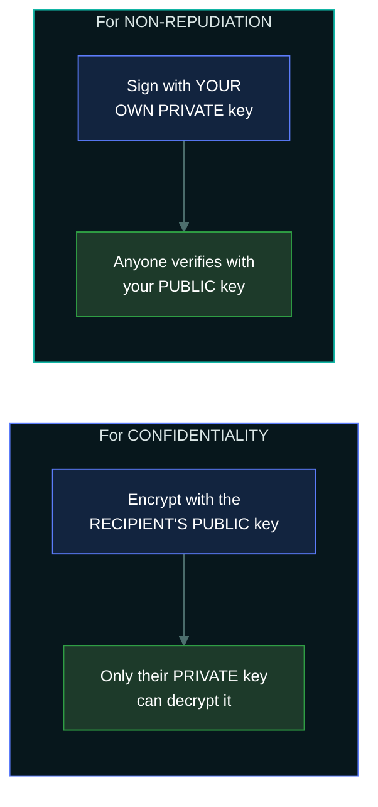
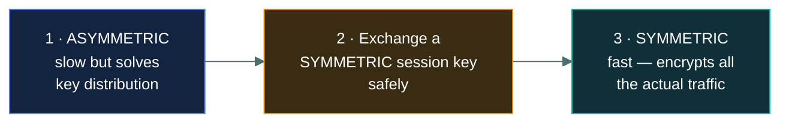

# 🔐 Encryption concepts

### *Symmetric and asymmetric — one key or two, and why you need both*

📌 *One of the heaviest topics in this domain. The key-direction rule — public encrypts, private decrypts — answers a surprising number of questions.*

---

## 🧸 The big idea

Two allied tribes carve an identical whistle-key from the same secret pattern before they ever
part ways. Either tribe's copy can lock and unlock the same message box — but the risk is
obvious: getting a copy of that one identical key safely to the other tribe in the first place,
without a bandit intercepting it along the road.

A stranger tribe with no such history solves it differently: a special lockbox has two
*different* keys, carved from two related but distinct patterns. One key — handed out freely to
absolutely anyone — can only ever **lock** the box. The other key — kept secret by one person
alone — is the only one that can **unlock** it. Anyone in the world can lock a message meant for
you, but only you can ever open it.

That's the whole idea. Encryption turns readable data into unreadable data, reversibly, using a
**key**. There are two families, and the whole topic is the difference between them:

| | **Symmetric** | **Asymmetric** |
|---|---|---|
| Keys | **One** key, shared | **Two** keys, mathematically paired |
| Same key encrypts and decrypts? | ✅ Yes | ❌ No — one encrypts, the other decrypts |
| Speed | **Fast** | **Slow** |
| The problem it has | **Getting the key to the other party safely** | Slowness |

Since locking every single item in a two-key box is far too slow for a whole trade shipment,
the tribes use the two-key box just once — to safely pass each other an identical whistle-key —
then use that fast shared key for the actual bulk of the trading afterward. Each solves the
other's problem, which is why real systems use both:

> **Asymmetric encryption is used to exchange a symmetric key. The symmetric key then does the
> bulk work.**

That sentence describes what happens every time you load an HTTPS page, and it is the single most
useful thing to understand here.

---

## 📖 Words you will keep seeing

| Word | What it means on this exam |
|---|---|
| **Plaintext** | The readable data before encryption. |
| **Ciphertext** | The unreadable data after encryption. |
| **Key** | The secret value that controls the encryption and decryption. |
| **Symmetric encryption** | One shared key encrypts and decrypts. Also called **secret key** cryptography. |
| **Asymmetric encryption** | A key pair: public and private. Also called **public key** cryptography. |
| **Public key** | Shared freely. Used to **encrypt** to someone, or to **verify** their signature. |
| **Private key** | Never shared. Used to **decrypt** what was sent to you, or to **sign**. |
| **AES** | The standard symmetric algorithm. |
| **RSA** | A widely used asymmetric algorithm. |
| **Key exchange** | Getting a shared key to both parties securely. |
| **PKI** — Public Key Infrastructure | The system of certificate authorities that binds public keys to identities. |
| **Digital certificate** | A document binding a public key to a verified identity. |
| **CA** — Certificate Authority | The trusted party that issues certificates. |
| **Key length** | The size of the key in bits. Longer is generally stronger. |

---

## 🔑 Symmetric encryption

**One key. Both parties hold the same one.**

| Strength | Weakness |
|---|---|
| **Fast** — suitable for large volumes | **Key distribution**: how do both parties get the key safely? |
| Efficient in processing and power | Key count explodes — every pair of people needs their own |
| Well understood, e.g. **AES** | Provides **no non-repudiation** — either party could have produced any ciphertext |

**Used for:** encrypting files, disks and databases; the bulk of data inside a TLS session; VPN
traffic.

> ⚠️ **The key distribution problem is symmetric encryption's defining weakness**, and it is what
> asymmetric encryption was invented to solve. If a question asks what problem public key
> cryptography addresses, this is it.

> ⚠️ **A shared symmetric key cannot provide non-repudiation.** Both parties hold the same key, so
> anything one could produce the other could too. Neither can be held to it.

---

## 🔐 Asymmetric encryption

**Two mathematically related keys.** What one encrypts, only the other can decrypt. The public
key is published; the private key never leaves its owner.

### The direction rule

This is the part that earns marks. The direction depends on **what you are trying to achieve**.

| Goal | Encrypt / sign with | Decrypt / verify with |
|---|---|---|
| **Confidentiality** — only they can read it | The **recipient's public** key | Their **private** key |
| **Non-repudiation** — prove it came from you | **Your private** key | Your **public** key |

> [!IMPORTANT]
> **Public key encrypts, private key decrypts** — because anyone may send you a secret, and only
> you may read it.
> **Private key signs, public key verifies** — because only you may sign, and anyone may check.
>
> Both directions follow from one idea: **the private key is the one only you have, so it does the
> thing only you should be able to do.**

| Strength | Weakness |
|---|---|
| **Solves key distribution** — publish the public key freely | **Slow** — unsuitable for bulk data |
| Enables **non-repudiation** through signatures | Needs PKI to bind keys to real identities |
| Scales — one key pair per person, not per pair of people | More computationally expensive |

**Used for:** key exchange, digital signatures, certificates, establishing TLS sessions.

---

## 🤝 How they work together

Read it as a sentence: **the slow method delivers the key, and the fast method does the work.**

This **hybrid** arrangement is what TLS does. The handshake uses asymmetric cryptography to agree
a session key; everything after that is symmetric. It gets asymmetric's key distribution with
symmetric's speed.

> 🎯 **If a question asks why both types are used together, the answer is that asymmetric solves
> key distribution and symmetric provides the speed.**

---

## 📜 PKI and certificates

Public key cryptography has one gap: **how do you know a public key really belongs to who it
claims?** An attacker could publish their own key labelled with your bank's name.

**PKI** solves this with **certificates** issued by a **Certificate Authority**, a trusted third
party that verifies identity before binding it to a public key.

| Component | Does |
|---|---|
| **Certificate Authority (CA)** | Verifies identity and issues certificates |
| **Digital certificate** | Binds a public key to a verified identity |
| **Registration Authority** | Handles the verification requests on the CA's behalf |
| **Certificate Revocation List (CRL)** | Lists certificates revoked before expiry |
| **OCSP** | Checks a single certificate's revocation status in real time |

> ⚠️ **Certificates expire, and they can be revoked before expiry** — if the private key is
> compromised, for example. A browser warning usually means expiry, an untrusted issuer, or a name
> mismatch.

---

## 📏 Key length

**Longer keys are harder to brute force**, and key lengths are not comparable between the two
families — a 256-bit symmetric key and a 256-bit asymmetric key offer very different strength,
because the mathematics differ.

> 🎯 **The security of a well-designed system rests on the secrecy of the key, never on the secrecy
> of the algorithm.** This is **Kerckhoffs's principle**, and "security through obscurity" —
> relying on a secret algorithm — is always the wrong answer.

---

## ⚖️ Told apart

| | Means | Not to be confused with |
|---|---|---|
| **Symmetric** | **One** shared key. Fast. | **Asymmetric**, two paired keys, slow. |
| **Symmetric's weakness** | **Key distribution.** | Speed — symmetric is the fast one. |
| **Asymmetric's weakness** | **Speed.** | Key distribution — that is what it solves. |
| **Public key** | Encrypts **to** someone; **verifies** their signature. | **Private key**, which decrypts and signs. |
| **Encrypting for confidentiality** | Uses the **recipient's public** key. | **Signing**, which uses **your own private** key. |
| **Encryption** | **Reversible** with the key. | **Hashing**, which is one-way and cannot be reversed. |
| **Certificate** | Binds a public key to a **verified identity**. | A key on its own, which claims nothing about who owns it. |
| **Key secrecy** | What security depends on. | **Algorithm secrecy** — obscurity is never the answer. |

---

## ⚠️ Where your instinct is wrong

> [!WARNING]
> **In the job:** you would describe TLS in terms of cipher suites and protocol versions.
>
> **On the exam:** the expected answer is the simple hybrid model — **asymmetric exchanges a key,
> symmetric encrypts the data.** Answer that.

> [!WARNING]
> **In the job:** "encryption" covers hashing loosely in conversation.
>
> **On the exam:** **hashing is not encryption.** Encryption is reversible with a key; hashing is
> one-way with no key and no way back. Passwords are hashed, never encrypted.

> [!WARNING]
> **In the job:** a longer key is straightforwardly better.
>
> **On the exam:** key lengths are **not comparable across families**, and length is only one
> factor. The expected point is that security rests on **key secrecy**, not algorithm secrecy.

---

## 🧠 How to remember it

🧠 **Symmetric = Same key. Asymmetric = A pair.**

🧠 **The direction rule, two sentences:**
**Public encrypts, private decrypts.** **Private signs, public verifies.**
*The private key does the thing only you should be able to do.*

🧠 **Slow key delivers, fast key works.** Asymmetric for exchange, symmetric for bulk.

🧠 **Symmetric's problem is distribution. Asymmetric's problem is speed.** Each fixes the other.

---

## ✅ Check you actually got it

Answer all five before expanding anything.

**Q1.** To send a confidential message that only the recipient can read, which key should be used
to encrypt it?

- **A.** The sender's private key
- **B.** The sender's public key
- **C.** The recipient's public key
- **D.** The recipient's private key

<b>Answer</b>

**C — the recipient's public key.** Only the matching private key can decrypt it, and only the
recipient holds that.

- **A** is used for **signing**, which proves origin. Anyone with the sender's public key could
  decrypt it, so it provides no confidentiality at all.
- **B** would be undecryptable by anyone except the sender, which achieves nothing useful.
- **D** is not available to the sender. The whole point of a private key is that nobody else has it.

**Q2.** What problem does asymmetric encryption solve that symmetric encryption has?

- **A.** Speed of encrypting large volumes of data
- **B.** Securely distributing the key to the other party
- **C.** Detecting whether data has been altered
- **D.** Reducing the size of the ciphertext

<b>Answer</b>

**B — securely distributing the key.** With symmetric encryption both parties need the same secret
key, and getting it to them safely was the historical difficulty. Asymmetric cryptography removes
it: publish the public key freely, because it cannot decrypt anything.

- **A** is reversed. Symmetric is the **fast** one; asymmetric is slow, which is why hybrid systems
  exist.
- **C** is integrity, provided by hashing and digital signatures rather than by encryption itself.
- **D** is not a property either family provides — ciphertext is typically the same size or larger.

**Q3.** In a TLS connection, how are symmetric and asymmetric encryption used?

- **A.** Only asymmetric encryption is used, for both handshake and data
- **B.** Only symmetric encryption is used, with a pre-shared key
- **C.** Asymmetric encryption establishes a symmetric session key, which then encrypts the traffic
- **D.** Symmetric encryption establishes an asymmetric key pair for the session

<b>Answer</b>

**C — asymmetric establishes a symmetric session key, which then encrypts the traffic.** This
hybrid gets asymmetric's solution to key distribution with symmetric's speed.

- **A** would be unusably slow for anything beyond a trivial amount of data.
- **B** would require every client and server to have exchanged a key in advance, which is exactly
  the problem the web could not solve that way.
- **D** inverts the sequence and misunderstands what each family is for.

**Q4.** A message is signed with the sender's private key. What does this provide, and how is it
verified?

- **A.** Confidentiality; verified with the sender's private key
- **B.** Non-repudiation and integrity; verified with the sender's public key
- **C.** Confidentiality; verified with the recipient's public key
- **D.** Availability; verified by the certificate authority

<b>Answer</b>

**B — non-repudiation and integrity, verified with the sender's public key.** Only the sender
holds the private key, so only they could have produced the signature, and any change to the
content breaks verification.

- **A** is wrong on both counts: signing provides no confidentiality, since anyone with the public
  key can verify and the content is not concealed. Verification also never uses a private key.
- **C** misassigns the purpose and the key.
- **D** has nothing to do with signatures; a CA issues certificates rather than verifying
  individual messages.

**Q5.** Which statement about cryptographic security is correct?

- **A.** Security depends on keeping the algorithm secret
- **B.** Security depends on keeping the key secret; the algorithm may be public
- **C.** Symmetric and asymmetric keys of the same length offer equivalent strength
- **D.** Longer keys always guarantee security regardless of implementation

<b>Answer</b>

**B — security depends on key secrecy; the algorithm may be public.** This is Kerckhoffs's
principle, and it is why standard algorithms are published and subjected to public analysis.

- **A** describes security through obscurity, which is always the wrong answer. Secret algorithms
  do not receive scrutiny, and their flaws are found by attackers rather than researchers.
- **C** is false. A 256-bit symmetric key and a 256-bit asymmetric key are not comparable, because
  the underlying mathematics differ entirely.
- **D** contains an absolute and is false on substance — a strong key badly implemented, stored
  insecurely or reused offers little protection.

---

## 🎓 The grown-up version

<b>Extra depth — open this on a second read, never needed for the pass</b>

**Key management is harder than cryptography.** Choosing AES is trivial. Generating keys with
proper randomness, storing them so applications can use them but attackers cannot, rotating them
without breaking decryption of old data, escrowing them so data is not lost when someone leaves,
and destroying them reliably — that is where cryptographic systems actually fail. Hardware security
modules exist to hold keys in tamper-resistant hardware that performs operations without ever
exposing the key. Most real-world "encryption failures" are key management failures.

**Perfect forward secrecy.** In older TLS, if an attacker recorded traffic and later obtained the
server's private key, they could decrypt everything they had captured. Modern key exchange —
ephemeral Diffie–Hellman — generates a fresh session key per connection that is never transmitted
and never derivable from the long-term key, so a later key compromise does not retroactively
expose past sessions. This is why the "record now, decrypt later" threat is much weaker against
current TLS than against older versions.

**Quantum computing and the migration already underway.** A sufficiently large quantum computer
would break RSA and elliptic-curve cryptography, because Shor's algorithm factors large numbers
and solves discrete logarithms efficiently. Symmetric encryption is far less affected — Grover's
algorithm roughly halves the effective key length, so AES-256 remains comfortable. Standards
bodies have selected post-quantum algorithms and migration has begun, driven partly by the
harvest-now-decrypt-later concern for data that must stay secret for decades.

**Why you should never implement cryptography yourself.** Correct algorithms are implemented
incorrectly with alarming regularity: reused initialisation vectors, predictable random number
generation, padding oracles, timing side channels in comparison functions. The consistent
professional advice is to use well-reviewed libraries at the highest level of abstraction
available, and never to construct primitives yourself. The CC exam does not ask this, and it is
the most practically useful thing in this topic.

**Certificate trust is a weak point.** Your browser trusts several hundred certificate
authorities, any of which can issue a certificate for any domain. A compromised or coerced CA can
therefore issue a valid certificate for a site it has no relationship with. Certificate
Transparency logs exist to make such issuance publicly visible, which is a detective control
layered over a preventive one that cannot be fully trusted.

---

## 📝 Cram lines

Destined for [`EXAM-DAY.md`](../../EXAM-DAY.md):

- **Symmetric = Same key, FAST.** Weakness: **key distribution**. Example: **AES**.
- **Asymmetric = A pair, SLOW.** Solves key distribution. Example: **RSA**.
- **PUBLIC ENCRYPTS, PRIVATE DECRYPTS.** (Confidentiality — anyone may send you a secret.)
- **PRIVATE SIGNS, PUBLIC VERIFIES.** (Non-repudiation — only you may sign.)
- **The private key does the thing only you should be able to do.**
- **Hybrid: asymmetric exchanges the session key, symmetric encrypts the traffic.** That's TLS.
- **A shared symmetric key gives NO non-repudiation** — either party could have produced it.
- **Encryption is REVERSIBLE with a key. Hashing is ONE-WAY.** Not the same thing.
- **PKI/CA binds a public key to a verified identity** via a certificate. **CRL/OCSP** handle revocation.
- **Security rests on KEY secrecy, not ALGORITHM secrecy** (Kerckhoffs). Obscurity is never the answer.

---

<a href="../README.md">← back to 05 · Security Operations and Incident Response</a> &nbsp;·&nbsp; <a href="../hashing-and-integrity/">next: Hashing and integrity →</a>

