# 🔐 Encryption Concepts

### *One shared key or a pair of keys — and why real systems use both*

📌 *Symmetric is fast but has a key-distribution problem; asymmetric is slow but solves it. Public encrypts / private decrypts; private signs / public verifies. TLS uses both.*

---

## 🧸 The big idea

Encryption turns readable data into unreadable data, reversibly, using a **key**. There are two
families, and this whole topic is the difference between them.

**Symmetric** is a padlock with **one key**, and you have a copy and so do I. Fast and simple, but
there's a snag: how do I get a copy of that key to you safely, without a thief grabbing it on the
way?

**Asymmetric** is a clever mailbox with **two different keys**. One key, handed out to anyone, can
only **lock** the box. The other key, which only you keep, is the only one that can **unlock** it.
Anyone in the world can post you a locked message, but only you can open it. That solves the
"getting the key to you" problem, because the locking key is public.

| | **Symmetric** | **Asymmetric** |
|---|---|---|
| Keys | **One** shared key | **Two** paired keys (public and private) |
| Same key both ways? | ✅ Yes | ❌ No: one locks, the other unlocks |
| Speed | **Fast** | **Slow** |
| Its problem | **Getting the key to the other person safely** | Being slow |

Locking a whole shipment with the slow two-key mailbox would take forever, so real systems use it
just once, to hand over a fast shared key, and then do the bulk work with that:

> **Asymmetric encryption is used to hand over a symmetric key. The symmetric key then does the
> heavy lifting.**

That sentence describes what happens every time you load an HTTPS page, and it's the single most
useful thing to understand here.

---

## 📖 Words you will keep seeing

| Word | What it means on this exam |
|---|---|
| **Plaintext** | The readable data, before encryption. |
| **Ciphertext** | The scrambled data, after encryption. |
| **Key** | The secret value that controls encryption and decryption. |
| **Symmetric encryption** | One shared key encrypts and decrypts. Also called **secret key**. |
| **Asymmetric encryption** | A pair of keys: public and private. Also called **public key**. |
| **Public key** | Shared freely. Used to **encrypt** to someone, or to **verify** their signature. |
| **Private key** | Never shared. Used to **decrypt** what was sent to you, or to **sign**. |
| **AES** | The standard symmetric algorithm. |
| **RSA** | A widely used asymmetric algorithm. |
| **PKI** (Public Key Infrastructure) | The system of certificate authorities that ties public keys to real identities. |
| **Digital certificate** | A document tying a public key to a verified identity. |
| **CA** (Certificate Authority) | The trusted party that issues certificates. |

---

## 🔍 The explanation

### The two families

**Symmetric encryption** uses one key that both sides hold.

| Strength | Weakness |
|---|---|
| **Fast**: good for large amounts of data | **Key distribution**: how do both sides get the key safely? |
| Efficient on power and processing | Every pair of people needs their own key, so the count explodes |
| Well understood, e.g. **AES** | **No non-repudiation**: either side could have produced any ciphertext |

> ⚠️ **Key distribution is symmetric encryption's defining weakness**, and it's the exact problem
> asymmetric encryption was invented to solve. If a question asks what public key cryptography
> solves, this is it.

> ⚠️ **A shared symmetric key can't give non-repudiation.** Both sides hold the same key, so
> anything one could make, the other could too. Neither can be pinned to it.

**Asymmetric encryption** uses two mathematically paired keys. What one locks, only the other
unlocks. The public key is published; the private key never leaves its owner.

| Strength | Weakness |
|---|---|
| **Solves key distribution**: publish the public key freely | **Slow**: not suitable for bulk data |
| Enables **signatures** (non-repudiation) | Needs PKI to tie keys to real identities |
| Scales: one key pair per person, not per pair of people | More processing work |

### The direction rule

This is the part that earns marks. Which key you use depends on **what you're trying to do**:

| Goal | Encrypt / sign with | Decrypt / verify with |
|---|---|---|
| **Confidentiality**: only they can read it | The **recipient's public** key | Their **private** key |
| **Non-repudiation**: prove it came from you | **Your private** key | Your **public** key |

> [!IMPORTANT]
> **Public key encrypts, private key decrypts** (anyone may send you a secret, only you may read
> it). **Private key signs, public key verifies** (only you may sign, anyone may check).
>
> Both follow from one idea: **the private key is the one only you have, so it does the thing only
> you should be able to do.**

### How they work together

This **hybrid** arrangement is what TLS does. The handshake uses asymmetric cryptography to agree a
session key, and everything after that is symmetric. You get asymmetric's solution to key
distribution *and* symmetric's speed.

> 🎯 **If a question asks why both types are used together: asymmetric solves key distribution, and
> symmetric provides the speed.** The slow key delivers; the fast key works.

### PKI and certificates

Public key cryptography has one gap: **how do you know a public key really belongs to who it claims
to?** An attacker could publish their own key labelled with your bank's name.

**PKI** solves this with **certificates** issued by a **Certificate Authority (CA)**, a trusted
third party that verifies an identity before tying it to a public key.

| Component | Does |
|---|---|
| **Certificate Authority (CA)** | Verifies identity and issues certificates |
| **Digital certificate** | Ties a public key to a verified identity |
| **CRL** (Certificate Revocation List) | Lists certificates cancelled before they expire |
| **OCSP** | Checks a single certificate's status in real time |

> ⚠️ **Certificates expire, and can be revoked before expiry** if the private key is compromised. A
> browser warning usually means the certificate has expired, comes from an untrusted issuer, or the
> name doesn't match.

### Key length

**Longer keys are harder to brute-force**, but key lengths **aren't comparable between the two
families**. A 256-bit symmetric key and a 256-bit asymmetric key give very different strength,
because the underlying maths is different.

> 🎯 **Security rests on the secrecy of the key, never the secrecy of the algorithm.** That's
> **Kerckhoffs's principle**, and "security through obscurity" (relying on a secret algorithm) is
> always the wrong answer.

---

## ⚖️ Told apart

| | Means | Not to be confused with |
|---|---|---|
| **Symmetric** | **One** shared key. Fast. | **Asymmetric** — two paired keys, slow. |
| **Symmetric's weakness** | **Key distribution.** | Speed — symmetric is the fast one. |
| **Asymmetric's weakness** | **Speed.** | Key distribution — that's what it solves. |
| **Public key** | Encrypts **to** someone; **verifies** their signature. | **Private key**, which decrypts and signs. |
| **Encrypting for confidentiality** | Uses the **recipient's public** key. | **Signing**, which uses **your own private** key. |
| **Encryption** | **Reversible** with the key. | **Hashing** — one-way, can't be reversed. |
| **Certificate** | Ties a public key to a **verified identity**. | A key on its own, which proves nothing about who owns it. |
| **Key secrecy** | What security depends on. | **Algorithm secrecy** — obscurity is never the answer. |

---

## ⚠️ Where your instinct is wrong

> [!WARNING]
> **In the job:** you'd describe TLS in terms of cipher suites and protocol versions.
>
> **On the exam:** the expected answer is the simple hybrid model: **asymmetric hands over a key,
> symmetric encrypts the data.** Answer that.

> [!WARNING]
> **In the job:** "encryption" loosely covers hashing in conversation.
>
> **On the exam:** **hashing is not encryption.** Encryption is reversible with a key; hashing is
> one-way with no key and no way back. Passwords are hashed, never encrypted.

> [!WARNING]
> **In the job:** a longer key is simply better.
>
> **On the exam:** key lengths **aren't comparable across families**, and length is only one factor.
> The point being tested is that security rests on **key secrecy**, not on hiding the algorithm.

---

## 🧠 How to remember it

**Symmetric = Same key. Asymmetric = A pair.**

**Public encrypts, private decrypts. Private signs, public verifies.** *The private key does the
thing only you should be able to do.*

**Slow key delivers, fast key works.** Asymmetric for the exchange, symmetric for the bulk.

**Symmetric's problem is distribution. Asymmetric's problem is speed.** Each fixes the other.

---

## ✅ Check you actually got it

Answer all five before expanding anything.

**Q1.** To send a confidential message that only the recipient can read, which key should be used to
encrypt it?

- **A.** The sender's private key
- **B.** The sender's public key
- **C.** The recipient's public key
- **D.** The recipient's private key

<b>Answer</b>

**C — the recipient's public key.** Only the matching private key can decrypt it, and only the
recipient holds that.

- **A** is used for **signing**, which proves origin. Anyone with the sender's public key could
  decrypt it, so it gives no confidentiality.
- **B** would produce something only the sender could decrypt, which achieves nothing useful.
- **D** isn't available to the sender. The whole point of a private key is that nobody else has it.

**Q2.** What problem does asymmetric encryption solve that symmetric encryption has?

- **A.** Speed of encrypting large volumes of data
- **B.** Securely distributing the key to the other party
- **C.** Detecting whether data has been altered
- **D.** Reducing the size of the ciphertext

<b>Answer</b>

**B — securely distributing the key.** Symmetric encryption needs both sides to hold the same secret
key, and getting it to them safely was the historical difficulty. Asymmetric removes it: publish the
public key freely, because it can't decrypt anything.

- **A** is backwards. Symmetric is the **fast** one; asymmetric is slow, which is why hybrid systems
  exist.
- **C** is integrity, which comes from hashing and signatures, not from encryption itself.
- **D** isn't something either family provides. Ciphertext is usually the same size or larger.

**Q3.** In a TLS connection, how are symmetric and asymmetric encryption used?

- **A.** Only asymmetric encryption is used, for both handshake and data
- **B.** Only symmetric encryption is used, with a pre-shared key
- **C.** Asymmetric encryption establishes a symmetric session key, which then encrypts the traffic
- **D.** Symmetric encryption establishes an asymmetric key pair for the session

<b>Answer</b>

**C — asymmetric sets up a symmetric session key, which then encrypts the traffic.** This hybrid gets
asymmetric's solution to key distribution and symmetric's speed.

- **A** would be unusably slow for anything beyond a trivial amount of data.
- **B** would need every client and server to have swapped a key in advance, which is exactly the
  problem the web couldn't solve that way.
- **D** reverses the sequence and misunderstands what each family is for.

**Q4.** A message is signed with the sender's private key. What does this provide, and how is it
verified?

- **A.** Confidentiality; verified with the sender's private key
- **B.** Non-repudiation and integrity; verified with the sender's public key
- **C.** Confidentiality; verified with the recipient's public key
- **D.** Availability; verified by the certificate authority

<b>Answer</b>

**B — non-repudiation and integrity, verified with the sender's public key.** Only the sender holds
the private key, so only they could have made the signature, and any change to the content breaks
verification.

- **A** is wrong twice: signing gives no confidentiality (anyone with the public key can verify, and
  the content isn't hidden), and verification never uses a private key.
- **C** puts the purpose and the key both in the wrong place.
- **D** has nothing to do with signatures. A CA issues certificates; it doesn't verify individual
  messages.

**Q5.** Which statement about cryptographic security is correct?

- **A.** Security depends on keeping the algorithm secret
- **B.** Security depends on keeping the key secret; the algorithm may be public
- **C.** Symmetric and asymmetric keys of the same length offer equivalent strength
- **D.** Longer keys always guarantee security regardless of implementation

<b>Answer</b>

**B — security depends on key secrecy; the algorithm may be public.** That's Kerckhoffs's principle,
and it's why standard algorithms are published and studied openly.

- **A** is security through obscurity, which is always the wrong answer. Secret algorithms get no
  scrutiny, so their flaws are found by attackers rather than researchers.
- **C** is false. A 256-bit symmetric key and a 256-bit asymmetric key aren't comparable, because
  the maths is entirely different.
- **D** contains an absolute and is false: a strong key that's badly implemented, stored carelessly
  or reused gives little protection.

---

## 🎓 The grown-up version

<b>Extra depth — open this on a second read, never needed for the pass</b>

**Key management is harder than the cryptography.** Choosing AES is trivial. Generating keys with
real randomness, storing them so applications can use them but attackers can't, rotating them
without breaking access to old data, and destroying them reliably: that's where cryptographic
systems actually fail. **Hardware security modules (HSMs)** hold keys in tamper-resistant hardware
that performs the operations without ever exposing the key. Most real "encryption failures" are key
management failures.

**How TLS 1.3 sets up the key.** Both sides send a **key share**, half of an ephemeral
Diffie-Hellman exchange, and each independently computes the *same* session key from its own half
plus the other side's public half. The actual key never crosses the network. The server's
certificate rides along in the same exchange, so the client can check it's talking to the right
server before trusting anything.

**Perfect forward secrecy.** Because that session key is derived fresh per connection and never
transmitted, an attacker who records traffic and *later* steals the server's long-term private key
still can't decrypt the old sessions. This is why the "record now, decrypt later" threat is much
weaker against modern TLS than against older versions.

**Quantum computing and the migration already under way.** A large enough quantum computer would
break RSA and elliptic-curve cryptography, because Shor's algorithm factors large numbers and solves
discrete logarithms efficiently. Symmetric encryption is far less affected: Grover's algorithm
roughly halves the effective key length, so AES-256 stays comfortable. Standards bodies have chosen
post-quantum algorithms, and migration has begun, driven partly by the harvest-now-decrypt-later
worry for data that must stay secret for decades.

**Never implement cryptography yourself.** Correct algorithms get implemented incorrectly all the
time: reused initialisation vectors, predictable randomness, padding oracles, timing leaks in
comparison functions. The consistent advice is to use well-reviewed libraries at the highest level
available and never build the primitives yourself. The exam doesn't ask this, and it's the most
practically useful thing in the topic.

**Certificate trust is a weak point.** Your browser trusts hundreds of certificate authorities, any
of which can issue a certificate for any domain. A compromised or coerced CA can therefore issue a
valid certificate for a site it has no relationship with. Certificate Transparency logs make such
issuance publicly visible, a detective control layered over a preventive one that can't be fully
trusted.

---

## 📝 Cram lines

Destined for [`EXAM-DAY.md`](../../EXAM-DAY.md):

- **Symmetric = Same key, FAST.** Weakness: **key distribution**. Example: **AES**.
- **Asymmetric = A pair, SLOW.** Solves key distribution. Example: **RSA**.
- **PUBLIC ENCRYPTS, PRIVATE DECRYPTS** (confidentiality — anyone may send you a secret).
- **PRIVATE SIGNS, PUBLIC VERIFIES** (non-repudiation — only you may sign). *The private key does what only you should be able to do.*
- **Hybrid: asymmetric hands over the session key, symmetric encrypts the traffic.** That's TLS.
- **A shared symmetric key gives NO non-repudiation** — either party could have produced it.
- **Encryption is REVERSIBLE with a key. Hashing is ONE-WAY.** Not the same thing.
- **PKI / CA ties a public key to a verified identity** via a certificate. **CRL / OCSP** handle revocation.
- **Security rests on KEY secrecy, not ALGORITHM secrecy** (Kerckhoffs). Obscurity is never the answer.

---

<a href="../README.md">← back to 05 · Security Operations and Incident Response</a> &nbsp;·&nbsp; <a href="../hashing-and-integrity/">next: Hashing and integrity →</a>

