# 🎯 Event Triage and Threat Intelligence

### *Deciding fast what to look at first — and knowing who might be attacking you*

📌 *Correlation links related alerts; prioritisation ranks them by severity and confidence. Rank threat actors (nation-state at the top), know the three CTI levels, and tell an IOC from an IOA.*

---

## 🧸 The big idea

A hospital emergency room can't treat everyone at once, so a nurse at the door does **triage**:
quickly sorting who needs care first. A quiet patient having a heart attack goes ahead of a loud one
with a sprained wrist.

A security team faces the same problem with alerts. Thousands come in; you can't investigate every
one at once. **Triage** is deciding, fast, what deserves attention first. Two skills make it work:

- **Prioritisation.** How bad would it be if this alert is real, and how likely is it real? A quiet
  but serious signal beats a loud but harmless one.
- **Correlation.** Noticing that three separate alerts (a failed login, a new scheduled task, an odd
  outbound connection) aren't three problems, but one attack told in three pieces.

Triage works better when you know **who might be attacking you and how they operate**. That's **cyber
threat intelligence (CTI)**, and it's organised using **threat frameworks**: a shared way to describe
attacker behaviour that everyone reads the same way.

---

## 📖 Words you will keep seeing

| Word | What it means on this exam |
|---|---|
| **Security event** | Any observable occurrence in a system or network. Not necessarily bad. |
| **Alert** | A system notification that an event may need attention. |
| **Triage** | Sorting and prioritising alerts for response. |
| **Prioritisation** | Ranking alerts by severity and likelihood, so the worst real threats get seen first. |
| **Correlation** | Linking related events into one picture, instead of treating each alert alone. |
| **Threat actor** | Who is carrying out an attack: nation-state, organised crime, hacktivist, insider, script kiddie. |
| **Cyber threat intelligence (CTI)** | Analysed information about threat actors, their capabilities and behaviour, used to guide defence. |
| **Threat framework** | A published, structured way to describe attacker tactics consistently (e.g. MITRE ATT&CK). |
| **IOC** (Indicator of Compromise) | A static artefact left behind: a malicious IP, a file hash, a suspicious registry key. |
| **IOA** (Indicator of Attack) | Evidence of attacker *behaviour or intent* in progress, rather than an artefact left behind. |
| **SOAR** (Security Orchestration, Automation and Response) | Tooling that automates routine triage steps, so analysts spend time on judgement calls. |

---

## 🔍 The explanation

### Triage: correlation and prioritisation

- **Prioritisation** asks: of everything alerting right now, what do we look at first? It weighs
  severity (how bad if real) against confidence (how likely this is genuine), not raw alert volume.
- **Correlation** asks: are these separate alerts actually one story? A failed login, a new scheduled
  task and an outbound connection to an unusual IP each look minor alone. Linked, they describe one
  intrusion in progress.

> 🎯 **Correlation usually comes before prioritisation.** You can't judge the severity of three
> isolated-looking alerts until you realise they're one attack chain. **Link it, then rank it.**

**Why triage can't run on people alone.** A team facing thousands of daily alerts can't hand-correlate
every one, which is why **detection patterns** and **SOAR playbooks** exist: they automate the
mechanical parts (gathering context, initial correlation) so analysts' judgement goes where it's
needed. When alert volume still overwhelms this, the fix is **tuning** the detections.

> ⚠️ **"Add more rules" is rarely the answer to alert fatigue.** Tuning the existing rules to cut
> noise, and correlating before escalating, are what the exam expects.

### IOC versus IOA: artefact versus behaviour

Not every clue is the same kind of clue. A footprint tells you a burglar was here last night, but a
burglar who learns that footprints give them away just wears different shoes, and the clue is gone.
Someone testing every window and door to find one that's unlocked is a different kind of clue: that
*is* how a break-in works, and they can't easily stop doing it.

> 🎯 **IOCs tell you something bad already happened somewhere. IOAs can catch an attack while it's
> still in progress.** That's why mature detection moves beyond IOC lists towards behaviour-based
> detection.

### Threat actors and motivations

Not every attacker is the same kind of threat:

| Actor type | Typical motivation | Capability |
|---|---|---|
| **Nation-state / APT** | Espionage, disruption, strategic advantage | Highest: patient, funded, persistent |
| **Organised crime** | Money | High: professional, profit-driven |
| **Hacktivist** | Ideology or politics | Varies |
| **Insider** | Grievance, money, or plain carelessness | Access-driven: already has valid credentials |
| **Script kiddie** | Curiosity, reputation | Low: uses others' tools without deep understanding |

> 🎯 **Ranked by capability, nation-state actors are the top and script kiddies the bottom.** If a
> question describes long-term, stealthy access with serious resources behind it, it wants
> **nation-state / APT**.

### Cyber threat intelligence

CTI turns raw information into something a defender can act on. Different people need different
versions of it, so it comes in three levels:

**Threat frameworks** give CTI a shared vocabulary. **MITRE ATT&CK** catalogues known attacker
tactics and techniques (such as "initial access" and "lateral movement"), so intelligence from one
incident can be described in terms other defenders recognise, instead of free-text prose unique to
that report.

> ⚠️ **At CC depth, know that threat frameworks exist and what they're for** (a shared, structured
> way to describe attacker behaviour), not any framework's internal technique IDs.

---

## ⚖️ Told apart

| | Means | Not to be confused with |
|---|---|---|
| **Prioritisation** | Ranking alerts by severity and confidence. | **Correlation** — linking related alerts into one picture, usually done first. |
| **CTI** | Analysed, actionable information about threats. | **An IOC** — one observable data point CTI might use as input. |
| **Threat framework** | A structured way to *describe* attacker behaviour. | **CTI itself** — the actual intelligence the framework helps organise. |
| **Threat actor** | Who is carrying out an attack. | **Threat vector** — the route or method used. |
| **IOC** | A static artefact: a hash, an IP, a file name. | **IOA** — attacker behaviour or intent seen while it's happening, harder to change. |
| **Alert tuning** | Adjusting existing rules to cut false positives. | **Adding more rules**, which increases volume rather than fixing the noise. |

---

## ⚠️ Where your instinct is wrong

> [!WARNING]
> **In the job:** you'd instinctively investigate the loudest or most recent alert first.
>
> **On the exam:** the expected answer prioritises by a mix of **severity and confidence**, informed
> by **correlation**, not by recency or volume alone. A quiet, low-volume alert correlated with other
> signals into a coherent attack chain outranks a noisy but isolated one.

> [!WARNING]
> **In the job:** blocking a bad file's hash or a bad IP feels like solid defence.
>
> **On the exam:** those are **IOCs**, and an attacker changes them cheaply (one new sample, one new
> hash). Detecting on **behaviour (IOA / TTP)** is what actually costs an attacker.

> [!WARNING]
> **In the job:** more detection rules feels like better coverage.
>
> **On the exam:** more rules means more alerts, which is the cause of alert fatigue. **Tuning** the
> existing rules is the answer.

---

## 🧠 How to remember it

**"Link it, then rank it."** Correlate related events into one picture before deciding what to work
first.

**Nation-state at the top, script kiddie at the bottom.**

**CTI levels: Strategic (leadership) → Operational (campaigns) → Tactical (IOCs to block).**

**IOC is a thing left behind (easy to change). IOA is behaviour in progress (harder to change).**

---

## ✅ Check you actually got it

Answer all five before expanding anything.

**Q1.** A SOC analyst notices three separate low-severity alerts (a failed login, a new scheduled
task, and an unusual outbound connection) all from the same host within ten minutes. What should the
analyst do FIRST?

- **A.** Dismiss each as low severity individually
- **B.** Correlate the events to determine whether they represent a single incident
- **C.** Escalate only the outbound connection alert
- **D.** Wait for a fourth alert before taking any action

<b>Answer</b>

**B — correlate the events.** Individually low-severity alerts can add up to one serious incident when
linked, and correlation should generally come before final prioritisation.

- **A** ignores the pattern by treating each alert alone.
- **C** picks one alert at random without considering the combined picture.
- **D** delays action while the risk may be escalating, with no reason to wait.

**Q2.** Which threat actor type is MOST associated with a well-resourced, patient, long-term covert
intrusion?

- **A.** Script kiddie
- **B.** Hacktivist
- **C.** Nation-state / APT
- **D.** Insider

<b>Answer</b>

**C — nation-state / APT.** These actors rank highest in capability and are typically patient, funded
and persistent.

- **A** is low-capability, opportunistic activity.
- **B** is ideologically driven and usually less focused on long-term stealth.
- **D** already has legitimate access, which is a different risk profile from a covert external
  intrusion.

**Q3.** What is the PRIMARY purpose of a threat framework such as MITRE ATT&CK?

- **A.** To provide a shared, structured vocabulary for describing attacker tactics and techniques
- **B.** To automatically block all known attacks
- **C.** To replace the need for a SOC
- **D.** To certify individual security analysts

<b>Answer</b>

**A — a shared, structured vocabulary for attacker behaviour.** It lets intelligence from different
sources be described and compared consistently.

- **B** overstates what a descriptive framework does. It organises knowledge; it doesn't block
  anything by itself.
- **C** and **D** describe things the framework doesn't do.

**Q4.** Strategic, operational, and tactical are levels of which of the following?

- **A.** Incident response phases
- **B.** Cyber threat intelligence
- **C.** Risk treatment options
- **D.** Access control models

<b>Answer</b>

**B — cyber threat intelligence.** The three levels describe intelligence aimed at different audiences
and decisions.

- **A** is a separate concept: the phases of handling a declared incident.
- **C** is accept / avoid / mitigate / transfer, unrelated to intelligence levels.
- **D** is DAC / MAC / RBAC / ABAC, unrelated.

**Q5.** An analyst notices a user account suddenly using administrative privileges it has never used
before, though no known-malicious file or IP is involved. This is BEST described as which of the
following?

- **A.** An IOC
- **B.** An IOA
- **C.** A threat framework
- **D.** A false positive by definition

<b>Answer</b>

**B — an IOA.** This is behaviour and intent seen in progress, not a static artefact like a hash or
IP, which is exactly what separates an IOA from an IOC.

- **A** needs a specific static artefact, which is absent here.
- **C** is a vocabulary for organising such observations, not the observation itself.
- **D** assumes the activity is harmless with no evidence. Unusual privilege use warrants
  investigation, not automatic dismissal.

---

## 🎓 The grown-up version

<b>Extra depth — open this on a second read, never needed for the pass</b>

**Alert fatigue is the real driver behind triage.** Analysts facing thousands of daily alerts start
pattern-matching and dismissing quickly, which is exactly why correlation engines (SIEM correlation
rules, SOAR playbooks) exist: to do the linking automatically before a human sees the combined
picture, rather than relying on someone to notice that three unrelated-looking tickets belong
together.

**The Pyramid of Pain.** A commonly referenced model (not required by CC) ranks indicator types by
how much it costs an attacker when you block them.

Blocking a hash costs an attacker nothing (change one byte, get a new hash). Blocking their **TTPs**
(how they establish persistence, how they move laterally) costs them real, expensive retooling,
because it targets *how* they operate rather than *what* they happened to use today. That's the
argument, in one picture, for CTI moving up the pyramid instead of just collecting IOC lists.

**How CTI is actually shared.** **STIX** (Structured Threat Information eXpression) is a standard data
format for describing a threat actor, an indicator or a TTP as structured JSON rather than free prose.
**TAXII** (Trusted Automated Exchange of Intelligence Information) is the protocol that moves STIX
packages between organisations automatically. A SIEM can subscribe to a TAXII feed and ingest
thousands of new indicators without an analyst retyping them from a report. That's what makes tactical
CTI "actionable".

**Why SOAR complements rather than replaces analysts.** A playbook reliably does the mechanical steps
of triage (look up a file hash's reputation, check whether an IP has been seen before, open a ticket)
every time, without fatigue. It can't make the judgement call about whether a genuinely new pattern of
behaviour matters, which is exactly the part of triage that still needs a human, and exactly why "more
automation" isn't a universal answer to every alert-volume problem.

---

## 📝 Cram lines

Destined for [`EXAM-DAY.md`](../../EXAM-DAY.md):

- **Correlation links related events. Prioritisation ranks them by severity + confidence.** Correlation usually comes first: *link it, then rank it.*
- **Threat actors ranked by capability:** nation-state / APT > organised crime > hacktivist > insider > script kiddie.
- **CTI levels: Strategic (leadership) → Operational (campaigns) → Tactical (IOCs to block).**
- **A threat framework (e.g. MITRE ATT&CK) is a shared vocabulary for attacker behaviour**, not a blocking tool.
- **IOC = a static artefact (easy to change). IOA = behaviour / intent (harder to change).**
- **Alert fatigue → tune the rules**, don't just add more.

---

<a href="../README.md">← back to 05 · Security Operations and Incident Response</a> &nbsp;·&nbsp; <a href="../incident-terminology/">next: Incident terminology →</a>

