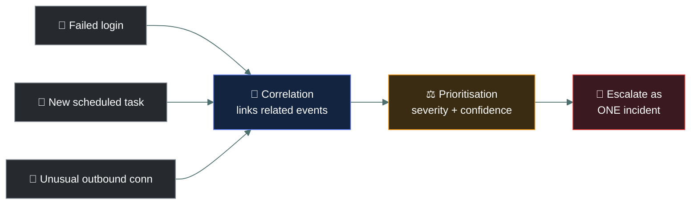
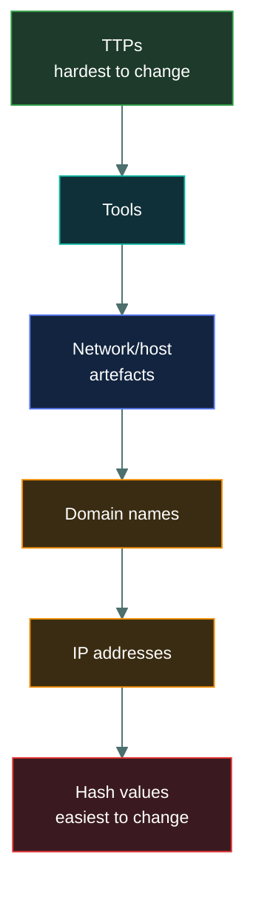

# 🎯 Event triage and threat intelligence

### *Deciding what matters, and who's likely behind it*

📌 *Security event triage — prioritisation and correlation — plus the vocabulary of threat actors, cyber threat intelligence, and threat frameworks.*

---

## 🧸 The big idea

Every night, the tribe's watchmen hear dozens of rustles in the bushes around camp. Most are
wind, or a raccoon, or nothing at all. One might be a wolf. Nobody has time to grab a spear and
investigate every single rustle personally — so the watchmen have to decide, fast, which rustles
deserve a closer look and in what order.

That's **triage**. Deciding fast, out of everything making noise, what deserves attention first.
Two skills make triage work. **Prioritisation** — how bad would it be if this one is real, and
how likely is it real — so a faint noise near the sleeping children outranks a loud one near an
empty field. And **correlation** — noticing that paw prints near the henhouse, a missing chicken,
and a distant growl aren't three separate rustles at all, but one wolf's whole night, told in
three pieces.

Triage works better when you know **who might be raiding you and why** — that's **cyber
threat intelligence (CTI)**, the tribe's intelligence about which raiders are in the valley and
how they operate — and it's organised using **threat frameworks**: a shared almanac of raider
tactics every tribe can read the same way, described in the same terms.

---

## 📖 Words you will keep seeing

| Word | What it means on this exam |
|---|---|
| **Security event** | Any observable occurrence in a system or network — not necessarily bad. |
| **Alert** | A system-generated notification that an event may warrant attention. |
| **Triage** | The process of sorting and prioritising alerts/incidents for response. |
| **Prioritisation** | Ranking alerts by severity and likelihood, so the worst genuine threats get attention first. |
| **Correlation** | Linking related events across sources/time into one coherent picture rather than treating each alert in isolation. |
| **Use case** (in this context) | A defined pattern of activity a detection is built to catch — e.g. "multiple failed logins followed by a success." |
| **Threat actor** | The entity carrying out a threat — nation-state, organised crime, hacktivist, insider, script kiddie. |
| **Cyber threat intelligence (CTI)** | Analysed information about threat actors, their capabilities, motivations and behaviour, used to inform defence. |
| **Threat framework** | A published, structured way of describing attacker tactics and techniques consistently across organisations (e.g. MITRE ATT&CK). |
| **IOC (Indicator of Compromise)** | Observable evidence that a compromise may have occurred — a malicious IP, a file hash, a suspicious registry key. |
| **IOA (Indicator of Attack)** | Evidence of attacker *behaviour or intent* in progress (e.g. unusual privilege use), rather than a static artefact left behind. |
| **TTP (Tactics, Techniques and Procedures)** | The pattern of *how* a threat actor operates — the highest-level, hardest-to-change thing to detect on. |
| **SOAR (Security Orchestration, Automation and Response)** | Tooling that automates routine triage/response steps (enriching an alert, running a playbook) so analysts spend time on judgment calls, not repetitive lookups. |
| **Alert tuning** | Adjusting detection rules to reduce false positives without losing real detections — the standing fix for alert fatigue. |

---

## 🔍 Triage: prioritisation and correlation

A faint growl near the sleeping children, matched against footprints by the fence and a howl an
hour ago, is one wolf closing in — and it outranks the loud but lone raccoon rattling the
grain-bin lid across camp, even though the raccoon is noisier right now.

**Prioritisation** asks: of everything alerting right now, what do we look at first? It weighs
severity (how bad if real) against confidence (how likely this is a true positive), not
just raw alert volume.

**Correlation** asks: are these separate alerts actually one story? A failed login, a new
scheduled task, and an outbound connection to an unusual IP — investigated separately, each
looks minor. Correlated, they describe a single intrusion in progress.

> 🎯 **Correlation usually comes before prioritisation in practice** — you can't accurately
> judge severity of three isolated-looking alerts until you realise they're one attack chain.

**Why triage doesn't scale on humans alone.** A SOC with thousands of daily alerts cannot
manually correlate every one, which is why **use cases** (predefined detection patterns) and
**SOAR playbooks** exist — automating the mechanical parts of triage (enrichment, initial
correlation) so an analyst's judgment is spent on the alerts that actually need it. When alert
volume overwhelms this, the standing fix is **tuning** the detections, not simply hiring more
analysts to look at more noise.

> ⚠️ **"Add more rules" is rarely the textbook answer to alert fatigue.** Tuning existing rules
> to cut noise, and correlating before escalating, are the answers the exam expects.

---

## 🔎 IOC versus IOA — artefacts versus behaviour

Not every clue is the same kind of clue. A paw print in the mud tells you a wolf passed through
last night — but a wolf that learns the mud gives it away just starts walking through the stream
instead, and the print is gone. A pack circling downwind of the herd before it strikes is a
different kind of clue: that circling *is* how wolves hunt. They can't simply stop doing it
without stopping being wolves.

| | Looks at | Example | How easy to change |
|---|---|---|---|
| **IOC** | A static artefact left behind | A specific file hash, a malicious IP address | **Easy for an attacker to change** — a new sample has a new hash |
| **IOA** | Behaviour or intent while it's happening | An account suddenly using admin privileges it's never used before | **Harder to change** — the underlying goal doesn't shift as easily as one file |

> 🎯 **IOCs tell you something bad already happened somewhere. IOAs can catch an attack while
> it's still in progress.** This is why mature detection strategies move beyond IOC lists
> toward behaviour-based (IOA/TTP) detection.

---

## 👤 Threat actors and motivations

Not every raider is the same kind of threat. A lone scavenger poking at the fence with a stick is
a different problem than a rival chief's trained war band sent to weaken your tribe on purpose —
and a tribe-member who knows exactly where the grain store's weak plank is, because he built it,
is a different problem again.

| Actor type | Typical motivation | Capability |
|---|---|---|
| **Nation-state / APT** | Espionage, disruption, strategic advantage | Highest — patient, funded, persistent |
| **Organised crime** | Financial gain | High — professional, profit-driven |
| **Hacktivist** | Ideological or political | Variable |
| **Insider** | Grievance, financial gain, or simple negligence | Access-driven — already has legitimate credentials |
| **Script kiddie** | Curiosity, reputation | Low — uses existing tools without deep understanding |

> 🎯 **Ranked by capability, nation-state actors are the top and script kiddies the bottom.** If
> a question describes long-term stealthy access with substantial resources, it wants
> **nation-state / APT**.

---

## 🕵️ Cyber threat intelligence (CTI)

CTI turns raw information into something a defender can act on. The chief doesn't need the same
report as the watchman on the wall tonight — one needs to know which raiders to prepare for this
season, the other needs to know exactly which howl to listen for before midnight. It's commonly
described at three levels:

| Level | Answers | Consumed by |
|---|---|---|
| **Strategic** | "What threats should leadership plan around?" | Executives, risk owners |
| **Operational** | "What campaign or actor is currently targeting organisations like us?" | SOC managers, incident responders |
| **Tactical** | "What specific IOCs should our tools block right now?" | Analysts, detection engineering |

**Threat frameworks** give CTI a shared vocabulary. A framework like **MITRE ATT&CK** catalogues
known attacker tactics and techniques (e.g. "initial access," "lateral movement") so that
intelligence from one incident can be described in terms other defenders will recognise,
rather than in free-text prose unique to that report.

> ⚠️ **At CC depth, you need to know that threat frameworks exist and what they're for** — a
> shared, structured way to describe attacker behaviour — not to memorise a framework's
> internal technique IDs.

---

## 🔬 The Pyramid of Pain, and how CTI is actually shared

The grown-up section mentions a model ranking IOC types by how costly they are for an attacker
to change. Here it is, drawn out.

Blocking a hash costs an attacker nothing — they change one byte and get a new hash. Blocking
their actual **TTPs** (how they establish persistence, how they move laterally) costs them
real, expensive retooling, because it targets *how* they operate rather than *what* they
happened to use today. This is the concrete argument, in one picture, for why mature CTI moves
up the pyramid rather than just collecting IOC lists.

**STIX and TAXII are the real technical standards that let organisations share threat
intelligence in a machine-readable way rather than a PDF report.** **STIX** (Structured Threat
Information eXpression) is a standardised data format for describing a threat actor, an
indicator, or a TTP as structured JSON rather than free prose. **TAXII** (Trusted Automated
Exchange of Intelligence Information) is the transport protocol that moves STIX packages between
organisations — an information-sharing group, a government feed, a vendor's threat intel
platform — automatically and on a schedule. This is what actually makes tactical CTI
"actionable": a SIEM can subscribe to a TAXII feed and automatically ingest thousands of new
STIX-formatted indicators without an analyst manually retyping them from a report.

---

## ⚖️ Told apart

| | Means | Not to be confused with |
|---|---|---|
| **Prioritisation** | Ranking alerts by severity and confidence. | **Correlation**, which links related alerts into one picture — often a prerequisite for accurate prioritisation. |
| **CTI** | Analysed, actionable information about threats. | **An IOC**, which is one specific observable data point CTI might use as input. |
| **Threat framework** | A structured way to *describe* attacker behaviour consistently. | **CTI itself**, which is the actual intelligence content the framework helps organise. |
| **Threat actor** | Who is carrying out an attack. | **Threat vector**, the route or method used, a separate concept from Domain 1's risk vocabulary. |
| **IOC** | A static artefact — a hash, an IP, a file name. | **IOA**, attacker behaviour or intent observed while it's happening, harder for an attacker to simply change. |
| **Alert tuning** | Adjusting existing detection rules to cut false positives. | **Adding more detection rules**, which increases volume rather than fixing the noise problem. |

---

## ⚠️ Where your instinct is wrong

> [!WARNING]
> **In the job:** you'd instinctively investigate the loudest or most recent alert first.
>
> **On the exam:** the textbook answer prioritises by a combination of **severity and
> confidence**, informed by **correlation** — not by recency or alert volume alone. A quiet,
> low-volume alert correlated with other signals into a coherent attack chain outranks a noisy
> but isolated one.

---

## 🧠 How to remember it

🧠 **"Link it, then rank it."** Correlate related events into one picture before prioritising
what to work first.

---

## ✅ Check you actually got it

Answer all five before expanding anything.

**Q1.** A SOC analyst notices three separate low-severity alerts — a failed login, a new
scheduled task, and an unusual outbound connection — all from the same host within ten
minutes. What should the analyst do FIRST?

- **A.** Dismiss each as low severity individually
- **B.** Correlate the events to determine whether they represent a single incident
- **C.** Escalate only the outbound connection alert
- **D.** Wait for a fourth alert before taking any action

<b>Answer</b>

**B — correlate the events.** Individually low-severity alerts can describe one serious
incident when linked together; correlation should generally happen before final
prioritisation.

- **A** ignores the pattern entirely by treating each alert in isolation.
- **C** arbitrarily picks one alert without considering the combined picture.
- **D** delays action while risk potentially escalates, with no justification for waiting.

**Q2.** Which threat actor type is MOST associated with a well-resourced, patient, long-term
covert intrusion?

- **A.** Script kiddie
- **B.** Hacktivist
- **C.** Nation-state / APT
- **D.** Insider

<b>Answer</b>

**C — nation-state / APT.** These actors are ranked highest in capability and are
characteristically patient, funded, and persistent.

- **A** describes low-capability, opportunistic activity.
- **B** is ideologically motivated and typically less concerned with long-term stealth.
- **D** already has legitimate access, which is a different risk profile from covert external
  intrusion.

**Q3.** What is the PRIMARY purpose of a threat framework such as MITRE ATT&CK?

- **A.** To provide a shared, structured vocabulary for describing attacker tactics and
  techniques
- **B.** To automatically block all known attacks
- **C.** To replace the need for a SOC
- **D.** To certify individual security analysts

<b>Answer</b>

**A — a shared, structured vocabulary for attacker behaviour.** This lets intelligence from
different sources be described and compared consistently.

- **B** overstates what a descriptive framework does — it organises knowledge, it doesn't
  block anything by itself.
- **C** and **D** describe unrelated functions the framework does not perform.

**Q4.** Strategic, operational, and tactical are levels of which of the following?

- **A.** Incident response phases
- **B.** Cyber threat intelligence
- **C.** Risk treatment options
- **D.** Access control models

<b>Answer</b>

**B — cyber threat intelligence.** These three levels describe intelligence tailored to
different audiences and decisions.

- **A** describes a separate concept — the phases of handling a declared incident.
- **C** describes accept/avoid/mitigate/transfer, unrelated to intelligence levels.
- **D** describes DAC/MAC/RBAC/ABAC, unrelated.

**Q5.** An indicator of compromise (IOC) is BEST described as which of the following?

- **A.** A complete threat intelligence report
- **B.** One specific observable piece of evidence that a compromise may have occurred
- **C.** A named threat actor
- **D.** A published threat framework

<b>Answer</b>

**B — one specific observable piece of evidence.** A malicious IP, file hash, or suspicious
registry key are all examples of individual IOCs.

- **A** describes something broader that might incorporate many IOCs plus analysis.
- **C** and **D** describe unrelated concepts — an actor and a framework, not a piece of
  evidence.

**Q6.** An analyst notices a user account suddenly using administrative privileges it has
never used before, though no known-malicious file or IP is involved. This is BEST described as
an example of which of the following?

- **A.** An IOC
- **B.** An IOA
- **C.** A threat framework
- **D.** A false positive by definition

<b>Answer</b>

**B — an IOA.** This is behaviour/intent observed in progress, not a static artefact like a
hash or IP — exactly what distinguishes an IOA from an IOC.

- **A** requires a specific static artefact, which is absent here.
- **C** describes a vocabulary for organising such observations, not the observation itself.
- **D** assumes the activity is benign without evidence — unusual privilege use warrants
  investigation, not automatic dismissal.

---

## 🎓 The grown-up version

<b>Extra depth — open this on a second read, never needed for the pass</b>

**Alert fatigue is the real-world driver behind triage.** Analysts facing thousands of daily
alerts inevitably start pattern-matching and dismissing quickly, which is exactly why
correlation engines (SIEM correlation rules, SOAR playbooks) exist — to do the linking work
automatically before a human ever sees the combined picture, rather than relying on an
analyst to notice three unrelated-looking tickets belong together.

**The pyramid of pain.** A commonly referenced (though not CC-required) model ranks IOC types
by how much it costs an attacker when you block them — hash values are cheapest for an
attacker to change, while their tactics, techniques and procedures (TTPs) are the most costly
to alter. This is the practical argument for CTI maturing beyond simple IOC feeds toward
behavioural, TTP-based detection.

**Why SOAR complements rather than replaces analysts.** A playbook can reliably do the
mechanical steps of triage — pull a file hash's reputation, check whether an IP has been seen
before, open a ticket — every time, without fatigue. It cannot make the judgment call about
whether a genuinely novel pattern of behaviour matters, which is precisely the part of triage
that still needs a human, and precisely why "more automation" is not a universal answer to
every alert-volume problem.

---

## 📝 Cram lines

Destined for [`EXAM-DAY.md`](../../EXAM-DAY.md):

- **Correlation links related events. Prioritisation ranks them by severity + confidence.**
  Correlation usually comes first.
- **CTI levels: Strategic (leadership) → Operational (campaigns) → Tactical (IOCs).**
- **Threat actors ranked by capability:** nation-state/APT > organised crime > hacktivist >
  insider > script kiddie (context-dependent).
- **A threat framework (e.g. MITRE ATT&CK) is a shared vocabulary for attacker behaviour** —
  not a blocking tool.
- **IOC = one observable piece of evidence**, not the whole intelligence picture.
- **IOC = static artefact (easy to change). IOA = behaviour/intent (harder to change).**
- **Alert fatigue → tune the rules**, not just add more of them.

---

<a href="../README.md">← back to 05 · Security Operations and Incident Response</a> &nbsp;·&nbsp; <a href="../incident-terminology/">next: Incident terminology →</a>

</content>
