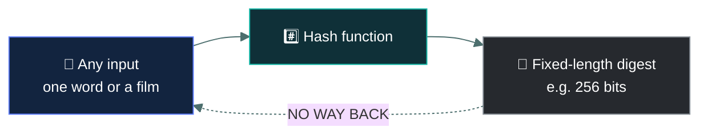
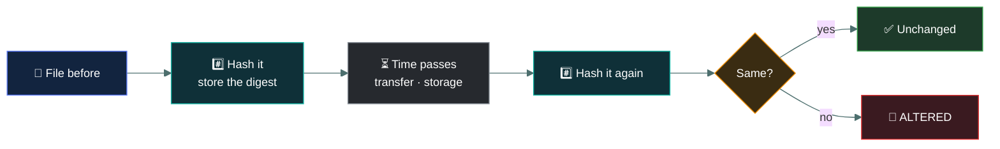
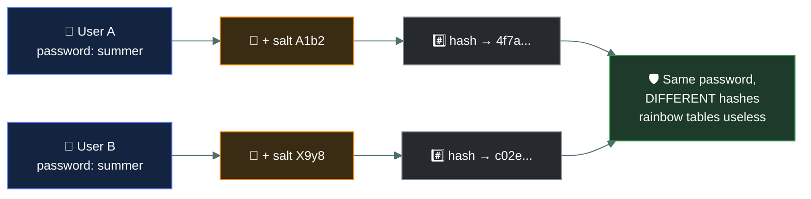

# #️⃣ Hashing and integrity

### *One-way, no key, no way back — and why that is exactly the point*

📌 *"Hashing is not encryption" is the sentence this topic exists to teach. Passwords are hashed, never encrypted.*

---

## 🧸 The big idea

Encryption is a locked chest — you can always open it again with the right key. Hashing is
grinding grain into flour: pour in a handful of any grain, always get out a fixed scoop of
flour, and there is no process on earth that turns that flour back into the original whole
grains. A **hash** takes any input and produces a fixed-length output — and **cannot be
reversed**.

That irreversibility is not a limitation. It is the entire purpose.

| | **Encryption** | **Hashing** |
|---|---|---|
| Reversible? | ✅ **Yes**, with the key | ❌ **No. Ever.** |
| Uses a key? | ✅ Yes | ❌ **No** |
| Output length | Varies with input | **Always fixed** |
| Purpose | **Confidentiality** | **Integrity** |

The two things a hash is for:

- **Integrity.** Hash a file now, hash it later, compare. Identical hashes mean the file is
  unchanged. Any difference — one bit — produces a completely different hash.
- **Storing passwords.** Instead of keeping a recording of someone's actual secret whistle — which
  a thief could simply replay — the tribe keeps only the exact scoop of flour that whistle
  produces when ground through the mill. When someone claims to know the whistle, they whistle it
  again, grind it through the same mill, and compare the flour. If it matches, they knew the real
  whistle, and the tribe never had to store the sound itself. Store the hash, not the password.
  When someone logs in, hash what they typed and compare. The system never holds the password, so
  a breach of the database does not hand over everyone's credentials.

> [!IMPORTANT]
> **Passwords are hashed, never encrypted.** Encryption is reversible, so an attacker who obtains
> the key recovers every password. Hashing has no key and no way back. If an option describes
> encrypting stored passwords, it is wrong.

---

## 📖 Words you will keep seeing

| Word | What it means on this exam |
|---|---|
| **Hash function** | A one-way function producing a fixed-length output from any input. |
| **Hash / digest / message digest** | The output of a hash function. |
| **One-way** | Cannot be reversed to recover the input. |
| **Fixed length** | The output is always the same size, whatever the input size. |
| **Avalanche effect** | A tiny change to the input produces a completely different hash. |
| **Collision** | Two different inputs producing the same hash. A weakness. |
| **Salt** | Unique random data added to a password before hashing. |
| **Rainbow table** | Precomputed hash lookups used to reverse hashes. **Defeated by salting.** |
| **SHA-256** | A current standard hash algorithm. |
| **MD5 / SHA-1** | Older algorithms, **broken by collisions**. Not for security use. |
| **Digital signature** | A hash of a message, encrypted with the signer's private key. |
| **Checksum** | A simple value detecting accidental corruption. Not cryptographically strong. |

---

## 🔍 How hashing works

**The properties the exam expects:**

| Property | Means |
|---|---|
| **One-way** | You cannot compute the input from the output |
| **Fixed length** | A one-line file and a gigabyte file produce the same-size hash |
| **Deterministic** | The same input always produces the same hash |
| **Avalanche effect** | Changing one character changes the entire hash |
| **Collision resistant** | It should be infeasible to find two inputs with the same hash |

> 🎯 **The avalanche effect is what makes hashing useful for integrity.** A hash that changed only
> slightly for a small edit would let an attacker aim for a near-match. Because it changes
> completely, any tampering is obvious.

---

## ✅ Using hashing for integrity

> ⚠️ **Hashing detects change; it does not prevent it.** That makes it a **detective** control. The
> file can still be altered — you will simply know that it was.

**Where you meet it:** verifying downloads against a published hash, file integrity monitoring,
evidence handling in investigations, and detecting tampering with logs.

---

## 🧂 Salting

**The problem:** the same word, ground the same way, always makes identical flour. A thief who
already keeps a book of common words and their flour results can identify a stolen scoop
instantly, and two villagers whose flour matches are revealed to share the same secret word.
Hashing is deterministic, so the same password always produces the same hash. An attacker can
precompute hashes of common passwords — a **rainbow table** — and look up any stolen hash
instantly. Identical hashes in a breached database also reveal which users share a password.

**The fix:** mix in one pinch of a unique random herb before grinding each person's word, so even
the exact same word grinds into completely different flour for different people, making the
thief's lookup book useless. Add unique random data — a **salt** — to each password before
hashing.

> 🎯 **Salting defeats rainbow tables.** This is one of the most reliable pairings on the exam.
> The salt need not be secret — it is stored alongside the hash. Its job is **uniqueness**, not
> secrecy.

---

## ✍️ Digital signatures

A digital signature combines hashing and asymmetric encryption:

1. **Hash** the message.
2. **Encrypt the hash** with the signer's **private key**. That is the signature.
3. The recipient **decrypts it with the signer's public key** to recover the hash.
4. The recipient **hashes the message themselves** and compares.

**A signature gives you three things and not the fourth:**

| Provides | Does not provide |
|---|---|
| **Integrity** — the content is unchanged | **Confidentiality** — the message is still readable |
| **Authentication** — it came from that key holder | |
| **Non-repudiation** — they cannot deny it | |

> ⚠️ **Signing is not encrypting.** A signed message is readable by anyone. To make it both
> confidential and signed, you sign **and** encrypt.

---

## 🚫 Broken algorithms

| Algorithm | Status |
|---|---|
| **MD5** | **Broken.** Collisions are trivially generated. Not for security |
| **SHA-1** | **Broken.** Practical collisions demonstrated. Deprecated |
| **SHA-2 family** (SHA-256, SHA-512) | **Current standard** |
| **SHA-3** | Newer alternative, also current |

> 🎯 **A collision means two different inputs produce the same hash**, which destroys integrity
> assurance — an attacker could substitute a different file with a matching hash. MD5 and SHA-1
> are the exam's "do not use" examples, exactly as Telnet and WEP are elsewhere.

---

## 🔬 Why "slow" is a real, measurable number

The grown-up section explains that password hashing needs to be deliberately slow. Here's what
that actually looks like in guesses per second on ordinary attacker hardware.

A general-purpose hash like SHA-256 is *designed* to be fast, because it's meant to hash gigabyte
files quickly for integrity checks — which is exactly the wrong property for a password, where an
attacker with a stolen hash wants to try billions of guesses. **Argon2**, the current
recommended choice, is deliberately memory-hard: it's tuned with a **memory cost** (how much RAM
each single hash attempt must use), a **time cost** (how many passes), and a **parallelism**
factor — and the memory requirement specifically defeats GPUs, which are extremely fast at raw
computation but have comparatively little memory per core, so they can't run millions of Argon2
attempts in parallel the way they can with MD5. The difference between "billions per second" and
"hundreds per second" is the entire practical value of choosing the right hash function — it
turns a password crackable in minutes into one that would take centuries.

**File integrity monitoring tools operationalise the "hash it now, hash it later" pattern
directly.** Tripwire and AIDE compute a baseline hash of every critical system file at a known-good
moment, then periodically re-hash and compare, alerting the instant any file's hash changes
unexpectedly — the exact mechanism in the diagram above, running continuously against thousands
of files rather than one, and it's how unauthorised changes to system binaries or configuration
get caught even when nothing else in the logs looks unusual.

---

## ⚖️ Told apart

| | Means | Not to be confused with |
|---|---|---|
| **Hashing** | **One-way**, no key, fixed length. For **integrity**. | **Encryption**, reversible with a key, for **confidentiality**. |
| **Hashing passwords** | Correct. There is no way back. | **Encrypting passwords**, which is wrong — the key recovers them all. |
| **Salt** | Unique random data per password. Defeats **rainbow tables**. | A key. It need not be secret; it must be unique. |
| **Collision** | Two inputs, one hash. A weakness. | The avalanche effect, which is a desirable property. |
| **Digital signature** | Hash encrypted with the **private** key. Integrity + origin + non-repudiation. | **Encryption for confidentiality**, which uses the recipient's public key. |
| **Signature** | Does **not** conceal the message. | Encryption, which does. |
| **Checksum** | Detects accidental corruption. | A **cryptographic hash**, which resists deliberate tampering. |
| **MD5 / SHA-1** | Broken by collisions. | **SHA-256**, current and acceptable. |

---

## ⚠️ Where your instinct is wrong

> [!WARNING]
> **In the job:** "encrypted passwords" is loose shorthand everyone understands.
>
> **On the exam:** passwords are **hashed**. Encryption is reversible, and an option describing
> encrypted password storage is wrong.

> [!WARNING]
> **In the job:** a digitally signed document feels protected.
>
> **On the exam:** a signature provides **integrity, authentication and non-repudiation — not
> confidentiality.** The message remains readable by anyone.

> [!WARNING]
> **In the job:** MD5 is fine for checking a file downloaded correctly.
>
> **On the exam:** MD5 and SHA-1 are **broken** and unacceptable for security purposes. Use SHA-256.

---

## 🧠 How to remember it

🧠 **Encryption is a locked box. Hashing is a shredder.** One opens with a key; the other never
reassembles.

🧠 **Hash = integrity. Encrypt = confidentiality.**

🧠 **Salt is for uniqueness, not secrecy.** It defeats rainbow tables.

🧠 **A signature is a hash locked with your private key** — so it proves both *unchanged* and *by
you*.

---

## ✅ Check you actually got it

Answer all five before expanding anything.

**Q1.** How should user passwords be stored?

- **A.** Encrypted with a strong symmetric key
- **B.** Hashed with a salt
- **C.** In plaintext, protected by database access controls
- **D.** Encrypted with the administrator's public key

<b>Answer</b>

**B — hashed with a salt.** Hashing is irreversible, so a breach of the database does not reveal
the passwords, and the salt ensures identical passwords produce different hashes.

- **A** is reversible. Anyone who obtains the key — and the key must live somewhere the application
  can reach — recovers every password.
- **C** means a database breach hands over every credential immediately. Access controls fail;
  that is what a breach is.
- **D** is still reversible, by whoever holds the corresponding private key, and it introduces the
  same key-compromise problem as A.

**Q2.** What does salting a password hash primarily defend against?

- **A.** Brute force attacks against the login page
- **B.** Rainbow table attacks using precomputed hashes
- **C.** On-path interception of the password in transit
- **D.** Privilege escalation after authentication

<b>Answer</b>

**B — rainbow table attacks.** A salt makes each password's hash unique, so precomputed tables do
not match and an attacker must attack each hash individually.

- **A** is addressed by account lockout and rate limiting. Salting has no effect on attempts at the
  login page.
- **C** is addressed by TLS. Salting concerns stored hashes, not transmission.
- **D** is unrelated — that concerns what an authenticated user can do afterwards.

**Q3.** Which statement about hashing is correct?

- **A.** A hash can be decrypted with the correct key
- **B.** Hash output length varies with the size of the input
- **C.** Hashing is one-way and produces a fixed-length output
- **D.** Hashing provides confidentiality for stored data

<b>Answer</b>

**C — hashing is one-way and produces a fixed-length output.** Those two properties define it.

- **A** is wrong twice: hashing uses no key, and there is nothing to decrypt. This is the central
  confusion the topic exists to correct.
- **B** is backwards. A single character and an entire film produce the same-size digest.
- **D** misassigns the purpose. Hashing provides **integrity**; encryption provides
  confidentiality.

**Q4.** A document is digitally signed but not encrypted. What protection does this provide?

- **A.** Only authorised recipients can read the document
- **B.** Integrity, authentication and non-repudiation, but not confidentiality
- **C.** Confidentiality and integrity, but not non-repudiation
- **D.** The document cannot be modified by anyone

<b>Answer</b>

**B — integrity, authentication and non-repudiation, but not confidentiality.** The signature
proves the content is unchanged and came from the key holder. The document itself is still
readable by anyone.

- **A** describes encryption, which has not been applied here.
- **C** claims a protection the signature does not give and denies the one it does.
- **D** overstates it. The document can absolutely be modified — the signature will then fail
  verification, which is detection rather than prevention.

**Q5.** Why are MD5 and SHA-1 considered unsuitable for security purposes?

- **A.** They produce output that is too short to store efficiently
- **B.** Practical collision attacks exist, so two different inputs can produce the same hash
- **C.** They require a key that must be distributed securely
- **D.** They are too slow for modern systems

<b>Answer</b>

**B — practical collision attacks exist.** If an attacker can construct a different file with the
same hash, the hash no longer proves the file is unchanged, which destroys the integrity
guarantee.

- **A** is a storage consideration, not a security flaw, and is not why they were deprecated.
- **C** is wrong — hash functions use no key at all.
- **D** is backwards. They are **fast**, which is a separate problem for password hashing
  specifically, but the reason they were deprecated is collisions.

---

## 🎓 The grown-up version

<b>Extra depth — open this on a second read, never needed for the pass</b>

**Fast hashes are wrong for passwords.** SHA-256 is excellent for verifying file integrity, and it
is a poor choice for passwords precisely because it is fast: modern hardware computes billions of
hashes per second, so an attacker with a stolen salted hash can still guess through enormous
dictionaries. Password hashing uses deliberately slow, memory-hard algorithms — bcrypt, scrypt,
Argon2 — with a tunable work factor, so each guess costs the attacker meaningful time and memory.
The CC exam says "hash with a salt"; the practical answer is "use a password hashing function,
not a general-purpose hash".

**Collisions versus preimages.** A **collision** is finding any two inputs with the same hash,
which is easier than it sounds because of the birthday paradox. A **preimage attack** is finding an
input that produces a *specific* given hash, which is much harder. MD5 and SHA-1 fell to collision
attacks, not preimage attacks — meaning an attacker can craft two documents with matching hashes
in advance, but cannot easily forge a match for an existing one. This is why MD5 remains usable for
non-adversarial checksums while being unacceptable for signatures.

**HMAC adds a key.** A plain hash proves a file is unchanged, and proves nothing about who
produced the hash — an attacker who alters a file can simply publish a new hash. HMAC combines a
hash with a secret key, so only someone holding the key can produce a valid value. It provides
integrity **and** authenticity between parties sharing a key, which is why it appears throughout
API authentication and TLS.

**Why the salt does not need to be secret.** It defeats precomputation, and precomputation is
defeated by uniqueness alone. An attacker who has the salt still has to compute hashes for that
one password individually, which is exactly the cost the salt was meant to impose. A secret salt —
sometimes called a pepper, stored separately from the database — adds a further layer, and is a
refinement rather than a requirement.

**Hashing in evidence handling.** Forensic practice hashes a drive image at acquisition and again
at analysis, demonstrating that the evidence has not changed while in custody. This is the
integrity property doing legal work, and it is why forensic tools display hash values so
prominently.

---

## 📝 Cram lines

Destined for [`EXAM-DAY.md`](../../EXAM-DAY.md):

- **HASHING IS NOT ENCRYPTION.** One-way · no key · fixed length · for **integrity**.
- **Encryption is reversible with a key · for confidentiality.**
- **PASSWORDS ARE HASHED, NEVER ENCRYPTED.** Encrypted is wrong — the key recovers them all.
- **Properties: one-way · fixed length · deterministic · avalanche effect · collision resistant.**
- **Avalanche effect** = one character changes the whole hash.
- **Hashing DETECTS change; it does not PREVENT it.** Detective control.
- **SALT = unique random data per password. Defeats RAINBOW TABLES.** Needs to be unique, not secret.
- **Digital signature = hash encrypted with the PRIVATE key.** Gives **integrity + authentication + non-repudiation**, **NOT confidentiality**.
- **A signed message is still readable.** Sign AND encrypt if you need both.
- **MD5 and SHA-1 are BROKEN by collisions.** Use **SHA-256**.

---

<a href="../README.md">← back to 05 · Security Operations and Incident Response</a> &nbsp;·&nbsp; <a href="../quantum-resistant-cryptography/">next: Quantum-resistant cryptography →</a>

