# #️⃣ Hashing and Integrity

### *A one-way fingerprint — why it isn't encryption, and what salting and signatures add*

📌 *Hashing is one-way with no key; it proves integrity, not confidentiality. Passwords are hashed, never encrypted. Salt defeats rainbow tables. A signature is a hash locked with your private key.*

---

## 🧸 The big idea

Encryption is a **locked box**: with the key, you get the original back. Hashing is a **paper
shredder**: you can shred any document into a pile of confetti, but no process on earth turns that
confetti back into the document. A **hash** takes any input and produces a fixed-length output that
**can't be reversed**.

That one-way property isn't a limitation. It's the whole point.

| | **Encryption** | **Hashing** |
|---|---|---|
| Reversible? | ✅ **Yes**, with the key | ❌ **No. Ever.** |
| Uses a key? | ✅ Yes | ❌ **No** |
| Output length | Varies with the input | **Always fixed** |
| Purpose | **Confidentiality** | **Integrity** |

Two jobs a hash does:

- **Integrity.** Hash a file now, hash it later, compare. Same hash means the file is unchanged.
  One changed bit produces a completely different hash.
- **Storing passwords.** Instead of keeping the actual password (which a thief could just steal and
  reuse), keep only its hash. When someone logs in, hash what they typed and compare. The system
  never holds the password, so a database breach doesn't hand over everyone's credentials.

> [!IMPORTANT]
> **Passwords are hashed, never encrypted.** Encryption is reversible, so an attacker who gets the
> key recovers every password. Hashing has no key and no way back. If an option describes
> *encrypting* stored passwords, it's wrong.

---

## 📖 Words you will keep seeing

| Word | What it means on this exam |
|---|---|
| **Hash function** | A one-way function that turns any input into a fixed-length output. |
| **Hash / digest** | The output of a hash function. |
| **One-way** | Can't be reversed to recover the input. |
| **Fixed length** | The output is the same size, whatever the input size. |
| **Avalanche effect** | A tiny change to the input completely changes the hash. |
| **Collision** | Two different inputs producing the same hash. A weakness. |
| **Salt** | Unique random data added to a password before hashing. |
| **Rainbow table** | A precomputed table for reversing hashes. **Defeated by salting.** |
| **SHA-256** | A current standard hash algorithm. |
| **MD5 / SHA-1** | Older algorithms, **broken by collisions**. Not for security. |
| **Digital signature** | A hash of a message, encrypted with the signer's private key. |
| **Checksum** | A simple value for catching accidental corruption. Not cryptographically strong. |

---

## 🔍 The explanation

### How hashing works

**Properties the exam expects:**

| Property | Means |
|---|---|
| **One-way** | You can't work out the input from the output |
| **Fixed length** | A one-line file and a gigabyte file give the same-size hash |
| **Deterministic** | The same input always gives the same hash |
| **Avalanche effect** | Change one character, and the whole hash changes |
| **Collision resistant** | It should be infeasible to find two inputs with the same hash |

> 🎯 **The avalanche effect is what makes hashing useful for integrity.** If a small edit changed
> the hash only slightly, an attacker could aim for a near-match. Because it changes completely,
> any tampering is obvious.

### Using hashing for integrity

> ⚠️ **Hashing detects change; it doesn't prevent it.** That makes it a **detective** control. The
> file can still be altered. You'll just know that it was.

**Where you meet it:** checking downloads against a published hash, file integrity monitoring,
handling evidence in investigations, and spotting tampered logs.

### 🧂 Salting

**The problem:** hashing is deterministic, so the same password always makes the same hash. An
attacker can precompute the hashes of common passwords, a **rainbow table**, and look up any stolen
hash instantly. Matching hashes in a breached database also reveal which users share a password.

**The fix:** add unique random data, a **salt**, to each password before hashing. Now the same
password gives a different hash for every user:

> 🎯 **Salting defeats rainbow tables.** One of the most reliable pairings on the exam. The salt
> doesn't need to be secret; it's stored right next to the hash. Its job is **uniqueness**, not
> secrecy.

### ✍️ Digital signatures

A digital signature combines hashing and asymmetric encryption:

**A signature gives you three things, and not the fourth:**

| Provides | Doesn't provide |
|---|---|
| **Integrity**: the content is unchanged | **Confidentiality**: the message is still readable |
| **Authentication**: it came from that key holder | |
| **Non-repudiation**: they can't deny it | |

> ⚠️ **Signing isn't encrypting.** A signed message is readable by anyone. To make it both
> confidential *and* signed, you sign **and** encrypt.

### 🚫 Broken algorithms

| Algorithm | Status |
|---|---|
| **MD5** | **Broken.** Collisions are trivial to generate. Not for security |
| **SHA-1** | **Broken.** Practical collisions demonstrated. Deprecated |
| **SHA-2** (SHA-256, SHA-512) | **Current standard** |
| **SHA-3** | Newer alternative, also current |

> 🎯 **A collision means two different inputs give the same hash**, which destroys the integrity
> guarantee: an attacker could swap in a different file with a matching hash. MD5 and SHA-1 are this
> exam's "do not use" examples, just like Telnet and WEP elsewhere.

---

## ⚖️ Told apart

| | Means | Not to be confused with |
|---|---|---|
| **Hashing** | **One-way**, no key, fixed length. For **integrity**. | **Encryption** — reversible with a key, for **confidentiality**. |
| **Hashing passwords** | Correct. There's no way back. | **Encrypting passwords** — wrong; the key recovers them all. |
| **Salt** | Unique random data per password. Defeats **rainbow tables**. | A key. It needn't be secret; it must be unique. |
| **Collision** | Two inputs, one hash. A weakness. | The avalanche effect, which is a desirable property. |
| **Digital signature** | A hash encrypted with the **private** key. Integrity + origin + non-repudiation. | **Encryption for confidentiality**, which uses the recipient's public key. |
| **Signature** | Does **not** hide the message. | Encryption, which does. |
| **Checksum** | Catches accidental corruption. | A **cryptographic hash**, which resists deliberate tampering. |
| **MD5 / SHA-1** | Broken by collisions. | **SHA-256** — current and acceptable. |

---

## ⚠️ Where your instinct is wrong

> [!WARNING]
> **In the job:** "encrypted passwords" is loose shorthand everyone understands.
>
> **On the exam:** passwords are **hashed**. Encryption is reversible, so any option describing
> encrypted password storage is wrong.

> [!WARNING]
> **In the job:** a digitally signed document feels protected.
>
> **On the exam:** a signature gives **integrity, authentication and non-repudiation, not
> confidentiality.** The message is still readable by anyone.

> [!WARNING]
> **In the job:** MD5 is fine for checking a file downloaded correctly.
>
> **On the exam:** MD5 and SHA-1 are **broken** and unacceptable for security. Use SHA-256.

---

## 🧠 How to remember it

**Encryption is a locked box. Hashing is a shredder.** One opens with a key; the other never
reassembles.

**Hash = integrity. Encrypt = confidentiality.**

**Salt is for uniqueness, not secrecy.** It defeats rainbow tables.

**A signature is a hash locked with your private key**, so it proves both *unchanged* and *by you*.

---

## ✅ Check you actually got it

Answer all five before expanding anything.

**Q1.** How should user passwords be stored?

- **A.** Encrypted with a strong symmetric key
- **B.** Hashed with a salt
- **C.** In plaintext, protected by database access controls
- **D.** Encrypted with the administrator's public key

<b>Answer</b>

**B — hashed with a salt.** Hashing is irreversible, so a breach of the database doesn't reveal the
passwords, and the salt makes identical passwords produce different hashes.

- **A** is reversible. Anyone who gets the key (and it has to live somewhere the application can
  reach) recovers every password.
- **C** means a breach hands over every credential at once. Access controls fail, and a breach is
  exactly that failure.
- **D** is still reversible by whoever holds the private key, and it carries the same key-compromise
  problem as A.

**Q2.** What does salting a password hash primarily defend against?

- **A.** Brute force attacks against the login page
- **B.** Rainbow table attacks using precomputed hashes
- **C.** On-path interception of the password in transit
- **D.** Privilege escalation after authentication

<b>Answer</b>

**B — rainbow table attacks.** A salt makes each password's hash unique, so precomputed tables don't
match and the attacker has to attack each hash separately.

- **A** is handled by account lockout and rate limiting. Salting doesn't affect login attempts.
- **C** is handled by TLS. Salting is about stored hashes, not data in transit.
- **D** is unrelated: that's about what an already-authenticated user can do.

**Q3.** Which statement about hashing is correct?

- **A.** A hash can be decrypted with the correct key
- **B.** Hash output length varies with the size of the input
- **C.** Hashing is one-way and produces a fixed-length output
- **D.** Hashing provides confidentiality for stored data

<b>Answer</b>

**C — hashing is one-way and produces a fixed-length output.** Those two properties define it.

- **A** is wrong twice: hashing uses no key, and there's nothing to decrypt. This is the core
  confusion the topic exists to fix.
- **B** is backwards. A single character and a whole film produce the same-size digest.
- **D** puts the purpose in the wrong place. Hashing provides **integrity**; encryption provides
  confidentiality.

**Q4.** A document is digitally signed but not encrypted. What protection does this provide?

- **A.** Only authorised recipients can read the document
- **B.** Integrity, authentication and non-repudiation, but not confidentiality
- **C.** Confidentiality and integrity, but not non-repudiation
- **D.** The document cannot be modified by anyone

<b>Answer</b>

**B — integrity, authentication and non-repudiation, but not confidentiality.** The signature proves
the content is unchanged and came from the key holder. The document itself is still readable by
anyone.

- **A** describes encryption, which hasn't been applied here.
- **C** claims a protection the signature doesn't give and denies the one it does.
- **D** overstates it. The document can absolutely be changed. The signature then fails
  verification, which is detection, not prevention.

**Q5.** Why are MD5 and SHA-1 considered unsuitable for security purposes?

- **A.** They produce output that is too short to store efficiently
- **B.** Practical collision attacks exist, so two different inputs can produce the same hash
- **C.** They require a key that must be distributed securely
- **D.** They are too slow for modern systems

<b>Answer</b>

**B — practical collision attacks exist.** If an attacker can build a different file with the same
hash, the hash no longer proves the file is unchanged, which destroys the integrity guarantee.

- **A** is about storage, not security, and isn't why they were deprecated.
- **C** is wrong: hash functions use no key at all.
- **D** is backwards. They're **fast**, which is a separate problem for password hashing, but they
  were deprecated because of collisions.

---

## 🎓 The grown-up version

<b>Extra depth — open this on a second read, never needed for the pass</b>

**Fast hashes are wrong for passwords.** SHA-256 is excellent for checking file integrity, and a
poor choice for passwords precisely because it's fast: modern hardware computes billions of hashes
per second, so an attacker with a stolen salted hash can still grind through huge dictionaries.
Password hashing uses deliberately slow, memory-hard algorithms (bcrypt, scrypt, Argon2) with a
tunable work factor, so each guess costs real time and memory. **Argon2** is tuned with a memory
cost, a time cost and a parallelism factor, and the memory requirement specifically defeats GPUs,
which are fast at raw computation but have little memory per core. The gap between "billions per
second" (SHA-256) and "hundreds per second" (a tuned Argon2) is the difference between a password
cracked in minutes and one that would take centuries. The exam says "hash with a salt"; the
practical answer is "use a password hashing function, not a general-purpose hash".

**Collisions versus preimages.** A **collision** is finding *any* two inputs with the same hash,
which is easier than it sounds because of the birthday paradox. A **preimage attack** is finding an
input that produces a *specific* given hash, which is much harder. MD5 and SHA-1 fell to collision
attacks, not preimage attacks, so an attacker can craft two documents with matching hashes in
advance but can't easily forge a match for an existing one. That's why MD5 is still fine for
non-adversarial checksums while being unacceptable for signatures.

**HMAC adds a key.** A plain hash proves a file is unchanged but says nothing about who produced the
hash; an attacker who alters a file can just publish a new hash. HMAC combines a hash with a secret
key, so only someone with the key can produce a valid value. It gives integrity **and** authenticity
between parties who share a key, which is why it turns up throughout API authentication and TLS.

**File integrity monitoring in practice.** Tools such as Tripwire and AIDE hash every critical system
file at a known-good moment, then periodically re-hash and compare, alerting the instant a file's
hash changes unexpectedly. It's exactly the "hash it now, hash it later" pattern, run continuously
against thousands of files, and it catches unauthorised changes to system binaries even when nothing
in the logs looks unusual.

**Hashing in evidence handling.** Forensic practice hashes a drive image when it's acquired and again
when it's analysed, showing the evidence didn't change while in custody. That's the integrity
property doing legal work, and it's why forensic tools display hash values so prominently.

---

## 📝 Cram lines

Destined for [`EXAM-DAY.md`](../../EXAM-DAY.md):

- **HASHING IS NOT ENCRYPTION.** One-way · no key · fixed length · for **integrity**. Encryption is reversible with a key, for confidentiality.
- **PASSWORDS ARE HASHED, NEVER ENCRYPTED.** Encrypted is wrong; the key recovers them all.
- **Properties: one-way · fixed length · deterministic · avalanche effect · collision resistant.**
- **Hashing DETECTS change; it doesn't PREVENT it.** A detective control.
- **SALT = unique random data per password. Defeats RAINBOW TABLES.** Must be unique, not secret.
- **Digital signature = a hash encrypted with the PRIVATE key.** Gives **integrity + authentication + non-repudiation**, **NOT confidentiality**. A signed message is still readable.
- **MD5 and SHA-1 are BROKEN by collisions.** Use **SHA-256**.

---

<a href="../README.md">← back to 05 · Security Operations and Incident Response</a> &nbsp;·&nbsp; <a href="../quantum-resistant-cryptography/">next: Quantum-resistant cryptography →</a>

