# 🏷️ Incident terminology

### *Event, alert, incident, breach — four words that are not interchangeable*

📌 *Short and entirely definitional. Every event is not an incident, and every incident is not a breach.*

---

## 🧸 The big idea

The forest around camp is full of noise all night — leaves falling, deer passing, wind in the
branches. None of it means anything. That's just the forest being the forest.

Sometimes a rustle catches a watchman's ear — could be the wind, could be a wolf. He doesn't know
yet; it's just a claim on his attention. If he checks and finds real wolf tracks circling the
sheep-fence, that's no longer noise — the flock is genuinely in danger, whether or not the wolf
ever gets in. And if the wolf actually breaks the fence and drags off a lamb, that's the worst
tier of all: the harm didn't just threaten to happen, it happened.

Four words describe increasingly serious things, and the exam wants them separated cleanly.

> **Event** — anything observable that happens.
> **Alert** — a notification that an event may matter.
> **Incident** — an event that **actually threatens** security.
> **Breach** — an incident in which **data was actually disclosed**.

The relationship is a funnel. Millions of events happen every day; a handful generate alerts; a
smaller number are genuine incidents; and only some incidents are breaches.

Two consequences the exam tests:

- **Every incident is an event, but most events are not incidents.** A successful login is an
  event. Nothing has gone wrong.
- **Every breach is an incident, but not every incident is a breach.** A contained ransomware
  attack with no data taken is an incident, not a breach.

---

## 📖 Words you will keep seeing

| Word | What it means on this exam |
|---|---|
| **Event** | Any observable occurrence in a system or network. Neutral — most are routine. |
| **Alert** | A notification generated because an event may require attention. |
| **Adverse event** | An event with a negative consequence. |
| **Incident** | An event that actually or potentially jeopardises confidentiality, integrity or availability, or violates policy. |
| **Security incident** | The same thing; the words are used interchangeably. |
| **Breach** | An incident in which protected data was **actually** accessed, disclosed or taken by an unauthorised party. |
| **Intrusion** | Unauthorised access to a system. |
| **Compromise** | A system or account under unauthorised control. |
| **Near miss** | An incident that was prevented or failed, but is worth learning from. |
| **False positive** | An alert for something that was not a problem. |
| **Escalation** | Raising an incident to a higher level of authority or expertise. |
| **Triage** | Assessing and prioritising alerts and incidents. |

---

## 🔽 The funnel

Read it as a sentence: **everything that happens is an event, some of it raises an alert, some
alerts turn out to be incidents, and some incidents turn out to be breaches.**

### 📋 Event

Leaves falling, deer passing, wind in the branches — the forest making its ordinary noise.

**Any observable occurrence.** A user logs in. A file is opened. A firewall permits a packet. A
service restarts.

**Events are neutral.** The overwhelming majority are routine business activity, which is why
logging produces so much volume.

### 🔔 Alert

A rustle that catches the watchman's ear — not yet known whether it's wind or a wolf.

**A notification that an event may require attention.** Generated by a rule, a signature or an
anomaly detection.

An alert is a **claim**, not a fact. Many are **false positives** — legitimate activity that
matched a rule. Triage is the work of deciding which alerts are real.

### 🚨 Incident

Real wolf tracks circling the sheep-fence. The flock is genuinely in danger — whether or not the
wolf ever gets past the rails.

**An event that actually or potentially jeopardises confidentiality, integrity or availability,
or violates security policy.**

Note the phrase **"or potentially"**. An incident does not require harm to have occurred — a
blocked intrusion attempt against a critical system is still an incident worth responding to.

**Examples:** malware executing on a host, an account compromised, a denial of service, data
found on an unapproved service, an employee emailing confidential data externally.

### 💀 Breach

The wolf broke the fence and dragged off a lamb. The danger didn't just threaten — it happened.

**An incident in which protected data was actually accessed, disclosed, altered or taken by
someone unauthorised.**

The distinguishing word is **actually**. A breach is a confirmed disclosure, not a suspected one.

> [!IMPORTANT]
> **The distinction carries legal weight.** Data protection regimes impose notification
> obligations that are triggered by a **breach** — such as GDPR's 72-hour requirement — and not
> by every incident. Whether something is classed as a breach determines whether regulators and
> affected individuals must be told.

---

## ⚖️ Worked examples

| Scenario | It is a… | Why |
|---|---|---|
| A user logs in successfully | **Event** | Routine, nothing wrong |
| A user fails to log in three times | **Event**, possibly an **alert** | Could be a typo or an attack |
| An IDS flags traffic that turns out to be a backup job | **Alert**, a **false positive** | No actual threat |
| Malware is detected and quarantined on a laptop | **Incident** | Security was jeopardised; contained |
| A firewall blocks an intrusion attempt | **Incident** (potentially) | "Or potentially" — worth responding to |
| Ransomware encrypts a file server, no data taken | **Incident**, not a breach | Availability lost; nothing disclosed |
| Customer records are copied and published | **Breach** | Data actually disclosed to unauthorised parties |
| A laptop with encrypted data is stolen | **Incident** | Whether it is a breach depends on whether the encryption held |
| An email with personal data goes to the wrong recipient | **Breach** | Data actually disclosed to someone unauthorised |

> 🎯 **Ransomware without exfiltration is an incident, not a breach.** If the same attackers also
> stole and leaked the data, that part is a breach. This scenario appears often.

---

## 🔍 Why the words matter

**Declaring an incident is a decision with consequences.** It starts the incident response plan,
brings in a defined team, triggers communications, and begins a formal record. That is why the
vocabulary is precise rather than pedantic — each word marks a different set of obligations.

---

## 🔬 What "declaring an incident" triggers in real tooling

"Declaring an incident" isn't a phrase in a policy document — it's a real button someone
presses in a real ticketing system. A **SEV1** (or similarly named highest-severity) ticket
auto-triggers a **PagerDuty**-style escalation that phones or texts the on-call responder
regardless of the hour, which is exactly why the severity-level vocabulary matters: mislabelling
something SEV3 when it's actually SEV1 means the right people simply never get woken up.
Separately, and just as automatically, a legal or data-protection function is looped in to make
the actual breach determination — and if they confirm one, a **72-hour countdown** (for GDPR, or
whatever the applicable regime's own window is) starts being tracked in a dedicated compliance
tool, because missing that deadline is itself a regulatory failure independent of the breach.
This is the concrete machinery behind the exam's insistence that the incident/breach distinction
"carries legal weight" — it's not abstract, it's a clock that starts or doesn't the moment a
specific person makes a specific call.

---

## ⚖️ Told apart

| | Means | Not to be confused with |
|---|---|---|
| **Event** | Any observable occurrence. **Neutral.** | **Incident**, which threatens security. Most events are routine. |
| **Alert** | A notification that something *may* matter. A **claim**. | **Incident**, which is a confirmed problem. Many alerts are false positives. |
| **Incident** | Actually **or potentially** jeopardises C, I or A. | **Breach**, which requires data to have **actually** been disclosed. |
| **Breach** | Data **actually** disclosed to an unauthorised party. | **Incident**, which is broader. Every breach is an incident; most incidents are not breaches. |
| **Intrusion** | Unauthorised **access** to a system. | **Breach**, which concerns the **data**. |
| **False positive** | An alert for something harmless. | A **near miss**, which was a genuine threat that did not succeed. |

---

## ⚠️ Where your instinct is wrong

> [!WARNING]
> **In the job:** "incident" and "breach" get used interchangeably in conversation, and nobody
> objects.
>
> **On the exam:** a **breach requires actual disclosure of data**. A contained incident with no
> data taken is not a breach, and the distinction determines notification obligations.

> [!WARNING]
> **In the job:** a blocked attack is not worth a ticket.
>
> **On the exam:** an incident is something that actually **or potentially** jeopardises security.
> A blocked intrusion attempt against a critical system can still qualify.

> [!WARNING]
> **In the job:** an alert from your tooling is treated as a finding.
>
> **On the exam:** an alert is a **claim** requiring triage. Alerts and incidents are separate
> stages, and conflating them is exactly what the question is testing.

---

## 🧠 How to remember it

🧠 **Event · Alert · Incident · Breach** — a funnel, each narrower than the last.

🧠 **Events are neutral. Alerts are claims. Incidents are real. Breaches are disclosed.**

🧠 **Every breach is an incident. Most incidents are not breaches.**

🧠 **Ransomware encrypts = incident. Ransomware leaks = breach.**

---

## ✅ Check you actually got it

Answer all five before expanding anything.

**Q1.** Ransomware encrypts a file server. Investigation confirms no data was copied or
exfiltrated. How should this be classified?

- **A.** An event, since the systems are still present
- **B.** An incident, but not a breach
- **C.** A breach, because data was rendered inaccessible
- **D.** A false positive, since the data still exists

<b>Answer</b>

**B — an incident, but not a breach.** Availability was jeopardised, which makes it an incident.
No data was accessed or disclosed by an unauthorised party, so it does not meet the definition of
a breach.

- **A** is far too weak. An event is neutral and routine; encrypting production data is neither.
- **C** misapplies the definition. A breach concerns **disclosure**, not loss of access.
  Inaccessibility is an availability failure.
- **D** is wrong — something genuinely happened. A false positive is an alert for something
  harmless.

**Q2.** An intrusion detection system generates an alert. Investigation shows it was triggered by a
legitimate backup process. What is this?

- **A.** An incident
- **B.** A breach
- **C.** A false positive
- **D.** A near miss

<b>Answer</b>

**C — a false positive.** The alert fired for activity that was not a threat.

- **A** requires an actual or potential threat to security. A backup job is neither.
- **B** requires data disclosed to an unauthorised party, which did not occur.
- **D** describes a genuine threat that did not succeed. There was no threat here at all — that is
  the distinction between a false positive and a near miss.

**Q3.** Which statement correctly describes the relationship between events and incidents?

- **A.** Every event is an incident
- **B.** Every incident is an event, but most events are not incidents
- **C.** Events and incidents are the same thing
- **D.** Incidents occur before events

<b>Answer</b>

**B — every incident is an event, but most events are not incidents.** An incident is a particular
kind of event: one that actually or potentially jeopardises security.

- **A** would make every successful login an incident, which is absurd and would make the word
  meaningless.
- **C** loses the distinction that the whole topic rests on.
- **D** reverses a relationship that is one of category, not sequence.

**Q4.** An employee emails a spreadsheet of customer personal data to an incorrect external
recipient. How should this be classified?

- **A.** An event, because sending email is routine
- **B.** An incident only, because it was accidental
- **C.** A breach, because personal data was actually disclosed to an unauthorised party
- **D.** A near miss, because the recipient may not read it

<b>Answer</b>

**C — a breach.** Protected data actually reached someone not authorised to receive it, which is
the definition, and it will typically carry notification obligations.

- **A** ignores what the email contained and where it went.
- **B** is the key trap: **intent is irrelevant**. Accidental disclosure is still disclosure, and
  accidental breaches are among the most common kind.
- **D** relies on hoping the recipient does not look. The data has been disclosed regardless of
  whether it is read.

**Q5.** Why does the distinction between an incident and a breach matter legally?

- **A.** Incidents must be reported to regulators; breaches need not be
- **B.** Breaches typically trigger notification obligations to regulators and affected individuals
- **C.** Only breaches require an incident response plan
- **D.** Incidents are handled by IT; breaches are handled by legal

<b>Answer</b>

**B — breaches typically trigger notification obligations.** Data protection regimes impose
notification duties on confirmed breaches of personal data, within defined timescales, rather than
on every incident.

- **A** is reversed.
- **C** is wrong. The incident response plan applies to all incidents, and a breach is one outcome
  the plan must handle.
- **D** describes an oversimplified division of labour. Both involve multiple functions, and this
  is not the legal distinction.

---

## 🎓 The grown-up version

<b>Extra depth — open this on a second read, never needed for the pass</b>

**Declaring an incident is a consequential decision.** It activates the response plan, may
require notifying insurers, can trigger contractual obligations to customers, and creates a record
that will be examined later. Organisations therefore sometimes hesitate to declare, which delays
response — the thing most correlated with damage. Mature programmes lower the cost of declaring by
having tiered severity levels, so a minor incident can be declared without convening a crisis team.

**"Breach" has statutory definitions that differ by regime.** GDPR defines a personal data breach
broadly, covering accidental or unlawful destruction, loss, alteration, unauthorised disclosure of,
or access to personal data — which means **loss of availability** can count as a breach under GDPR,
unlike the narrower disclosure-focused definition the CC exam uses. Sector rules differ again.
Answer the exam's definition, and know that the real-world one depends on the jurisdiction.

**Encryption changes the notification calculus.** Several regimes provide that notification to
affected individuals may not be required where the data was rendered unintelligible — properly
encrypted with the key uncompromised. This is one of the most concrete regulatory incentives for
encryption at rest, and it is why the "stolen encrypted laptop" scenario is genuinely ambiguous:
whether it is a breach depends on whether the encryption was correctly implemented and the key
was not also taken.

**Near misses are underused.** An attack that failed because a control worked contains most of the
information a successful attack would, at none of the cost. Safety-critical industries treat near
misses as primary learning material; security teams often close them without analysis. The
question worth asking is not "did it work" but "which control stopped it, and would it have
stopped a slightly different version".

**Alert-to-incident ratios are a programme health metric.** A team converting 1% of alerts into
incidents is drowning in false positives; one converting 90% is probably not alerting on enough.
Tracking the ratio, and the time from alert to triage decision, says more about detection quality
than the raw number of alerts ever will.

---

## 📝 Cram lines

Destined for [`EXAM-DAY.md`](../../EXAM-DAY.md):

- **Funnel: EVENT → ALERT → INCIDENT → BREACH.** Each narrower than the last.
- **EVENT** = any observable occurrence. **Neutral.** Most are routine.
- **ALERT** = a notification that something *may* matter. A **claim** needing triage. Often a **false positive**.
- **INCIDENT** = actually **OR POTENTIALLY** jeopardises C, I or A, or violates policy. A blocked attack can count.
- **BREACH** = data **ACTUALLY** disclosed/accessed/taken by an unauthorised party.
- **Every breach is an incident. Most incidents are NOT breaches.**
- **Ransomware encryption = INCIDENT. Ransomware leak = BREACH.**
- **Accidental disclosure is still a breach** — intent is irrelevant.
- **Breaches trigger NOTIFICATION obligations** (e.g. GDPR's 72 hours); incidents generally don't.

---

<a href="../README.md">← back to 05 · Security Operations and Incident Response</a> &nbsp;·&nbsp; <a href="../incident-response-plan/">next: The incident response plan →</a>

