# 📊 Logging and monitoring

### *Recording what happened, and actually looking at it*

📌 *Detective controls. Logging without review detects nothing — which is the distinction the exam keeps returning to.*

---

## 🧸 The big idea

Every night, the tribe's watchmen scratch a mark into the camp's tally-wall for everything that
happens at the gate: who came, what they did, when, and whether they were let in or turned away.
By morning the wall is covered in scratches — a perfect, honest record of the whole night.

But a wall covered in scratches doesn't stop a single wolf. It doesn't even notice one. Marks on
a wall only matter if someone actually walks up, reads them, and reacts. A wall nobody reads is
just... a wall. The wolves could have strolled through the gate every night for a month, and the
tally-wall would prove it — after the pack has already moved into the caves.

That's the whole distinction. **Logging** records what happened — the scratches on the wall.
**Monitoring** is looking at those records and noticing when something is wrong — someone actually
reading the wall.

They are not the same thing, and the gap between them is where organisations fail. A system with
comprehensive logging that nobody reviews provides forensic material after the fact and **detects
nothing** at the time. The log existed; the breach still ran for six months.

> 🎯 **Logging is the record; monitoring is the attention.** If a question describes logs being
> collected but incidents going unnoticed, the failure is monitoring and review.

Both are **detective** controls. They prevent nothing. Their value is that they make activity
visible — which supports detection, investigation, accountability, and a genuine deterrent effect
when people know they are logged.

---

## 📖 Words you will keep seeing

| Word | What it means on this exam |
|---|---|
| **Log** | A record of events generated by a system or application. |
| **Audit trail** | A chronological record of activity, sufficient to reconstruct what happened. |
| **Monitoring** | Observing systems and logs to identify problems or attacks. |
| **SIEM** — Security Information and Event Management | A platform that **centralises, correlates and alerts** on log data. |
| **Correlation** | Connecting events from different sources into one picture. |
| **Alert** | A notification that something requiring attention has occurred. |
| **Baseline (behavioural)** | The pattern of normal activity, against which anomalies stand out. |
| **Ingress monitoring** | Watching traffic **entering** the network. |
| **Egress monitoring** | Watching traffic **leaving** — where data exfiltration shows up. |
| **DLP** — Data Loss Prevention | Controls detecting or blocking sensitive data leaving. |
| **Log retention** | How long logs are kept. |
| **Time synchronisation** | Keeping clocks aligned, usually with NTP, so events can be sequenced. |
| **Alert fatigue** | Analysts becoming desensitised by too many alerts, especially false positives. |

---

## 📋 What to log

**Events worth logging:**

| Category | Examples |
|---|---|
| **Authentication** | Successful and **failed** logins, lockouts, MFA events |
| **Authorisation** | Access granted and **denied**, permission changes |
| **Privileged activity** | Use of administrative rights, elevation, account creation |
| **Configuration changes** | System and security settings modified |
| **Data access** | Reads and modifications of sensitive data |
| **Security events** | Malware detections, IDS alerts, policy violations |
| **System events** | Starts, stops, crashes, service failures |

> ⚠️ **Log failures as well as successes.** Failed logins reveal brute force and spraying; denied
> access reveals probing. A log of successes alone misses every unsuccessful attack — and every
> attack begins as unsuccessful attempts.

> ⚠️ **Do not log sensitive data itself.** Passwords, card numbers and personal data should never
> be written into logs, because logs are widely copied, retained for years and read by many people.
> A log holding credentials is a breach waiting to be found.

---

## 🔗 Centralisation and SIEM

If every watchman keeps his own tally-wall in his own hut, a raider who breaks into that one hut
can simply scratch out his own marks before anyone reads them — the evidence of how he got in
vanishes with him. So the tribe builds one central drum-tower in the middle of camp, and every
watchman's marks get copied there the moment they're made. A raider who reaches one hut still
can't touch the tower. And each morning the wise elder walks the tower, not each hut separately,
and reads every watchman's night side by side — spotting a pattern none of them could see alone.

Logs scattered across hundreds of systems are of little use. **Centralising** them serves two
purposes.

**One: correlation.** A single failed login is noise. The same account failing on forty systems
within a minute is an attack. Only a central view shows that.

**Two: integrity.** If logs stay on the system that generated them, an attacker who compromises
that system can delete the record of how they got in. **Shipping logs elsewhere in real time puts
the evidence beyond their reach.**

> [!IMPORTANT]
> **Logs must be protected from modification, including by administrators.** Otherwise the account
> that caused the damage can erase the evidence of it, and accountability collapses. Write-once
> storage or a separately administered log platform is the expected answer.

**A SIEM** collects log data from across the environment, normalises it, correlates events, and
raises alerts. It is the tool that turns logging into monitoring.

---

## ⏰ Time synchronisation

If the east watchman marks his sundial's shadow and the west watchman marks his water-clock, but
the two clocks drift an hour apart, nobody can tell the next morning which happened first — the
gate opening or the fire going out. The story falls apart at the exact moment it matters most.

If two systems' clocks differ by ten minutes, their logs cannot be sequenced. You cannot tell
whether the firewall event preceded the server event, and the reconstruction falls apart.

**NTP** keeps clocks aligned across the estate. Consistent, accurate timestamps — usually in UTC
to avoid time-zone and daylight-saving confusion — are a precondition for correlation and for
evidence that stands up.

> 🎯 **Accurate time synchronisation is a prerequisite for meaningful log analysis.** It is a
> small, unglamorous control that everything else in this topic depends on.

---

## 🔁 Ingress and egress monitoring

The tribe posts guards facing outward at the gate, watching for wolves and raiders trying to get
**in**. Almost nobody watches the back of the storehouse, where a sack of grain can quietly go
**out** in the dead of night. By the time grain is leaving, a thief is already inside — and the
back of the storehouse is where you'd actually catch him.

| | Watches | Finds |
|---|---|---|
| **Ingress** | Traffic entering | Attacks, scanning, intrusion attempts |
| **Egress** | Traffic **leaving** | **Data exfiltration**, command and control, compromised hosts phoning home |

> ⚠️ **Egress monitoring is the one organisations neglect**, because attention goes to keeping
> attackers out. But by the time data is leaving, the attacker is already inside — and egress is
> where you find the breach you missed at ingress. If a question asks how to detect data theft,
> the answer involves egress monitoring or DLP.

**DLP** detects and can block sensitive data leaving — by email, upload, or removable media. It
works by recognising patterns and classification labels.

---

## 😵 Alert fatigue

The most common way monitoring fails in practice, and the exam recognises it.

The boy who bangs the drum every time a rabbit rustles a bush eventually gets ignored — and the
night the real wolf shows up, nobody runs. **Too many alerts, especially false positives, desensitise analysts.** They start dismissing
alerts without investigation, and the genuine one is dismissed along with the noise. More alerting
is not better monitoring.

The remedies are **tuning** to cut false positives, **prioritising** by severity, and **automating**
routine triage so human attention goes where it is needed.

> 🎯 **An alert nobody investigates is worth nothing.** This is the same point as logs nobody
> reads, one step further along.

---

## 🔬 How a detection rule actually gets written and shared

Different devices speak different log formats natively, which is a real interoperability
problem a SIEM has to solve before it can correlate anything at all.

**Syslog (RFC 5424) and CEF (Common Event Format)** are the two real standards that make this
possible — a firewall, an EDR agent and a directory server all describe wildly different events,
but a CEF-formatted message always carries the same basic fields (severity, source, destination,
event name) regardless of which vendor produced it, which is what lets one SIEM correlate across
all three without custom parsing for every product on the market.

**Sigma is the real, open format detection engineers use to write one rule that works
everywhere.** Rather than hand-writing a separate query for Splunk, then Elastic, then Microsoft
Sentinel, an analyst writes a single Sigma rule in plain YAML describing the *pattern* to detect
— "a process named `powershell.exe` spawned by `winword.exe`, with a command line containing
`-enc`" — and Sigma converters translate that one rule into each platform's own query language.
This is the concrete mechanism behind "detections mapped to MITRE ATT&CK": a public repository of
Sigma rules exists, each one tagged with the specific ATT&CK technique ID it detects, so a
defender can adopt a community-vetted rule for a named technique instead of inventing detection
logic from scratch.

---

## ⚖️ Told apart

| | Means | Not to be confused with |
|---|---|---|
| **Logging** | Recording events. | **Monitoring**, which is reviewing them. Logging alone detects nothing. |
| **Both** | **Detective** controls. | Preventive controls. Logging stops nothing. |
| **SIEM** | Centralises, correlates, alerts. | A log store, which only keeps logs. Correlation is the added value. |
| **Ingress monitoring** | Traffic coming **in**. Attacks. | **Egress monitoring**, traffic going **out** — exfiltration. |
| **Audit trail** | Enough detail to reconstruct events. | A basic log, which may record too little to be useful. |
| **Alert fatigue** | Desensitisation from alert volume. | A shortage of alerts. The failure is too many, not too few. |
| **Log retention** | How long logs are kept. | **Log protection**, which is stopping them being altered. |

---

## ⚠️ Where your instinct is wrong

> [!WARNING]
> **In the job:** you log everything you can and worry about volume later.
>
> **On the exam:** logging **without review** provides no detection, and **excessive logging**
> creates noise that buries real events. The expected answer balances coverage against usable
> signal.

> [!WARNING]
> **In the job:** local logs are fine for most systems, and central collection is a project.
>
> **On the exam:** **logs must be centralised and protected from modification**, because an
> attacker who compromises a system can otherwise delete the evidence.

> [!WARNING]
> **In the job:** perimeter defence means watching what is coming in.
>
> **On the exam:** **egress monitoring is what finds exfiltration.** Data leaving is often the
> first visible sign of a compromise that ingress controls missed entirely.

---

## 🧠 How to remember it

🧠 **Logging records. Monitoring notices.** Both detective; neither preventive.

🧠 **Every entry: who · what · when · where · outcome.**

🧠 **Log the failures too** — attacks start as failed attempts.

🧠 **Ship logs off the box**, or the attacker deletes them.

🧠 **Ingress finds the attack. Egress finds the theft.**

---

## ✅ Check you actually got it

Answer all five before expanding anything.

**Q1.** An organisation logs extensively but nobody reviews the logs. An intrusion goes unnoticed
for months. What was the failure?

- **A.** Insufficient logging coverage
- **B.** Logs were collected but not monitored, so nothing was detected
- **C.** The logs were not retained long enough
- **D.** The logging system lacked encryption

<b>Answer</b>

**B — logs were collected but not monitored.** Logging is the record; monitoring is the attention.
Without review, the evidence exists and detection does not.

- **A** is contradicted by the stem, which states logging was extensive.
- **C** is wrong — the logs were present throughout the months in question. Retention was not the
  gap.
- **D** protects logs from disclosure and would not have caused anyone to notice the intrusion.

**Q2.** Why should logs be sent to a centralised system rather than kept only on the originating
host?

- **A.** It reduces storage costs on individual systems
- **B.** It enables correlation across sources, and an attacker who compromises a host cannot delete the shipped evidence
- **C.** It is required by all data protection regulations
- **D.** Central storage automatically encrypts log data

<b>Answer</b>

**B — correlation across sources, and the evidence survives compromise of the host.** These are the
two reasons, and the second is the security-critical one: a privileged attacker on a system can
delete its local logs.

- **A** is an operational side benefit and generally untrue — central storage adds cost.
- **C** overstates it. Some regulations require logging; none mandate centralisation universally,
  and the word "all" should raise suspicion.
- **D** is not automatic and is a property of a particular implementation rather than a reason for
  centralising.

**Q3.** Which type of monitoring is MOST likely to detect data exfiltration?

- **A.** Ingress monitoring of traffic entering the network
- **B.** Egress monitoring of traffic leaving the network
- **C.** Physical access monitoring at the data centre
- **D.** Monitoring of failed authentication attempts

<b>Answer</b>

**B — egress monitoring.** Exfiltration is data going **out**, so the outbound path is where it is
visible.

- **A** watches for attacks arriving. By the time data is being stolen, the attacker is already
  inside and ingress monitoring has been passed.
- **C** would find someone physically removing media and nothing about network exfiltration.
- **D** may reveal an earlier stage of the intrusion and says nothing about data leaving.

**Q4.** Why is accurate time synchronisation important for logging?

- **A.** It reduces the storage space logs consume
- **B.** Without it, events from different systems cannot be reliably sequenced
- **C.** It prevents logs from being modified
- **D.** It is required before logs can be encrypted

<b>Answer</b>

**B — without it, events from different systems cannot be reliably sequenced.** If clocks disagree,
you cannot establish whether the firewall event preceded the server event, and the reconstruction
of an incident falls apart.

- **A** has no relationship to timestamp accuracy.
- **C** is log integrity protection, achieved through write-once storage and separate
  administration rather than through clock accuracy.
- **D** invents a dependency that does not exist.

**Q5.** An analyst begins dismissing security alerts without investigation because there are
hundreds each day, most of them false positives. What is this called, and what is the remedy?

- **A.** Alert fatigue; remedied by tuning to reduce false positives and prioritising by severity
- **B.** Log saturation; remedied by increasing log retention
- **C.** Correlation failure; remedied by adding more alert rules
- **D.** Monitoring drift; remedied by rebuilding the SIEM

<b>Answer</b>

**A — alert fatigue, remedied by tuning and prioritisation.** Volume and false positives
desensitise analysts, and the genuine alert gets dismissed with the noise.

- **B** is not a standard term, and longer retention addresses nothing about alert volume.
- **C** would make it worse. More rules means more alerts, which is the cause rather than the cure.
- **D** is not a recognised term, and replacing the platform does not fix rules that were never
  tuned.

---

## 🎓 The grown-up version

<b>Extra depth — open this on a second read, never needed for the pass</b>

**Detection engineering has moved away from volume.** The early SIEM model was to collect
everything and write rules for anything suspicious, which produced alert volumes no team could
work. Current practice favours fewer, higher-fidelity detections mapped to specific adversary
behaviours — frameworks such as MITRE ATT&CK provide the taxonomy — with each detection owned,
tested and measured for its true-positive rate. A detection that has never produced a valid alert
is a candidate for removal, not a safety net.

**Log volume has real cost.** Commercial SIEM licensing is often priced by ingestion volume, so
"log everything" is a budget decision as much as a technical one. This drives tiered
architectures: high-value security-relevant sources into the SIEM for real-time correlation, and
bulk telemetry into cheaper searchable storage for investigation. The design question is which
sources would actually change a detection outcome.

**Logs are themselves sensitive.** They record who accessed what and when, frequently contain
fragments of personal data, and sometimes capture secrets through poor application logging
practice. A log platform is therefore a high-value target and a data protection obligation of its
own — which is why access to it should be restricted and audited, and why it is one of the few
systems where administrators should not be able to delete their own tracks.

**Retention balances competing pressures.** Investigations routinely need logs older than most
organisations keep, because the interval between compromise and discovery is frequently measured
in months. Against that sit storage cost and data minimisation obligations. Typical practice keeps
detailed logs for months and summarised or compressed data considerably longer, with retention
periods set per source rather than uniformly.

**Monitoring only works with someone to act.** A SIEM with no analyst is an expensive log archive.
This is why many organisations use a managed detection and response provider — the tooling is the
cheap part, and twenty-four-hour analyst coverage is what actually produces detection. Any claim
that an organisation is "covered" because it bought a platform deserves the question: covered by
whom, at 3am on a Sunday?

---

## 📝 Cram lines

Destined for [`EXAM-DAY.md`](../../EXAM-DAY.md):

- **Logging RECORDS. Monitoring NOTICES.** Logs nobody reviews detect **nothing**.
- **Both are DETECTIVE controls.** They prevent nothing.
- **Every entry: WHO · WHAT · WHEN · WHERE · OUTCOME.**
- **Log FAILURES as well as successes** — attacks begin as failed attempts.
- **Never log passwords or sensitive data** — logs are copied, retained and widely read.
- **Centralise logs:** enables **correlation**, and puts evidence **beyond an attacker's reach** on a compromised host.
- **Protect logs from modification, including by administrators.**
- **SIEM = centralise + correlate + alert.**
- **Accurate time sync (NTP) is a prerequisite** for sequencing events across systems.
- **INGRESS finds attacks coming in. EGRESS finds DATA EXFILTRATION going out.** Egress is the neglected one.
- **Alert fatigue** = too many alerts, especially false positives → tune and prioritise, don't add more rules.

---

<a href="../README.md">← back to 05 · Security Operations and Incident Response</a> &nbsp;·&nbsp; <a href="../event-triage-and-cti/">next: Event triage and threat intelligence →</a>

