# 🏢 Physical penetration testing

### *Testing whether people and doors hold up, not just firewalls*

📌 *One of security testing's three families under the live outline — authorised attempts to walk, talk or trick your way past physical controls.*

---

## 🧸 The big idea

This time, the mock raid isn't aimed at the fence out in the woods — it's aimed at the gate, the
guards, and the people of camp itself. The chief's trusted tester doesn't climb anything. He
simply walks in close behind a tribesman carrying an armful of firewood, or shows up claiming to
be the healer the neighbouring tribe sent for the chief's sick child, and sees how far politeness
alone carries him.

**Physical penetration testing is security testing aimed at doors, badges and people instead of
code or networks.** An authorised tester tries to get somewhere they shouldn't — a server room,
a restricted floor, a locked cabinet — using the same tricks a real intruder would: following
someone through a door, pretending to belong, or talking their way past reception.

It sits alongside application testing (vulnerability scanning, SAST, DAST, threat modeling) and
readiness testing (red/blue/purple team exercises) as one of the three clusters under the exam's
security testing objective. The common thread across all three: **someone authorised
deliberately tries to break in, so the organisation finds the gap before someone unauthorised
does.**

---

## 📖 Words you will keep seeing

| Word | What it means on this exam |
|---|---|
| **Physical penetration test** | An authorised, scoped attempt to bypass physical security controls to reach a defined target. |
| **Tailgating** | Following an authorised person through a door **without** their knowledge. |
| **Piggybacking** | The same, but **with** the authorised person's knowledge and consent. |
| **Impersonation** | Posing as someone with a legitimate reason to be present — a contractor, a delivery driver, an inspector — to gain access or information. |
| **Pretexting** | The invented scenario or cover story an impersonation is built on. |
| **Badge cloning** | Copying the data from a proximity access card to a duplicate, then using the duplicate to gain entry. |
| **Rules of engagement** | The written scope, boundaries and authorisation for a physical test — what can be attempted, what cannot, and who to call if something goes wrong. |

---

## 🔍 What a physical penetration test actually tests

The exam's own list of techniques is short and specific: **phishing, tailgating, and
impersonation.** Phishing appears here as well as under social engineering (Domain 2's
awareness content) because a physical test often opens with a phishing email to obtain
credentials or a pretext before ever setting foot on site.

| Technique | What it looks like |
|---|---|
| **Tailgating** | Testers walk in close behind an employee badging through a door, relying on courtesy rather than any technical bypass. |
| **Impersonation** | Testers pose as a delivery courier, IT contractor, or auditor with a plausible pretext to be let in or given information. |
| **Phishing (as an opening move)** | A pretext email obtains a name, a schedule, or credentials that make the on-site attempt more convincing. |

Walking in close behind the tribesman with the firewood, who never notices he let anyone in, is
**tailgating**. That same tribesman kindly holding the gate open once he spots the "healer"
trailing him is **piggybacking** — he knows he's letting someone through, he just doesn't know
who he's really letting in. Claiming to be the healer sent for the chief's sick child is
**impersonation** — a plausible reason to be there, invented from nothing. And a runner arriving
first with a message "from the neighbouring tribe" to soften up the guards before the tester ever
shows his face is **phishing as the opening move**.

**Why this is authorised, scoped work, not a real intrusion.** Every physical test runs under
written rules of engagement: what can be attempted, what targets are off-limits, and — critically
— **a way to prove authorisation on the spot** if a tester is caught, so a legitimate test does
not escalate into a real security incident or an arrest.

> 🎯 **Human safety and legal authorisation come before the test.** A physical test that risks
> real harm, or that has no signed authorisation, is not a valid test regardless of what it finds.

---

## 🔬 What badge cloning actually involves, and what stops it

The vocabulary section mentions badge cloning as a supporting technique. The reason it works is
a specific technical weakness in older credentials.

**Older proximity cards simply shout a fixed number.** A legacy 125 kHz prox card holds a static
identifier and transmits it, unencrypted and unauthenticated, to any reader that energises it —
which means a tester carrying a concealed long-range reader can capture a badge number by
standing near someone in a lift, then write that number to a blank card. The card never proves
it is genuine; it only announces who it claims to be, which is identification without
authentication.

**Modern smart cards fix this with challenge-response.** A contemporary credential holds a
secret key it never transmits. The reader sends a random challenge, the card returns a
cryptographic response computed from that challenge and its key, and a captured exchange is
useless because the next challenge will be different. This is the same reasoning as the replay
defences elsewhere in this domain, applied to a door — which is why "upgrade legacy prox cards"
appears as a remediation after a physical test, and why pairing the badge with a PIN (something
you have plus something you know) blunts cloning even where the cards themselves cannot be
replaced yet.

---

## ⚖️ Told apart

| | Means | Not to be confused with |
|---|---|---|
| **Tailgating** | Following through **without** the authorised person's knowledge. | **Piggybacking**, done **with** their knowledge and consent. |
| **Physical penetration testing** | Authorised, scoped attempts against physical controls, one of security testing's three families. | **Application testing** (vuln scanning, SAST, DAST, threat modeling), which targets software, not people or doors. |
| **Impersonation** | Posing as someone with a legitimate reason to be present. | **Phishing**, which targets people remotely by email or message rather than in person — though the two are often combined. |

---

## ⚠️ Where your instinct is wrong

> [!WARNING]
> **In the job:** a control like a mantrap or a badge reader is where physical security
> discussion stops.
>
> **On the exam, this objective is about testing, not the controls themselves.** The question
> is whether an authorised tester found a way past those controls using tailgating,
> impersonation or phishing — not what the controls were.

> [!WARNING]
> **In the job:** catching someone tailgating feels like a minor lapse in courtesy.
>
> **On the exam:** it is a named test technique because it reliably works against otherwise
> strong physical controls — the weakness being exploited is human politeness, not a
> technology gap.

---

## 🧠 How to remember it

🧠 **"Phish, follow, pretend."** The exam's three physical test techniques, in one phrase:
phishing, tailgating, impersonation.

---

## ✅ Check you actually got it

Answer all five before expanding anything.

**Q1.** An authorised tester follows an employee through a badge-controlled door without the
employee noticing. What technique is this?

- **A.** Piggybacking
- **B.** Tailgating
- **C.** Impersonation
- **D.** Pretexting

<b>Answer</b>

**B — tailgating.** The employee is unaware they have let anyone in.

- **A** requires the employee's knowing consent, which is not described here.
- **C** would involve posing as someone with a reason to be there, not silently following.
- **D** is the invented cover story an impersonation is built on — a related but different
  concept.

**Q2.** Which of the following is one of the three physical testing techniques the exam
outline names?

- **A.** Vulnerability scanning
- **B.** Static analysis
- **C.** Impersonation
- **D.** Threat modeling

<b>Answer</b>

**C — impersonation.** The outline names phishing, tailgating, and impersonation under
physical penetration testing.

- **A**, **B**, and **D** are all application testing techniques, a separate cluster under the
  same security testing objective.

**Q3.** Why does a physical penetration test require documented rules of engagement before it
begins?

- **A.** To guarantee the test will succeed
- **B.** To define scope and provide proof of authorisation if a tester is challenged on site
- **C.** Because ISC2 requires it for certification purposes
- **D.** To avoid needing management approval

<b>Answer</b>

**B — to define scope and provide proof of authorisation.** Without it, a legitimate test can
escalate into a real security incident, or expose the tester to being treated as a genuine
intruder.

- **A** is not something rules of engagement can guarantee, and is not their purpose.
- **C** invents a certification requirement that does not exist.
- **D** is backwards — rules of engagement exist because of management approval, formalising
  what was authorised.

**Q4.** A tester poses as a fire-alarm inspector to gain access to a restricted floor. What
technique is this?

- **A.** Tailgating
- **B.** Piggybacking
- **C.** Impersonation
- **D.** Badge cloning

<b>Answer</b>

**C — impersonation.** The tester is posing as someone with a plausible, legitimate reason to
be present.

- **A** and **B** both involve following someone through a door rather than presenting a false
  identity.
- **D** involves duplicating a credential, not adopting a false role.

**Q5.** Physical penetration testing is best understood as which of the following?

- **A.** A replacement for physical access controls
- **B.** One of three clusters of security testing, alongside application testing and readiness
  testing
- **C.** A subset of incident response
- **D.** A control exclusive to Domain 3

<b>Answer</b>

**B — one of three clusters of security testing.** The outline groups readiness testing
(red/blue/purple), application testing, and physical penetration testing under the same
security testing objective.

- **A** confuses testing a control with replacing it — the controls still need to exist
  independently.
- **C** confuses proactive testing with reacting to a declared incident.
- **D** is outdated — physical access controls are no longer a named Domain 3 objective under
  the live outline, and this testing technique sits in Domain 5.

---

## 🎓 The grown-up version

<b>Extra depth — open this on a second read, never needed for the pass</b>

**Get-out-of-jail letters.** Professional physical testers carry a signed authorisation letter
naming the engagement, the authorising party, and an emergency contact, specifically so that if
security or law enforcement intervenes, the situation can be resolved without an arrest. This
is not paperwork theatre — testers have been detained by responding police before the letter
resolved things.

**Why tailgating keeps working.** It exploits a genuinely prosocial human instinct — holding a
door for someone carrying boxes — rather than any technology gap, which is why it remains
effective even in buildings with strong badge systems, and why awareness training (Domain 2)
is the actual long-term fix rather than more hardware.

**Badge cloning as a footnote, not the headline.** Older proximity credentials broadcast a
static identifier with no cryptography, which is what makes cloning devices possible. It is
mentioned here because it can support impersonation, but it is not one of the outline's three
named techniques on its own.

---

## 📝 Cram lines

Destined for [`EXAM-DAY.md`](../../EXAM-DAY.md):

- **Physical penetration testing = phishing, tailgating, impersonation** — the outline's own
  three techniques.
- **Tailgating = no consent. Piggybacking = with consent.**
- **Impersonation = posing as someone with a legitimate reason to be there.**
- **Rules of engagement** scope the test and prove authorisation if a tester is challenged.
- One of **three security testing clusters**: readiness (red/blue/purple), application
  (vuln scan/SAST/DAST/threat modeling), physical (this page).

---

<a href="../README.md">← back to 05 · Security Operations and Incident Response</a> &nbsp;·&nbsp; <a href="../../02-security-governance/README.md">next domain: 02 · Security Governance →</a>

</content>
