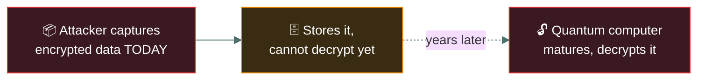
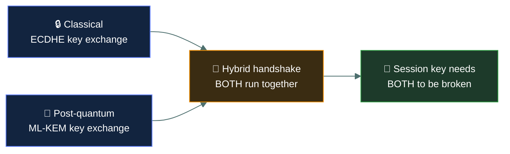

# 🔮 Quantum-resistant cryptography

### *Why encryption that's secure today may not stay that way*

📌 *One idea, at CC depth: today's public-key encryption has a known future weakness, and the industry is already replacing it. No maths required.*

---

## 🧸 The big idea

Today's two-key lockbox is safe because untangling it without the right key would take an
ordinary person a lifetime. But legend speaks of a giant, not yet born, whose strength works in
a completely different way — one who could untangle that same lock almost instantly, the moment
he grows into his power.

That's the whole idea. Modern public-key (asymmetric) encryption — RSA, elliptic-curve
cryptography — relies on mathematical problems that are extremely hard for **ordinary
computers** to solve. A sufficiently powerful **quantum computer**, using different
computational techniques, is expected to be able to solve those same problems quickly, breaking
the encryption they protect.

**Quantum-resistant cryptography** (also called post-quantum cryptography) means building a
lock the giant *still* can't untangle even once he's fully grown — encryption algorithms
specifically designed to remain secure even against an attacker with a quantum computer. At CC
depth, you need to know *why this matters now*, not the mathematics behind any specific
algorithm.

---

## 📖 Words you will keep seeing

| Word | What it means on this exam |
|---|---|
| **Quantum computer** | A fundamentally different kind of computer that can, in theory, solve certain mathematical problems far faster than a classical computer. |
| **Quantum-resistant / post-quantum cryptography** | Encryption algorithms designed to stay secure even against a quantum computer. |
| **Harvest now, decrypt later** | An attacker captures encrypted data today, storing it until quantum computers are capable of decrypting it in the future. |
| **Cryptographic agility** | An organisation's ability to swap out cryptographic algorithms without redesigning entire systems — what makes migrating to quantum-resistant algorithms practical. |

---

## 🔍 Why this is a "now" problem, not a "later" one

Practical, cryptography-breaking quantum computers do not exist yet at the scale needed. So
why does the exam test this as current content?

A rival tribe today can't open your locked message chest — so instead of giving up, they simply
steal the sealed chest and bury it, patiently waiting for years until the legendary giant is
finally born and can crack it open for them. **"Harvest now, decrypt later."** An adversary can
capture and store encrypted traffic or data *today*, and simply wait until quantum computing
matures enough to decrypt it. For data that must remain confidential for many years — government
secrets, long-lived personal records — today's encryption may already be inadequate against a
*future* decryption capability, even though it is completely secure against every attacker that
exists right now.

This is why standards bodies are already publishing quantum-resistant algorithms and why
organisations with long-lived sensitive data are beginning migration now — the migration
itself takes years, and the data being protected today needs to survive the transition.

## 🔬 The real, named algorithms already being deployed

"Standards bodies have already published post-quantum algorithms" has actual names attached.
**NIST finalised its selections in 2024**: **CRYSTALS-Kyber** (standardised as **ML-KEM**) for
key exchange, and **CRYSTALS-Dilithium** (standardised as **ML-DSA**) for digital signatures.
Both are built on **lattice-based cryptography** — a completely different family of hard
mathematical problem than the factoring and discrete-logarithm problems RSA and elliptic-curve
cryptography rely on, which is exactly why Shor's algorithm doesn't help against them: it was
built to solve *those specific* problems, not lattice problems.

**This migration isn't hypothetical — it's already running in production today, via hybrid
deployment.** Chrome and Cloudflare, among others, now run TLS handshakes combining a classical
key exchange (ECDHE) *and* a post-quantum one (ML-KEM) simultaneously, deriving the actual
session key from both together. This is cryptographic agility in its most concrete form: an
attacker would need to break *both* the classical and the lattice-based math to recover the
key, which is deliberately cautious in case a weakness in the still-newer post-quantum algorithms
is discovered before classical algorithms are ever actually broken by a quantum computer.

---

## ⚖️ Told apart

| | Means | Not to be confused with |
|---|---|---|
| **Quantum-resistant cryptography** | Algorithms designed to withstand a *future* quantum-capable attacker. | **Current strong encryption** (AES, RSA at adequate key lengths), which is secure against *today's* classical-computing attackers but not assumed secure against a mature quantum attacker. |
| **Harvest now, decrypt later** | Capturing ciphertext today to decrypt once quantum capability exists. | A conventional brute-force attack, which targets present-day computational limits, not a future capability. |

---

## ⚠️ Where your instinct is wrong

> [!WARNING]
> **In the job:** "we'll deal with quantum computing when it's actually a threat" feels like a
> reasonable prioritisation call.
>
> **On the exam:** the tested reasoning is the opposite — because of harvest-now-decrypt-later
> and because migrating cryptography takes years, the textbook-correct view is that
> **long-lived sensitive data needs quantum-resistant protection well before quantum computers
> are actually capable of the attack.**

---

## 🧠 How to remember it

🧠 **"Harvest now, decrypt later."** The four words that explain why this is tested as a
current concern rather than a distant one.

---

## ✅ Check you actually got it

Answer all five before expanding anything.

**Q1.** What is the PRIMARY reason organisations are adopting quantum-resistant cryptography
before large-scale quantum computers exist?

- **A.** Quantum computers are already breaking encryption in production environments
- **B.** Attackers can capture encrypted data now and decrypt it once quantum computing
  matures ("harvest now, decrypt later")
- **C.** Quantum-resistant algorithms are cheaper to implement than current encryption
- **D.** Regulatory bodies have banned current encryption standards

<b>Answer</b>

**B — harvest now, decrypt later.** Long-lived confidential data captured today could be
decrypted by a future quantum-capable attacker, which is why migration starts before that
capability exists.

- **A** overstates current quantum capability, which is not yet at the scale needed to break
  standard encryption.
- **C** is not the stated rationale and is not necessarily true.
- **D** invents a regulatory action that has not occurred.

**Q2.** Which of the following data would be MOST urgent to protect with quantum-resistant
cryptography?

- **A.** A promotional email newsletter
- **B.** Data that must remain confidential for many decades
- **C.** A publicly available press release
- **D.** Data already deleted from all systems

<b>Answer</b>

**B — data that must remain confidential for decades.** The harvest-now-decrypt-later risk is
highest for data with a long required confidentiality lifespan.

- **A** and **C** are not sensitive or confidential, so future decryption poses little risk.
- **D** cannot be harvested if it no longer exists anywhere to capture.

**Q3.** What does "cryptographic agility" refer to?

- **A.** The speed at which an encryption algorithm processes data
- **B.** An organisation's ability to swap cryptographic algorithms without redesigning entire systems
- **C.** A specific quantum-resistant algorithm
- **D.** The physical size of a quantum computer

<b>Answer</b>

**B — the ability to swap algorithms without a full redesign.** This is what makes a future
migration to quantum-resistant algorithms practical rather than a ground-up rebuild.

- **A** describes performance, unrelated to agility.
- **C** invents a named algorithm not referenced in the concept.
- **D** is irrelevant to the term.

**Q4.** Which statement about quantum computing and encryption is MOST accurate?

- **A.** Quantum computers currently break all forms of encryption in everyday use
- **B.** A sufficiently powerful quantum computer is expected to be able to break widely-used
  public-key encryption
- **C.** Quantum computing has no relevance to cryptography
- **D.** Symmetric and asymmetric encryption are equally at risk from quantum computing

<b>Answer</b>

**B — a sufficiently powerful quantum computer is expected to break widely-used public-key
encryption.** This is the stated concern driving quantum-resistant cryptography.

- **A** overstates current capability — this is an anticipated future risk, not a present
  reality at scale.
- **C** contradicts the entire premise of this topic.
- **D** overgeneralises; the primary concern is with public-key (asymmetric) algorithms whose
  security relies on problems quantum computers are expected to solve efficiently.

**Q5.** Why does migrating an organisation's cryptography to quantum-resistant algorithms
typically take significant time?

- **A.** Because quantum computers must be purchased first
- **B.** Because cryptographic systems are deeply embedded across infrastructure, software and standards, and require careful, coordinated replacement
- **C.** Because it requires shutting down all systems permanently
- **D.** Because quantum-resistant algorithms do not yet exist

<b>Answer</b>

**B — cryptography is deeply embedded and requires coordinated replacement.** This is why
cryptographic agility matters and why migration starts well ahead of the anticipated threat.

- **A** confuses the defender's migration with acquiring the attacker's future capability.
- **C** describes an unnecessary and extreme approach.
- **D** is factually wrong — standards bodies have already published post-quantum algorithms.

---

## 🎓 The grown-up version

<b>Extra depth — open this on a second read, never needed for the pass</b>

**Why asymmetric cryptography specifically is at risk.** RSA and elliptic-curve cryptography
rely on problems (integer factorisation, discrete logarithms) for which an efficient quantum
algorithm is already known in theory (Shor's algorithm) — it is a matter of building a quantum
computer large and stable enough to run it, not a matter of whether the mathematical approach
works. Symmetric algorithms like AES are considered less urgently at risk; a quantum approach
(Grover's algorithm) offers a much smaller speedup against them, addressed by simply using
longer keys rather than replacing the algorithm family.

**Standardisation is already underway.** National standards bodies have run public,
multi-year competitions to select and standardise post-quantum algorithms, precisely so
organisations have vetted options to migrate to well ahead of the anticipated threat timeline.
CC does not require naming specific selected algorithms.

---

## 📝 Cram lines

Destined for [`EXAM-DAY.md`](../../EXAM-DAY.md):

- **"Harvest now, decrypt later"** — why quantum-resistant crypto matters before quantum
  computers can actually break encryption.
- Quantum-resistant cryptography mainly concerns **public-key (asymmetric)** algorithms.
- **Cryptographic agility** = the ability to swap algorithms without a full system redesign.
- Prioritise migration for data with a **long required confidentiality lifespan**.

---

<a href="../README.md">← back to 05 · Security Operations and Incident Response</a> &nbsp;·&nbsp; <a href="../logging-and-monitoring/">next: Logging and monitoring →</a>

</content>
