# 📜 Security policies

### *The named policies the exam expects you to recognise by purpose*

📌 *Mostly recognition: match a described situation to the policy that governs it. AUP and BYOD carry the most questions.*

---

## 🧸 The big idea

The chief doesn't just expect good behaviour and hope for the best. She carves the rule into a
post at the centre of camp, where everyone walks past it, and only after that can she fairly
punish someone who breaks it. A rule nobody carved down, and nobody read, cannot be fairly
enforced against anyone.

Policies are how an organisation states, in writing and with authority, what it requires. They
are **administrative controls**, they are **mandatory**, and they are approved by **senior
management**.

This topic is largely a naming exercise: several standard policies exist, each covering one area,
and the exam asks you to match a situation to the right one.

The theme running underneath is the one from Domain 1, and it is worth restating because it drives
so many answers:

> **For an organisation-wide behaviour problem, the answer is a policy, then training, then a
> technical control.**

Not because technology is ineffective, but because an organisation cannot fairly enforce,
monitor or discipline against a rule it never wrote down and never communicated.

---

## 📖 Words you will keep seeing

| Word | What it means on this exam |
|---|---|
| **AUP** — Acceptable Use Policy | Defines permitted and prohibited use of the organisation's systems. |
| **BYOD** — Bring Your Own Device | Governs the use of personally owned devices for work. |
| **Change management policy** | Requires changes to follow a controlled process. |
| **Privacy policy** | States how personal data is collected, used, shared and protected. |
| **Password policy** | Sets requirements for credentials. |
| **Data retention policy** | Defines how long each type of data is kept. |
| **Clean desk policy** | Requires sensitive material to be secured when unattended. |
| **Remote work policy** | Governs working away from organisational premises. |
| **Incident response policy** | Establishes how incidents are reported and handled. |
| **Onboarding / offboarding policy** | Governs access at the start and end of employment. |
| **MDM** — Mobile Device Management | The technology enforcing policy on mobile devices. |
| **Containerisation** | Separating work data from personal data on one device. |

---

## 📜 The named policies

### ✅ Acceptable Use Policy

The rule carved on the post about the tribe's own shared tools, the fire, and the storehouse —
what you may take, what you may borrow, what you may never touch without asking.

**What staff may and may not do with the organisation's systems.** The most broadly applicable
policy, and typically the one everyone signs.

**Covers:** permitted personal use, prohibited activities, use of email and internet, software
installation, removable media, handling of company data, monitoring and privacy expectations,
and consequences of breach.

> 🎯 **The AUP is the answer to most "employees are doing X with company systems" questions** —
> personal use, unauthorised software, misuse of email.

> ⚠️ **The AUP is also what makes monitoring defensible.** It sets the expectation that use of
> company systems is monitored, which matters legally in many jurisdictions.

### 📱 BYOD

A hunter brings his own personal knife to help with tribe work. Camp needs some say over that
knife when it's doing tribe business — but the knife is still his, and that's exactly what makes
the whole arrangement awkward.

**Governs personally owned devices used for work.** It is difficult precisely because the
organisation does not own the device, and the tension is structural.

| The organisation wants | The employee wants |
|---|---|
| Control over corporate data | Privacy over personal data |
| Ability to enforce encryption and passcodes | Not to be told how to run their phone |
| Ability to **wipe** on loss or departure | Their photos not deleted |
| Visibility of what is installed | No inventory of their personal apps |

**A BYOD policy should address:** which devices are permitted, minimum security requirements,
who pays, what the organisation may access and wipe, what happens at departure, and support
boundaries.

> ⚠️ **Remote wipe is the point of friction.** Wiping a personal device to protect corporate data
> destroys personal data too, which is why **containerisation** — separating work data into a
> managed area that can be wiped alone — is the expected technical answer. Like tying a coloured
> cord around just the one pouch on the hunter's belt that holds tribe supplies — if he leaves,
> camp reclaims that pouch alone and never touches the rest of his gear.

> 🎯 **BYOD is a policy problem first and an MDM problem second.** MDM enforces; the policy
> establishes what may be enforced and what the employee consented to.

### 🔄 Change management policy

**Requires changes to follow a controlled process** — requested, assessed, approved, tested,
implemented and documented, with a backout plan.

### 🕵️ Privacy policy

**States how personal data is collected, used, shared, retained and protected.** Note that this
normally means two documents: an **external** notice telling data subjects what happens to their
data, and an **internal** policy telling staff how to handle it.

### 🔑 Password policy

Sets credential requirements: minimum length, complexity, reuse restrictions, screening against
known-breached passwords, and rules for sharing — which is prohibited.

> ⚠️ **The password *policy* is administrative. The system setting enforcing it is technical.**
> A recurring exam pairing.

### 🗄️ Data retention policy

**How long each type of data is kept**, balancing legal requirements, business need and the
privacy principle that data should not be kept longer than necessary.

### 🧹 Clean desk policy

Nobody leaves the tribe's record-tablets scattered by the fire pit when they step away — a
passing trader, a curious child, anyone at all can read what's left in plain sight.

**Sensitive material must be secured when unattended** — documents filed, whiteboards cleared,
screens locked. It defends against shoulder surfing, casual observation and opportunistic theft
by visitors and cleaners.

> 🧠 **A clean desk policy is the physical counterpart of a session timeout.** Both stop an
> unattended position being used by whoever walks past.

---

## 🔄 The order that answers questions

Read it as a sentence: **write it down, tell people, enforce it, then watch.**

> [!IMPORTANT]
> **Policy comes before the technical control.** An organisation cannot fairly discipline someone
> for breaking a rule nobody wrote or communicated, and a technical control deployed without a
> policy breaks legitimate work nobody documented. When a question asks for the **BEST first
> step** to an organisation-wide behaviour problem, the policy is the answer.

---

## ✍️ What every policy needs

| Element | Why |
|---|---|
| **Senior management approval** | This is what gives it authority |
| **Clear scope** | Who and what it applies to, including contractors |
| **Defined responsibilities** | Who must do what |
| **Consequences of breach** | Otherwise it is advice, not a policy |
| **Periodic review** | Annually, and after significant change or an incident |
| **Communication and acknowledgement** | Staff must have seen it; signature or a training record |

> ⚠️ **A policy nobody has read is not a control.** Communication and acknowledgement are part of
> the control, not administrative overhead around it.

---

## 🔬 How a written policy becomes an enforced setting

A policy is administrative. Something technical has to actually make it happen, and for the two
most-examined policies here that mechanism has a specific name.

**Containerisation is a real OS feature, not a vendor promise.** Android calls it a **work
profile**; iOS achieves the equivalent through **managed apps and managed app configuration**. The
operating system itself keeps corporate apps and their data in a cryptographically separate
space, with its own storage and its own encryption — the phone's own kernel refuses to let a
personal app read a work app's files. That separation is what makes a **selective wipe**
technically possible: the MDM sends a command that destroys the work container's encryption key
and data, and the OS leaves the personal side completely untouched, because it was never the
same storage in the first place.

**A password policy gets enforced by a specific technical control too.** On Windows, a Group
Policy Object pushes minimum length and complexity to every domain-joined machine. Modern
identity platforms go further with a **banned password list** — Entra ID Password Protection, for
instance, checks a proposed password against a maintained list of known-breached and
organisation-specific weak terms and rejects it at the point of being set. That is the concrete
answer to the exam's "policy is administrative, the setting enforcing it is technical" pairing:
the policy document says "credentials must be strong," and a GPO or password-protection service
is the thing that actually refuses `Summer2026!`.

---

## ⚖️ Told apart

| | Covers | Not to be confused with |
|---|---|---|
| **AUP** | What staff may do with **the organisation's** systems. | **BYOD**, which covers using **the employee's own** device for work. |
| **BYOD** | Personally owned devices used for work. | **Remote work policy**, which covers working *from elsewhere* on any device. |
| **Password policy** | Administrative — the written rule. | The **system setting** enforcing it, which is technical. |
| **Privacy policy** | How **personal data** is handled. | **Data retention policy**, which covers how long **all** data is kept. |
| **Clean desk** | Physical material secured when unattended. | **Session timeout**, the logical equivalent. |
| **Policy** | High-level intent, mandatory, management-approved. | **Procedure**, the step-by-step how. **Guideline**, which is optional. |
| **MDM** | The **technology** enforcing device policy. | The **BYOD policy**, which is the rule MDM enforces. |

---

## ⚠️ Where your instinct is wrong

> [!WARNING]
> **In the job:** the fix for people misusing systems is a technical control — block it and move
> on.
>
> **On the exam:** **policy first, then training, then the technical control.** The technical
> control enforces a rule; the rule has to exist and be communicated first.

> [!WARNING]
> **In the job:** BYOD is solved by deploying MDM.
>
> **On the exam:** BYOD is a **policy** problem. MDM enforces what the policy establishes, and the
> hard parts — what the organisation may wipe, what it may see, what happens at departure — are
> policy questions requiring the employee's consent.

> [!WARNING]
> **In the job:** policies are documents that sit unread on an intranet.
>
> **On the exam:** **communication and acknowledgement are part of the control.** An
> unacknowledged policy cannot support enforcement or discipline.

---

## 🧠 How to remember it

🧠 **AUP = our systems. BYOD = your device.**

🧠 **Policy · Training · Technology · Monitoring.** In that order, every time.

🧠 **Clean desk is the physical session timeout.**

🧠 **No consequences, no policy.** A rule without a sanction is a guideline.

---

## ✅ Check you actually got it

Answer all five before expanding anything.

**Q1.** Employees are installing unapproved software on company laptops. What is the BEST FIRST
step?

- **A.** Remove local administrator rights from all users immediately
- **B.** Establish and communicate an acceptable use policy covering software installation
- **C.** Deploy application allow-listing software
- **D.** Monitor installations and discipline offenders

<b>Answer</b>

**B — establish and communicate an acceptable use policy.** The organisation cannot fairly enforce
or discipline against a rule it has never written down and communicated.

- **A** is a legitimate technical control that may well follow, and as a first step it enforces an
  unwritten rule and will break legitimate work nobody has documented yet.
- **C** is the same objection: a strong control implementing a policy that does not yet exist.
- **D** disciplines people for breaching a rule they were never told about, which is
  indefensible.

**Q2.** Which policy governs the use of personally owned smartphones to access corporate email?

- **A.** Acceptable use policy
- **B.** BYOD policy
- **C.** Remote work policy
- **D.** Privacy policy

<b>Answer</b>

**B — the BYOD policy.** It specifically governs personally owned devices used for work, including
what the organisation may require, access and wipe.

- **A** governs use of the **organisation's** systems. It is adjacent and does not address the
  ownership questions that make BYOD difficult.
- **C** governs working away from the premises, which may involve corporate or personal devices —
  a different axis.
- **D** covers handling of personal data as a subject-matter area, not device ownership.

**Q3.** An employee leaves and their personal phone contains corporate email. What is the
PRIMARY challenge?

- **A.** The phone must be confiscated as company property
- **B.** Wiping corporate data may also destroy the employee's personal data, which is why containerisation is used
- **C.** The employee must delete the data themselves, unverified
- **D.** Corporate email cannot be removed from personal devices

<b>Answer</b>

**B — wiping corporate data may destroy personal data, which is why containerisation is used.**
Separating work data into a managed container allows a selective wipe that leaves personal photos
and messages untouched.

- **A** is wrong — the device belongs to the employee, and that is the defining feature of BYOD.
- **C** describes what happens with no policy or technology in place, and provides no assurance the
  data is gone.
- **D** is factually wrong; selective wipe is standard MDM functionality.

**Q4.** What gives a security policy its authority?

- **A.** Publication on the company intranet
- **B.** Approval by senior management
- **C.** Review by the legal department
- **D.** Inclusion in the employee handbook

<b>Answer</b>

**B — approval by senior management.** Their approval is what makes the policy binding across the
organisation, and it is a consistent theme in this exam that governance authority sits with
management.

- **A** is how the policy is communicated — necessary, and it confers no authority by itself.
- **C** ensures it is lawful and enforceable, which supports the policy without being its source of
  authority.
- **D** is another communication mechanism, with the same limitation as A.

**Q5.** A clean desk policy PRIMARILY defends against which risk?

- **A.** Malware infection from removable media
- **B.** Unauthorised viewing or theft of sensitive material left unattended
- **C.** Loss of data due to hardware failure
- **D.** Network intrusion from external attackers

<b>Answer</b>

**B — unauthorised viewing or theft of sensitive material left unattended.** Documents on a desk,
notes on a whiteboard and an unlocked screen are all readable by anyone passing — visitors,
contractors, cleaners, or a colleague who should not see them.

- **A** is addressed by removable media controls within the AUP.
- **C** is addressed by backups.
- **D** is a network security concern, unrelated to what is physically visible in an office.

---

## 🎓 The grown-up version

<b>Extra depth — open this on a second read, never needed for the pass</b>

**Policies fail when they are written for auditors rather than readers.** A forty-page document in
legal language, acknowledged with a click by people who did not read it, satisfies an audit
requirement and changes no behaviour. The policies that work are short, specific about what to do
in situations people actually encounter, and reinforced at the moment of decision — a warning
banner on an external email does more than a paragraph in a document signed eleven months ago.

**BYOD is genuinely legally complex.** Remote-wiping an employee's personal device raises questions
about property and about personal data that vary considerably between jurisdictions, and consent
obtained as a condition of employment is treated sceptically in some legal systems. Monitoring a
personal device can engage privacy law directly. This is why many organisations moved away from
BYOD towards corporate-owned devices, or towards approaches where no corporate data ever lands on
the personal device at all.

**Acceptable use and monitoring interact.** In several jurisdictions, monitoring employee activity
requires notice, and in some it requires more than notice. The AUP is usually the vehicle for that
notice, which is why its wording about monitoring matters more than the rest of the document
combined. An organisation that monitors without having established the expectation may find the
evidence unusable and the monitoring itself unlawful.

**Policy exceptions need the same rigour as the policy.** Every policy meets a case it cannot
accommodate. Handling that with an undocumented informal allowance erodes the policy for everyone;
handling it with a documented exception — justification, compensating controls, an approver, an
expiry date — preserves it. An exception is a documented risk acceptance, which links this topic
back to risk treatment.

**The consequences clause is what separates a policy from advice.** If there is no stated
consequence for breach, and no instance of the consequence ever being applied, the document
describes an aspiration. This is uncomfortable and it is why HR involvement in policy drafting
matters: a rule the organisation is unwilling to enforce should not be written as a rule.

---

## 📝 Cram lines

Destined for [`EXAM-DAY.md`](../../EXAM-DAY.md):

- **Order: POLICY → TRAINING → TECHNICAL CONTROL → MONITORING.** Policy is the **BEST first step** for behaviour problems.
- **AUP = what you may do with OUR systems.** The answer to most misuse questions. Also establishes that monitoring occurs.
- **BYOD = using YOUR OWN device for work.** A **policy** problem first, MDM second.
- **Remote wipe destroys personal data too → CONTAINERISATION** separates work data for selective wipe.
- **Password POLICY is administrative. The system setting enforcing it is TECHNICAL.**
- **Privacy policy** = how personal data is handled. **Retention policy** = how long data is kept.
- **Clean desk = the physical counterpart of session timeout.**
- **Policies need: senior management approval · scope · responsibilities · CONSEQUENCES · periodic review · acknowledgement.**
- **A policy nobody has read is not a control.**

---

<a href="../README.md">← back to 05 · Security Operations and Incident Response</a> &nbsp;·&nbsp; <a href="../asset-lifecycle-and-eol/">next: Asset lifecycle and EOL →</a>

