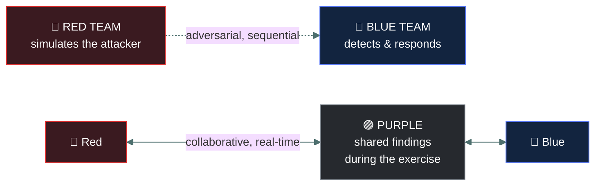
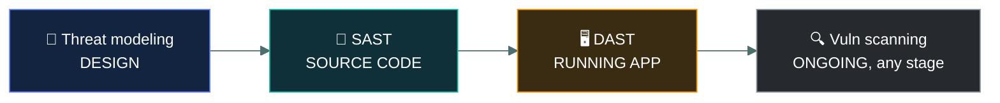

# 🧪 Security testing methods

### *Red, blue, purple, and the four ways to find a bug in an application before an attacker does*

📌 *Two of the outline's three security testing clusters: readiness testing (team colours) and application testing (scanning and analysis techniques). The third, physical testing, has its own page.*

---

## 🧸 The big idea

Once a season, the chief hires a trusted band of hunters to stage a mock raid on camp — sneaking
past the fence at night, the same way a real enemy would, while the real watchmen try to catch
them. Nobody gets hurt, nothing actually burns, but the camp learns exactly where its defences
hold and where they don't — before a real raiding party finds out first.

Security testing means **deliberately trying to find weaknesses before someone hostile does.**
The live outline groups this into three clusters: **readiness testing** (people and process,
organised by team colour), **application testing** (finding bugs in software), and **physical
penetration testing** (covered on its own page). This page covers the first two.

---

## 📖 Words you will keep seeing

| Word | What it means on this exam |
|---|---|
| **Red team** | Authorised attackers simulating real adversaries against the organisation's defences. |
| **Blue team** | The defenders — the team detecting and responding to the red team's activity. |
| **Purple team** | A collaborative exercise where red and blue actively share findings **during** the exercise, to improve detection faster than a purely adversarial exercise would. |
| **Vulnerability scanning** | Automated scanning of systems/applications against a database of known vulnerabilities. |
| **SAST (Static Application Security Testing)** | Analysing an application's **source code** for security flaws, without running it. |
| **DAST (Dynamic Application Security Testing)** | Testing a **running** application from the outside, the way an attacker would interact with it. |
| **Threat modeling** | Systematically identifying what could go wrong in a system's design, **before or during development** — a design-time activity, not a scan. |
| **Penetration test** | An authorised, human-led attempt to actively exploit weaknesses — goes beyond scanning by proving what an attacker could actually achieve. |
| **Black box test** | The tester starts with **no internal knowledge** — the outside attacker's view. |
| **White box test** | The tester has **full internal knowledge** — source code, architecture, credentials. |
| **Grey box test** | The tester has **partial knowledge** — e.g. a standard user account, but not source code. |
| **Rules of engagement** | The written scope and boundaries for a test — what may be attempted, what is off-limits, and who to contact if something goes wrong. |

---

## 🔍 Readiness testing: red, blue, purple

The mock raiders (**red**) try to slip past the fence undetected; the real watchmen (**blue**)
try to catch them. Normally the two sides only sit down together after it's all over, comparing
notes at the fire the next morning. A **purple** exercise has them signalling to each other
*during* the raid itself — the mock raider calling out "I just got past your east post" the
moment it happens, so the watchmen learn the gap immediately instead of the next day.

| Team | Role | Style |
|---|---|---|
| **Red** | Simulates a real attacker, trying to get in and stay undetected | Adversarial |
| **Blue** | Defends, detects, and responds | Adversarial (from red's perspective) |
| **Purple** | Red and blue collaborate and share findings **as the exercise runs** | Collaborative |

> 🎯 **Purple team's defining feature is the timing of information sharing.** In a traditional
> red-vs-blue exercise, findings are shared in a debrief *after* the exercise ends. In a purple
> team exercise, sharing happens **during**, specifically to accelerate blue team learning.

---

## 🔍 Application testing: four techniques, told apart by *when* and *how*

Building a hut gives you four different chances to catch a problem: studying the drawn-out plan
before a single log is cut (would that door face straight into the wind?), checking each log for
rot as it's carved but before the hut stands (still just timber, not yet a building), pushing and
kicking the walls once the hut is fully built and standing to see what actually gives, and — for
a hut already lived in for years — walking round it with the known list of "this exact door
hinge always snaps eventually" checks.

| Technique | Looks at | When | Finds |
|---|---|---|---|
| **Vulnerability scanning** | Systems/apps against a **known-vulnerability database** | Any time, often scheduled/automated | Known, previously catalogued vulnerabilities |
| **SAST** | **Source code**, without executing it | Early — during development, before the app runs | Coding flaws (injection patterns, insecure functions) directly in the code |
| **DAST** | A **running** application, from the outside | Later — once the app is deployed/running | Flaws only visible from actual runtime behaviour (how it responds to malicious input) |
| **Threat modeling** | The system's **design** | Design/architecture time — often the earliest of all | Structural weaknesses before any code is even written |

> 🎯 **SAST reads; DAST attacks.** SAST never runs the application — it reads the code. DAST
> never reads the code — it interacts with the running application the way a user or attacker
> would.

---

## 🕶️ Penetration testing: how much the tester is told beforehand

A penetration test goes further than scanning — a human actively tries to exploit what's
found, to prove real-world impact rather than just flagging a theoretical weakness. How much
the tester knows in advance is itself a tested distinction — the same mock-raid hunter tests
the camp very differently depending on what the chief tells him going in: nothing at all, the
full camp map and the elder's own key, or just a guest's welcome past the front gate.

| | Tester starts with | Simulates |
|---|---|---|
| **Black box** | No internal knowledge | An outside attacker with no inside help |
| **White box** | Full internal knowledge (source, architecture, credentials) | The deepest, most efficient possible review |
| **Grey box** | Partial knowledge (e.g. a standard user account) | A malicious insider, or an attacker who has already gained a foothold |

> 🎯 **More knowledge given to the tester trades realism for efficiency.** Black box is the
> most realistic simulation of an external attacker; white box finds the most issues fastest
> because nothing has to be discovered blind.

**Every test — application, red team, or physical — runs under written rules of engagement.**
Without a defined scope and authorisation, an "authorised" test is legally indistinguishable
from the real intrusion it's meant to simulate. This is exactly why the chief and the mock
raiders agree beforehand which huts are truly off-limits and who to run to if it looks like
turning into a real fight.

---

## 🔬 Where each technique actually runs in a real pipeline

The "design → code → running app" ordering isn't abstract — in a modern software team each of
these techniques is wired into a specific stage of the CI/CD pipeline, and failing one can block
a release automatically.

```mermaid
%%{init: {'theme':'base','themeVariables':{'fontSize':'12px','lineColor':'#4d6f6e','textColor':'#dbe7e6'}}}%%
flowchart LR
    DES["📐 Design review<br/>threat modeling"] --> COMMIT["💻 Developer<br/>commits code"]
    COMMIT --> CI["⚙️ CI pipeline runs<br/>SAST + dependency scan"]
    CI --> DEPLOY["🚀 Deploy to<br/>staging"]
    DEPLOY --> DASTS["🖥️ DAST runs against<br/>the live staging app"]
    DASTS --> PROD["✅ Release to<br/>production"]

    style DES fill:#12243f,stroke:#5C7CFA,color:#fff
    style COMMIT fill:#26292e,stroke:#868E96,color:#fff
    style CI fill:#0f3038,stroke:#12B5A5,color:#fff
    style DEPLOY fill:#26292e,stroke:#868E96,color:#fff
    style DASTS fill:#3a2c12,stroke:#F08C00,color:#fff
    style PROD fill:#1d3a2a,stroke:#2F9E44,color:#fff
```

**SAST runs on every commit, before anything is even built.** Tools like SonarQube, Semgrep or
CodeQL parse the source as the pipeline starts and can fail the build outright if they find a
high-severity pattern — the developer gets told within minutes, while the code is still fresh in
their head, which is the entire economic argument for "shift left": a flaw caught at commit costs
a fraction of one caught after release. Alongside it runs **software composition analysis**,
checking every third-party dependency against known-vulnerable versions — a different question
from SAST, which only examines code your own team wrote.

**DAST necessarily runs later, because it needs something running to attack.** A tool like OWASP
ZAP is pointed at the deployed staging environment and actively sends malformed requests,
injection payloads and unexpected inputs at the live application, watching how it responds. This
is why the two are complements rather than alternatives: SAST can see a dangerous function in
code that never actually executes, and DAST can see a misconfigured server header that exists
nowhere in the source at all.

**Threat modeling is the one step that has no tool gate**, because it happens before there is
anything to scan. The common structured approach is **STRIDE** — walking a diagram of the
system and asking, at each component and each boundary between them, whether Spoofing,
Tampering, Repudiation, Information disclosure, Denial of service, or Elevation of privilege
applies there. The output is a list of design changes, not a scan report.

---

## ⚖️ Told apart

| | Means | Not to be confused with |
|---|---|---|
| **Red vs. blue team exercise** | Adversarial; findings shared in a debrief afterwards. | **Purple team**, where red and blue collaborate and share findings **during** the exercise. |
| **SAST** | Analyses **source code**, app not running. | **DAST**, which tests a **running** application from the outside, without looking at code. |
| **Vulnerability scanning** | Automated check against **known** vulnerabilities. | **Threat modeling**, which reasons about a design's weaknesses that may have no existing catalogue entry at all. |
| **Threat modeling** | A **design-time** activity, often the earliest testing performed. | **Penetration testing** in general, which tests something that already exists (code, a system, a building). |
| **Black box test** | Tester has **no** internal knowledge — the outside view. | **White box test**, full internal knowledge, and **grey box**, partial knowledge in between. |
| **Vulnerability scanning** | Automated, finds and lists weaknesses. | **Penetration testing**, which actively exploits findings to prove real impact. |

---

## ⚠️ Where your instinct is wrong

> [!WARNING]
> **In the job:** "penetration testing" is often used as a catch-all term for any offensive
> security activity.
>
> **On the exam:** you're expected to place a described activity into the **specific** named
> technique — SAST vs. DAST vs. vulnerability scanning vs. threat modeling vs. red/blue/purple
> — rather than answering "penetration testing" generically. The specific mechanism described
> (reading code vs. probing a live app vs. reasoning about a design) determines the answer.

---

## 🧠 How to remember it

🧠 **"SAST reads, DAST attacks."** And: **"Purple shares while it happens; red/blue share when
it's over."**

---

## ✅ Check you actually got it

Answer all five before expanding anything.

**Q1.** A security team analyses an application's source code for insecure coding patterns
before the application is ever executed. What technique is this?

- **A.** DAST
- **B.** SAST
- **C.** Vulnerability scanning
- **D.** Threat modeling

<b>Answer</b>

**B — SAST.** Analysing source code without running the application is the defining
characteristic of static analysis.

- **A** requires a running application, which this scenario explicitly does not have.
- **C** checks against a database of known vulnerabilities rather than analysing source code
  directly.
- **D** is a design-time activity, not a code-analysis one.

**Q2.** A tester interacts with a live web application, submitting malicious input to observe
how the running system responds. What technique is this?

- **A.** SAST
- **B.** Threat modeling
- **C.** DAST
- **D.** Vulnerability scanning

<b>Answer</b>

**C — DAST.** Testing a running application from the outside, the way an attacker would
interact with it, is dynamic analysis.

- **A** would involve reading source code, not interacting with a running system.
- **B** happens at design time, before there's a running system to test.
- **D** checks against known vulnerability signatures rather than actively probing behaviour.

**Q3.** What distinguishes a purple team exercise from a traditional red-versus-blue exercise?

- **A.** Purple team exercises use no red team component at all
- **B.** Findings are shared between red and blue teams during the exercise, not only afterwards
- **C.** Purple team exercises are always conducted by external vendors
- **D.** Purple team exercises test only physical security

<b>Answer</b>

**B — real-time information sharing during the exercise.** This collaborative timing is the
defining feature.

- **A** is wrong — purple team still involves both red and blue components.
- **C** invents a sourcing requirement that doesn't exist.
- **D** confuses this with physical penetration testing, a separate testing cluster.

**Q4.** A team identifies potential design flaws in a new system's architecture before any
code has been written. What activity is this?

- **A.** DAST
- **B.** Vulnerability scanning
- **C.** Threat modeling
- **D.** Red teaming

<b>Answer</b>

**C — threat modeling.** Identifying weaknesses in a design before code exists is the defining
trait of threat modeling, the earliest testing activity in the sequence.

- **A** requires a running application, which doesn't yet exist.
- **B** requires an actual system or application to scan.
- **D** simulates an attacker against an existing environment, not a design review.

**Q5.** Which of the following BEST describes vulnerability scanning?

- **A.** Manually reading application source code line by line
- **B.** Automated checking of systems or applications against a database of known vulnerabilities
- **C.** A collaborative red/blue exercise
- **D.** A design-time architectural review

<b>Answer</b>

**B — automated checking against known vulnerabilities.** This is the defining trait,
distinguishing it from manual code review, team exercises, or design review.

- **A** describes a manual SAST-like activity, not automated scanning.
- **C** describes purple teaming.
- **D** describes threat modeling.

**Q6.** A tester is given a standard employee-level user account but no access to source code
before starting an assessment. What type of test is this?

- **A.** Black box
- **B.** White box
- **C.** Grey box
- **D.** Vulnerability scanning

<b>Answer</b>

**C — grey box.** Partial knowledge (a standard account, but not source code) sits between the
no-knowledge black box and the full-knowledge white box approaches.

- **A** would mean starting with no internal access at all, not a working account.
- **B** would mean full internal knowledge, including source code.
- **D** describes an automated technique, not a human-led, knowledge-tiered test.

---

## 🎓 The grown-up version

<b>Extra depth — open this on a second read, never needed for the pass</b>

**Why SAST and DAST are complementary, not competing.** SAST catches flaws early and cheaply
(before deployment) but can miss issues that only manifest at runtime — configuration errors,
authentication flows, how components interact once actually running. DAST catches those
runtime-only issues but only after the application already exists and only for the paths
actually exercised during testing. Mature programmes run both, plus threat modeling earlier
still, rather than treating any one as sufficient on its own.

**Why purple teaming emerged.** Traditional red-vs-blue exercises can suffer from a long delay
between an attack technique succeeding and the blue team learning about it in the final
debrief — sometimes weeks after the exercise. Purple teaming compresses that feedback loop to
near-real-time, which is particularly valuable when the goal is rapidly improving detection
content (SIEM rules, alerting logic) rather than simply measuring whether red team "won."

**IAST, briefly.** Interactive Application Security Testing runs an agent alongside the
application during normal use or automated functional testing, combining a SAST-like view of
the code path actually executed with DAST-like observation of runtime behaviour. CC does not
require naming IAST, but it explains why "SAST or DAST" is not always a strict either/or in
practice — mature testing programmes layer several of these techniques rather than picking
one.

**Get-out-of-jail authorisation.** Professional testers carry a signed authorisation letter
naming the engagement and an emergency contact, precisely so a test that gets discovered
mid-engagement can be resolved without treating the tester as a genuine intruder — the same
principle covered in more depth for physical tests on the next page.

---

## 📝 Cram lines

Destined for [`EXAM-DAY.md`](../../EXAM-DAY.md):

- **Red = attacks. Blue = defends. Purple = both, sharing findings DURING the exercise.**
- **SAST = source code, app not running. DAST = running app, code not examined.**
- **Vulnerability scanning = automated, checks against KNOWN vulnerabilities.**
- **Threat modeling = design-time**, the earliest of all these activities.
- Three security testing clusters: **readiness (red/blue/purple), application (SAST/DAST/scan/
  threat modeling), physical** (own page).
- **Black box = no knowledge. White box = full knowledge. Grey box = partial.**
- **Rules of engagement** scope every test and prove authorisation if something goes wrong.

---

<a href="../README.md">← back to 05 · Security Operations and Incident Response</a> &nbsp;·&nbsp; <a href="../physical-penetration-testing/">next: Physical penetration testing →</a>

</content>
