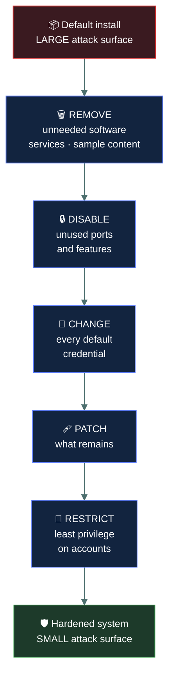
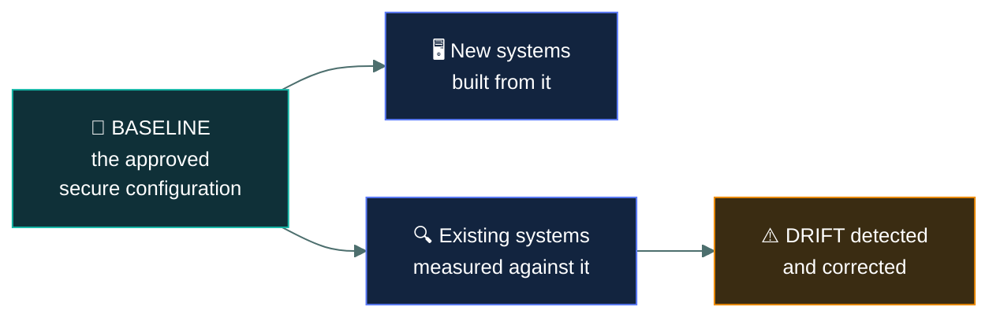
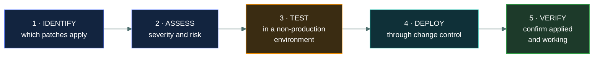

# 🔩 System hardening

### *Reducing what a system offers an attacker, before anyone attacks it*

📌 *Baselines, patching and least functionality. The sentence to hold: a service that is not running cannot be exploited.*

---

## 🧸 The big idea

Systems ship configured for **convenience**, not security. Features are enabled so things work
out of the box, default accounts exist so setup is easy, and sample content is installed so the
product demonstrates well.

Every one of those is **attack surface** — a place an attacker might get in.

**Hardening** removes what is not needed and secures what remains:

> **Turn off what you do not use. Patch what you do. Change every default. Grant the minimum.**

The principle underneath is **least functionality**, and it is the system-level twin of least
privilege. Least privilege limits what a *person* can do; least functionality limits what a
*system* offers.

> 🎯 **A service that is not running cannot be exploited**, and a vulnerability in software you
> removed does not apply to you. Removal beats configuration wherever it is possible.

---

## 📖 Words you will keep seeing

| Word | What it means on this exam |
|---|---|
| **Hardening** | Reducing a system's attack surface by removing and securing. |
| **Attack surface** | The total set of points where an attacker could attempt entry. |
| **Baseline** | The defined minimum secure configuration for a class of system. |
| **Least functionality** | Enabling only the services, ports and features actually required. |
| **Patch** | A vendor fix for a defect, often a security vulnerability. |
| **Patch management** | The process of identifying, testing, deploying and verifying patches. |
| **Zero-day** | A vulnerability with **no patch available**. |
| **Default configuration** | How software arrives before it is secured. |
| **Default credentials** | Built-in usernames and passwords. Publicly documented. |
| **Vulnerability scanning** | Automated checking for known weaknesses. |
| **Configuration drift** | Systems gradually diverging from the baseline over time. |
| **Golden image** | A hardened, approved system image used to build new systems. |

---

## 🔩 What hardening involves

| Step | Why |
|---|---|
| **Remove unnecessary software** | Every application is potential vulnerability surface |
| **Disable unused services and ports** | A service not running cannot be attacked |
| **Change default credentials** | Defaults are published in the vendor's own manual |
| **Remove default and sample accounts** | Guest accounts and demo content are standard targets |
| **Apply patches** | Closes known, published vulnerabilities |
| **Apply least privilege** | Limits what a compromise achieves |
| **Enable logging** | So activity on the system is visible |
| **Configure host firewall and endpoint protection** | Layered defence at the host |

> [!IMPORTANT]
> **Changing default credentials is the most examined single step.** Default usernames and
> passwords are published in vendor documentation and collected in public lists. Any scenario
> describing a device left on its factory password has that as the finding.

---

## 📐 Baselines

A **baseline** is the documented minimum secure configuration for a class of system — all web
servers, all laptops, all database servers.

A baseline does two jobs: **new systems are built from it**, and **existing systems are measured
against it**. The second is what catches **configuration drift** — systems slowly diverging as
people make undocumented changes to fix problems.

> ⚠️ **Configuration drift is gradual and invisible.** Nothing breaks when a system drifts, which
> is precisely why it goes unnoticed until an audit or an incident finds it.

**A golden image** is a hardened, approved build used to create new systems, so hardening happens
once rather than being repeated and forgotten.

---

## 🩹 Patch management

Patching is the most visible part of hardening, and the exam expects the **process**, not just the
act.

> [!IMPORTANT]
> **Test before deploying to production.** A patch that breaks a critical application causes an
> availability incident, and an untested emergency patch rollout is a classic self-inflicted
> outage. If an option skips testing, it is usually wrong.

**Two tensions the exam recognises:**

| Tension | The balance |
|---|---|
| Patch fast vs test properly | Critical vulnerabilities may justify an **emergency** process with abbreviated testing — a documented risk decision, not an omission |
| Patch vs cannot patch | Where patching is impossible — legacy or unsupported systems — use **compensating controls**: segmentation and heightened monitoring |

> 🎯 **"We cannot patch it" leads to segmentation**, which is the compensating control answer that
> appears across several domains.

**A zero-day has no patch**, so patching cannot address it. The defences are the other hardening
measures — reduced attack surface, least privilege, segmentation, and anomaly-based detection.

---

## 🔍 Vulnerability scanning

Automated checking of systems against known vulnerabilities and configuration weaknesses.

| | |
|---|---|
| **Control function** | **Detective** — it finds weaknesses, it does not fix them |
| **Finds** | Missing patches, default credentials, weak configuration, unnecessary services |
| **Frequency** | Regularly, and after significant change |
| **Limitation** | Only finds **known** vulnerabilities; produces false positives |

> ⚠️ **A vulnerability scan is detective, not preventive.** The remediation that follows is
> corrective. This classification is tested the same way access reviews are.

**Scanning is not penetration testing.** A scan checks automatically against a database of known
issues. A penetration test involves a person actively attempting exploitation, and goes deeper on
fewer things.

---

## ⚖️ Told apart

| | Means | Not to be confused with |
|---|---|---|
| **Hardening** | Reducing attack surface by removing and securing. | **Patching**, which is one part of it. |
| **Baseline** | The approved minimum secure configuration. | A **policy**, which states intent. A baseline is the concrete configuration. |
| **Least functionality** | Only the services and features the **system** needs. | **Least privilege**, which limits what a **person** can do. |
| **Configuration drift** | Gradual divergence from the baseline. | A single unauthorised change. Drift is cumulative and unnoticed. |
| **Zero-day** | **No patch exists.** | An **unpatched** vulnerability, where a fix exists but was not applied. |
| **Vulnerability scanning** | Automated, known issues, broad. **Detective.** | **Penetration testing**, human, exploitation, deep. |
| **Golden image** | A hardened build template. | A backup image, which captures a system as it is. |

---

## ⚠️ Where your instinct is wrong

> [!WARNING]
> **In the job:** critical patches go out fast, and testing is a luxury when something is being
> actively exploited.
>
> **On the exam:** **test before production deployment.** Emergency processes exist and are a
> documented risk decision; they are not the default answer.

> [!WARNING]
> **In the job:** you disable a service you are unsure about and see what breaks.
>
> **On the exam:** the expected answer is to **remove** unnecessary software rather than merely
> disable it, where removal is possible. Removed software has no vulnerabilities.

> [!WARNING]
> **In the job:** a vulnerability scan is how you improve security posture.
>
> **On the exam:** a scan is **detective**. It finds problems; the remediation is the corrective
> step. Scanning alone changes nothing.

---

## 🧠 How to remember it

🧠 **Remove · Disable · Change · Patch · Restrict.** In that order.

🧠 **A service that isn't running can't be exploited.**

🧠 **Least privilege limits PEOPLE. Least functionality limits SYSTEMS.**

🧠 **Baselines build new systems and measure old ones.** The second catches drift.

🧠 **Scans find, patches fix.** Detective, then corrective.

---

## ✅ Check you actually got it

Answer all five before expanding anything.

**Q1.** A newly deployed network device is still using the manufacturer's default administrative
password. What is the PRIMARY concern?

- **A.** The password may not meet complexity requirements
- **B.** Default credentials are publicly documented and widely known
- **C.** The device will require a password change at first login
- **D.** The password cannot be changed without vendor support

<b>Answer</b>

**B — default credentials are publicly documented and widely known.** They appear in the vendor's
own manuals and in public lists, and automated tools try them against exposed devices constantly.

- **A** is a secondary concern at best. Even a complex default is worthless if it is published.
- **C** describes a helpful product behaviour rather than a security concern, and the stem states
  it is still in use.
- **D** is not generally true, and would be an operational limitation rather than the primary
  concern.

**Q2.** Which principle underlies disabling unused services and removing unnecessary software?

- **A.** Least privilege
- **B.** Least functionality
- **C.** Segregation of duties
- **D.** Defence in depth

<b>Answer</b>

**B — least functionality.** It applies to what a **system** provides: only the services, ports
and features actually required should be present.

- **A** is the closely related principle governing what a **person** or account may do. The two are
  twins and the distinction is what the question tests.
- **C** concerns splitting a sensitive process between people.
- **D** concerns layering independent controls. Hardening contributes to it without being the
  principle described.

**Q3.** An organisation must apply a critical security patch to production servers. What should
happen before deployment?

- **A.** Nothing — critical patches should be deployed immediately
- **B.** The patch should be tested in a non-production environment
- **C.** All servers should be backed up and taken offline permanently
- **D.** The vendor should guarantee the patch in writing

<b>Answer</b>

**B — tested in a non-production environment.** A patch that breaks a critical application causes
an availability incident, and untested emergency rollouts are a well-known source of self-inflicted
outages.

- **A** is the tempting operational instinct. Emergency processes with abbreviated testing exist
  for actively exploited vulnerabilities, and they are a documented risk decision rather than the
  default.
- **C** proposes a permanent outage, which is a far worse outcome than the vulnerability.
- **D** is not something vendors provide, and it would not substitute for testing in your own
  environment.

**Q4.** A legacy application runs on an operating system no longer supported by its vendor, so no
patches are available. What is the MOST appropriate response?

- **A.** Continue as normal, since no patches exist to apply
- **B.** Isolate the system on a segmented network with enhanced monitoring
- **C.** Disable all logging to reduce the system's load
- **D.** Grant the system additional privileges so it can defend itself

<b>Answer</b>

**B — isolate it on a segmented network with enhanced monitoring.** The primary control, patching,
is unavailable, so a **compensating control** provides comparable protection by another route.

- **A** accepts an unmitigated known-vulnerable system, which is exactly what compensating controls
  exist to avoid.
- **C** removes the visibility you most need on the system you can least protect.
- **D** is backwards — additional privilege increases what a compromise achieves.

**Q5.** How should vulnerability scanning be classified by control function?

- **A.** Preventive, because it stops attacks
- **B.** Detective, because it identifies existing weaknesses
- **C.** Corrective, because it fixes vulnerabilities
- **D.** Deterrent, because attackers avoid scanned systems

<b>Answer</b>

**B — detective, because it identifies existing weaknesses.** A scan reports what is wrong and
changes nothing.

- **A** is wrong: scanning stops no attack. The patching that follows a finding is what reduces
  risk.
- **C** describes the **remediation** that follows a scan. The scan itself fixes nothing — a
  distinction that matters because organisations produce scan reports and act on none of them.
- **D** is wrong; attackers have no knowledge of whether you scan your own systems.

---

## 🎓 The grown-up version

<b>Extra depth — open this on a second read, never needed for the pass</b>

**Published hardening guides exist and are worth knowing about.** The Center for Internet Security
publishes CIS Benchmarks — detailed, consensus-developed configuration guidance for operating
systems, databases, cloud platforms and applications — and the US Defense Information Systems
Agency publishes STIGs for government systems. Both provide hundreds of specific settings with
rationale. The practical difficulty is that applying every recommendation breaks things, so
organisations adopt a profile and document deviations, which is baseline plus exception management.

**Immutable infrastructure removes drift entirely.** Rather than patching running servers, the
modern approach rebuilds them: a new hardened image is produced with the patch included, new
instances are deployed from it, and the old ones are destroyed. Nothing is modified in place, so
configuration drift cannot accumulate and every server is provably identical to its image. This is
why container and cloud environments treat servers as disposable, and it is a genuine improvement
over decades of patching long-lived machines.

**Patch prioritisation by severity alone wastes effort.** A critical-severity vulnerability in a
component that is not network-reachable, not enabled, and not used matters less than a
moderate-severity flaw in an internet-facing service. Mature programmes combine severity with
exploitability data — is there a public exploit, is it being used in the wild — and with
environmental context. Patching strictly by score means spending the same effort on both.

**The patch window is shrinking.** The interval between a vulnerability being disclosed and being
actively exploited has fallen substantially, and for some widely deployed products exploitation has
begun within hours. This pushes organisations towards faster deployment and automated testing, and
it is the practical pressure behind the tension this topic describes between speed and caution.

**Hardening has a usability cost that determines whether it survives.** A baseline that blocks
legitimate work generates exception requests, and exceptions granted in a hurry become permanent
and undocumented. The hardening that lasts is hardening that was tested against how people
actually work.

---

## 📝 Cram lines

Destined for [`EXAM-DAY.md`](../../EXAM-DAY.md):

- **Hardening = reduce the attack surface.** Remove · Disable · Change defaults · Patch · Restrict.
- **A service that isn't running can't be exploited.** Removal beats configuration.
- **CHANGE DEFAULT CREDENTIALS** — they're published in the vendor's manual. Most-examined step.
- **Least FUNCTIONALITY limits the SYSTEM. Least PRIVILEGE limits the PERSON.**
- **Baseline** = the approved minimum secure configuration. Builds new systems, measures old ones.
- **Configuration drift** = gradual divergence from the baseline. Invisible because nothing breaks.
- **Patch process: identify → assess → TEST → deploy → verify.** Test before production.
- **Can't patch it → SEGMENT it.** Compensating control.
- **Zero-day = no patch exists** (≠ unpatched, where a fix exists but wasn't applied).
- **Vulnerability scanning is DETECTIVE.** It finds; it doesn't fix. **Scanning ≠ penetration testing.**

---

<a href="../README.md">← back to 05 · Security Operations</a> &nbsp;·&nbsp; <a href="../configuration-management/">next: Configuration management →</a>

