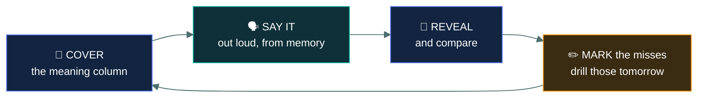

<div align="center">


# 🗂️&nbsp; 06 · Term Bank

### *Every definition the exam can ask you for.*

[](#-02--whats-here)
[](#-03--how-to-use-it)


</div>

---

## 👋 01 · Read this first

CC is a **definitional** exam. A large share of the paper is "which of these four words means
the thing I just described", and that is a recall problem rather than an understanding problem.

Recall is trained by **retrieval**, not by re-reading. Looking at a definition again feels
productive and teaches very little; covering it and trying to produce it from memory is what
makes it stick. Every file here is built for that: term on the left, meaning on the right, cover
one side and work down.

> 🎯 **Five minutes a day beats an hour a week.** Material revisited across many days sticks far
> better than the same total minutes in one block. Start the habit in week 2 and keep it to the
> end.

**The single highest-value file here is [`most-confused-pairs.md`](most-confused-pairs.md)** —
the terms the exam deliberately swaps. If you only drill one thing, drill that.

---

## 📂 02 · What's here

| File | Contains |
|---|---|
| ⚖️ [`most-confused-pairs.md`](most-confused-pairs.md) | **The pairs the exam swaps.** Highest value in the module |
| 🧭 [`domain-01-terms.md`](domain-01-terms.md) | Security Principles — CIA, AAA, risk, controls, governance, ethics |
| 🚨 [`domain-02-terms.md`](domain-02-terms.md) | BC, DR & Incident Response |
| 🚪 [`domain-03-terms.md`](domain-03-terms.md) | Access Control Concepts |
| 🌐 [`domain-04-terms.md`](domain-04-terms.md) | Network Security — including the port table |
| ⚙️ [`domain-05-terms.md`](domain-05-terms.md) | Security Operations |
| 🃏 [`flashcards.csv`](flashcards.csv) | **591 cards**, importable into Anki or any flashcard app |

---

## 🎯 03 · How to use it



**Four rules that make the difference:**

1. **Produce the answer before you look.** If you read the definition first, you have learned
   nothing — you have only recognised it.
2. **Say it out loud or write it.** Thinking "yes, I know that one" is not retrieval.
3. **Work only your misses.** Terms you get right twice in a row can be retired for a week.
4. **Go both directions.** Cover the meaning and name it; then cover the term and define it. The
   exam asks both ways.

**A weekly rhythm that works:**

| | |
|---|---|
| **Mon–Fri** | 5 minutes — one domain's terms, plus yesterday's misses |
| **Saturday** | 10 minutes — `most-confused-pairs.md`, all of it |
| **Sunday** | Rest, or a quick pass over the week's misses only |

> ⚠️ **Do not start this in week 1.** Drill terms for material you have already read; drilling
> definitions for concepts you have not met produces memorised strings with nothing attached to
> them.

---

## 🃏 04 · Flashcards

[`flashcards.csv`](flashcards.csv) holds **591 cards** as term, definition and domain tag —
importable into Anki, Quizlet or any flashcard application.

It is **generated** from the domain term files by [`ci/make-flashcards.sh`](../ci/make-flashcards.sh),
so the cards can never drift out of step with the pages. Re-run it after editing any term table:

```bash
./ci/make-flashcards.sh
```

Spaced repetition software does the "work only your misses" rule for you automatically, which is
its main advantage over the markdown files. Use whichever you will actually open daily; the
scheduling matters less than the habit.

---

## ⏭️ 05 · Where to go next

Term recall gets you the definition questions. For the scenario questions, work
[`07-question-bank/`](../07-question-bank/README.md), then measure with
[`08-mock-exams/`](../08-mock-exams/README.md).

---

<div align="center">
<sub><a href="../README.md">← back to the repo index</a></sub>
</div>
