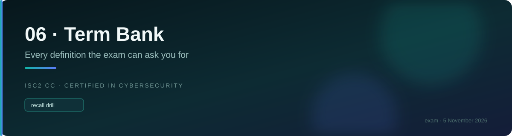

# ⚙️ Domain 5 terms · Security Operations and Incident Response

📌 *Broad but shallow, and now the home of incident response. The encryption/hashing terms and the incident phase order carry the most weight.*

---

## 🗄️ Data handling

| Term | Meaning |
|---|---|
| **Data at rest** | Stored — on disk, in a database, on a backup tape |
| **Data in transit** | Moving across a network. Also **data in motion** |
| **Data in use** | Loaded in memory, being processed. **The HARDEST to protect** |
| **Why in use is hard** | It must be **decrypted to be processed** — encryption cannot cover it |
| **Data lifecycle** | Create → store → use → share → archive → **destroy** |
| **When to classify** | **At creation** — every later decision depends on it |
| **Archived data** | **Still classified data.** Cheaper storage does not reduce sensitivity |
| **Retention** | How long data is kept before disposal |
| **Retention reality** | Keeping data past its period is a **LIABILITY**, not an asset |
| **Legal hold** | Suspends normal destruction for litigation or investigation |
| **Remanence** | Residual data remaining after an attempt to remove it |
| **Deleting** | Removes the **pointer** only. The data remains. **Not sanitisation** |
| **Clearing** | **Overwriting** so ordinary recovery fails. **Media reusable** |
| **Purging** | Degaussing or crypto-erase. **Resists laboratory recovery** |
| **Destruction** | Shredding, incineration, pulverising. **Media unusable** |
| **Degaussing** | Magnetic erasure. **Magnetic media ONLY — does nothing to an SSD** |
| **Crypto-shredding** | **Destroying the encryption key.** The answer for **cloud storage** |
| **SSD sanitisation** | Built-in secure erase, crypto-shredding, or physical destruction |

---

## 🏷️ Data classification

| Term | Meaning |
|---|---|
| **Data classification** | Categorising data by sensitivity so protection is proportionate |
| **What sets the level** | The **IMPACT** of disclosure, alteration or loss. Not volume, format or department |
| **Data owner** | **DECIDES** classification and access. A **BUSINESS** role. **ACCOUNTABLE** |
| **Data custodian** | **IMPLEMENTS** protection — storage, backups, permissions. Usually **IT**. **RESPONSIBLE** |
| **Data steward** | Responsible for data **quality and meaning** within a business area |
| **Data user** | Accesses the data and **follows the handling rules** |
| **Commercial scheme** | Public → Internal → Confidential → Restricted |
| **Government scheme** | Unclassified → Confidential → Secret → Top Secret |
| **How many levels** | **Fewer is better** — three or four. A scheme nobody applies correctly is useless |
| **Labelling** | Marking data with its classification |
| **Handling requirements** | What a classification obliges — storage, transmission, disposal |
| **Aggregation** | Low-sensitivity items combined becoming **more sensitive** |
| **The dataset rule** | Takes the level of its **most sensitive element**, or higher if aggregation raises it |
| **The label is a floor** | At least that protection; stronger is always fine |
| **Reclassification** | Changing a label as sensitivity changes. The **owner's** decision |
| **Declassification** | Lowering a classification when data is no longer sensitive |

---

## 🔐 Encryption

| Term | Meaning |
|---|---|
| **Plaintext** | The readable data before encryption |
| **Ciphertext** | The unreadable data after encryption |
| **Symmetric encryption** | **ONE shared key**, encrypts and decrypts. **FAST** |
| **Symmetric's weakness** | **KEY DISTRIBUTION** — getting the key to the other party safely |
| **Asymmetric encryption** | **A KEY PAIR** — public and private. **SLOW**. Solves key distribution |
| **AES** | The standard **symmetric** algorithm |
| **RSA** | A widely used **asymmetric** algorithm |
| **For confidentiality** | **Encrypt with the RECIPIENT'S PUBLIC key.** Only their private key decrypts |
| **For non-repudiation** | **Sign with YOUR OWN PRIVATE key.** Anyone verifies with your public key |
| **The rule** | **Public encrypts, private decrypts. Private signs, public verifies** |
| **Why** | **The private key does the thing only you should be able to do** |
| **Hybrid model** | **Asymmetric exchanges the session key; symmetric encrypts the traffic.** This is TLS |
| **Shared symmetric key** | Provides **NO non-repudiation** — either party could have produced it |
| **PKI** | The system of certificate authorities binding public keys to identities |
| **CA** | Certificate Authority — verifies identity and issues certificates |
| **Digital certificate** | Binds a public key to a **verified identity** |
| **CRL** | Certificate Revocation List — certificates revoked before expiry |
| **OCSP** | Real-time check of a single certificate's revocation status |
| **Kerckhoffs's principle** | Security rests on **KEY secrecy, never ALGORITHM secrecy** |
| **Security through obscurity** | Relying on a secret algorithm. **Always the wrong answer** |
| **Key length note** | **Not comparable across families** — 256-bit symmetric ≠ 256-bit asymmetric |

---

## #️⃣ Hashing

| Term | Meaning |
|---|---|
| **Hash function** | **ONE-WAY**, no key, **fixed-length** output from any input |
| **Hash / digest** | The output of a hash function |
| **Purpose** | **INTEGRITY** — and storing passwords |
| **Hashing vs encryption** | Encryption is **reversible with a key**. Hashing is **one-way with no key** |
| **Passwords** | **HASHED, NEVER ENCRYPTED.** Encryption's key would recover them all |
| **Deterministic** | The same input always produces the same hash |
| **Avalanche effect** | A tiny input change produces a **completely different** hash |
| **Collision** | Two **different** inputs producing the **same** hash. A weakness |
| **Collision resistance** | It should be infeasible to find two inputs with the same hash |
| **Hashing's control function** | **DETECTIVE** — it detects change, it does not prevent it |
| **Salt** | **Unique random data** added per password before hashing |
| **What salting defeats** | **RAINBOW TABLES** |
| **Salt secrecy** | It needs to be **unique**, not secret. Stored alongside the hash |
| **SHA-256 / SHA-2** | **Current standard** |
| **MD5** | **BROKEN** by collisions. Not for security |
| **SHA-1** | **BROKEN** by collisions. Deprecated |
| **Digital signature** | A **hash encrypted with the signer's private key** |
| **Signature provides** | **Integrity + authentication + non-repudiation** |
| **Signature does NOT provide** | **CONFIDENTIALITY.** A signed message is still readable |
| **Checksum** | Detects accidental corruption. Not cryptographically strong |
| **HMAC** | A hash combined with a secret key — integrity **and** authenticity |

---

## 🔩 Hardening and configuration

| Term | Meaning |
|---|---|
| **Hardening** | Reducing a system's **attack surface** by removing and securing |
| **Attack surface** | The total set of points where an attacker could attempt entry |
| **The order** | **Remove → Disable → Change defaults → Patch → Restrict** |
| **Least functionality** | Only the services and features the **SYSTEM** requires |
| **Least privilege** | Only the access the **PERSON** requires |
| **The key sentence** | **A service that is not running cannot be exploited** |
| **Default credentials** | Built-in usernames and passwords. **Publicly documented.** Change them |
| **Baseline** | The defined **minimum secure configuration** for a class of system |
| **Baseline's two jobs** | New systems are **built from it**; existing systems are **measured against it** |
| **Golden image** | A hardened, approved build template |
| **Configuration drift** | Systems **gradually diverging** from the baseline. Invisible — nothing breaks |
| **Patch management** | Identify → assess → **TEST** → deploy → verify |
| **Testing patches** | **Test before production.** Untested emergency rollouts cause outages |
| **Cannot patch** | **Segment it** — a **compensating control** |
| **Vulnerability scanning** | Automated, **known** issues, broad. **DETECTIVE** |
| **Penetration testing** | **Human**, active exploitation attempts, deep on fewer things |
| **Configuration management** | Establishing and maintaining the **known state** of systems |
| **Asset inventory** | What you have. **THE FIRST STEP in securing anything** |
| **Why inventory first** | **You cannot protect what you do not know you have** |
| **Shadow IT** | Systems and services in use **without IT's or security's knowledge** |
| **Change control** | Request → assess → approve → test → implement → verify **and document** |
| **Backout plan** | How to **reverse** a change. **Defined BEFORE approval** |
| **CAB** | Change Advisory Board — reviews and approves significant changes |
| **Emergency change** | **Accelerated approval + retrospective documentation.** Not an absent process |
| **Unauthorised change** | **No approval at all.** Not the same as an emergency change |
| **The incident question** | **"What changed?"** — the first question in every incident |

---

## 📊 Logging and monitoring

| Term | Meaning |
|---|---|
| **Logging** | **RECORDING** events |
| **Monitoring** | **LOOKING at** those records and noticing when something is wrong |
| **The gap** | **Logs nobody reviews detect NOTHING.** Both are **detective** controls |
| **Every log entry** | **WHO · WHAT · WHEN · WHERE · OUTCOME** |
| **Log failures too** | Failed logins reveal brute force and spraying. Attacks start as failures |
| **Never log** | **Passwords, card numbers, personal data.** Logs are copied and widely read |
| **Centralisation, reason 1** | **Correlation** across sources |
| **Centralisation, reason 2** | **Log integrity** — an attacker on the host cannot delete shipped evidence |
| **Log protection** | Protected from modification **including by administrators** |
| **SIEM** | **Centralises, correlates and ALERTS** on log data |
| **Time synchronisation** | **NTP.** A prerequisite for sequencing events across systems |
| **Ingress monitoring** | Traffic **entering** — attacks |
| **Egress monitoring** | Traffic **LEAVING** — **data exfiltration**, command and control |
| **DLP** | Data Loss Prevention — detects or blocks sensitive data leaving |
| **Alert fatigue** | Too many alerts, especially false positives → analysts dismiss them |
| **Alert fatigue remedy** | **Tune and prioritise.** Not more rules |

---

## 📜 Policies

| Term | Meaning |
|---|---|
| **The order** | **POLICY → TRAINING → TECHNICAL CONTROL → MONITORING** |
| **The BEST first step** | For an organisation-wide behaviour problem: **the policy** |
| **AUP** | Acceptable Use Policy — what you may do with **OUR** systems |
| **AUP's second job** | Establishes that **monitoring occurs** — which matters legally |
| **BYOD** | Governs **YOUR OWN device** used for work. A **policy** problem first |
| **BYOD tension** | Remote wipe destroys **personal** data too |
| **Containerisation** | Separating work data so it can be **wiped alone** |
| **MDM** | Mobile Device Management — the **technology** enforcing device policy |
| **Change management policy** | Requires changes to follow a controlled process |
| **Privacy policy** | How personal data is collected, used, shared and protected |
| **Password policy** | **Administrative.** The system setting enforcing it is **technical** |
| **Data retention policy** | How long each data type is kept |
| **Clean desk policy** | Sensitive material secured when unattended. The **physical session timeout** |
| **Every policy needs** | Management approval · scope · responsibilities · **consequences** · review · acknowledgement |
| **Unread policy** | **Not a control.** Communication and acknowledgement are part of it |

> Security **awareness training** terms (awareness vs. training vs. education, phishing
> simulations, security culture) now live in the [Domain 2 term bank](domain-02-terms.md) —
> awareness moved there under the live outline.

---

## 🎭 Masking, PQ crypto

| Term | Meaning |
|---|---|
| **Masking** | Hides part/all of a value while keeping data usable for viewing — not the same as encryption |
| **Masking vs encryption** | Masking is for **viewing without exposing**; encryption is for **later full recovery with a key** |
| **Quantum-resistant / post-quantum cryptography** | Algorithms designed to stay secure against a future **quantum computer** |
| **Harvest now, decrypt later** | Attacker captures ciphertext today, decrypts once quantum computing matures |
| **Cryptographic agility** | Ability to **swap algorithms** without a full system redesign |
| **Most urgent to protect** | Data needing **long-term confidentiality** — decades, not months |

---

## 🎯 Event triage and threat intelligence

| Term | Meaning |
|---|---|
| **Triage** | Sorting and prioritising alerts/incidents for response |
| **Prioritisation** | Ranking by **severity and confidence**, not just volume |
| **Correlation** | Linking related events into **one picture** — usually comes before prioritisation |
| **Threat actor types** | Nation-state/APT · organised crime · hacktivist · insider · script kiddie |
| **Highest capability actor** | **Nation-state / APT** — patient, funded, persistent |
| **CTI** | Cyber Threat Intelligence — analysed, actionable information about threats |
| **CTI levels** | **Strategic** (leadership) → **Operational** (campaigns) → **Tactical** (IOCs) |
| **IOC** | Indicator of Compromise — **one** observable piece of evidence, not the whole picture |
| **Threat framework** | A shared, structured vocabulary for attacker behaviour, e.g. **MITRE ATT&CK** |

---

## 🏷️ Incident terminology

| Term | Meaning |
|---|---|
| **Event** | Any **observable occurrence** in a system or network. **Neutral** — most are routine |
| **Alert** | A notification that an event **may** require attention. A claim, not a fact |
| **Adverse event** | An event with a negative consequence |
| **Incident** | An event that **actually or potentially** jeopardises C, I or A, or violates policy |
| **Breach** | An incident in which protected data was **actually** accessed, disclosed or taken |
| **Intrusion** | Unauthorised **access** to a system |
| **Compromise** | A system or account under unauthorised control |
| **Near miss** | A genuine threat that was prevented or failed, still worth learning from |
| **False positive** | An alert for something that was not a problem |
| **Escalation** | Raising an incident to higher authority or expertise |

---

## 🚑 Incident response

| Term | Meaning |
|---|---|
| **Incident response plan (IRP)** | The documented process for handling incidents |
| **CSIRT / CIRT** | Computer Security Incident Response Team |
| **Playbook** | A procedure for one specific incident type |
| **Phase 1 · Preparation** | Everything **before** an incident: plan, team, tools, training, exercises |
| **Phase 2 · Detection and analysis** | Identifying that an incident is occurring and determining its nature |
| **Phase 3 · Containment** | **Limiting the damage** and stopping the spread |
| **Phase 4 · Eradication** | **Removing the cause** — malware, attacker access, the vulnerability |
| **Phase 5 · Recovery** | **Restoring** systems to normal and verifying they are clean |
| **Phase 6 · Post-incident activity** | The **lessons-learned** review. Blameless. Feeds back into preparation |
| **IR exercise / tabletop** | Testing the IRP without a real incident — read-through, tabletop, simulation |
| **Short-term containment** | Immediate action — isolate a host, block an address, disable an account |
| **Long-term containment** | Temporary fixes allowing business to continue while a proper fix is prepared |
| **The first action** | **Follow the documented plan and notify.** Containment is a phase, not a first move |
| **Chain of custody** | An unbroken documented record of who handled evidence, when, and why |
| **Order of volatility** | Collect the **most perishable evidence first** — memory before disk |
| **Working copy** | Analyse a copy; preserve the original untouched |

---

## 📦 Asset lifecycle and EOL

| Term | Meaning |
|---|---|
| **Asset lifecycle** | Acquire → Deploy → Maintain → **EOL** → Retire/decommission |
| **EOL / EOS** | End-of-life / end-of-support — vendor **stops issuing security patches** |
| **EOL risk** | **Increases indefinitely** the longer the asset stays in service |
| **Can't retire on time** | Apply **compensating controls** — isolate, segment, monitor |
| **Decommissioning** | Formally retiring an asset, **including data sanitisation** |

---

## 🧪 Security testing

| Term | Meaning |
|---|---|
| **Red team** | Simulates a real attacker |
| **Blue team** | Detects and responds |
| **Purple team** | Red + blue **collaborate and share findings DURING** the exercise |
| **Vulnerability scanning** | Automated, checks against **known** vulnerabilities |
| **SAST** | Static analysis — reads **source code**, app not running |
| **DAST** | Dynamic analysis — tests a **running** app from the outside |
| **Threat modeling** | **Design-time** activity — the earliest of these, before code exists |
| **SAST vs DAST** | **SAST reads, DAST attacks** |

---

## 🏢 Physical penetration testing

| Term | Meaning |
|---|---|
| **Physical penetration testing** | Authorised, scoped attempts to bypass physical controls |
| **The three named techniques** | **Phishing, tailgating, impersonation** |
| **Tailgating** | Following **without** the authorised person's knowledge |
| **Piggybacking** | The same, **with** consent |
| **Impersonation** | Posing as someone with a legitimate reason to be present |
| **Rules of engagement** | Scope + proof of authorisation if a tester is challenged |

---

<a href="README.md">← back to 06 · Term Bank</a> &nbsp;·&nbsp; <a href="most-confused-pairs.md">The most confused pairs →</a>

