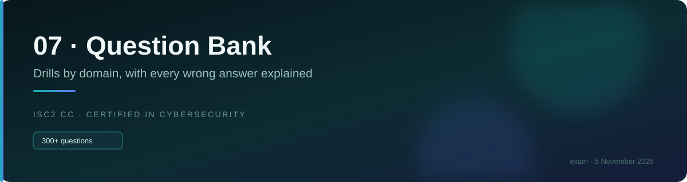
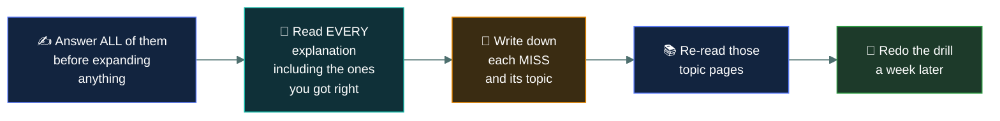

# ❓&nbsp; 07 · Question Bank

### *Drills by domain, with every wrong answer explained.*

---

## 👋 01 · Read this first

**You already have 265 practice questions.** Every one of the 53 topic pages ends with five, each
with all three distractors explained. Those are your first pass, taken as you read.

This module adds what the topic pages structurally cannot:

- **Domain drills** — questions mixed across a whole domain, so you cannot rely on knowing which
  topic you just read. Recall without the context cue is much harder, and much closer to the exam.
- **Mixed drills** — questions from **all five domains interleaved**, in exam order and
  proportion. This is the format the real paper uses, and the only way to practise switching
  between domains cold.

> 🎯 **The context cue is the thing being removed.** Answering a DAC question immediately after
> reading the DAC page proves very little. Answering it three weeks later, between a port-number
> question and a BIA question, proves you know it.

**Total available across the repo: 438 questions**, before the three mock exams.

---

## 📂 02 · What's here

| File | Questions | Use it |
|---|--:|---|
| 🧭 [`drill-domain-01.md`](drill-domain-01.md) | 22 | After finishing Domain 1 |
| 🚨 [`drill-domain-02.md`](drill-domain-02.md) | 20 | After finishing Domain 2 |
| 🚪 [`drill-domain-03.md`](drill-domain-03.md) | 20 | After finishing Domain 3 |
| 🌐 [`drill-domain-04.md`](drill-domain-04.md) | 25 | After finishing Domain 4 |
| ⚙️ [`drill-domain-05.md`](drill-domain-05.md) | 28 | After finishing Domain 5 |
| 🔀 [`mixed-drill-01.md`](mixed-drill-01.md) | 30 | Week 7, all domains interleaved |
| 🔀 [`mixed-drill-02.md`](mixed-drill-02.md) | 30 | Week 7, after reviewing drill 1 |

---

## 🎯 03 · How to work a drill

**Four rules:**

1. **Answer everything before expanding anything.** Peeking converts a test into a reading
   exercise, and reading teaches far less.
2. **Read the explanation even when you were right.** You may have been right for the wrong
   reason, and the distractor analysis is where most of the teaching is.
3. **Log your misses by topic**, not just by count. Six misses spread across six topics is a
   different problem from six misses all in access control models.
4. **Redo drills after a week.** A question you get right twice, a week apart, is learned.

> ⚠️ **These drills are open-book learning exercises, not measurements.** Take them untimed with
> notes available if you want. The **mock exams** in
> [`08-mock-exams/`](../08-mock-exams/README.md) are the measurement, and those are closed-book
> and timed.

---

## 📊 04 · What your misses mean

| Pattern | What it says | What to do |
|---|---|---|
| Misses spread evenly | Normal at this stage | Keep working; redo in a week |
| Misses clustered in one topic | A genuine gap | Re-read that page properly, then redo |
| Misses on **qualifier** words (FIRST, BEST, NOT) | A reading problem, not a knowledge one | Re-read `00-foundations/answering-technique/` |
| Misses where you chose the **operationally right** answer | The practitioner trap | Re-read `00-foundations/how-isc2-thinks/` |
| Misses on **told-apart pairs** | Terminology not yet solid | Drill `06-term-bank/most-confused-pairs.md` |

> 🎯 **The fourth row is the one to watch.** If your wrong answers are consistently the thing you
> would actually do at work, the problem is not knowledge — it is the answer-selection habit, and
> it is fixable in one reading.

---

## ⏭️ 05 · Where to go next

When the domain drills are comfortable and the mixed drills are scoring well, measure yourself
properly: [`08-mock-exams/`](../08-mock-exams/README.md). Three papers, full conditions, on the
schedule — not before.

---

<a href="../README.md">← back to the repo index</a>

