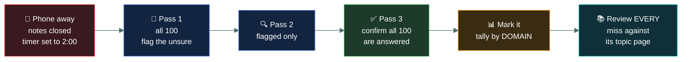

# 📝&nbsp; 08 · Mock Exams

### *Three full timed sets. You only get three.*

---

## 👋 01 · Read this first

**These are measurements, not learning exercises.** The question bank is where you learn; this is
where you find out whether it worked.

That difference dictates everything about how you use them:

| | Question bank | Mock exams |
|---|---|---|
| Conditions | Open book, untimed | **Closed book, 2 hours** |
| Explanations | Inline, after each question | **In a key at the end** |
| Purpose | Teaching | **Diagnosis** |
| Repeatable? | Yes, usefully | **No — once seen, the score is worthless** |

> [!CAUTION]
> **You have exactly three papers, and each one is single-use.** Once you have seen a question, it
> measures recall of that question rather than knowledge of the subject. Do not "just have a quick
> look" at one — that spends it.

**The papers are deliberately structured like the real exam:** 100 questions, exam-blueprint
proportions, no domain grouping, and **no answers visible while you work**. The key sits in a
collapsed section at the end.

---

## 📂 02 · The three papers

| Paper | Take it | Purpose |
|---|---|---|
| 📝 [`mock-01.md`](mock-01.md) | **End of week 5** (Sun 18 Oct) | **Diagnostic.** Expect a mediocre score; it exists to direct weeks 6–7 |
| 📝 [`mock-02.md`](mock-02.md) | **Week 7** (Fri 30 Oct) | **Progress check.** The real readiness signal |
| 📝 [`mock-03.md`](mock-03.md) | **Week 8** (Mon 2 Nov) | **Final calibration.** Confidence, not learning |
| 📊 [`scoring-guide.md`](scoring-guide.md) | After each | Converting a raw score into a realistic readiness reading |

Each paper draws in blueprint proportion: **26 from Domain 1, 24 from Domain 4, 22 from Domain 3,
18 from Domain 5, 10 from Domain 2.**

---

## 🎯 03 · How to sit one

**Non-negotiables if the score is to mean anything:**

1. **Two hours, one sitting.** No pausing, no coming back tomorrow.
2. **Nothing open.** No notes, no repo, no search. A mock taken with the material to hand
   measures nothing and burns a paper.
3. **Answer all 100.** There is no negative marking on the real exam, so a blank is a guaranteed
   zero. Guess, flag, move on.
4. **Do not scroll to the key.** Write your answers down separately, then mark in one pass.
5. **Review every miss**, and tally them **by domain** — not just the total.

> 🎯 **Write your answers on paper or in a separate file.** Working in the document itself makes it
> far too easy to catch a glimpse of the key.

---

## 📊 04 · Reading your score

Full detail in [`scoring-guide.md`](scoring-guide.md). The short version:

| Raw score | Reading |
|---|---|
| **85%+** | Comfortable. Maintain with light revision |
| **80–84%** | **On track.** This is the target before sitting the real exam |
| **75–79%** | Marginal. Close the gaps the breakdown shows |
| **70–74%** | Below the safety margin. Targeted work needed |
| **Below 70%** | Significant gaps. Re-read the weak domains properly |

> [!IMPORTANT]
> **Aim for 80%+, not 70%.** The pass is a **scaled** 700/1000, which is not 70% of questions, and
> most people score a few points lower under real proctoring than on a quiet desk at home. Treat
> 80% as the floor, not the ceiling.

---

## ⚠️ 05 · What a mock cannot tell you

Worth being honest about the limits:

- **These questions are not ISC2's.** They are written to the same blueprint in the same style, and
  they are not the real item bank. Any practice bank tends to be slightly kinder than the real
  thing.
- **A single score is noise.** Two papers a week apart, both at 80%+, is a signal. One paper at 81%
  is a data point.
- **A mock cannot measure exam-room nerves**, which cost most people a few points.

What a mock **can** tell you reliably is **where your gaps are by domain**, and that is the
information weeks 6 and 7 are built around.

---

## ⏭️ 06 · Where to go next

After Mock 3, stop taking papers. Move to [`../EXAM-DAY.md`](../EXAM-DAY.md) — the single page you
read on 3–4 November, and nothing else.

---

<a href="../README.md">← back to the repo index</a>

