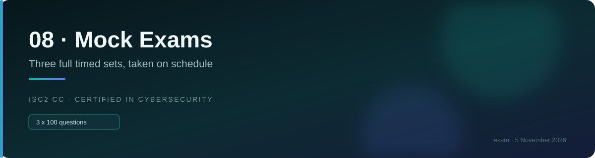

# 📝 Mock exam 2

### *Progress check · take in week 7 · the real readiness signal*

---

> [!CAUTION]
> **Closed book. Two hours. One sitting. Answers on a separate sheet.** Do not scroll to the key.
>
> This paper is **harder than Mock 1** — more scenarios, more qualifier words, and more options
> that are operationally right and textbook wrong. That is deliberate: this is the paper whose
> score you should trust.

**Blueprint proportion (rounded):** 24 × D1 · 17 × D2 · 20 × D3 · 21 × D4 · 18 × D5. Not grouped. Fixed-form practice, not a CAT simulation.

---

## The paper

**1.** A contractor is given access to an entire file share when they needed one folder. Which principle is violated?
A. Segregation of duties · B. Least privilege · C. Need to know only · D. Defence in depth

**2.** An IPS is running in detect-only mode. On this exam, how is an IPS described?
A. As detective, since it is only monitoring · B. As detecting and blocking · C. As identical to an IDS · D. As a firewall

**3.** Which BEST reduces the impact of a ransomware attack?
A. Email filtering · B. Tested offline backups · C. Awareness training · D. Endpoint detection

**4.** A user reports a phishing email instead of clicking it. Which IR phase is this?
A. Preparation · B. Detection and analysis · C. Containment · D. Post-incident

**5.** Which option can be eliminated on structural grounds alone?
A. Segmentation limits lateral movement · B. Antivirus completely prevents all infections · C. Training reduces phishing success · D. MFA reduces credential compromise risk

**6.** Access is granted if the user is in Finance, on a managed device, and within office hours. Which model?
A. RBAC · B. MAC · C. ABAC · D. DAC

**7.** An organisation's MTD is 4 hours and its RTO is 7 hours. What is the problem?
A. Nothing — there is margin · B. RTO exceeds MTD, so the plan fails by definition · C. The RPO is unspecified · D. The MTD should be raised

**8.** Which is TRUE of a shared service account with a vaulted password?
A. It is best practice on this exam · B. Shared credentials still undermine individual accountability · C. Vaulting removes the concern · D. It is required for automation

**9.** A report combines three Internal-classified fields and identifies individuals. How is it classified?
A. Internal · B. Public · C. Higher than Internal, due to aggregation · D. Unclassified

**10.** Which is the BEST first step when staff repeatedly email data to personal accounts?
A. Block webmail at the proxy · B. Establish a policy and train staff · C. Deploy DLP · D. Discipline offenders

**11.** Which protocol operates at OSI layer 6 on this exam?
A. TCP · B. IP · C. TLS · D. ARP

**12.** An asset worth $120,000 loses 25% per incident, occurring once every three years. What is the ALE?
A. $10,000 · B. $30,000 · C. $40,000 · D. $90,000

**13.** Which is TRUE of transferring risk via insurance?
A. The likelihood decreases · B. The financial impact moves; accountability does not · C. The risk is eliminated · D. The insurer becomes accountable

**14.** A privileged user deletes the logs recording their own actions. Which control would have prevented this?
A. Stronger passwords · B. Shipping logs to storage administrators cannot modify · C. More frequent backups · D. Session timeouts

**15.** Which is LEAST likely to be a correct answer?
A. Follow the documented incident response plan · B. Notify senior management · C. Immediately power off the affected server · D. Evacuate personnel

**16.** Which correctly distinguishes a BIA from a risk assessment?
A. A BIA identifies threats · B. A BIA assesses impact regardless of cause · C. They are identical · D. A risk assessment ignores likelihood

**17.** Which is TRUE of VLANs?
A. They match physical separation for isolation · B. They are logical and subject to VLAN hopping · C. They encrypt inter-segment traffic · D. They operate at layer 3

**18.** An organisation wants to detect an attacker already inside. Which is MOST likely to succeed?
A. Perimeter firewall rules · B. Egress monitoring · C. Antivirus updates · D. Password complexity

**19.** Which pairing is correct?
A. Background screening — technical, detective · B. Background screening — administrative, preventive · C. Encryption — administrative · D. CCTV — technical, preventive

**20.** A board of directors needs a periodic, non-technical summary of the security programme's status. What is the MOST appropriate format?
A. Direct dashboard access · B. A scorecard or report · C. Raw scan output · D. No reporting needed

**21.** A user holds Top Secret clearance. Which is correct?
A. They may access all Top Secret material · B. Clearance alone is insufficient; need to know applies · C. They may grant access at their discretion · D. Clearance overrides labels

**22.** Which is TRUE of an incremental backup?
A. It holds changes since the last full · B. It holds changes since the last backup of any type · C. Restore needs only the latest one · D. It is slower to create than a differential

**23.** An attacker floods a server with SYN packets and never completes the handshakes. What is affected?
A. Confidentiality · B. Integrity · C. Availability · D. Non-repudiation

**24.** Which is the MOST reliable sign an awareness programme is working?
A. 100% completion rates · B. A rising reporting rate · C. Fewer reported incidents · D. Positive feedback scores

**25.** Which is NOT one of the four risk treatments?
A. Accept · B. Eliminate · C. Mitigate · D. Transfer

**26.** A hospital's aggressive lockout policy leaves clinicians unable to log in during shifts. What has happened?
A. Confidentiality strengthened with no cost · B. Integrity compromised · C. A confidentiality control created an availability problem · D. Non-repudiation weakened

**27.** Which describes a reverse proxy?
A. It sits in front of clients · B. It sits in front of servers · C. It replaces a firewall · D. It operates at layer 2

**28.** Which best describes accountability?
A. Recording events · B. Tracing an action to a named individual · C. Proving identity · D. Granting permissions

**29.** A legacy device cannot be patched. Which response is expected?
A. Accept and continue as normal · B. Segment it with enhanced monitoring · C. Disable its logging · D. Grant it more privileges

**30.** Which is TRUE of DNSSEC?
A. It encrypts DNS queries · B. It provides authenticity and integrity of responses · C. It prevents DDoS · D. It speeds resolution

**31.** Which is the correct canon ranking when two conflict?
A. The later canon wins · B. The lower-numbered canon wins · C. They are equal · D. Canon 3 wins

**32.** An engineer captures a memory image before powering off a compromised host. Why?
A. Memory is easier to analyse · B. Memory contents are lost when power is removed · C. Disk evidence is inadmissible · D. To avoid alerting the attacker

**33.** Which is TRUE of a mirrored site?
A. Space and power only · B. Equipment without current data · C. Fully equipped with current data · D. A running duplicate, near-instant failover

**34.** A new starter is provisioned by cloning a ten-year colleague. What is the concern?
A. Nothing — it is efficient · B. It propagates accumulated privilege creep · C. It breaches SoD · D. It creates a dormant account

**35.** Which combination is genuinely MFA?
A. Two hardware tokens · B. Password and passphrase · C. PIN and authenticator app code · D. Fingerprint and palm scan

**36.** Which BEST describes the purpose of a baseline?
A. To inventory hardware · B. To define minimum secure configuration and measure systems against it · C. To document incident procedures · D. To set retention periods

**37.** Which is TRUE of split tunnelling?
A. It is more secure than full tunnelling · B. Non-corporate traffic bypasses corporate inspection · C. It uses stronger encryption · D. It requires a hot site

**38.** Under PaaS, who manages the operating system?
A. The customer · B. The provider · C. Shared · D. Neither

**39.** Which is a corrective control?
A. A warning sign · B. An access review · C. A fire suppression system · D. A biometric reader

**40.** A question asks which control would "identify" unauthorised changes. Which should you choose?
A. Preventive, since prevention is preferable · B. Detective, because the stem asks to identify · C. Corrective · D. Deterrent

**41.** Which is TRUE of pseudonymised data?
A. It is no longer personal data · B. It remains personal data because the process is reversible · C. It is encrypted · D. It is aggregated

**42.** An organisation has three controls all authenticating against one directory. What is the flaw?
A. None — three layers is depth · B. A common mode failure defeats all three at once · C. Directories are insecure · D. Three is too few

**43.** Which is TRUE of the data owner?
A. They implement encryption and backups · B. They classify the data and approve access · C. They are always from IT · D. They manage data quality

**44.** Which sequence correctly describes the risk management lifecycle?
A. Treat, Identify, Assess, Monitor · B. Identify, Assess, Treat, Monitor · C. Assess, Treat, Identify, Monitor · D. Monitor, Identify, Treat, Assess

**45.** Which describes long-term containment?
A. Immediately isolating a host · B. Temporary fixes allowing business to continue while a proper fix is prepared · C. Removing the malware · D. Restoring from backup

**46.** A GRC tool is BEST described as which of the following?
A. A firewall configuration system · B. Software centrally tracking controls, risks, policies and evidence · C. A mandatory single framework · D. An automated risk-treatment engine

**47.** Which port pairing is INCORRECT?
A. SSH — 22 · B. DNS — 53 · C. LDAPS — 389 · D. RDP — 3389

**48.** Which is TRUE of an access review?
A. It prevents inappropriate grants · B. It detects access that already exists inappropriately · C. IT should perform it · D. It is optional

**49.** Which is the expected answer to "what comes first in business continuity planning"?
A. Selecting a recovery site · B. Conducting a BIA · C. Writing the DR plan · D. Buying backup hardware

**50.** A signed but unencrypted document provides:
A. Confidentiality only · B. Integrity, authentication and non-repudiation · C. Confidentiality and integrity · D. Availability

**51.** Which is TRUE of MTTR?
A. It is a recovery objective set by the business · B. It measures average repair time — maintainability · C. It equals RTO · D. It measures data loss

**52.** An employee is dismissed for misconduct. When is access removed?
A. End of notice period · B. Within 30 days · C. Before or at notification · D. After the exit interview

**53.** Which is TRUE of a bastion host?
A. It is a hardened, deliberately exposed host · B. It is a backup server · C. It is a database server · D. It is a router

**54.** Which BEST describes zero trust?
A. Employees are not trusted · B. No trust is granted based on network location · C. A product that replaces VPNs · D. Perimeter firewalls are removed

**55.** An organisation collects dates of birth "in case they are useful". Which principle does this breach?
A. Data minimisation · B. Confidentiality · C. Integrity · D. Accountability

**56.** Which is TRUE of a compensating control?
A. It adds a layer for depth · B. It substitutes where the primary control is infeasible · C. It restores after an incident · D. It discourages attempts

**57.** Which correctly describes sensitivity versus criticality?
A. Sensitivity concerns availability · B. Sensitivity concerns disclosure; criticality concerns loss of access · C. They are identical · D. Criticality concerns disclosure

**58.** An analyst chooses to contain before notifying. What is the exam's objection?
A. Containment is ineffective · B. The plan and notification come first · C. Containment destroys evidence always · D. Only managers may contain

**59.** Which provides the strongest workload isolation?
A. Containers · B. Virtual machines · C. Both equally · D. Namespaces

**60.** A company reviews a target's incident history and patch practices before an acquisition. What does this represent?
A. Due care · B. Due diligence · C. Negligence · D. Risk transfer

**61.** Which is TRUE of the avalanche effect?
A. Hashes grow with input size · B. A small input change produces a completely different hash · C. Two inputs produce one hash · D. Hashes can be reversed

**62.** Which BEST reduces the risk of a rogue DHCP server?
A. Stronger Wi-Fi encryption · B. DHCP snooping on switches · C. Longer DHCP leases · D. Static DNS entries

**63.** Which is TRUE of a policy?
A. It contains numbered steps · B. It states what and why, technology-neutral, and is mandatory · C. It is optional guidance · D. It specifies key lengths

**64.** An organisation must prove an individual approved a transaction to a regulator. Which is BEST?
A. An audit log entry · B. A digital signature with that person's private key · C. Encryption of the record · D. A shared approval account

**65.** Which is TRUE of WRT?
A. It ends when systems are restored · B. It is the work catch-up period after systems are back · C. It equals RPO · D. It is a hardware metric

**66.** Which of the following is a named example of a standards/framework body under Domain 1's governance sub-area?
A. CIS · B. SAST · C. RTO · D. VLAN

**67.** An employee holds a door open for someone they believe is a colleague, who is unauthorised. What is this?
A. Tailgating · B. Piggybacking · C. Pretexting · D. Baiting

**68.** Which is TRUE of the reference monitor?
A. It may be bypassed for performance · B. It must be always invoked, tamper-proof and verifiable · C. It is a physical device · D. It replaces authentication

**69.** Which cloud responsibility is the customer's in every model?
A. Physical security · B. Hypervisor patching · C. Data and access permissions · D. Network hardware

**70.** Which is TRUE of a parallel test?
A. Production is switched off · B. Recovery systems are brought up while production keeps running · C. It is a paper exercise · D. It is the least rigorous test

**71.** Which describes configuration drift?
A. A single unauthorised change · B. Gradual divergence from the baseline · C. A failed patch · D. A hardware failure

**72.** Which is TRUE of an event?
A. Every event is an incident · B. An event is any observable occurrence and is neutral · C. Events require disclosure · D. Events are always malicious

**73.** Which is the correct order of physical security rings, outside in?
A. Room, building, perimeter · B. Perimeter, building, zone, room, cabinet · C. Cabinet, room, building · D. Building, perimeter, room

**74.** Which BEST describes dual control?
A. Different steps performed by different people · B. Two people required for the same single action · C. Two separate approvals in sequence · D. Job rotation

**75.** A control reduces likelihood rather than impact. Which is it?
A. Backups · B. Redundant servers · C. Multi-factor authentication · D. An incident response plan

**76.** Which is TRUE of the private 172 range?
A. All of 172.x.x.x is private · B. 172.16 to 172.31 only · C. 172.0 to 172.16 · D. 172.32 to 172.64

**77.** Which describes the correct use of keys for confidentiality?
A. Sign with your private key · B. Encrypt with the recipient's public key · C. Encrypt with your public key · D. Use a shared symmetric key sent alongside

**78.** Which is TRUE of a clean desk policy?
A. It defends against network intrusion · B. It defends against unauthorised viewing of unattended material · C. It prevents malware · D. It is a technical control

**79.** An organisation's only BCP copy is on the corporate file server. What is the flaw?
A. File servers are insecure · B. The plan is unavailable in the scenario it was written for · C. It should be printed for legal reasons · D. Nothing, if backed up

**80.** Which is TRUE of role explosion?
A. Too many users · B. Roles proliferating until there are nearly as many roles as users · C. An attack on RBAC · D. A benefit of RBAC

**81.** Which is TRUE of the ISC2 Code when an employer requests an illegal act?
A. Comply, as the employer is the principal · B. Refuse — Canon 2 requires acting legally · C. Comply but document it · D. Comply with written authorisation

**82.** Which is TRUE of anomaly-based detection?
A. It produces fewer false positives · B. It can detect previously unknown attacks · C. It needs no baseline · D. It only matches signatures

**83.** Which BEST describes the relationship between governance and compliance?
A. They are the same activity · B. Governance sets direction; compliance verifies it is followed · C. Compliance sets direction; governance verifies it · D. They are unrelated

**84.** Which is TRUE of data in transit?
A. It is protected by full-disk encryption · B. It is protected by TLS or a VPN · C. It cannot be protected · D. It is the hardest state to protect

**85.** Which is TRUE of a service account?
A. It should permit interactive logon · B. It should be scoped to minimum privilege and have rotated credentials · C. It should be shared among administrators · D. It should hold domain admin rights

**86.** Which is TRUE of the incident-versus-breach distinction?
A. They are synonymous · B. A breach requires data to have actually been disclosed · C. Every incident is a breach · D. Breaches are always deliberate

**87.** Which BEST describes due care?
A. Investigating the risks · B. Taking the action a reasonable person would take · C. Documenting the risk register · D. Buying insurance

**88.** Which is TRUE of a mantrap?
A. It detects intrusions · B. It permits one person through per authorisation · C. It records footage · D. It deters only

**89.** Which is TRUE of the OSI placement of ARP?
A. Layer 3, because it uses IP addresses · B. Layer 2, because it enables local frame delivery · C. Layer 4 · D. Layer 7

**90.** Which is TRUE of a break-glass account?
A. It should be used routinely · B. Its use should trigger an alert and be reviewed · C. It should have ordinary controls · D. It should be shared widely

**91.** Which BEST describes purging?
A. Deleting the file pointer · B. Overwriting so ordinary recovery fails · C. Degaussing or crypto-erase, resisting laboratory recovery · D. Physical shredding

**92.** Which is TRUE of alert fatigue?
A. It results from too few alerts · B. Analysts become desensitised by volume and false positives · C. It is fixed by adding rules · D. It affects only junior staff

**93.** Which is TRUE of the relationship between BC and DR?
A. DR contains BC · B. BC is broader; DR is a subset focused on systems · C. They are unrelated · D. They are identical

**94.** Which is TRUE of an SLA?
A. It is a statement of intent · B. It specifies measurable service levels with remedies · C. It protects confidential information · D. It defines specific work packages

**95.** Which is the expected answer for securing a wireless network?
A. Hide the SSID · B. MAC address filtering · C. WPA3 with a strong passphrase · D. Reduce transmitter power

**96.** Which is TRUE of quantitative risk assessment?
A. It uses descriptive categories · B. It produces monetary figures and needs data · C. It handles intangibles best · D. It is always more accurate

**97.** Which is TRUE of an evil twin attack?
A. Any unauthorised access point · B. A rogue AP impersonating a legitimate SSID · C. A cloned badge · D. A duplicate DHCP server

**98.** Which is TRUE of the AUP?
A. It governs personally owned devices · B. It governs use of the organisation's systems and establishes that monitoring occurs · C. It sets retention periods · D. It is optional

**99.** Which is TRUE of a hot site versus a warm site?
A. A hot site has no equipment · B. A hot site keeps data current; a warm site restores it on demand · C. A warm site is faster · D. They are identical

**100.** An organisation discovers its cloud storage bucket was publicly readable for two months. Whose responsibility was the configuration?
A. The provider's · B. The customer's, under the shared responsibility model · C. Shared equally · D. The provider's, absent a warning

---

## ⏹️ Stop

Time up. **Confirm all 100 are answered** before marking.

---

<h2>📋 Answer key — do not open until you have finished</h2>

| # | Ans | Domain | Why |
|--:|:--:|:--:|---|
| 1 | **B** | D3 | More access than the role requires |
| 2 | **B** | D4 | Answer the simplified model: **IPS blocks** |
| 3 | **B** | D1 | Backups reduce **impact**; the others reduce likelihood |
| 4 | **B** | D5 | User reports are a primary detection source |
| 5 | **B** | Fnd | "Completely prevents all" — two absolutes |
| 6 | **C** | D3 | Several dissimilar attributes together |
| 7 | **B** | D2 | **RTO ≤ MTD** |
| 8 | **B** | D3 | Shared credentials destroy attribution |
| 9 | **C** | D5 | Aggregation raises the level |
| 10 | **B** | D5 | Policy → training → technology |
| 11 | **C** | D4 | TLS is layer 6, Presentation, on this exam |
| 12 | **A** | D1 | SLE = 120,000 × 0.25 = 30,000; ARO = 0.333; ALE ≈ **10,000** |
| 13 | **B** | D1 | Transfer moves money, never accountability or likelihood |
| 14 | **B** | D3 | Logs must sit beyond privileged reach |
| 15 | **C** | Fnd | The technical action is never the exam's **first** move |
| 16 | **B** | D2 | The BIA is **cause-agnostic** |
| 17 | **B** | D4 | Logical only — weaker than physical separation |
| 18 | **B** | D5 | Egress finds what ingress missed |
| 19 | **B** | D1 | Administrative type, preventive function |
| 20 | **B** | D2 | Scorecard/report matches a periodic, leadership audience |
| 21 | **B** | D3 | Clearance sets a ceiling, not an entitlement |
| 22 | **B** | D2 | Since the last backup of **any** type |
| 23 | **C** | D4 | A SYN flood denies service |
| 24 | **B** | D2 | Reporting rate, not completion or click rate |
| 25 | **B** | D1 | The four are accept, avoid, mitigate, transfer |
| 26 | **C** | D1 | The triad in tension |
| 27 | **B** | D4 | Reverse faces **servers**; forward faces clients |
| 28 | **B** | D3 | Accounting records; accountability traces to a person |
| 29 | **B** | D5 | Compensating control |
| 30 | **B** | D4 | It **signs**; it does not encrypt |
| 31 | **B** | D1 | The order is the ranking |
| 32 | **B** | D5 | Order of volatility |
| 33 | **D** | D2 | Running duplicate, near-instant |
| 34 | **B** | D3 | Cloning propagates creep |
| 35 | **C** | D1 | know + have. A is have+have; B know+know; D are+are |
| 36 | **B** | D5 | Build from it **and** measure against it |
| 37 | **B** | D4 | Which is why full tunnelling is more secure |
| 38 | **B** | D4 | Under PaaS the provider manages OS and runtime |
| 39 | **C** | D1 | It limits damage after ignition |
| 40 | **B** | Fnd | Answer what the stem asks for |
| 41 | **B** | D1 | Reversible, so still personal data |
| 42 | **B** | D3 | One event defeats all three |
| 43 | **B** | D5 | Owner decides; custodian implements |
| 44 | **B** | D1 | Identify, Assess, Treat, Monitor — then back to Identify |
| 45 | **B** | D2 | Temporary fixes sustaining business |
| 46 | **B** | D2 | Centrally tracks controls, risks, policies, evidence |
| 47 | **C** | D4 | LDAPS is **636**; 389 is LDAP |
| 48 | **B** | D3 | Detective, performed by the manager or data owner |
| 49 | **B** | D2 | The BIA comes first |
| 50 | **B** | D5 | **Not** confidentiality — it remains readable |
| 51 | **B** | D2 | A hardware metric, not a recovery objective |
| 52 | **C** | D3 | The risk window opens at notification |
| 53 | **A** | D4 | Hardened and deliberately exposed |
| 54 | **B** | D4 | Location earns no trust — not distrust of people |
| 55 | **A** | D1 | "In case it's useful" is not a purpose |
| 56 | **B** | D1 | Substitution, not addition |
| 57 | **B** | D1 | Disclosure vs loss of access |
| 58 | **B** | D5 | Containment is a phase, not a first move |
| 59 | **B** | D4 | Each VM runs its own kernel |
| 60 | **B** | D1 | Investigation performed before a decision is finalised |
| 61 | **B** | D5 | Which is what makes hashing useful for integrity |
| 62 | **B** | D4 | DHCP snooping is the specific defence |
| 63 | **B** | D1 | Numbers mean standard; steps mean procedure |
| 64 | **B** | D1 | Only they hold the private key |
| 65 | **B** | D2 | RTO + WRT must fit inside MTD |
| 66 | **A** | D1 | CIS publishes the CIS Controls and Benchmarks |
| 67 | **B** | D3 | Piggy**b**acking has **p**ermission |
| 68 | **B** | D3 | Always invoked is the critical property |
| 69 | **C** | D4 | Data and access in **every** model |
| 70 | **B** | D2 | Production keeps running |
| 71 | **B** | D5 | Gradual and cumulative — invisible because nothing breaks |
| 72 | **B** | D2 | Events are neutral; most are routine |
| 73 | **B** | D3 | Perimeter → building → zone → room → cabinet |
| 74 | **B** | D3 | Same action, two people. SoD splits steps |
| 75 | **C** | D1 | MFA reduces likelihood; A, B and D reduce impact |
| 76 | **B** | D4 | 172.15 and 172.32 are **public** |
| 77 | **B** | D5 | Public encrypts, private decrypts |
| 78 | **B** | D3 | The physical counterpart of session timeout |
| 79 | **B** | D2 | Keep offline and off-site copies |
| 80 | **B** | D3 | A failure of role design |
| 81 | **B** | D1 | "Following orders" is never the answer |
| 82 | **B** | D4 | The only method that catches a zero-day |
| 83 | **B** | D2 | Governance sets direction; compliance verifies it |
| 84 | **B** | D5 | In transit → TLS/VPN. **In use** is the hardest state |
| 85 | **B** | D3 | Scope, rotate, deny interactive logon |
| 86 | **B** | D5 | Ransomware encryption is an incident, not a breach |
| 87 | **B** | D1 | Diligence is the research; care is the action |
| 88 | **B** | D3 | The specific answer to tailgating |
| 89 | **B** | D4 | Layer 2 — the most-missed placement |
| 90 | **B** | D3 | A monitored emergency exception |
| 91 | **C** | D5 | A is deleting, B is clearing, D is destruction |
| 92 | **B** | D5 | Remedy is tuning and prioritising |
| 93 | **B** | D2 | DR is a subset of BC |
| 94 | **B** | D4 | Binding, measurable, with remedies |
| 95 | **C** | D4 | The others are obscurity, not security |
| 96 | **B** | D1 | Qualitative handles intangibles |
| 97 | **B** | D4 | Impersonating a legitimate SSID |
| 98 | **B** | D5 | And the monitoring notice matters legally |
| 99 | **B** | D2 | Data currency is the difference |
| 100 | **B** | D4 | Configuration and data are the customer's in every model |

---

## 📊 Mark it, then decide

Tally by domain and categorise every miss. Then read the go/no-go section of
[`scoring-guide.md`](scoring-guide.md).

> [!IMPORTANT]
> **This is the paper whose score you should trust.** 80%+ means you are on track. Below 75% means
> week 8 is targeted repair — and if you are going to reschedule, **decide by the end of week 6**.

---

<a href="README.md">← back to 08 · Mock Exams</a> &nbsp;·&nbsp; <a href="mock-03.md">Mock 3 (week 8) →</a>

