# 📊 Scoring guide

### *Turning a raw mock score into a realistic readiness reading*

📌 *A raw percentage is not a scaled score, and one paper is not a trend. This page says what your number actually means.*

---

## 🎯 The target

**Aim for 80%+, consistently, across two different papers.**

Not 70%. Three reasons, and all three are real:

| Reason | Effect |
|---|---|
| **700/1000 is a scaled score** | It is **not** "70% of questions right". The raw percentage behind a 700 moves with form difficulty and is not published |
| **Exam-room degradation** | Almost everyone performs a few points below their quiet-desk practice score under proctoring |
| **Practice-bank flattery** | Any practice bank — including this one — tends to be slightly kinder than the real item bank |

**80% gives you a margin against all three.** 72% gives you a margin against none of them.

---

## 📋 Marking a paper

1. **Mark it in one pass**, from your separate answer sheet.
2. **Record the raw score** — correct out of 100.
3. **Tally misses by domain**, using the domain tag on each answer.
4. **Categorise every miss** into one of the four types below.

### The four miss types

**Each type needs a completely different fix**, which is why the count alone is almost useless:

| Type | Means | Fix |
|---|---|---|
| **1 · Didn't know** | A genuine knowledge gap | Re-read that topic page properly |
| **2 · Misread the qualifier** | A **reading** problem, not a knowledge one | Re-read `00-foundations/answering-technique/` |
| **3 · Practitioner answer** | You chose what you would actually do | Re-read `00-foundations/how-isc2-thinks/` |
| **4 · Confused pair** | Terminology not yet solid | Drill `06-term-bank/most-confused-pairs.md` |

> 🎯 **Types 2 and 3 are the cheapest marks in the whole exam to recover.** They require no new
> knowledge — only one reading and a change of habit. If half your misses are types 2 and 3, your
> effective score is much closer to ready than the number suggests.

---

## 📐 Reading the raw score

| Raw | Reading | What to do |
|---|---|---|
| **90–100** | Very comfortable | Light maintenance. Do not over-prepare |
| **85–89** | Comfortable | Maintain; fix any single weak domain |
| **80–84** | **On track — the target** | Review misses; keep the term drill going |
| **75–79** | **Marginal** | Close the domain gaps the breakdown shows |
| **70–74** | Below the safety margin | Targeted re-reading of the two weakest domains |
| **60–69** | Significant gaps | Re-read weak domains fully, then re-drill |
| **Below 60** | Not ready | Work the material properly before another paper |

---

## 🔍 Reading the domain breakdown

The breakdown matters more than the total. Work out your **percentage within each domain**, not
the raw count — 6 misses out of 24 in Domain 1 is better than 6 out of 17 in Domain 2.

| Pattern | Diagnosis | Priority |
|---|---|---|
| Even misses, 80%+ total | Normal and healthy | Light review |
| One domain far below the rest | A genuine gap | **Re-read that domain** before anything else |
| Weak in Domain 1 | Serious — its vocabulary appears in every other domain's questions | **Highest priority** |
| Weak in Domain 4 | Check whether misses were practitioner answers | Read the domain for **phrasing** |
| Weak in Domain 2 | GRC/awareness/metrics are new — usually a coverage gap, not depth | Re-read Domain 2 in full |
| Weak in Domain 3 | Usually the four models | Drill `dac-mac-rbac-abac/` |
| Strong everywhere except 80% total | Likely qualifier misreads | `answering-technique/` |

> ⚠️ **A weak Domain 1 costs more than its 24% suggests.** Its terms — risk, control, CIA, data
> owner — appear inside questions belonging to every other domain. Fix it first.

---

## 📈 Tracking across the three papers

Keep a simple record:

| | Raw | D1 /24 | D2 /17 | D3 /20 | D4 /21 | D5 /18 | Type 1 | Type 2 | Type 3 | Type 4 |
|---|--:|--:|--:|--:|--:|--:|--:|--:|--:|--:|
| **Mock 1** | | | | | | | | | | |
| **Mock 2** | | | | | | | | | | |
| **Mock 3** | | | | | | | | | | |

**What the trend tells you:**

| Trend | Reading |
|---|---|
| Rising, ending 80%+ | On track. Sit the exam |
| Flat in the 70s | Re-reading is not working — switch to **retrieval** (drills, term bank) |
| Rising but ending below 75% | Consider whether the date is right; decide by end of week 6 |
| Falling | Almost always fatigue. Take two days off, then reassess |

---

## 🚦 The go / no-go decision

> [!IMPORTANT]
> **If you are going to reschedule, decide by the end of week 6.** Pearson VUE reschedules are
> possible outside a short window before the appointment, usually for a fee. Deciding in week 8
> gets you the worst of both: the fee **and** the panic.

**And the honest counter-point:** a failed attempt is not a catastrophe. There is a waiting period
and a retake, and the score report gives domain-level feedback that makes a second attempt much
better targeted. Sitting at 78% and failing costs you a delay and a fee; postponing at 78% costs
you eight more weeks of study you may not have needed.

---

## ❌ Four ways to waste a mock

| Mistake | Why it ruins the measurement |
|---|---|
| **Taking it open-book** | Measures your ability to look things up, which you cannot do on the day |
| **Splitting it across sessions** | Removes the fatigue and time pressure the paper exists to simulate |
| **Retaking a paper you have seen** | Measures recall of those questions, not knowledge of the subject |
| **Marking without reviewing** | Throws away the entire diagnostic value — the score is the least useful output |

> 🎯 **The score is the least informative part of a mock.** The domain breakdown and the miss
> types are what change what you do next.

---

<a href="README.md">← back to 08 · Mock Exams</a>

