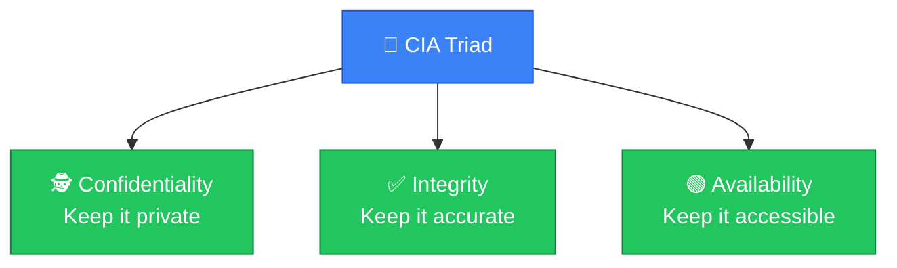
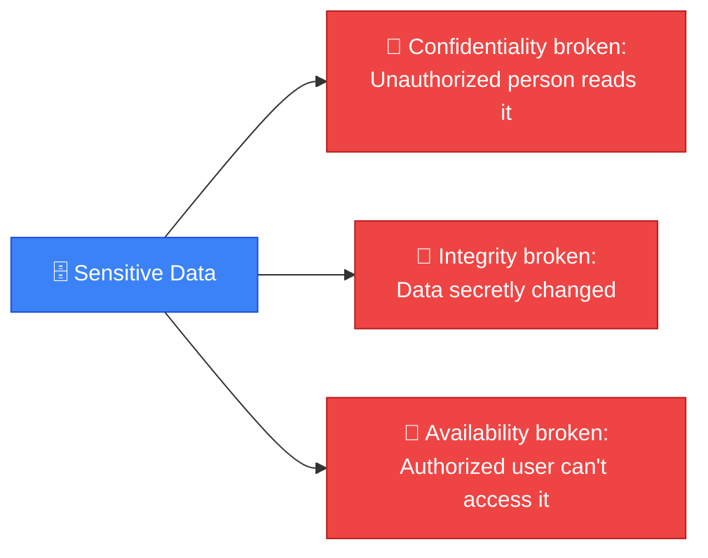
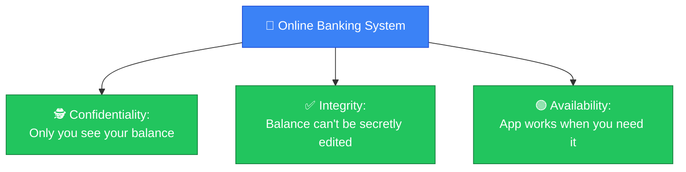
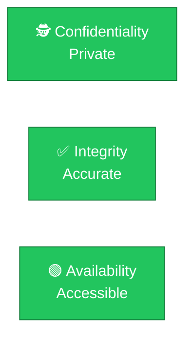

# 🔐 CIA Triad

**Section:** Core Security Concepts &nbsp;·&nbsp; **Topic:** 11 of 130 &nbsp;·&nbsp; **Level:** 🟢 Beginner

## 📖 First, a Quick Story

Think about a bank locker. A good locker system needs to do three things at the same time: only the right person should be able to open it (nobody else can see what's inside), nobody should be able to secretly change what's inside without permission, and the owner should be able to access their own locker whenever they genuinely need to.

If any one of these three fails — a stranger can open it, someone tampers with the contents unnoticed, or the owner can never get to their own locker when needed — the whole system has failed at its job, even if the other two are working fine.

This is exactly the idea behind the **CIA Triad**, the foundation of almost all security thinking: Confidentiality, Integrity, and Availability.

## 🧠 What Is It?

The **CIA Triad** is a simple framework made of three goals that security is built to protect:

- **Confidentiality** — keeping information private, so only authorized people can see it.
- **Integrity** — keeping information accurate and unaltered, so it cannot be secretly changed.
- **Availability** — keeping information and systems accessible to the people who are authorized to use them, when they need it.

"CIA" here has nothing to do with any intelligence agency — it is simply an acronym for these three words.

## 🎯 Why Does It Exist?

Before you can decide how to protect something, you need to agree on *what* "being secure" actually means. Without a clear definition, security efforts can become unfocused — protecting against the wrong things, or focusing entirely on one concern while ignoring others.

The CIA Triad exists to give security a clear, shared definition. Almost every security control, tool, or decision exists to support at least one of these three goals. When evaluating any security measure, you can ask: which of these three is it protecting, and is it protecting it well?

## ⚙️ How Does It Work?

Each of the three goals addresses a different kind of failure:

1. **Confidentiality** fails when unauthorized people can see information they should not — for example, a stranger reading someone else's private messages.
2. **Integrity** fails when information is changed without authorization, whether by accident or on purpose — for example, someone secretly altering a bank balance in a database.
3. **Availability** fails when authorized people cannot access information or a system when they legitimately need to — for example, a website being knocked offline so real customers cannot use it.

Good security usually requires balancing all three. Focusing entirely on one can sometimes weaken another — for example, locking a system down so heavily for confidentiality that legitimate users can no longer access it, which would hurt availability instead.

What it looks like when one part of the triad fails:

## 🧩 Important Parts

| Term | Meaning |
|---|---|
| 🕵️ Confidentiality | Only authorized people can view specific information |
| ✅ Integrity | Information stays accurate and is not altered without authorization |
| 🟢 Availability | Authorized people can access information/systems when needed |
| 🔐 Security control | Any tool, process, or safeguard put in place to support one or more of these three goals |

## 💡 Simple Example

Consider an online banking system:

- **Confidentiality**: Your account balance and transaction history should only be visible to you (and authorized bank staff), not to other customers or outsiders.
- **Integrity**: If you have $500 in your account, that number should stay accurate until a legitimate transaction changes it — no one should be able to quietly edit it to a different value.
- **Availability**: When you want to check your balance or transfer money, the banking app or website should be up and working, not crashed or unreachable.

If an attacker steals your login and views your balance, that is a confidentiality failure. If someone secretly changes your balance in the database, that is an integrity failure. If the bank's servers go down during a DDoS attack (covered in a later topic) and you cannot check your account at all, that is an availability failure.

## 🔍 How It Looks in Real Life

- Encrypting a file so only authorized people can read it protects **confidentiality**.
- Using checksums or digital signatures to detect if a file has been tampered with protects **integrity**.
- Having backup servers ready in case one server crashes protects **availability**.
- Most security tools and later topics in this path — encryption, access control, firewalls, backups — map back to protecting one or more parts of this triad.

## ⚠️ Common Confusion

- ❌ **"CIA Triad refers to a government agency."**
  In security, CIA is simply an acronym for Confidentiality, Integrity, and Availability. It has no connection to any intelligence organization.

- ❌ **"The three parts of the triad are equally important in every situation."**
  Depending on the system, one goal might matter more than the others. For example, a public news website may prioritize availability (it needs to stay online and reachable) over strict confidentiality (its content is meant to be public anyway). A hospital's patient records system, on the other hand, may prioritize confidentiality very heavily. The right balance depends on what is being protected.

- ❌ **"Protecting confidentiality automatically protects integrity and availability too."**
  These are three separate goals. A system can keep information perfectly private (confidential) while still allowing it to be silently corrupted (an integrity failure), or while being completely offline (an availability failure). Each goal needs its own attention.

## 🛠️ Practical Example

Think about a simple company file server storing employee records:

- **Confidentiality** is enforced through login permissions — only HR staff can open the salary files.
- **Integrity** is enforced through file permissions and audit logs — regular employees cannot edit HR's records, and any changes are tracked.
- **Availability** is enforced through backups and reliable servers — if the main server fails, employee records are still accessible from a backup.

Each of these is a different kind of protection, addressing a different one of the three goals, even though they're all protecting the same set of files.

## 🧪 Quick Check

**1. What does the CIA Triad stand for in security?**

Answer
Confidentiality, Integrity, and Availability.

**2. If an attacker changes the price of a product in a company's database without permission, which part of the CIA Triad has been violated?**

Answer
Integrity — the data was altered without authorization.

**3. If a website is taken offline by an attack and real customers cannot use it, which part of the CIA Triad has been violated?**

Answer
Availability — authorized users cannot access the system when they need to.

**4. True or False: All three parts of the CIA Triad are always equally important for every system.**

Answer
False. The right balance depends on the system — some systems prioritize confidentiality more, others prioritize availability more, depending on what they are protecting.

**5. Why is it useful to have a shared framework like the CIA Triad before deciding how to secure something?**

Answer
Because it gives a clear, shared definition of what "being secure" actually means, so security efforts can be evaluated against specific goals instead of being vague or unfocused.

## 🧠 Remember This

- The CIA Triad defines three core goals of security: Confidentiality, Integrity, and Availability.
- Confidentiality means only authorized people can see information.
- Integrity means information stays accurate and unaltered without authorization.
- Availability means authorized people can access systems and data when they need to.
- Most security tools and practices exist to support one or more of these three goals.
