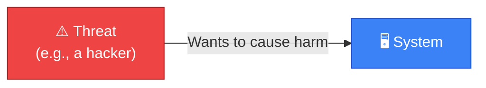
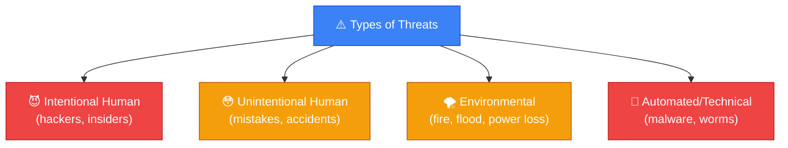
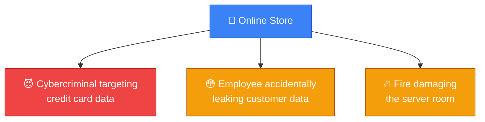
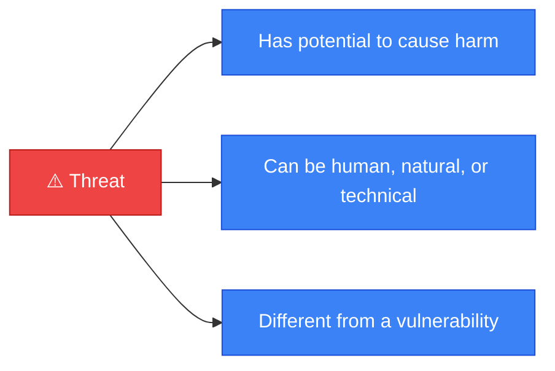

# ⚠️ Threat

**Section:** Core Security Concepts &nbsp;·&nbsp; **Topic:** 13 of 130 &nbsp;·&nbsp; **Level:** 🟢 Beginner

## 📖 First, a Quick Story

Imagine you own a shop with a weak lock on the back door. That weak lock, by itself, does not cause any harm. It only becomes a problem if someone actually wants to break in and is capable of doing so — a burglar walking down that street, planning to enter shops with weak locks.

The weak lock is a weakness. The burglar — someone or something capable of taking advantage of that weakness — is the **threat**.

## 🧠 What Is It?

A **threat** is any person, group, or event that has the potential to cause harm to a system, network, or organization — by stealing data, damaging systems, or disrupting operations.

A threat does not need to be actively attacking right now to be considered a threat. It simply needs the potential and, usually, some level of intent or capability to cause harm.

## 🎯 Why Does It Exist?

Security work requires being able to reason about *who or what* might cause harm, separately from reasoning about *where* a system is weak. These are two different questions:

- "What could go wrong, and who or what could cause it?" — this is the threat.
- "Where are we weak enough that it could actually happen?" — this is the vulnerability (covered in the next topic).

Defining "threat" as its own concept lets security teams think specifically about the sources of danger — attackers, malicious insiders, natural disasters, even accidental human error — separately from the technical weaknesses those sources might exploit.

## ⚙️ How Does It Work?



Threats generally fall into a few broad categories:

1. **Human threats (intentional)** — attackers, hackers, malicious insiders who deliberately try to cause harm.
2. **Human threats (unintentional)** — employees who make mistakes, such as accidentally deleting important data or clicking a malicious link.
3. **Environmental/natural threats** — events like fires, floods, or power outages that can damage systems, with no human attacker involved at all.
4. **Technical threats** — automated things like malware or worms that can spread and cause harm without a human directly steering every action.



## 🧩 Important Parts

| Term | Meaning |
|---|---|
| ⚠️ Threat | Any person, group, or event with the potential to cause harm |
| 😈 Threat actor | A specific person or group behind an intentional threat (e.g., a hacker, a criminal group) |
| 🎯 Intent | Whether a threat actor deliberately wants to cause harm (not all threats involve intent) |
| 💪 Capability | Whether a threat actor is actually able to carry out harm, not just wanting to |

🔍 A threat is only meaningful in security discussions when paired with a target — "a hacker" alone is a general concept, but "a hacker targeting our customer database" is a specific threat to a specific system.

## 💡 Simple Example

Consider a small online store:

- **Threat 1**: A cybercriminal who wants to steal customer credit card numbers to sell them. This is an intentional human threat.
- **Threat 2**: An employee who might accidentally email a spreadsheet of customer data to the wrong recipient. This is an unintentional human threat.
- **Threat 3**: A fire in the building housing the store's servers, which could destroy them. This is an environmental threat.



None of these threats have necessarily succeeded yet — they are simply things that *could* cause harm. Whether they actually succeed depends on whether a matching vulnerability exists (the next topic) and how well the store is defended.

## 🔍 How It Looks in Real Life

- Security teams track "threat intelligence" — information about known attackers, their methods, and their targets.
- Companies run background checks partly to reduce the risk of malicious insider threats.
- Fire suppression systems and backup power exist specifically to address environmental threats to data centers.
- Antivirus software exists to detect and block malware, a form of automated technical threat.

## ⚠️ Common Confusion

- ❌ **"Threat and vulnerability mean the same thing."**
  A threat is the potential source of harm (who or what could cause damage). A vulnerability is the weakness that a threat could exploit to actually succeed. They are related but distinct — you can have a threat with no matching vulnerability (safe), or a vulnerability with no active threat targeting it (currently unexploited, but still risky).

- ❌ **"Threats are always human attackers."**
  Threats can also be natural events (fires, floods), accidents (an employee's mistake), or automated systems (malware). Not every threat has a person deliberately behind it in the moment.

- ❌ **"If there is no known threat right now, there is no risk."**
  New threats can emerge at any time. Security planning generally assumes threats exist or could exist, even if none are currently observed targeting a specific system.

## 🛠️ Practical Example

A basic threat model for a company laptop might list threats like this:

```
Threat: External attacker attempting remote access
Threat: Malware delivered through a phishing email
Threat: Employee losing the laptop while traveling
Threat: Power surge damaging the hardware
```

Each line names a distinct source of potential harm. Security measures — such as strong passwords, antivirus software, device encryption, and surge protectors — are then chosen specifically to address these named threats.

## 🧪 Quick Check

**1. What is a "threat" in security terms?**
<details><summary>Answer</summary>Any person, group, or event with the potential to cause harm to a system, network, or organization.</details>

**2. Does a threat need to be actively attacking right now to be considered a threat?**
<details><summary>Answer</summary>No. A threat only needs the potential (and usually some intent or capability) to cause harm — it does not need to be actively acting at this moment.</details>

**3. Give one example each of an intentional human threat and an environmental threat.**
<details><summary>Answer</summary>Intentional human threat: a hacker trying to steal data. Environmental threat: a fire or flood that could damage equipment. Any similarly correct examples are valid.</details>

**4. True or False: "Threat" and "vulnerability" mean the same thing.**
<details><summary>Answer</summary>False. A threat is a potential source of harm; a vulnerability is a specific weakness that a threat could exploit. They are related but different concepts.</details>

**5. Can an employee's honest mistake count as a threat?**
<details><summary>Answer</summary>Yes. Unintentional human error, such as accidentally leaking data, is still classified as a threat because it has the potential to cause harm, even without malicious intent.</details>

## 🧠 Remember This



- A threat is any person, group, or event that has the potential to cause harm.
- Threats can be intentional (attackers), unintentional (human error), environmental (fires, floods), or automated (malware).
- A threat is distinct from a vulnerability — a threat is the potential source of harm, not the weakness it might exploit.
- Security planning accounts for threats even before they actively attack.
