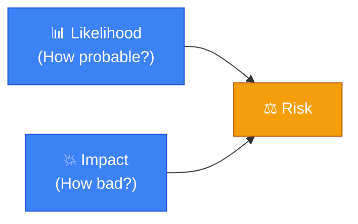
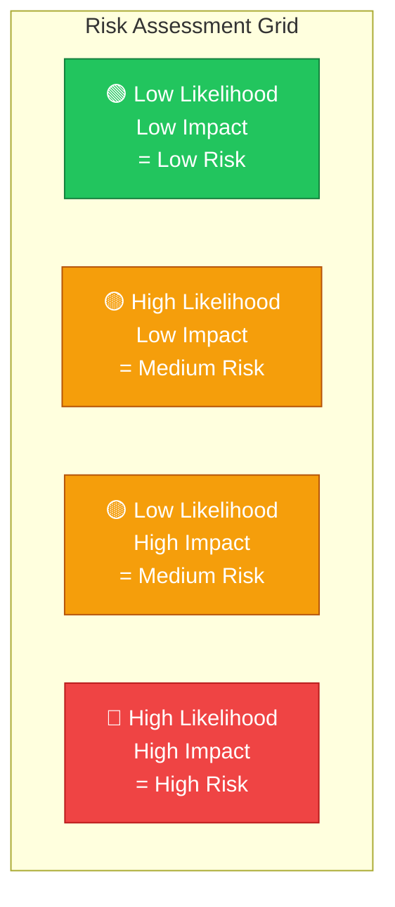
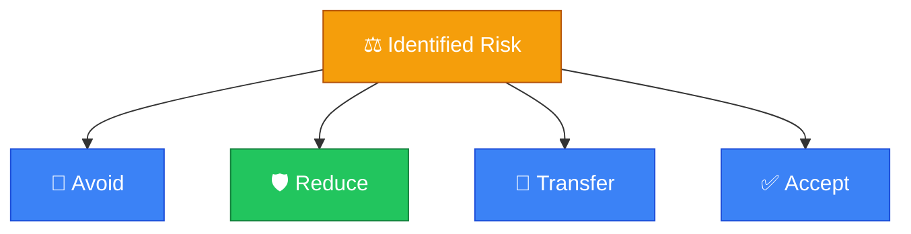
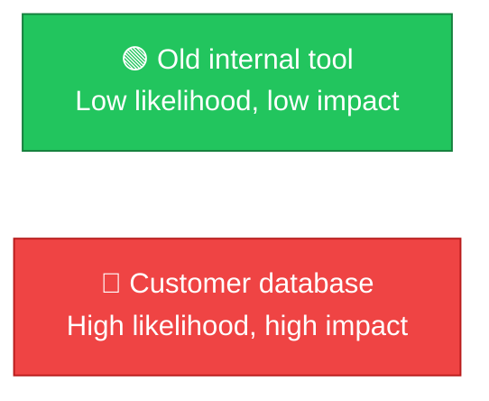
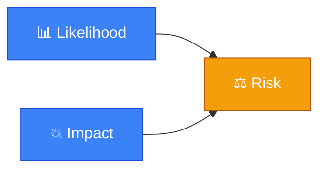

# ⚖️ Risk

**Section:** Core Security Concepts &nbsp;·&nbsp; **Topic:** 16 of 290 &nbsp;·&nbsp; **Level:** 🟢 Beginner

## 📖 First, a Quick Story

Imagine you are deciding whether to cross a road. You look at how much traffic is coming (how likely you are to get hit) and how badly you would get hurt if you were hit (how serious the outcome would be). Based on both of these together, you decide whether it's worth crossing right now, or whether to wait.

That combination — how likely something bad is to happen, multiplied by how bad it would be if it did — is exactly what security professionals call **risk**.

## 🧠 What Is It?

**Risk** is the likelihood that a threat will exploit a vulnerability, combined with the impact that would result if it happened.

In simple terms:

```
Risk = Likelihood × Impact
```

Risk brings together several ideas already covered in this section: the [threat](13-threat.md) (who or what could cause harm), the [vulnerability](14-vulnerability.md) (the weakness that could be exploited), and now two new questions — how likely is this to actually happen, and how bad would it be?

## 🎯 Why Does It Exist?

No organization has unlimited time or money to fix every single vulnerability or defend against every possible threat. Decisions have to be made about where to focus limited security effort first.

Risk exists as a concept to help make that decision rationally. Instead of treating every possible problem as equally urgent, risk lets you compare different problems on the same scale: how likely is this, and how bad would it be? This allows security teams (and organizations generally) to prioritize the most serious risks first, rather than reacting randomly or spending resources on unlikely, low-impact problems while ignoring likely, high-impact ones.

## ⚙️ How Does It Work?



Risk is often visualized using a simple grid, comparing likelihood against impact:



Once a risk is identified and measured, organizations generally choose one of a few standard responses:

1. **Avoid** the risk — stop doing the risky activity entirely.
2. **Reduce** the risk — put in place controls to lower the likelihood or impact (this is most of what "security" work actually is).
3. **Transfer** the risk — shift the burden elsewhere, such as buying cyber insurance.
4. **Accept** the risk — knowingly decide the risk is low enough, or the cost of addressing it high enough, that no action is taken.



## 🧩 Important Parts

| Term | Meaning |
|---|---|
| 📊 Likelihood | How probable it is that a specific threat will exploit a specific vulnerability |
| 💥 Impact | How much harm would result if that happened |
| ⚖️ Risk | The combination of likelihood and impact |
| 🎚️ Risk appetite | How much risk an organization is willing to accept, before deciding action is needed |

## 💡 Simple Example

Consider a small company evaluating two different issues:

- **Issue A**: An old, rarely-used internal tool has a known vulnerability, but it is only accessible from inside the office network, and contains no sensitive data. Likelihood of exploitation: low. Impact if exploited: low. **Risk: Low.**
- **Issue B**: The company's customer database, containing credit card numbers, is missing a critical security patch and is reachable from the internet. Likelihood of exploitation: high. Impact if exploited: very high (financial loss, legal consequences, reputational damage). **Risk: High.**



Even though both issues are technically vulnerabilities, the risk they represent is very different. A security team with limited time should fix Issue B first, because its risk is far higher.

## 🔍 How It Looks in Real Life

- Companies maintain a "risk register," a documented list of identified risks, their likelihood, impact, and current status.
- Cybersecurity insurance exists specifically as a way to transfer certain risks.
- Security budgets are often allocated based on which risks are rated highest.
- Executives and boards are regularly briefed on top organizational risks, including cybersecurity risks, to help guide business decisions.

## ⚠️ Common Confusion

- ❌ **"Risk is the same as a threat or a vulnerability."**
  Risk is the combination of likelihood and impact, built on top of a threat and a vulnerability existing together. A threat or vulnerability alone does not tell you how urgent or serious the situation actually is — risk does.

- ❌ **"All risks must be eliminated."**
  Eliminating all risk is generally not realistic or even necessary. Organizations choose to avoid, reduce, transfer, or accept different risks based on cost, feasibility, and how serious each one is.

- ❌ **"Low likelihood always means low risk."**
  A very unlikely event can still carry high risk if its impact would be severe. This is why risk considers both factors together, not just one.

## 🛠️ Practical Example

A simple risk register entry might look like this:

```
Risk: Customer database missing critical security patch
Likelihood: High
Impact: Severe (financial, legal, reputational)
Overall Risk Rating: High
Response: Reduce — apply patch immediately, restrict access in the meantime
```

What this means:
- `Likelihood` and `Impact` are rated separately, then combined into an overall risk rating.
- The `Response` line documents the decision made — in this case, to reduce the risk through immediate action.

## 🧪 Quick Check

**1. What is the basic formula used to think about risk?**
<details><summary>Answer</summary>Risk = Likelihood × Impact — how probable something is, combined with how bad it would be if it happened.</details>

**2. Why can't organizations just fix every vulnerability and defend against every threat equally?**
<details><summary>Answer</summary>Because time, money, and resources are limited, so risk is used to prioritize which problems are most urgent to address first.</details>

**3. Name the four common ways an organization can respond to an identified risk.**
<details><summary>Answer</summary>Avoid, reduce, transfer, and accept.</details>

**4. True or False: A very unlikely event can never be considered a high risk.**
<details><summary>Answer</summary>False. If the impact of that unlikely event would be severe enough, it can still be rated as a high risk overall.</details>

**5. What does it mean for an organization to "accept" a risk?**
<details><summary>Answer</summary>It means the organization has knowingly decided the risk is low enough, or too costly to address relative to its severity, that no further action will be taken at this time.</details>

## 🧠 Remember This



- Risk combines likelihood (how probable) and impact (how bad) into one measure.
- Risk helps prioritize limited security resources toward the most serious problems first.
- Organizations respond to risk by avoiding, reducing, transferring, or accepting it.
- A low-likelihood event can still be high risk if its potential impact is severe enough.
