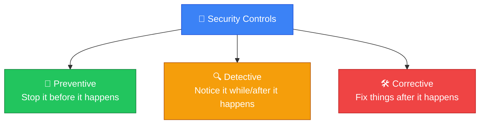
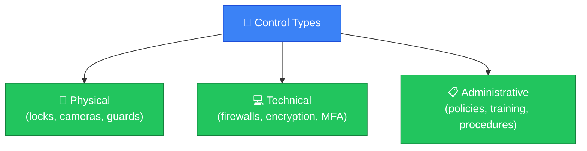
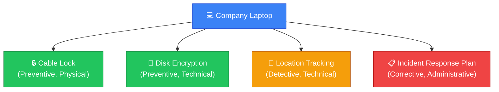
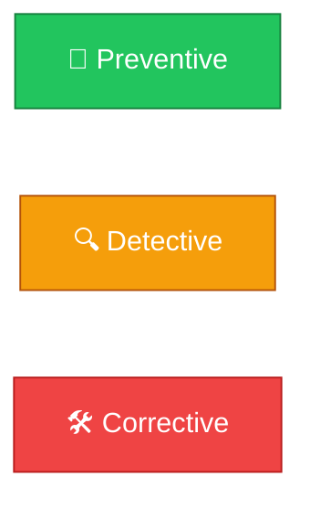

# 🧰 Security Controls

**Section:** Core Security Concepts &nbsp;·&nbsp; **Topic:** 19 of 290 &nbsp;·&nbsp; **Level:** 🟢 Beginner

## 📖 First, a Quick Story

Think about everything a shop owner might do to prevent theft: installing a lock on the door, putting up a security camera, hiring a guard, placing a warning sign about the cameras, and training staff to watch for suspicious behavior. Each of these is a different kind of measure, but they all exist for the same reason — to reduce the chance or impact of theft.

In security, each of these measures is an example of a **security control** — anything put in place specifically to reduce risk.

## 🧠 What Is It?

A **security control** is any safeguard, tool, policy, or process put in place to reduce risk — by preventing, detecting, or responding to threats and vulnerabilities.

Security controls are the practical, real-world implementation of everything discussed so far in this section: they exist specifically to protect the CIA Triad, reduce the attack surface, address threats and vulnerabilities, and manage risk.

## 🎯 Why Does It Exist?

All the concepts covered so far — threats, vulnerabilities, risk — describe *problems*. Security controls are the *solutions*: the actual things an organization does to address those problems.

Having a clear category called "security controls" helps organize security work into concrete, actionable items, and allows different controls to be evaluated, chosen, and combined deliberately (this combination is what creates defense in depth, covered in the previous topic).

## ⚙️ How Does It Work?

Security controls are commonly grouped by **what they do**:



They are also commonly grouped by **what type of control** they are:



These two ways of grouping controls can be combined — for example, a security camera is a *physical, detective* control (it's physical hardware, and it helps notice something happening, rather than stopping it outright). A locked door is a *physical, preventive* control. A password policy is an *administrative, preventive* control.

## 🧩 Important Parts

| Term | Meaning |
|---|---|
| 🚫 Preventive control | Stops an incident before it happens (e.g., a firewall blocking bad traffic) |
| 🔍 Detective control | Notices and alerts on an incident during or after it happens (e.g., an intrusion detection system) |
| 🛠️ Corrective control | Fixes or limits damage after an incident (e.g., restoring from backup) |
| 🚪 Physical control | A tangible, real-world safeguard (locks, badges, cameras) |
| 💻 Technical control | A technology-based safeguard (firewalls, encryption, access control software) |
| 📋 Administrative control | A policy, procedure, or training-based safeguard |

## 💡 Simple Example

Consider how a company protects against an employee's laptop being stolen with sensitive data on it:

- **Preventive, Physical**: A cable lock physically securing the laptop to a desk.
- **Preventive, Technical**: Full-disk encryption, so stolen data can't be read without the correct credentials.
- **Detective, Technical**: A device-tracking service that alerts IT if the laptop connects from an unusual location.
- **Corrective, Administrative**: A documented incident response procedure for what to do if a laptop is reported stolen (such as remotely wiping it).



Together, these four different controls address the same risk (a stolen laptop) from several different angles — before, during, and after an incident.

## 🔍 How It Looks in Real Life

- A locked server room door is a physical, preventive control.
- Antivirus software is a technical, mostly preventive (and somewhat detective) control.
- A company's password policy document is an administrative, preventive control.
- A security camera reviewed after an incident is a physical, detective control.
- Restoring data from backup after a ransomware attack is a technical, corrective control.

## ⚠️ Common Confusion

- ❌ **"Security controls are only about technology."**
  Many important controls are administrative (policies, training) or physical (locks, guards), not just software or hardware.

- ❌ **"Preventive controls are always better than detective or corrective ones."**
  All three types are needed together. No preventive control is perfect, so detective controls catch what slips through, and corrective controls limit damage and enable recovery when something does happen.

- ❌ **"One good control is enough."**
  As covered in the [Defense in Depth](17-defense-in-depth.md) topic, relying on a single control is risky. Effective security combines multiple controls of different types.

## 🛠️ Practical Example

A basic control inventory for protecting a company database might look like this:

```
Control: Firewall restricting database access to specific IPs
Type: Technical, Preventive

Control: Database activity logging and alerting on unusual queries
Type: Technical, Detective

Control: Documented data breach response plan
Type: Administrative, Corrective

Control: Locked, badge-access server room
Type: Physical, Preventive
```

Each entry names one specific control, its type, and its purpose — this kind of documentation is common in real security programs, so teams can see clearly what protections exist and where gaps might remain.

## 🧪 Quick Check

**1. What is a security control?**
<details><summary>Answer</summary>Any safeguard, tool, policy, or process put in place to reduce risk by preventing, detecting, or responding to threats and vulnerabilities.</details>

**2. Name the three functional categories of security controls (based on what they do).**
<details><summary>Answer</summary>Preventive, detective, and corrective.</details>

**3. What is the difference between a physical control and an administrative control? Give an example of each.**
<details><summary>Answer</summary>A physical control is a tangible safeguard, like a locked door. An administrative control is a policy or procedure, like a required password complexity policy.</details>

**4. True or False: Relying on strong preventive controls alone is sufficient for good security.**
<details><summary>Answer</summary>False. No preventive control is perfect, so detective controls (to notice what gets through) and corrective controls (to recover afterward) are also needed.</details>

**5. Classify this control: "A security camera that records the entrance to a server room." What functional type and control type is it?**
<details><summary>Answer</summary>It is a detective, physical control — physical because it's tangible hardware, and detective because it helps notice/record events rather than directly preventing them.</details>

## 🧠 Remember This



- A security control is any safeguard put in place to reduce risk.
- Controls can be preventive (stop it), detective (notice it), or corrective (fix it afterward).
- Controls can also be physical, technical, or administrative in type.
- Effective security combines multiple types of controls together, not just one.
