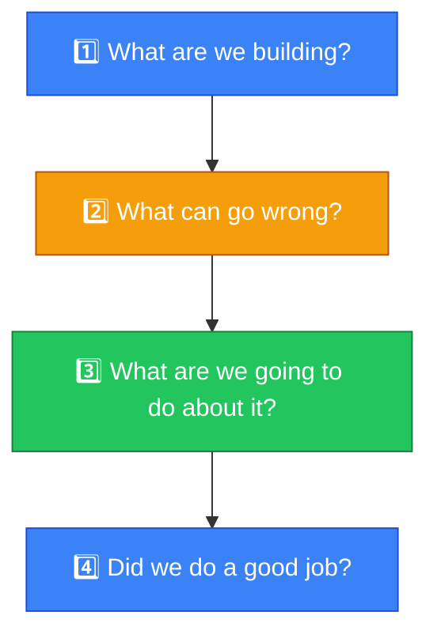
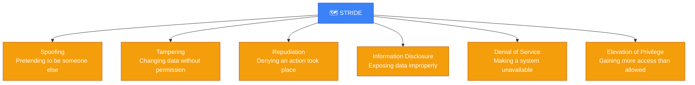
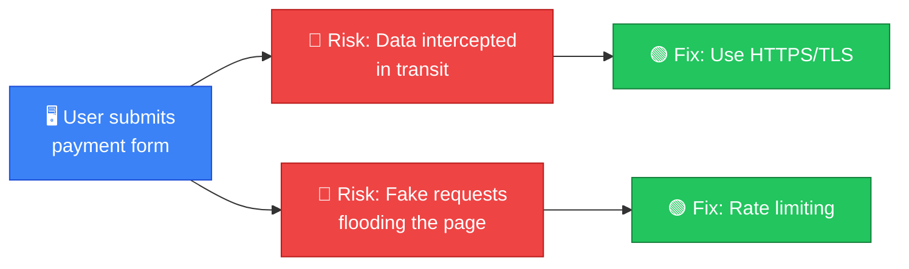

# 🗺️ Threat Modeling

**Section:** Core Security Concepts &nbsp;·&nbsp; **Topic:** 20 of 290 &nbsp;·&nbsp; **Level:** 🟢 Beginner

## 📖 First, a Quick Story

Imagine an architect designing a new house. Before laying a single brick, a good architect thinks ahead: where could someone break in? Which windows are hardest to see from the street, making them tempting for a burglar? Should the valuables room be near an exterior wall? This kind of deliberate, structured thinking — done *before* building anything — leads to a much safer design than simply building the house and hoping for the best.

**Threat modeling** is this same exercise, applied to a system, application, or network before (or while) it is built.

## 🧠 What Is It?

**Threat modeling** is a structured process of identifying potential threats, vulnerabilities, and attack paths against a system, so that defenses can be planned deliberately, rather than added as an afterthought.

It brings together everything covered so far in this section — threats, vulnerabilities, risk, and controls — into one organized exercise, usually performed by asking a consistent set of questions about a specific system.

## 🎯 Why Does It Exist?

Security added after a system is already built and in use is often more expensive, more disruptive, and less effective than security designed in from the start. Threat modeling exists to catch potential problems early — during design — when they are far cheaper and easier to fix.

It also forces a team to think from an attacker's perspective, rather than only from a "does this feature work" perspective. This shift in thinking often reveals risks that would otherwise be missed until an actual incident occurred.

## ⚙️ How Does It Work?

A common, simple way to threat model is to ask four questions about a system:



1. **What are we building?** — Understand the system: its components, data flows, and boundaries.
2. **What can go wrong?** — Brainstorm threats and vulnerabilities specific to this system.
3. **What are we going to do about it?** — Decide on security controls to address the most important risks.
4. **Did we do a good job?** — Review whether the plan actually addresses the identified risks well.

One popular structured method for step 2 (identifying what can go wrong) is called **STRIDE**, which stands for six categories of threats:



🔍 You do not need to memorize STRIDE in detail at this stage — it is simply an example of how threat modeling can be made structured and repeatable, rather than relying on random guessing about what might go wrong.

## 🧩 Important Parts

| Term | Meaning |
|---|---|
| 🗺️ Threat model | The documented result of a threat modeling exercise for a specific system |
| 🔀 Data flow diagram | A visual map of how data moves through a system, often used as the starting point for threat modeling |
| 🎯 Attack path | A specific sequence of steps an attacker could take to compromise a system |
| 🧩 STRIDE | A structured categorization of six common threat types, used as a checklist during threat modeling |

## 💡 Simple Example

Imagine a team building a new online payment feature for a website. Before writing code, they threat model it:

- **What are we building?** A page where users enter card details to make a payment, which are sent to a payment processor.
- **What can go wrong?** An attacker could intercept card details in transit (information disclosure). An attacker could submit fake payment requests (spoofing). A flood of requests could overwhelm the payment page (denial of service).
- **What are we going to do about it?** Use HTTPS/TLS to protect data in transit, verify requests are properly authenticated, and add rate limiting to prevent flooding.
- **Did we do a good job?** Review the plan with the security team before development begins, checking whether these controls sufficiently reduce the identified risks.



Because this thinking happened before the feature launched, the necessary protections (HTTPS, rate limiting) were built in from the start, rather than added later in a rush after a real incident.

## 🔍 How It Looks in Real Life

- Software development teams often run threat modeling sessions as part of designing new features, especially ones handling sensitive data.
- Security teams use threat modeling when reviewing new network architecture, before it is deployed.
- Frameworks like STRIDE and attack trees (structured diagrams of possible attack paths) are commonly used tools during these sessions.
- Threat modeling is often a required step in secure software development processes at organizations that take security seriously.

## ⚠️ Common Confusion

- ❌ **"Threat modeling is only for large, complex systems."**
  Even a simple system benefits from a basic threat modeling exercise — the four core questions can be applied at any scale, even to something as small as a single new feature.

- ❌ **"Threat modeling is a one-time task."**
  Systems change over time — new features are added, new integrations are built. Threat modeling should be revisited whenever a system changes significantly, not done only once at the very beginning.

- ❌ **"Threat modeling replaces the need for security testing later."**
  Threat modeling helps design better security in from the start, but it does not replace later steps like security testing (covered in later topics) — both are needed together.

## 🛠️ Practical Example

A simple threat modeling worksheet entry might look like this:

```
System: Customer login page
Threat: Attacker guesses passwords via automated tool (brute force)
Category: Elevation of Privilege
Mitigation: Account lockout after repeated failed attempts, plus MFA
Status: Planned for initial release
```

This kind of entry documents one identified threat, categorizes it, and records the planned defense — a simple, repeatable pattern used across a full threat modeling exercise covering many different threats.

## 🧪 Quick Check

**1. What is threat modeling?**
<details><summary>Answer</summary>A structured process of identifying potential threats, vulnerabilities, and attack paths against a system, so defenses can be planned deliberately.</details>

**2. Why is it valuable to do threat modeling before a system is built, rather than after?**
<details><summary>Answer</summary>Because fixing security issues during design is generally much cheaper and easier than fixing them after the system is already built and in use.</details>

**3. What are the four basic questions often used in a simple threat modeling process?**
<details><summary>Answer</summary>What are we building? What can go wrong? What are we going to do about it? Did we do a good job?</details>

**4. True or False: Threat modeling only needs to be done once, at the very start of a project.**
<details><summary>Answer</summary>False. It should be revisited whenever a system changes significantly, since new features or integrations can introduce new risks.</details>

**5. What does STRIDE represent in the context of threat modeling?**
<details><summary>Answer</summary>A structured framework of six common threat categories (Spoofing, Tampering, Repudiation, Information Disclosure, Denial of Service, Elevation of Privilege) used to help identify what could go wrong with a system.</details>

## 🧠 Remember This


- Threat modeling is a structured way to think about security risks before (or while) building a system.
- It brings together threats, vulnerabilities, risk, and controls into one deliberate exercise.
- Frameworks like STRIDE help make the process structured and repeatable rather than random.
- It should be revisited as systems change, not treated as a one-time task.
