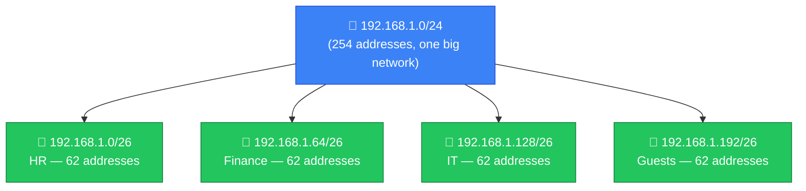
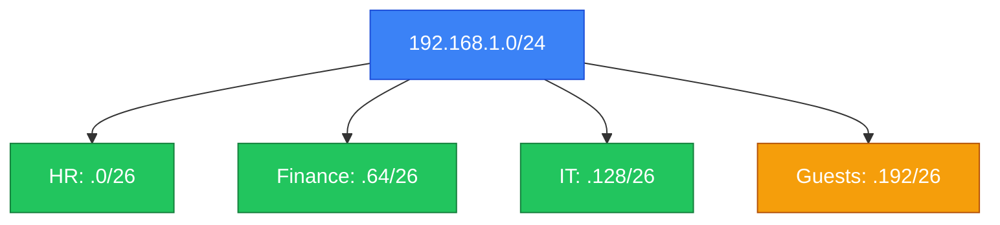

# 🧩 Subnetting

**Section:** IP Networking &nbsp;·&nbsp; **Topic:** 23 of 290 &nbsp;·&nbsp; **Level:** 🟢 Beginner

## 📖 First, a Quick Story

Imagine a company is given one large office floor. Instead of leaving it as one giant open room, the company divides it into separate rooms: one for HR, one for Finance, one for IT. Each room is smaller, but easier to manage, secure, and organize — HR doesn't need to walk through Finance's space, and if there's a problem in one room, it doesn't necessarily affect the others.

**Subnetting** is this same idea, applied to a network. It takes one large block of IP addresses and divides it into smaller, more manageable pieces.

## 🧠 What Is It?

**Subnetting** is the process of dividing a larger network into smaller, separate sub-networks (called **subnets**), each with its own defined range of IP addresses.

This builds directly on the [Subnet Mask](21-subnet-mask.md) and [CIDR](22-cidr.md) topics — subnetting is the *practice* of choosing subnet masks and CIDR prefixes deliberately, in order to split one network into several smaller ones.

## 🎯 Why Does It Exist?

Without subnetting, an organization might be forced to run every single device — desks in accounting, servers in IT, printers in the lobby — on one single, massive, flat network. This creates several problems:

- **Performance**: A single large network has more devices generating traffic and broadcast messages that everyone else has to process, even if it's irrelevant to them.
- **Organization**: It becomes hard to logically group devices by department, purpose, or location.
- **Security**: Without separation, a compromised device in one area could potentially reach and attack devices anywhere else, since everything is on one shared network.

Subnetting solves these problems by intentionally splitting a network into smaller, logical, more manageable pieces — improving performance, organization, and (importantly for security) making it possible to control and restrict traffic *between* subnets.

## ⚙️ How Does It Work?

Subnetting takes one larger address block and divides it into multiple smaller blocks by using a longer CIDR prefix (as shown in the previous topic — a longer prefix means a smaller network).



Step by step:

1. Start with one larger network block (like `192.168.1.0/24`).
2. Decide how many smaller subnets are needed, and roughly how many devices each one must support.
3. Choose an appropriate CIDR prefix for each subnet (a longer prefix for smaller groups, as covered in the CIDR topic).
4. Assign each subnet its own distinct range of addresses, none of which overlap with the others.

Once divided, devices within the same subnet can communicate directly (as shown in the Subnet Mask topic), while communication *between* different subnets must pass through a router — which gives network administrators a natural checkpoint to monitor, control, or restrict that traffic if needed.


## 🧩 Important Parts

| Term | Meaning |
|---|---|
| 🧩 Subnet | A smaller network created by dividing a larger address block |
| ✂️ Subnetting | The process of dividing a network into subnets |
| 🚧 Isolation | The natural separation subnetting creates between groups of devices |
| 📡 Inter-subnet traffic | Communication between devices on different subnets, which must pass through a router |

## 💡 Simple Example

A company with one flat network (`192.168.1.0/24`) decides to subnet it by department:

```
HR:       192.168.1.0/26    (addresses .0 to .63)
Finance:  192.168.1.64/26   (addresses .64 to .127)
IT:       192.168.1.128/26  (addresses .128 to .191)
Guests:   192.168.1.192/26  (addresses .192 to .255)
```



With this structure, the company can now set a rule, for example, blocking the Guest subnet from ever reaching the Finance subnet directly — something that would have been much harder to enforce cleanly if every device shared one single flat network.

## 🔍 How It Looks in Real Life

- Companies commonly subnet their networks by department, floor, or function (guest Wi-Fi is almost always placed on its own subnet, separate from internal company devices).
- Data centers use subnetting to separate different types of servers (web servers, databases, management systems) into distinct zones.
- Home routers sometimes offer a separate "guest network" — a simple, consumer-friendly example of subnetting in action.
- This concept lays the groundwork for **network segmentation**, a security-focused version of the same idea, covered in a later topic.

## ⚠️ Common Confusion

- ❌ **"Subnetting and a subnet mask are the same thing."**
  A subnet mask is the tool (the number that defines the network/host split). Subnetting is the broader *process* of using subnet masks and CIDR prefixes deliberately to divide a network into smaller pieces.

- ❌ **"More subnets are always better."**
  Over-subnetting a small network can add unnecessary complexity without real benefit. The right number of subnets depends on the actual size and structure of the organization.

- ❌ **"Devices on different subnets can never communicate at all."**
  They can communicate — but only through a router, rather than directly. This is a deliberate design choice, not a limitation, since it allows administrators to control that traffic.

## 🛠️ Practical Example

A simplified subnetting plan document might look like this:

```
Network: 192.168.1.0/24
Subnet 1: 192.168.1.0/26   - HR Department
Subnet 2: 192.168.1.64/26  - Finance Department
Subnet 3: 192.168.1.128/26 - IT Department
Subnet 4: 192.168.1.192/26 - Guest Wi-Fi
```

Each line defines one subnet's address range and its intended purpose — a common format used by network administrators when planning how to divide a network.

## 🧪 Quick Check

**1. What is subnetting?**
<details><summary>Answer</summary>The process of dividing a larger network into smaller, separate sub-networks (subnets), each with its own defined address range.</details>

**2. Name two benefits subnetting provides to an organization.**
<details><summary>Answer</summary>Any two of: improved performance (less shared broadcast traffic), better organization (logical grouping by department/purpose), and improved security (ability to control traffic between subnets). </details>

**3. True or False: Devices on two different subnets can never communicate with each other under any circumstances.**
<details><summary>Answer</summary>False. They can communicate, but only by passing through a router, rather than directly as devices on the same subnet would.</details>

**4. Why might a company put its guest Wi-Fi on a separate subnet from its internal company devices?**
<details><summary>Answer</summary>To isolate guest devices from internal systems, so guests cannot directly reach sensitive internal resources, and any traffic between the two can be controlled or restricted.</details>

**5. What is the relationship between subnetting and a subnet mask?**
<details><summary>Answer</summary>A subnet mask is the specific value that defines the network/host split for an address range. Subnetting is the overall process of choosing and applying subnet masks/CIDR prefixes to divide a larger network into smaller ones.</details>

## 🧠 Remember This


- Subnetting divides one larger network into smaller, more manageable subnets.
- It improves performance, organization, and enables better security control between groups of devices.
- Devices within the same subnet communicate directly; devices on different subnets must go through a router.
- Subnetting is the practical process of applying subnet masks and CIDR prefixes deliberately.
