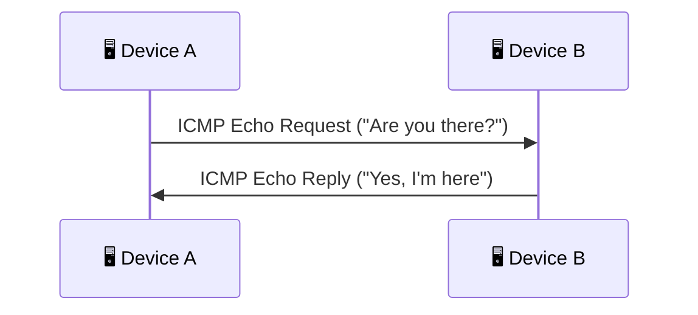
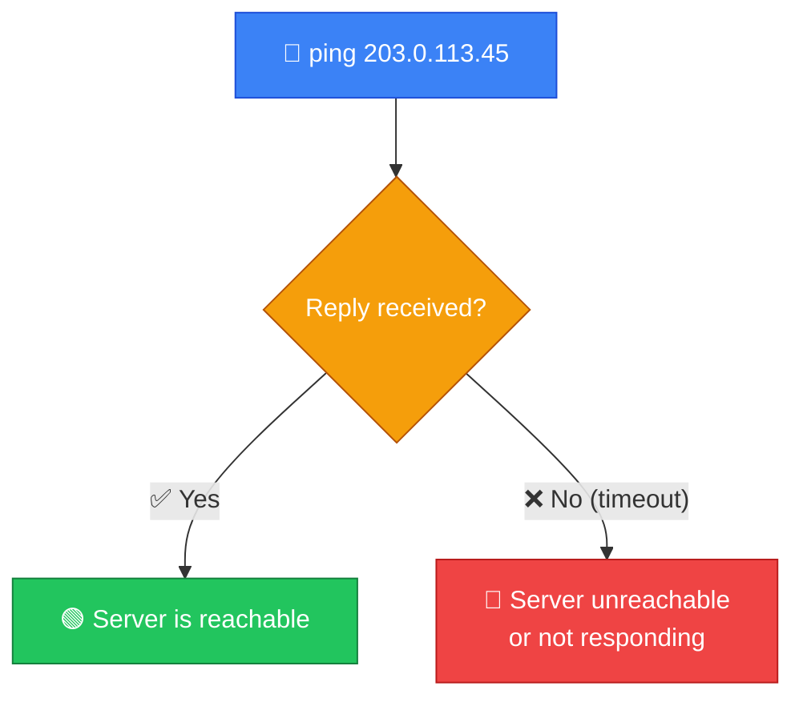
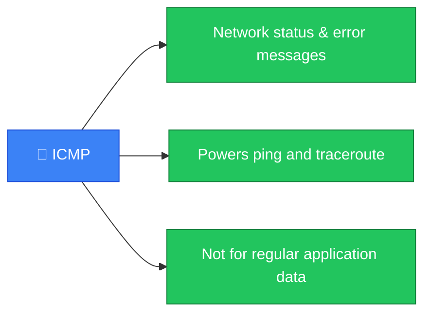

# 📡 ICMP

**Section:** Core Network Protocols &nbsp;·&nbsp; **Topic:** 33 of 290 &nbsp;·&nbsp; **Level:** 🟢 Beginner

## 📖 First, a Quick Story

Imagine sending a letter to a friend, just to check whether the postal service between your two addresses is actually working right now — not because the letter contains anything important, but purely to test the connection. If your friend gets it and mails a quick reply back, you know the path between you works. If the letter never arrives, or comes back stamped "undeliverable," you've learned something useful too.

**ICMP** is exactly this kind of "just checking" mechanism for computer networks — used to test connectivity and report problems, rather than to carry actual application data like a web page or an email.

## 🧠 What Is It?

**ICMP (Internet Control Message Protocol)** is a network protocol used to send status and error messages about network conditions — such as whether a device is reachable, or why a piece of data failed to reach its destination.

Unlike protocols such as HTTP (covered in a later topic) that carry actual application content, ICMP exists purely to communicate information *about* the network itself.

## 🎯 Why Does It Exist?

Networks are complex, with many devices and routers involved in delivering data (as covered in the [Routing](27-routing.md) topic). Things can and do go wrong: a destination might be unreachable, a router along the path might be overloaded, or a piece of data might simply take too many hops and need to be discarded.

Without a way to communicate these conditions, network problems would be silent and much harder to diagnose — devices would have no formal way to say "I couldn't deliver this, and here's why," and administrators would have no simple way to test basic connectivity. ICMP exists to fill this gap.

## ⚙️ How Does It Work?

The most well-known use of ICMP is the **ping** utility (covered in more depth in a later topic), which tests whether a destination device is reachable.



Step by step:

1. Device A sends an ICMP "Echo Request" message to Device B, essentially asking, "are you reachable?"
2. If Device B receives it and is working normally, it responds with an ICMP "Echo Reply" message.
3. Device A receiving that reply confirms that Device B is reachable, and roughly how long the round trip took.

ICMP is also used to report specific error conditions, without needing a direct request first:


Common ICMP messages include:

1. **Echo Request / Echo Reply** — used by `ping` to test basic reachability.
2. **Destination Unreachable** — sent back when data cannot be delivered to its intended target.
3. **Time Exceeded** — sent back when data has passed through too many routers (hops) without reaching its destination; this is actually the mechanism behind the `traceroute` tool mentioned in an earlier topic.

## 🧩 Important Parts

| Term | Meaning |
|---|---|
| 📡 ICMP | Internet Control Message Protocol — used for network status and error messages |
| 🏓 Echo Request/Reply | The specific ICMP messages used by the `ping` utility |
| 🚫 Destination Unreachable | An ICMP error indicating data could not be delivered |
| ⏱️ Time Exceeded | An ICMP error indicating data expired before reaching its destination (used by traceroute) |

## 💡 Simple Example

An administrator wants to check whether a server is online:

```
ping 203.0.113.45
```

If the server is reachable, it responds with ICMP Echo Replies, and the administrator sees output confirming the server is up, along with how long each round trip took. If the server is offline or unreachable, no replies come back, and the administrator sees a timeout instead — a simple, immediate signal that something is wrong.



## 🔍 How It Looks in Real Life

- The `ping` command, used constantly by everyday users and network professionals alike, relies entirely on ICMP.
- The `traceroute`/`tracert` tool (covered in a later topic) uses ICMP "Time Exceeded" messages to map out the path data takes across multiple routers.
- Network monitoring systems often use ICMP to regularly check whether critical servers and devices are still online and responsive.

## ⚠️ Common Confusion

- ❌ **"ICMP carries regular application data, like web pages or files."**
  ICMP is specifically for network status and error messages, not for carrying actual application content like websites, emails, or file transfers — those rely on other protocols, covered in upcoming topics.

- ❌ **"If a device doesn't respond to ping, it's definitely offline."**
  Many devices and firewalls are deliberately configured to block or ignore ICMP Echo Requests as a security measure, even while the device itself is fully online and working normally. A missing ping reply is a clue, not absolute proof, of a device being down.

- ❌ **"ICMP is only used for the ping command."**
  While ping is the most familiar use, ICMP also carries a variety of other important error messages (like "Destination Unreachable" and "Time Exceeded") used throughout normal network operation, often without any user directly triggering them.

## 🛠️ Practical Example

Using `ping` to test connectivity:

```
ping example.com
```

Example output (simplified):
```
Reply from 203.0.113.45: bytes=32 time=15ms TTL=54
Reply from 203.0.113.45: bytes=32 time=14ms TTL=54
```

What this means:
- Each `Reply from` line confirms an ICMP Echo Reply was received, meaning the destination is currently reachable.
- `time=15ms` shows how long the round trip took, and `TTL` (Time To Live) relates to how many more hops the packet could have traveled before being discarded — connecting back to the concept behind ICMP's "Time Exceeded" message.

## 🧪 Quick Check

**1. What is ICMP primarily used for?**
<details><summary>Answer</summary>Sending status and error messages about network conditions, such as testing reachability or reporting why data couldn't be delivered — not carrying actual application data.</details>

**2. What ICMP messages does the `ping` command rely on?**
<details><summary>Answer</summary>Echo Request and Echo Reply.</details>

**3. True or False: If a device doesn't reply to a ping, it is always completely offline.**
<details><summary>Answer</summary>False. Many devices are deliberately configured to block or ignore ICMP Echo Requests for security reasons, even while fully online.</details>

**4. What does an ICMP "Destination Unreachable" message indicate?**
<details><summary>Answer</summary>That a piece of data could not be delivered to its intended target.</details>

**5. Which ICMP message type is the underlying mechanism behind the traceroute tool?**
<details><summary>Answer</summary>Time Exceeded.</details>

## 🧠 Remember This



- ICMP is used for network status and error messages, not application data.
- The `ping` utility relies on ICMP Echo Request and Echo Reply messages.
- ICMP also reports errors like "Destination Unreachable" and "Time Exceeded."
- A device not responding to ping doesn't necessarily mean it's offline — ICMP may simply be blocked.
