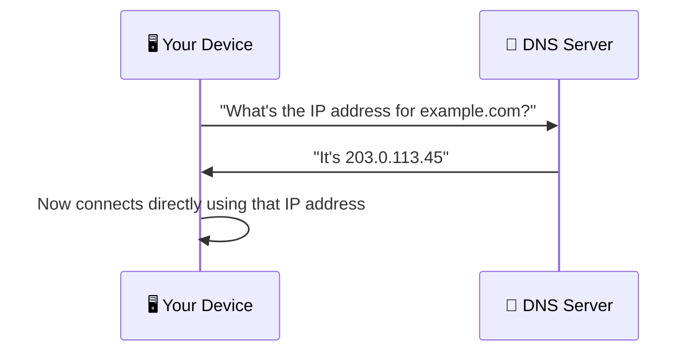
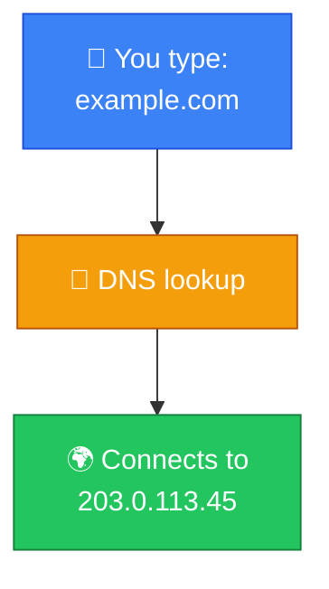

# 📖 DNS

**Section:** Core Network Protocols &nbsp;·&nbsp; **Topic:** 37 of 290 &nbsp;·&nbsp; **Level:** 🟢 Beginner

## 📖 First, a Quick Story

Imagine trying to call a friend, but instead of dialing their name, you had to remember their exact ten-digit phone number by heart, every single time. Most people don't work that way — they save the friend's name in their phone's contacts, and let the phone look up the actual number automatically.

**DNS** does exactly this for the internet. Humans get to type easy-to-remember website names, while DNS quietly looks up the actual [IP address](01-ip-address.md) behind the scenes.

## 🧠 What Is It?

**DNS (Domain Name System)** is a system that translates human-friendly domain names (like `example.com`) into the numerical IP addresses that computers actually use to locate and connect to each other.

## 🎯 Why Does It Exist?

Computers communicate using IP addresses, as covered extensively in earlier topics — but IP addresses are difficult for humans to remember, especially as the number of websites and services in the world has grown into the billions. Nobody wants to memorize a string like `203.0.113.45` just to visit a website.

DNS exists to bridge this gap. It lets people use simple, memorable names, while the actual underlying technical communication still happens using IP addresses exactly as it needs to.

## ⚙️ How Does It Work?



Step by step, at a basic level:

1. You type a domain name (like `example.com`) into your browser.
2. Your device sends a request to a DNS server, asking for the IP address associated with that domain name.
3. The DNS server looks up the answer and sends the corresponding IP address back.
4. Your device then uses that IP address to actually connect to the website's server.

🔍 This process at a high level is called **DNS resolution**, and it involves more steps and different types of servers working together behind the scenes — this is covered in full detail in the upcoming [DNS Resolution](46-dns-resolution.md) topic. For now, the important idea is simply: DNS is the system that converts names into addresses.


## 🧩 Important Parts

| Term | Meaning |
|---|---|
| 📖 DNS | Domain Name System — translates domain names into IP addresses |
| 🏷️ Domain name | A human-friendly website name, like `example.com` |
| 📇 DNS record | An entry mapping a specific domain name to its corresponding IP address (or other information) |
| 🖥️ DNS server | A server that stores and answers requests for these domain-to-IP mappings |

## 💡 Simple Example

You type `example.com` into your browser:

1. Your browser doesn't actually know where `example.com` is located — it only knows the name.
2. Your device asks a DNS server: "what's the IP address for example.com?"
3. The DNS server responds: "203.0.113.45."
4. Your browser now connects directly to `203.0.113.45` to actually load the website.



If DNS didn't exist, you would need to type `203.0.113.45` directly into your browser every time you wanted to visit that particular website — and remember a completely different number for every other website too.

## 🔍 How It Looks in Real Life

- Every website visit begins with a DNS lookup, even though it's completely invisible to most users.
- Companies manage their own DNS records to point their domain name (like `example.com`) at the correct server's IP address.
- When a company changes web hosting providers, they typically need to update their DNS records to point to the new server's IP address.

## ⚠️ Common Confusion

- ❌ **"DNS actually hosts the website content itself."**
  DNS only provides the address lookup — it has no role in storing or serving the actual website content. The web server (covered in a later topic) is what actually stores and delivers that content, at the address DNS provided.

- ❌ **"A domain name and an IP address are basically the same thing."**
  A domain name is a human-friendly label; an IP address is the actual technical address a computer uses to connect. DNS is precisely the system that connects the two.

- ❌ **"DNS lookups always go to the same, single central server for the whole world."**
  DNS is actually a distributed system involving many different servers working together, not one single central authority — a distinction explored further in the DNS Resolution topic.

## 🛠️ Practical Example

Manually performing a DNS lookup using a command-line tool:

```
nslookup example.com
```

Example output (simplified):
```
Name:    example.com
Address: 203.0.113.45
```

What this means:
- `Name` shows the domain name that was looked up.
- `Address` shows the actual IP address that DNS returned for that name — the address your device would then use to actually connect to the website.

## 🧪 Quick Check

**1. What does DNS do?**
<details><summary>Answer</summary>It translates human-friendly domain names (like example.com) into the numerical IP addresses that computers use to actually connect to each other.</details>

**2. Why does DNS exist, given that computers could theoretically communicate using IP addresses alone?**
<details><summary>Answer</summary>Because IP addresses are difficult for humans to remember, especially at internet scale — DNS lets people use simple, memorable names instead.</details>

**3. True or False: DNS actually stores and delivers a website's content.**
<details><summary>Answer</summary>False. DNS only provides the address lookup; the actual website content is stored and delivered by a web server, at the address DNS provided.</details>

**4. What is a "DNS record"?**
<details><summary>Answer</summary>An entry mapping a specific domain name to its corresponding IP address (or other related information).</details>

**5. What tool can be used to manually perform a DNS lookup from the command line?**
<details><summary>Answer</summary>nslookup (or an equivalent tool like dig, covered in a later topic).</details>

## 🧠 Remember This


- DNS translates human-friendly domain names into the IP addresses computers actually use.
- It exists because IP addresses are impractical for people to remember at scale.
- DNS only handles the address lookup — it does not store or serve website content itself.
- DNS is a distributed system, not one single central server.
