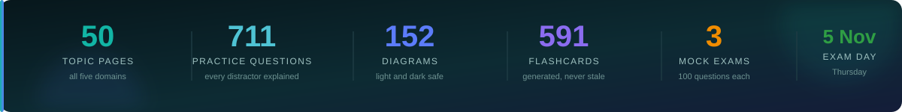

<h1>
🛡️&nbsp; ISC2 CC — Certified in Cybersecurity
</h1>

<h3>
<em>Understand · Define · Tell apart · <strong>Unlearn</strong> · Drill · Recall · Pass</em>
</h3>

<b>9 modules · 50 topics · 711 practice questions · 152 diagrams</b> 
Everything the exam can ask, written to be read once and drilled twice. Nothing here is a copy of the ISC2 courseware.

🌐 Prefer to browse? <a href="docs/index.html"><code>docs/index.html</code></a> is a filterable index of every
topic — open it locally, or turn on GitHub Pages from the <code>/docs</code> folder.

---

## 🎯 What this is

A complete study path for the **ISC2 Certified in Cybersecurity (CC)** exam, built to be
worked through in order and finished before **5 November 2026**.

It is deliberately **not** a general cybersecurity course. It teaches the narrower, far more
predictable thing the exam actually measures: **ISC2's vocabulary, ISC2's definitions, and
ISC2's preferred answer** — including the places where those differ from how the work is
really done.

> [!IMPORTANT]
> If you already work in security, the hardest part of this exam is **not** the material.
> It is answering like the textbook instead of like a practitioner. Read
> [`00-foundations/how-isc2-thinks/`](00-foundations/how-isc2-thinks/) before anything else —
> it is the single highest-value page in this repo.

---

## 📊 What the exam weighs

| | Domain | Weight | Module |
|:--:|---|--:|---|
| 🧭 | **Security Principles** | **26%** | [`01-security-principles/`](01-security-principles/README.md) |
| 🌐 | **Network Security** | **24%** | [`04-network-security/`](04-network-security/README.md) |
| 🚪 | **Access Control Concepts** | **22%** | [`03-access-control/`](03-access-control/README.md) |
| ⚙️ | **Security Operations** | **18%** | [`05-security-operations/`](05-security-operations/README.md) |
| 🚨 | **BC, DR & Incident Response** | **10%** | [`02-bc-dr-ir/`](02-bc-dr-ir/README.md) |

**Domains 1, 4 and 3 are 72% of the paper between them.** Spend your time there — and if the
schedule slips, it slips on Domain 2.

---

## 📚 The 9 modules

> **Key** &nbsp; 🧱 foundations &nbsp;·&nbsp; 📘 exam domain &nbsp;·&nbsp; 🎯 drill material

### 🧱 Before you start

| | Module | Topics | What it gives you |
|:--:|---|--:|---|
| 🧱 | **[00 · Foundations](00-foundations/README.md)** How the exam works, and how ISC2 wants you to think. | 5 | The blueprint, the answer-selection logic, and a schedule that fits around a full-time job. |

### 📘 The five exam domains

Numbered to match ISC2's own domain numbers, so the syllabus maps straight onto the folders.

| | Module | Topics | Weight | What it covers |
|:--:|---|--:|:--:|---|
| 🧭 | **[01 · Security Principles](01-security-principles/README.md)** The vocabulary the whole exam is built on. | 11 | **26%** | CIA, authentication, non-repudiation, privacy, risk, controls, governance, ethics. |
| 🚨 | **[02 · BC, DR & Incident Response](02-bc-dr-ir/README.md)** What you do once it has already gone wrong. | 6 | **10%** | Incident terminology and phases, BIA, RTO/RPO/MTD, continuity and recovery plans. |
| 🚪 | **[03 · Access Control Concepts](03-access-control/README.md)** Who gets in, to what, and on whose authority. | 8 | **22%** | Subjects and objects, physical and logical controls, DAC/MAC/RBAC/ABAC, least privilege. |
| 🌐 | **[04 · Network Security](04-network-security/README.md)** How networks are built, attacked and defended. | 11 | **24%** | OSI and TCP/IP, addressing, ports, attacks, firewalls and IDS, segmentation, VPNs, cloud. |
| ⚙️ | **[05 · Security Operations](05-security-operations/README.md)** The daily job, as the textbook describes it. | 9 | **18%** | Data handling and classification, encryption, hardening, logging, policies, awareness. |

### 🎯 Drill material

| | Module | Contents | When to use it |
|:--:|---|---|---|
| 🗂️ | **[06 · Term Bank](06-term-bank/README.md)** Every definition the exam can ask you for. | 591 cards, domain-tagged | From week 2 onward, a few minutes daily |
| ❓ | **[07 · Question Bank](07-question-bank/README.md)** Drills by domain, every wrong answer explained. |  160 here + 250 in the topics | After each domain, then mixed in week 6 |
| 📝 | **[08 · Mock Exams](08-mock-exams/README.md)** Three full timed sets. You only get three. | 3 × 100 questions | Weeks 5 and 7 — not before |

---

## 🗺️ How the repo fits together

**The domains are worked in weight order, not number order** — heaviest first, so if the schedule
slips, what you lose is what was worth least. The folders keep ISC2's own numbering so the
official syllabus maps straight onto them.

The full day-by-day plan is in [`00-foundations/study-schedule/`](00-foundations/study-schedule/README.md).

---

## 📖 Every page is built the same way

| Section | What it gives you |
|---|---|
| 🧸 **The big idea** | A plain-English handle on the concept before any jargon |
| 📖 **Words you will keep seeing** | Every term defined in ISC2's own wording, *before* it gets used |
| 🔍 **The explanation** | Short sections and diagrams, with the tested parts called out |
| ⚖️ **Told apart** | The term pairs the exam deliberately confuses — the highest-value block on the page |
| ⚠️ **Where your instinct is wrong** | Places doing the job well and answering well point different directions |
| 🧠 **How to remember it** | A mnemonic or hook, where one genuinely helps |
| ✅ **Check you actually got it** | Five questions, with **every wrong option explained** |
| 🎓 **The grown-up version** | Collapsed. Real-world depth — never needed for the pass |
| 📝 **Cram lines** | The two or three facts that land in `EXAM-DAY.md` |

Conventions, colours and the full visual language: [`CLAUDE.md`](CLAUDE.md).

---

## 📌 Progress

**The repo is complete.** All 50 domain topics, the term bank, the question bank, three mock
exams and the final cram page are written.

| Module | Status |
|---|---|
| 🧱 00 · Foundations | `5 / 5` ✅ |
| 🧭 01 · Security Principles | `11 / 11` ✅ |
| 🚨 02 · BC, DR & IR | `6 / 6` ✅ |
| 🚪 03 · Access Control | `8 / 8` ✅ |
| 🌐 04 · Network Security | `11 / 11` ✅ |
| ⚙️ 05 · Security Operations | `9 / 9` ✅ |
| 🗂️ 06 · Term Bank | `complete` ✅ |
| ❓ 07 · Question Bank | `complete` ✅ |
| 📝 08 · Mock Exams | `complete` ✅ |
| 🎓 `EXAM-DAY.md` | `complete` ✅ |

### What's in it

| | |
|---|---|
| **Topic pages** | 50, each with definitions, told-apart blocks, traps, 5 questions and cram lines |
| **Practice questions** | **711** — 250 in the topics, 160 in the drills, 300 in the mocks |
| **Diagrams** | **152** — 148 mermaid (theme-safe in light and dark) + 4 designed SVGs |
| **Flashcards** | **591**, generated from the term tables |
| **Checks** | `ci/check-diagrams.sh` · `ci/check-links.sh` · `ci/make-flashcards.sh` |

### Start here

1. [`00-foundations/how-isc2-thinks/`](00-foundations/how-isc2-thinks/) — the highest-value page
2. [`00-foundations/study-schedule/`](00-foundations/study-schedule/README.md) — the day-by-day plan
3. Then Domain 1, and work the schedule

---

Built for one exam sitting on <b>5 November 2026</b>. After that it is a reference, not a plan.

