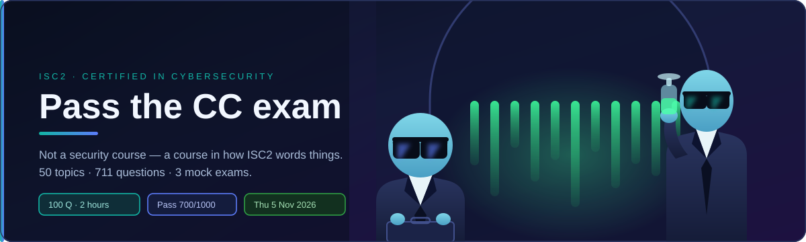
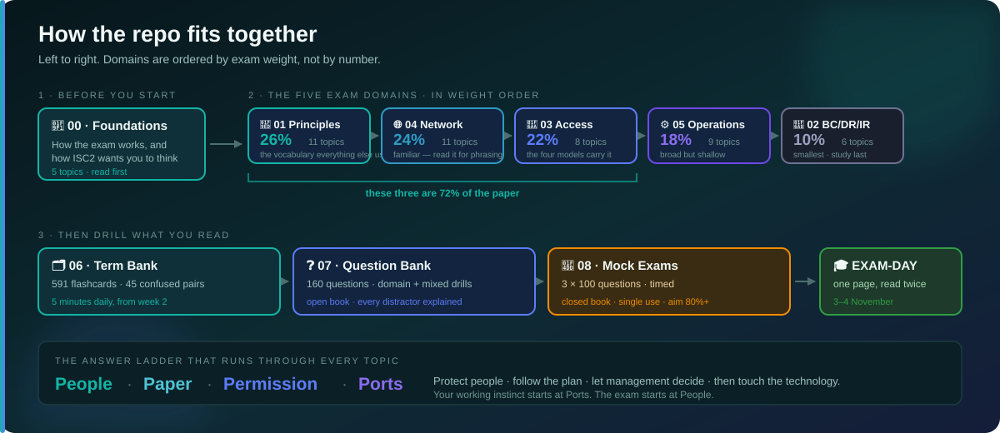
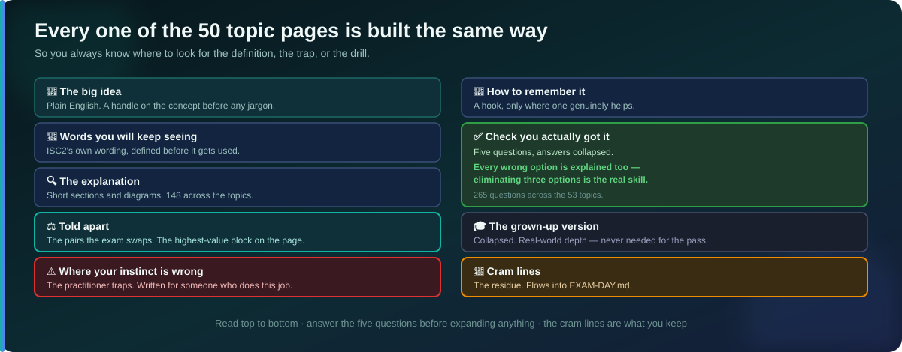

<h1>
🛡️&nbsp; ISC2 CC — Certified in Cybersecurity
</h1>

<h3>
<em>Understand · Define · Tell apart · <strong>Unlearn</strong> · Drill · Recall · Pass</em>
</h3>

<b>9 modules · 53 topics · 738 practice questions</b> 
Built for the <strong>live exam outline, effective 1 September 2026</strong>. Everything the exam can ask, written to be read once and drilled twice. Nothing here is a copy of the ISC2 courseware.

🌐 Prefer to browse? <a href="docs/index.html"><code>docs/index.html</code></a> is a filterable index of every
topic — open it locally, or turn on GitHub Pages from the <code>/docs</code> folder.

---

## 🎯 What this is

A complete study path for the **ISC2 Certified in Cybersecurity (CC)** exam, built to be
worked through in order and finished before **5 November 2026**.

It is deliberately **not** a general cybersecurity course. It teaches the narrower, far more
predictable thing the exam actually measures: **ISC2's vocabulary, ISC2's definitions, and
ISC2's preferred answer** — including the places where those differ from how the work is
really done.

> [!IMPORTANT]
> If you already work in security, the hardest part of this exam is **not** the material.
> It is answering like the textbook instead of like a practitioner. Read
> [`00-foundations/how-isc2-thinks/`](00-foundations/how-isc2-thinks/) before anything else —
> it is the single highest-value page in this repo.

---

## 📊 What the exam weighs

| | Domain | Weight | Module |
|:--:|---|--:|---|
| 🧭 | **Security Principles** | **24%** | [`01-security-principles/`](01-security-principles/README.md) |
| 🌐 | **Networking and Cloud Security Concepts** | **21.3%** | [`04-network-security/`](04-network-security/README.md) |
| 🚪 | **IAM Concepts** | **20%** | [`03-access-control/`](03-access-control/README.md) |
| 🚨 | **Security Governance** | **17.3%** | [`02-security-governance/`](02-security-governance/README.md) |
| ⚙️ | **Security Operations and Incident Response** | **17.3%** | [`05-security-operations/`](05-security-operations/README.md) |

**Domains 1, 4 and 3 are 65.3% of the paper between them.** Study in weight order — 1, then 4,
then 3, then 2 and 5 tied — and if the schedule slips, it slips on whichever of Governance or
Security Operations you reach last, not on Domains 1, 4 or 3.

> [!IMPORTANT]
> These are the **live outline weights, effective 1 September 2026.** The old outline (26% /
> 24% / 22% / 18% / 10%, with Domain 2 = "BC, DR & Incident Response") no longer applies.
> Incident response now lives in Domain 5; Domain 2 is Security Governance (GRC, redundancy,
> awareness, measuring effectiveness).

---

## 📚 The 9 modules

> **Key** &nbsp; 🧱 foundations &nbsp;·&nbsp; 📘 exam domain &nbsp;·&nbsp; 🎯 drill material

### 🧱 Before you start

| | Module | Topics | What it gives you |
|:--:|---|--:|---|
| 🧱 | **[00 · Foundations](00-foundations/README.md)** How the exam works, and how ISC2 wants you to think. | 5 | The blueprint, the answer-selection logic, and a schedule that fits around a full-time job. |

### 📘 The five exam domains

Numbered to match ISC2's own domain numbers, so the syllabus maps straight onto the folders.

| | Module | Topics | Weight | What it covers |
|:--:|---|--:|:--:|---|
| 🧭 | **[01 · Security Principles](01-security-principles/README.md)** The vocabulary the whole exam is built on. | 12 | **24%** | CIA, authentication, non-repudiation, privacy, risk (+lifecycle), controls, governance (+ISO/CIS), ethics, due care/diligence. |
| 🚨 | **[02 · Security Governance](02-security-governance/README.md)** Planning resilience and proving the programme works. | 7 | **17.3%** | GRC, BC/DR, RTO/RPO/MTD, security awareness, measuring effectiveness (KRIs, dashboards). |
| 🚪 | **[03 · IAM Concepts](03-access-control/README.md)** Who gets in, to what, and on whose authority. | 6 | **20%** | Identity lifecycle, DAC/MAC/RBAC/ABAC, least privilege, logical access controls. |
| 🌐 | **[04 · Networking and Cloud Security](04-network-security/README.md)** How networks and clouds are built, attacked and defended. | 14 | **21.3%** | OSI/TCP-IP, ports, wireless/Bluetooth, IoT/ICS, firewalls, segmentation, Zero Trust, cloud. |
| ⚙️ | **[05 · Security Operations and IR](05-security-operations/README.md)** The daily job, plus what happens once it goes wrong. | 14 | **17.3%** | Data handling, encryption, quantum-resistant crypto, CTI, incident response, EOL, security testing. |

### 🎯 Drill material

| | Module | Contents | When to use it |
|:--:|---|---|---|
| 🗂️ | **[06 · Term Bank](06-term-bank/README.md)** Every definition the exam can ask you for. | 651 cards, domain-tagged | From week 2 onward, a few minutes daily |
| ❓ | **[07 · Question Bank](07-question-bank/README.md)** Drills by domain, every wrong answer explained. | 173 here + 265 in the topics | After each domain, then mixed in week 6 |
| 📝 | **[08 · Mock Exams](08-mock-exams/README.md)** Three full fixed-form practice papers. | 3 × 100 questions | Weeks 5 and 7 — not before |

### 🎁 Bonus (outside the ISC2 syllabus, kept separate under `bonus/`)

Lives in its own top-level folder, away from the numbered `00`–`08` exam modules, and is not counted in the "9 modules / 53 topics" totals above — optional background reading, not exam drilling.

| Module | Contents | What it's for |
|---|---|---|
| 🛡️ **[Security Fundamentals](bonus/security-fundamentals/README.md)** General networking &amp; security, taught from zero. | 290 topics (growing) | Anyone who wants the underlying concepts explained in depth, beyond what the CC exam itself tests |

---

## 🗺️ How the repo fits together

**The domains are worked in weight order, not number order** — heaviest first, so if the schedule
slips, what you lose is what was worth least. The folders keep ISC2's own numbering so the
official syllabus maps straight onto them.

The full day-by-day plan is in [`00-foundations/study-schedule/`](00-foundations/study-schedule/README.md).

---

## 📖 Every page is built the same way

| Section | What it gives you |
|---|---|
| 🧸 **The big idea** | A plain-English handle on the concept before any jargon |
| 📖 **Words you will keep seeing** | Every term defined in ISC2's own wording, *before* it gets used |
| 🔍 **The explanation** | Short sections and diagrams, with the tested parts called out |
| ⚖️ **Told apart** | The term pairs the exam deliberately confuses — the highest-value block on the page |
| ⚠️ **Where your instinct is wrong** | Places doing the job well and answering well point different directions |
| 🧠 **How to remember it** | A mnemonic or hook, where one genuinely helps |
| ✅ **Check you actually got it** | Five questions, with **every wrong option explained** |
| 🎓 **The grown-up version** | Collapsed. Real-world depth — never needed for the pass |
| 📝 **Cram lines** | The two or three facts that land in `EXAM-DAY.md` |

Conventions, colours and the full visual language: [`CLAUDE.md`](CLAUDE.md).

---

## 📌 Progress

**The repo is rebuilt for the live outline, effective 1 September 2026.** All 53 domain topics,
the term bank, the question bank, three mock exams and the final cram page are written.

| Module | Status |
|---|---|
| 🧱 00 · Foundations | `5 / 5` ✅ |
| 🧭 01 · Security Principles | `12 / 12` ✅ |
| 🚨 02 · Security Governance | `7 / 7` ✅ |
| 🚪 03 · IAM Concepts | `6 / 6` ✅ |
| 🌐 04 · Networking and Cloud Security | `14 / 14` ✅ |
| ⚙️ 05 · Security Operations and IR | `14 / 14` ✅ |
| 🗂️ 06 · Term Bank | `complete` ✅ |
| ❓ 07 · Question Bank | `complete` ✅ |
| 📝 08 · Mock Exams | `complete` ✅ |
| 🎓 `EXAM-DAY.md` | `complete` ✅ |

### What's in it

| | |
|---|---|
| **Topic pages** | 53, each with definitions, told-apart blocks, traps, 5 questions and cram lines |
| **Practice questions** | **738** — 265 in the topics, 173 in the drills, 300 in the mocks |
| **Flashcards** | **651**, generated from the term tables |
| **Checks** | `ci/check-diagrams.sh` · `ci/check-links.sh` · `ci/make-flashcards.sh` |

### Start here

1. [`00-foundations/how-isc2-thinks/`](00-foundations/how-isc2-thinks/) — the highest-value page
2. [`00-foundations/study-schedule/`](00-foundations/study-schedule/README.md) — the day-by-day plan
3. Then Domain 1, and work the schedule

> 🔥 Having a rough week? [`MOTIVATION.md`](MOTIVATION.md) is a one-page pep talk for exactly
> that — bookmark it now, before you need it.

---

## ⚖️ About this repo

**Everything here is original.** No ISC2 courseware is reproduced — the questions are written to
the published exam blueprint, not taken from any item bank, and the definitions are stated in the
terminology the exam uses rather than copied from it.

**The practice questions are not ISC2's.** They follow the same blueprint and style, and like any
practice bank they run slightly kinder than the real thing. That is why
[`08-mock-exams/scoring-guide.md`](08-mock-exams/scoring-guide.md) sets **80%** as the target
rather than 70%.

Released under the [MIT licence](LICENSE) — use it, fork it, correct it. If you spot an error,
open an issue.

---

Built for one exam sitting on <b>5 November 2026</b>. After that it is a reference, not a plan.

