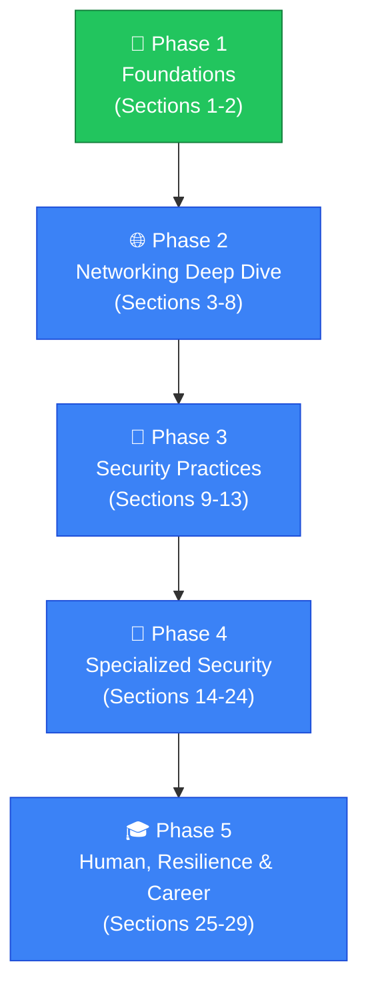

> [!NOTE]
> **🎁 Bonus module — not part of the ISC2 CC syllabus.** This is a general networking &amp;
> security fundamentals path (290 topics), kept in its own `bonus/` folder, separate from the
> numbered `00`–`08` exam modules. Those modules are scoped tightly to what the ISC2 CC exam
> tests; this one is broader background reading for anyone who wants the underlying concepts
> explained from zero, not exam-specific drilling. It does not count toward the "9 modules / 53
> topics" totals on the main [`README.md`](../../README.md), and its pages follow their own
> layout (see [How a Lesson Is Structured](#-how-a-lesson-is-structured) below), not
> `CLAUDE.md`'s exam-page format. This is now the only copy — the standalone
> `security-fundamentals` repo it originated from has been deleted.

# 🛡️ Security Fundamentals

### A caveman-simple, professionally-written path from zero to solid networking &amp; security fundamentals

---

## 📚 What This Is

Every topic here is a **self-contained lesson** that follows the same promise: read it once, and understand exactly **what** the thing is, **why** it exists, **how** it works, and **where** it shows up in real systems.

- 🧠 Starts from zero — no prior knowledge assumed
- 📖 Opens with a short, plain-language story before any jargon
- 🎯 Explains the *why*, not just the *what*
- 🧪 Ends with a quick self-check
- 🖼️ Uses diagrams to make the mechanics visible, not just for decoration

## 🗺️ The Learning Path

The path is organized into **29 sections**, grouped into five broad phases — from raw networking basics, through core security thinking, into specialized modern security domains, and finally practical/career skills:

🟢 Green = phase in progress or complete &nbsp;·&nbsp; 🔵 Blue = not started yet

> 💡 **Notes on ordering:** Core Security Concepts (CIA Triad, Threat, Vulnerability, Risk, etc.) was moved up to Section 2, right after basic networking vocabulary, so beginner security thinking is introduced early. A **Malware & Email Security** section was added after Network Devices — essential beginner topics not in the original list. The curriculum was then expanded from the original 130 topics to **290**, adding full sections on web application security, cryptography, cloud security, wireless/IoT security, advanced threats, digital forensics, security operations, governance/risk/compliance, deeper identity & endpoint security, advanced network architecture, API security, physical/human security, backup & resilience, career skills, hands-on tools, and emerging technology — so the path goes all the way from absolute zero to genuinely professional-level coverage.

## 🗂️ Section Overview

All 29 sections, with every topic name, in one place — no scrolling through one long list. ✅ = live and linked, ⬜ = coming up. Progress is filled in as topics are pushed.

<table>
<tr>
<td valign="top">

**✅ 1. Networking Foundations — 10/10**
<ul>
<li>✅ <a href="topics/01-ip-address.md">IP Address</a></li>
<li>✅ <a href="topics/02-ipv4-vs-ipv6.md">IPv4 vs IPv6</a></li>
<li>✅ <a href="topics/03-public-vs-private-ip.md">Public vs Private IP</a></li>
<li>✅ <a href="topics/04-mac-address.md">MAC Address</a></li>
<li>✅ <a href="topics/05-port.md">Port</a></li>
<li>✅ <a href="topics/06-protocol.md">Protocol</a></li>
<li>✅ <a href="topics/07-packet.md">Packet</a></li>
<li>✅ <a href="topics/08-client-vs-server.md">Client vs Server</a></li>
<li>✅ <a href="topics/09-lan-wan-internet.md">LAN, WAN, and Internet</a></li>
<li>✅ <a href="topics/10-network-interface-nic.md">Network Interface / NIC</a></li>
</ul>

</td>
<td valign="top">

**✅ 2. Core Security Concepts — 10/10**
<ul>
<li>✅ <a href="topics/11-cia-triad.md">CIA Triad</a></li>
<li>✅ <a href="topics/12-attack-surface.md">Attack Surface</a></li>
<li>✅ <a href="topics/13-threat.md">Threat</a></li>
<li>✅ <a href="topics/14-vulnerability.md">Vulnerability</a></li>
<li>✅ <a href="topics/15-exploit.md">Exploit</a></li>
<li>✅ <a href="topics/16-risk.md">Risk</a></li>
<li>✅ <a href="topics/17-defense-in-depth.md">Defense in Depth</a></li>
<li>✅ <a href="topics/18-least-privilege.md">Least Privilege</a></li>
<li>✅ <a href="topics/19-security-controls.md">Security Controls</a></li>
<li>✅ <a href="topics/20-threat-modeling.md">Threat Modeling</a></li>
</ul>

</td>
</tr>
<tr>
<td valign="top">

**✅ 3. IP Networking — 11/11**
<ul>
<li>✅ <a href="topics/21-subnet-mask.md">Subnet Mask</a></li>
<li>✅ <a href="topics/22-cidr.md">CIDR</a></li>
<li>✅ <a href="topics/23-subnetting.md">Subnetting</a></li>
<li>✅ <a href="topics/24-network-address.md">Network Address</a></li>
<li>✅ <a href="topics/25-broadcast-address.md">Broadcast Address</a></li>
<li>✅ <a href="topics/26-default-gateway.md">Default Gateway</a></li>
<li>✅ <a href="topics/27-routing.md">Routing</a></li>
<li>✅ <a href="topics/28-routing-table.md">Routing Table</a></li>
<li>✅ <a href="topics/29-static-vs-dynamic-routing.md">Static vs Dynamic Routing</a></li>
<li>✅ <a href="topics/30-nat.md">NAT</a></li>
<li>✅ <a href="topics/31-pat.md">PAT</a></li>
</ul>

</td>
<td valign="top">

**🚧 4. Core Network Protocols — 8/14**
<ul>
<li>✅ <a href="topics/32-arp.md">ARP</a></li>
<li>✅ <a href="topics/33-icmp.md">ICMP</a></li>
<li>✅ <a href="topics/34-tcp.md">TCP</a></li>
<li>✅ <a href="topics/35-udp.md">UDP</a></li>
<li>✅ <a href="topics/36-tcp-3-way-handshake.md">TCP 3-Way Handshake</a></li>
<li>✅ <a href="topics/37-dns.md">DNS</a></li>
<li>✅ <a href="topics/38-dhcp.md">DHCP</a></li>
<li>✅ <a href="topics/39-http.md">HTTP</a></li>
<li>✅ <a href="topics/40-https.md">HTTPS</a></li>
<li>✅ <a href="topics/41-tls.md">TLS</a></li>
<li>✅ <a href="topics/42-ssh.md">SSH</a></li>
<li>✅ <a href="topics/43-ftp-sftp.md">FTP / SFTP</a></li>
<li>✅ <a href="topics/44-smtp.md">SMTP</a></li>
<li>✅ <a href="topics/45-imap-pop3.md">IMAP / POP3</a></li>
</ul>

</td>
</tr>
<tr>
<td valign="top">

**⬜ 5. How the Internet Works — 0/10**
<ul>
<li>⬜ DNS Resolution</li>
<li>⬜ What Happens When You Enter a URL</li>
<li>⬜ HTTP Request and Response</li>
<li>⬜ Web Server</li>
<li>⬜ Proxy</li>
<li>⬜ Reverse Proxy</li>
<li>⬜ Load Balancer</li>
<li>⬜ CDN</li>
<li>⬜ VPN</li>
<li>⬜ Tunneling</li>
</ul>

</td>
<td valign="top">

**⬜ 6. Network Devices — 0/9**
<ul>
<li>⬜ Switch</li>
<li>⬜ Router</li>
<li>⬜ Firewall</li>
<li>⬜ Access Point</li>
<li>⬜ Modem</li>
<li>⬜ Gateway</li>
<li>⬜ IDS</li>
<li>⬜ IPS</li>
<li>⬜ WAF</li>
</ul>

</td>
</tr>
<tr>
<td valign="top">

**⬜ 7. Malware & Email Security — 0/7**
<ul>
<li>⬜ Malware (Overview)</li>
<li>⬜ Virus</li>
<li>⬜ Worm</li>
<li>⬜ Trojan</li>
<li>⬜ Ransomware</li>
<li>⬜ Spyware</li>
<li>⬜ Email Security Gateway</li>
</ul>

</td>
<td valign="top">

**⬜ 8. Network Models — 0/7**
<ul>
<li>⬜ OSI Model</li>
<li>⬜ TCP/IP Model</li>
<li>⬜ Encapsulation</li>
<li>⬜ Decapsulation</li>
<li>⬜ Layer 2 vs Layer 3</li>
<li>⬜ Layer 4</li>
<li>⬜ Layer 7</li>
</ul>

</td>
</tr>
<tr>
<td valign="top">

**⬜ 9. Network Security — 0/14**
<ul>
<li>⬜ Firewall Rules</li>
<li>⬜ Stateful vs Stateless Firewall</li>
<li>⬜ Network Segmentation</li>
<li>⬜ VLAN</li>
<li>⬜ DMZ</li>
<li>⬜ Zero Trust</li>
<li>⬜ Authentication</li>
<li>⬜ Authorization</li>
<li>⬜ Access Control</li>
<li>⬜ Encryption</li>
<li>⬜ Hashing</li>
<li>⬜ Digital Certificates</li>
<li>⬜ Public Key vs Private Key</li>
<li>⬜ PKI</li>
</ul>

</td>
<td valign="top">

**⬜ 10. Common Network Attacks — 0/14**
<ul>
<li>⬜ Port Scanning</li>
<li>⬜ Packet Sniffing</li>
<li>⬜ ARP Spoofing</li>
<li>⬜ DNS Spoofing</li>
<li>⬜ Man-in-the-Middle Attack</li>
<li>⬜ DDoS</li>
<li>⬜ DNS Tunneling</li>
<li>⬜ IP Spoofing</li>
<li>⬜ Session Hijacking</li>
<li>⬜ Rogue Access Point</li>
<li>⬜ Evil Twin</li>
<li>⬜ Phishing</li>
<li>⬜ Brute Force</li>
<li>⬜ Password Spraying</li>
</ul>

</td>
</tr>
<tr>
<td valign="top">

**⬜ 11. Security Infrastructure — 0/10**
<ul>
<li>⬜ Active Directory</li>
<li>⬜ Domain</li>
<li>⬜ Domain Controller</li>
<li>⬜ LDAP</li>
<li>⬜ Kerberos</li>
<li>⬜ Group Policy</li>
<li>⬜ DNS in Active Directory</li>
<li>⬜ Identity and Access Management</li>
<li>⬜ MFA</li>
<li>⬜ SSO</li>
</ul>

</td>
<td valign="top">

**⬜ 12. Operating System Networking — 0/11**
<ul>
<li>⬜ Linux Networking</li>
<li>⬜ Windows Networking</li>
<li>⬜ Network Interfaces</li>
<li>⬜ Routing Commands</li>
<li>⬜ DNS Commands</li>
<li>⬜ Ping</li>
<li>⬜ Traceroute / Tracert</li>
<li>⬜ Nslookup / Dig</li>
<li>⬜ Netstat / SS</li>
<li>⬜ ARP Commands</li>
<li>⬜ Hosts File</li>
</ul>

</td>
</tr>
<tr>
<td valign="top">

**⬜ 13. Practical Cybersecurity — 0/10**
<ul>
<li>⬜ Logs</li>
<li>⬜ Packet Capture</li>
<li>⬜ Wireshark</li>
<li>⬜ Nmap</li>
<li>⬜ SIEM</li>
<li>⬜ EDR</li>
<li>⬜ IDS/IPS Monitoring</li>
<li>⬜ Network Traffic Analysis</li>
<li>⬜ Incident Detection</li>
<li>⬜ Incident Response</li>
</ul>

</td>
<td valign="top">

**⬜ 14. Web Application Security — 0/14**
<ul>
<li>⬜ OWASP Top 10 Overview</li>
<li>⬜ SQL Injection</li>
<li>⬜ Cross-Site Scripting (XSS)</li>
<li>⬜ Cross-Site Request Forgery (CSRF)</li>
<li>⬜ Command Injection</li>
<li>⬜ Directory Traversal</li>
<li>⬜ Insecure Deserialization</li>
<li>⬜ Broken Authentication</li>
<li>⬜ Security Misconfiguration</li>
<li>⬜ Sensitive Data Exposure</li>
<li>⬜ Server-Side Request Forgery (SSRF)</li>
<li>⬜ Input Validation</li>
<li>⬜ Secure Coding Practices</li>
<li>⬜ Rate Limiting</li>
</ul>

</td>
</tr>
<tr>
<td valign="top">

**⬜ 15. Cryptography Deep Dive — 0/13**
<ul>
<li>⬜ Symmetric Encryption</li>
<li>⬜ Asymmetric Encryption</li>
<li>⬜ Common Hashing Algorithms</li>
<li>⬜ Salting and Peppering</li>
<li>⬜ Digital Signatures Deep Dive</li>
<li>⬜ Key Exchange</li>
<li>⬜ Cipher Types (Block vs Stream)</li>
<li>⬜ Cryptographic Attacks</li>
<li>⬜ Steganography</li>
<li>⬜ Certificate Authorities</li>
<li>⬜ TLS Handshake Deep Dive</li>
<li>⬜ Perfect Forward Secrecy</li>
<li>⬜ Post-Quantum Cryptography</li>
</ul>

</td>
<td valign="top">

**⬜ 16. Cloud Security — 0/11**
<ul>
<li>⬜ What Is Cloud Computing</li>
<li>⬜ IaaS vs PaaS vs SaaS</li>
<li>⬜ Shared Responsibility Model</li>
<li>⬜ Cloud Identity and Access Management</li>
<li>⬜ Cloud Storage Security</li>
<li>⬜ Cloud Misconfigurations</li>
<li>⬜ Container Security</li>
<li>⬜ Kubernetes Security Basics</li>
<li>⬜ Serverless Security</li>
<li>⬜ Cloud Security Posture Management (CSPM)</li>
<li>⬜ Multi-Cloud Security</li>
</ul>

</td>
</tr>
<tr>
<td valign="top">

**⬜ 17. Wireless & IoT Security — 0/7**
<ul>
<li>⬜ Wireless Networking Basics (802.11)</li>
<li>⬜ WEP vs WPA vs WPA2 vs WPA3</li>
<li>⬜ Bluetooth Security</li>
<li>⬜ IoT Security Challenges</li>
<li>⬜ Smart Home Security</li>
<li>⬜ Industrial Control Systems (ICS/SCADA) Security</li>
<li>⬜ RFID and NFC Security</li>
</ul>

</td>
<td valign="top">

**⬜ 18. Advanced Threats & Threat Intelligence — 0/10**
<ul>
<li>⬜ Advanced Persistent Threat (APT)</li>
<li>⬜ Command and Control (C2)</li>
<li>⬜ Cyber Kill Chain</li>
<li>⬜ MITRE ATT&CK Framework</li>
<li>⬜ Botnets</li>
<li>⬜ Zero-Day Vulnerabilities</li>
<li>⬜ Threat Intelligence</li>
<li>⬜ Indicators of Compromise (IOC)</li>
<li>⬜ Threat Hunting</li>
<li>⬜ Supply Chain Attacks</li>
</ul>

</td>
</tr>
<tr>
<td valign="top">

**⬜ 19. Malware Analysis & Digital Forensics — 0/10**
<ul>
<li>⬜ Static Malware Analysis</li>
<li>⬜ Dynamic Malware Analysis</li>
<li>⬜ Sandboxing</li>
<li>⬜ Digital Forensics Basics</li>
<li>⬜ Chain of Custody</li>
<li>⬜ Disk Forensics</li>
<li>⬜ Memory Forensics</li>
<li>⬜ Log Forensics</li>
<li>⬜ Forensic Imaging</li>
<li>⬜ Anti-Forensics Techniques</li>
</ul>

</td>
<td valign="top">

**⬜ 20. Security Operations & Frameworks — 0/11**
<ul>
<li>⬜ Security Operations Center (SOC) Overview</li>
<li>⬜ SOC Analyst Tiers</li>
<li>⬜ SOAR</li>
<li>⬜ Security Use Case Development</li>
<li>⬜ Incident Response Playbooks</li>
<li>⬜ MITRE ATT&CK Mapping in Practice</li>
<li>⬜ Vulnerability Management Lifecycle</li>
<li>⬜ Patch Management</li>
<li>⬜ Endpoint Detection and Response (Deep Dive)</li>
<li>⬜ Extended Detection and Response (XDR)</li>
<li>⬜ Managed Detection and Response (MDR)</li>
</ul>

</td>
</tr>
<tr>
<td valign="top">

**⬜ 21. Governance, Risk & Compliance (GRC) — 0/13**
<ul>
<li>⬜ What Is GRC</li>
<li>⬜ Risk Management Frameworks</li>
<li>⬜ NIST Cybersecurity Framework</li>
<li>⬜ ISO 27001</li>
<li>⬜ CIS Controls</li>
<li>⬜ PCI-DSS</li>
<li>⬜ HIPAA</li>
<li>⬜ GDPR</li>
<li>⬜ SOX</li>
<li>⬜ Security Policies</li>
<li>⬜ Business Continuity Planning</li>
<li>⬜ Disaster Recovery Planning</li>
<li>⬜ Security Audits</li>
</ul>

</td>
<td valign="top">

**⬜ 22. Identity, Access & Endpoint Security Deep Dive — 0/9**
<ul>
<li>⬜ Privileged Access Management (PAM)</li>
<li>⬜ Role-Based Access Control (RBAC)</li>
<li>⬜ Attribute-Based Access Control (ABAC)</li>
<li>⬜ Conditional Access</li>
<li>⬜ Endpoint Security Overview</li>
<li>⬜ Mobile Device Management (MDM)</li>
<li>⬜ Network Access Control (NAC)</li>
<li>⬜ Data Loss Prevention (DLP)</li>
<li>⬜ User and Entity Behavior Analytics (UEBA)</li>
</ul>

</td>
</tr>
<tr>
<td valign="top">

**⬜ 23. Network Architecture & Advanced Routing — 0/8**
<ul>
<li>⬜ VLAN Trunking (802.1Q)</li>
<li>⬜ Spanning Tree Protocol</li>
<li>⬜ Link Aggregation</li>
<li>⬜ OSPF Basics</li>
<li>⬜ BGP Basics</li>
<li>⬜ Software-Defined Networking (SDN)</li>
<li>⬜ Network Automation Basics</li>
<li>⬜ Quality of Service (QoS)</li>
</ul>

</td>
<td valign="top">

**⬜ 24. Application & API Security Deep Dive — 0/10**
<ul>
<li>⬜ REST API Security</li>
<li>⬜ OAuth 2.0</li>
<li>⬜ OpenID Connect</li>
<li>⬜ JWT (JSON Web Tokens)</li>
<li>⬜ API Gateway Security</li>
<li>⬜ Secure Software Development Lifecycle (SSDLC)</li>
<li>⬜ DevSecOps</li>
<li>⬜ CI/CD Pipeline Security</li>
<li>⬜ Static Application Security Testing (SAST)</li>
<li>⬜ Dynamic Application Security Testing (DAST)</li>
</ul>

</td>
</tr>
<tr>
<td valign="top">

**⬜ 25. Physical & Human Security — 0/6**
<ul>
<li>⬜ Physical Security Controls</li>
<li>⬜ Social Engineering Techniques</li>
<li>⬜ Dumpster Diving</li>
<li>⬜ Shoulder Surfing</li>
<li>⬜ Security Culture and Awareness</li>
<li>⬜ Insider Threat Programs</li>
</ul>

</td>
<td valign="top">

**⬜ 26. Backup, Recovery & Resilience — 0/7**
<ul>
<li>⬜ Backup Types (Full, Incremental, Differential)</li>
<li>⬜ The 3-2-1 Backup Rule</li>
<li>⬜ High Availability</li>
<li>⬜ Redundancy</li>
<li>⬜ Failover</li>
<li>⬜ Business Impact Analysis</li>
<li>⬜ Disaster Recovery Sites (Hot/Warm/Cold)</li>
</ul>

</td>
</tr>
<tr>
<td valign="top">

**⬜ 27. Career, Certifications & Practical Skills — 0/9**
<ul>
<li>⬜ Types of Cybersecurity Roles</li>
<li>⬜ Blue Team vs Red Team vs Purple Team</li>
<li>⬜ Common Security Certifications Overview</li>
<li>⬜ Capture The Flag (CTF) Basics</li>
<li>⬜ Bug Bounty Basics</li>
<li>⬜ Building a Home Lab</li>
<li>⬜ Security Awareness Training Programs</li>
<li>⬜ Writing a Security Incident Report</li>
<li>⬜ Interview & Career Preparation Basics</li>
</ul>

</td>
<td valign="top">

**⬜ 28. Hands-On Practice & Tools — 0/8**
<ul>
<li>⬜ Metasploit Basics</li>
<li>⬜ Burp Suite Basics</li>
<li>⬜ OSINT Basics</li>
<li>⬜ Kali Linux Overview</li>
<li>⬜ Vulnerability Scanners (Nessus / OpenVAS)</li>
<li>⬜ Password Cracking Tools (Hashcat / John the Ripper)</li>
<li>⬜ Setting Up a SOC Home Lab</li>
<li>⬜ Building a Personal CTF Practice Environment</li>
</ul>

</td>
</tr>
<tr>
<td valign="top">

**⬜ 29. Emerging & Advanced Topics — 0/7**
<ul>
<li>⬜ Artificial Intelligence in Security</li>
<li>⬜ Machine Learning for Threat Detection</li>
<li>⬜ Blockchain Security Basics</li>
<li>⬜ Quantum Computing's Impact on Security</li>
<li>⬜ 5G Network Security</li>
<li>⬜ Deepfakes and Security Implications</li>
<li>⬜ Cybersecurity Ethics and Law</li>
</ul>

</td>
<td valign="top">

</td>
</tr>
</table>

## ✅ Topic Checklist

Topics are unlocked and pushed **one at a time**, in order. Checked boxes are live and linked; unchecked ones are still coming.

<b>🌱 Phase 1 — Foundations</b>

### 🌐 1. Networking Foundations
- [x] 1. [IP Address](topics/01-ip-address.md)
- [x] 2. [IPv4 vs IPv6](topics/02-ipv4-vs-ipv6.md)
- [x] 3. [Public vs Private IP](topics/03-public-vs-private-ip.md)
- [x] 4. [MAC Address](topics/04-mac-address.md)
- [x] 5. [Port](topics/05-port.md)
- [x] 6. [Protocol](topics/06-protocol.md)
- [x] 7. [Packet](topics/07-packet.md)
- [x] 8. [Client vs Server](topics/08-client-vs-server.md)
- [x] 9. [LAN, WAN, and Internet](topics/09-lan-wan-internet.md)
- [x] 10. [Network Interface / NIC](topics/10-network-interface-nic.md)

### 🧭 2. Core Security Concepts
- [x] 11. [CIA Triad](topics/11-cia-triad.md)
- [x] 12. [Attack Surface](topics/12-attack-surface.md)
- [x] 13. [Threat](topics/13-threat.md)
- [x] 14. [Vulnerability](topics/14-vulnerability.md)
- [x] 15. [Exploit](topics/15-exploit.md)
- [x] 16. [Risk](topics/16-risk.md)
- [x] 17. [Defense in Depth](topics/17-defense-in-depth.md)
- [x] 18. [Least Privilege](topics/18-least-privilege.md)
- [x] 19. [Security Controls](topics/19-security-controls.md)
- [x] 20. [Threat Modeling](topics/20-threat-modeling.md)

<b>🌐 Phase 2 — Networking Deep Dive</b>

### 🧮 3. IP Networking
- [x] 21. [Subnet Mask](topics/21-subnet-mask.md)
- [x] 22. [CIDR](topics/22-cidr.md)
- [x] 23. [Subnetting](topics/23-subnetting.md)
- [x] 24. [Network Address](topics/24-network-address.md)
- [x] 25. [Broadcast Address](topics/25-broadcast-address.md)
- [x] 26. [Default Gateway](topics/26-default-gateway.md)
- [x] 27. [Routing](topics/27-routing.md)
- [x] 28. [Routing Table](topics/28-routing-table.md)
- [x] 29. [Static vs Dynamic Routing](topics/29-static-vs-dynamic-routing.md)
- [x] 30. [NAT](topics/30-nat.md)
- [x] 31. [PAT](topics/31-pat.md)

### 📡 4. Core Network Protocols
- [x] 32. [ARP](topics/32-arp.md)
- [x] 33. [ICMP](topics/33-icmp.md)
- [x] 34. [TCP](topics/34-tcp.md)
- [x] 35. [UDP](topics/35-udp.md)
- [x] 36. [TCP 3-Way Handshake](topics/36-tcp-3-way-handshake.md)
- [x] 37. [DNS](topics/37-dns.md)
- [x] 38. [DHCP](topics/38-dhcp.md)
- [x] 39. [HTTP](topics/39-http.md)
- [x] 40. [HTTPS](topics/40-https.md)
- [x] 41. [TLS](topics/41-tls.md)
- [x] 42. [SSH](topics/42-ssh.md)
- [x] 43. [FTP / SFTP](topics/43-ftp-sftp.md)
- [x] 44. [SMTP](topics/44-smtp.md)
- [x] 45. [IMAP / POP3](topics/45-imap-pop3.md)

### 🖥️ 5. How the Internet Works
- [ ] 46. DNS Resolution
- [ ] 47. What Happens When You Enter a URL
- [ ] 48. HTTP Request and Response
- [ ] 49. Web Server
- [ ] 50. Proxy
- [ ] 51. Reverse Proxy
- [ ] 52. Load Balancer
- [ ] 53. CDN
- [ ] 54. VPN
- [ ] 55. Tunneling

### 🔌 6. Network Devices
- [ ] 56. Switch
- [ ] 57. Router
- [ ] 58. Firewall
- [ ] 59. Access Point
- [ ] 60. Modem
- [ ] 61. Gateway
- [ ] 62. IDS
- [ ] 63. IPS
- [ ] 64. WAF

### 🦠 7. Malware & Email Security
- [ ] 65. Malware (Overview)
- [ ] 66. Virus
- [ ] 67. Worm
- [ ] 68. Trojan
- [ ] 69. Ransomware
- [ ] 70. Spyware
- [ ] 71. Email Security Gateway

### 🧩 8. Network Models
- [ ] 72. OSI Model
- [ ] 73. TCP/IP Model
- [ ] 74. Encapsulation
- [ ] 75. Decapsulation
- [ ] 76. Layer 2 vs Layer 3
- [ ] 77. Layer 4
- [ ] 78. Layer 7

<b>🔐 Phase 3 — Security Practices</b>

### 🔐 9. Network Security
- [ ] 79. Firewall Rules
- [ ] 80. Stateful vs Stateless Firewall
- [ ] 81. Network Segmentation
- [ ] 82. VLAN
- [ ] 83. DMZ
- [ ] 84. Zero Trust
- [ ] 85. Authentication
- [ ] 86. Authorization
- [ ] 87. Access Control
- [ ] 88. Encryption
- [ ] 89. Hashing
- [ ] 90. Digital Certificates
- [ ] 91. Public Key vs Private Key
- [ ] 92. PKI

### 🎭 10. Common Network Attacks
- [ ] 93. Port Scanning
- [ ] 94. Packet Sniffing
- [ ] 95. ARP Spoofing
- [ ] 96. DNS Spoofing
- [ ] 97. Man-in-the-Middle Attack
- [ ] 98. DDoS
- [ ] 99. DNS Tunneling
- [ ] 100. IP Spoofing
- [ ] 101. Session Hijacking
- [ ] 102. Rogue Access Point
- [ ] 103. Evil Twin
- [ ] 104. Phishing
- [ ] 105. Brute Force
- [ ] 106. Password Spraying

### 🏛️ 11. Security Infrastructure
- [ ] 107. Active Directory
- [ ] 108. Domain
- [ ] 109. Domain Controller
- [ ] 110. LDAP
- [ ] 111. Kerberos
- [ ] 112. Group Policy
- [ ] 113. DNS in Active Directory
- [ ] 114. Identity and Access Management
- [ ] 115. MFA
- [ ] 116. SSO

### 🖱️ 12. Operating System Networking
- [ ] 117. Linux Networking
- [ ] 118. Windows Networking
- [ ] 119. Network Interfaces
- [ ] 120. Routing Commands
- [ ] 121. DNS Commands
- [ ] 122. Ping
- [ ] 123. Traceroute / Tracert
- [ ] 124. Nslookup / Dig
- [ ] 125. Netstat / SS
- [ ] 126. ARP Commands
- [ ] 127. Hosts File

### 🔍 13. Practical Cybersecurity
- [ ] 128. Logs
- [ ] 129. Packet Capture
- [ ] 130. Wireshark
- [ ] 131. Nmap
- [ ] 132. SIEM
- [ ] 133. EDR
- [ ] 134. IDS/IPS Monitoring
- [ ] 135. Network Traffic Analysis
- [ ] 136. Incident Detection
- [ ] 137. Incident Response

<b>🎯 Phase 4 — Specialized Security</b>

### 🕸️ 14. Web Application Security
- [ ] 138. OWASP Top 10 Overview
- [ ] 139. SQL Injection
- [ ] 140. Cross-Site Scripting (XSS)
- [ ] 141. Cross-Site Request Forgery (CSRF)
- [ ] 142. Command Injection
- [ ] 143. Directory Traversal
- [ ] 144. Insecure Deserialization
- [ ] 145. Broken Authentication
- [ ] 146. Security Misconfiguration
- [ ] 147. Sensitive Data Exposure
- [ ] 148. Server-Side Request Forgery (SSRF)
- [ ] 149. Input Validation
- [ ] 150. Secure Coding Practices
- [ ] 151. Rate Limiting

### 🔑 15. Cryptography Deep Dive
- [ ] 152. Symmetric Encryption
- [ ] 153. Asymmetric Encryption
- [ ] 154. Common Hashing Algorithms
- [ ] 155. Salting and Peppering
- [ ] 156. Digital Signatures Deep Dive
- [ ] 157. Key Exchange
- [ ] 158. Cipher Types (Block vs Stream)
- [ ] 159. Cryptographic Attacks
- [ ] 160. Steganography
- [ ] 161. Certificate Authorities
- [ ] 162. TLS Handshake Deep Dive
- [ ] 163. Perfect Forward Secrecy
- [ ] 164. Post-Quantum Cryptography

### ☁️ 16. Cloud Security
- [ ] 165. What Is Cloud Computing
- [ ] 166. IaaS vs PaaS vs SaaS
- [ ] 167. Shared Responsibility Model
- [ ] 168. Cloud Identity and Access Management
- [ ] 169. Cloud Storage Security
- [ ] 170. Cloud Misconfigurations
- [ ] 171. Container Security
- [ ] 172. Kubernetes Security Basics
- [ ] 173. Serverless Security
- [ ] 174. Cloud Security Posture Management (CSPM)
- [ ] 175. Multi-Cloud Security

### 📶 17. Wireless & IoT Security
- [ ] 176. Wireless Networking Basics (802.11)
- [ ] 177. WEP vs WPA vs WPA2 vs WPA3
- [ ] 178. Bluetooth Security
- [ ] 179. IoT Security Challenges
- [ ] 180. Smart Home Security
- [ ] 181. Industrial Control Systems (ICS/SCADA) Security
- [ ] 182. RFID and NFC Security

### 🕵️ 18. Advanced Threats & Threat Intelligence
- [ ] 183. Advanced Persistent Threat (APT)
- [ ] 184. Command and Control (C2)
- [ ] 185. Cyber Kill Chain
- [ ] 186. MITRE ATT&CK Framework
- [ ] 187. Botnets
- [ ] 188. Zero-Day Vulnerabilities
- [ ] 189. Threat Intelligence
- [ ] 190. Indicators of Compromise (IOC)
- [ ] 191. Threat Hunting
- [ ] 192. Supply Chain Attacks

### 🔬 19. Malware Analysis & Digital Forensics
- [ ] 193. Static Malware Analysis
- [ ] 194. Dynamic Malware Analysis
- [ ] 195. Sandboxing
- [ ] 196. Digital Forensics Basics
- [ ] 197. Chain of Custody
- [ ] 198. Disk Forensics
- [ ] 199. Memory Forensics
- [ ] 200. Log Forensics
- [ ] 201. Forensic Imaging
- [ ] 202. Anti-Forensics Techniques

### 🛰️ 20. Security Operations & Frameworks
- [ ] 203. Security Operations Center (SOC) Overview
- [ ] 204. SOC Analyst Tiers
- [ ] 205. SOAR
- [ ] 206. Security Use Case Development
- [ ] 207. Incident Response Playbooks
- [ ] 208. MITRE ATT&CK Mapping in Practice
- [ ] 209. Vulnerability Management Lifecycle
- [ ] 210. Patch Management
- [ ] 211. Endpoint Detection and Response (Deep Dive)
- [ ] 212. Extended Detection and Response (XDR)
- [ ] 213. Managed Detection and Response (MDR)

### ⚖️ 21. Governance, Risk & Compliance (GRC)
- [ ] 214. What Is GRC
- [ ] 215. Risk Management Frameworks
- [ ] 216. NIST Cybersecurity Framework
- [ ] 217. ISO 27001
- [ ] 218. CIS Controls
- [ ] 219. PCI-DSS
- [ ] 220. HIPAA
- [ ] 221. GDPR
- [ ] 222. SOX
- [ ] 223. Security Policies
- [ ] 224. Business Continuity Planning
- [ ] 225. Disaster Recovery Planning
- [ ] 226. Security Audits

### 🪪 22. Identity, Access & Endpoint Security Deep Dive
- [ ] 227. Privileged Access Management (PAM)
- [ ] 228. Role-Based Access Control (RBAC)
- [ ] 229. Attribute-Based Access Control (ABAC)
- [ ] 230. Conditional Access
- [ ] 231. Endpoint Security Overview
- [ ] 232. Mobile Device Management (MDM)
- [ ] 233. Network Access Control (NAC)
- [ ] 234. Data Loss Prevention (DLP)
- [ ] 235. User and Entity Behavior Analytics (UEBA)

### 🧭 23. Network Architecture & Advanced Routing
- [ ] 236. VLAN Trunking (802.1Q)
- [ ] 237. Spanning Tree Protocol
- [ ] 238. Link Aggregation
- [ ] 239. OSPF Basics
- [ ] 240. BGP Basics
- [ ] 241. Software-Defined Networking (SDN)
- [ ] 242. Network Automation Basics
- [ ] 243. Quality of Service (QoS)

### 🔗 24. Application & API Security Deep Dive
- [ ] 244. REST API Security
- [ ] 245. OAuth 2.0
- [ ] 246. OpenID Connect
- [ ] 247. JWT (JSON Web Tokens)
- [ ] 248. API Gateway Security
- [ ] 249. Secure Software Development Lifecycle (SSDLC)
- [ ] 250. DevSecOps
- [ ] 251. CI/CD Pipeline Security
- [ ] 252. Static Application Security Testing (SAST)
- [ ] 253. Dynamic Application Security Testing (DAST)

<b>🎓 Phase 5 — Human, Resilience & Career</b>

### 🚪 25. Physical & Human Security
- [ ] 254. Physical Security Controls
- [ ] 255. Social Engineering Techniques
- [ ] 256. Dumpster Diving
- [ ] 257. Shoulder Surfing
- [ ] 258. Security Culture and Awareness
- [ ] 259. Insider Threat Programs

### 💾 26. Backup, Recovery & Resilience
- [ ] 260. Backup Types (Full, Incremental, Differential)
- [ ] 261. The 3-2-1 Backup Rule
- [ ] 262. High Availability
- [ ] 263. Redundancy
- [ ] 264. Failover
- [ ] 265. Business Impact Analysis
- [ ] 266. Disaster Recovery Sites (Hot/Warm/Cold)

### 🎓 27. Career, Certifications & Practical Skills
- [ ] 267. Types of Cybersecurity Roles
- [ ] 268. Blue Team vs Red Team vs Purple Team
- [ ] 269. Common Security Certifications Overview
- [ ] 270. Capture The Flag (CTF) Basics
- [ ] 271. Bug Bounty Basics
- [ ] 272. Building a Home Lab
- [ ] 273. Security Awareness Training Programs
- [ ] 274. Writing a Security Incident Report
- [ ] 275. Interview & Career Preparation Basics

### 🧰 28. Hands-On Practice & Tools
- [ ] 276. Metasploit Basics
- [ ] 277. Burp Suite Basics
- [ ] 278. OSINT Basics
- [ ] 279. Kali Linux Overview
- [ ] 280. Vulnerability Scanners (Nessus / OpenVAS)
- [ ] 281. Password Cracking Tools (Hashcat / John the Ripper)
- [ ] 282. Setting Up a SOC Home Lab
- [ ] 283. Building a Personal CTF Practice Environment

### 🚀 29. Emerging & Advanced Topics
- [ ] 284. Artificial Intelligence in Security
- [ ] 285. Machine Learning for Threat Detection
- [ ] 286. Blockchain Security Basics
- [ ] 287. Quantum Computing's Impact on Security
- [ ] 288. 5G Network Security
- [ ] 289. Deepfakes and Security Implications
- [ ] 290. Cybersecurity Ethics and Law

## 🎨 How a Lesson Is Structured

Every topic page follows the same layout, so once you know it, every lesson feels familiar:

| Section | Purpose |
|---|---|
| 📖 First, a Quick Story | A short, relatable scenario that makes the idea click before any terminology |
| 🧠 What Is It? | The simplest correct explanation |
| 🎯 Why Does It Exist? | The problem it solves |
| ⚙️ How Does It Work? | Step-by-step mechanics, with diagrams |
| 🧩 Important Parts | Key terms, explained plainly |
| 💡 Simple Example | A concrete walkthrough |
| 🔍 How It Looks in Real Life | Where you'll actually see it |
| ⚠️ Common Confusion | The mistakes beginners typically make |
| 🛠️ Practical Example | A real command, config, or scenario |
| 🧪 Quick Check | A handful of self-test questions |
| 🧠 Remember This | The short takeaway |

## 🧭 Color Legend (used across diagrams)

| Color | Meaning |
|---|---|
| 🔵 Blue | Normal information or a system component |
| 🟢 Green | Allowed, successful, or safe |
| 🔴 Red | Blocked, failed, or dangerous |
| 🟡 Yellow | Warning, decision point, or important note |
| 🟣 Purple | Special or advanced concept |

---

**Status:** 🚧 Actively being built, one topic at a time — checked boxes above are live.

