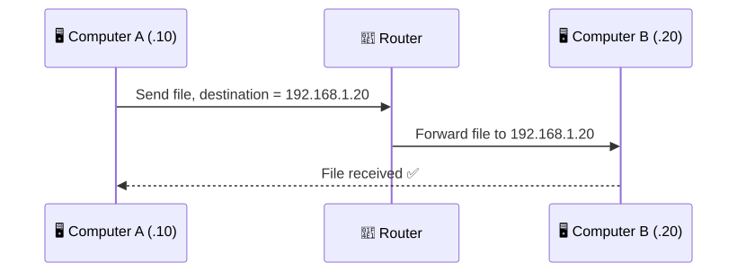

# 🌐 IP Address

**Section:** Networking Foundations &nbsp;·&nbsp; **Topic:** 1 of 130 &nbsp;·&nbsp; **Level:** 🟢 Beginner

## 📖 First, a Quick Story

Think of a large building with a hundred flats. If someone wants to deliver a letter to you, just writing "this building" on the envelope is not enough. The postman needs your exact flat number, such as Flat 14B. Without that number, the letter could reach the wrong door, or not be delivered at all.

Every device connected to a network — your laptop, your phone, or a website's server — is like one flat in a very large building. An **IP address** is that flat number. It tells the network exactly which device the data should go to, out of every other device connected to it.

This is the basic idea behind an IP address. The rest of this lesson explains it in full detail.

## 🧠 What Is It?

An **IP address** (Internet Protocol address) is a number assigned to a device so that other devices on a network can find it and send it data.

Every device that communicates on a network — a laptop, a phone, a server, a printer — needs an address. The IP address is that address. Without it, no other device would know where to send information.

An IP address looks like this:

```
192.168.1.10
```

That is an example of the most common format, called IPv4. It is written as four numbers separated by dots. Each number is called an **octet**, and each octet can range from 0 to 255.

## 🎯 Why Does It Exist?

Computer networks work by sending small chunks of data, called **packets** (a packet is simply a unit of data with some information attached to it, describing where it needs to go), from one device to another.

For a packet to reach the correct device, two things are required:

1. Every device must have a unique identifier on the network.
2. That identifier must fit into a system that lets other devices calculate how to reach it.

The IP address solves both problems. It gives each device a unique number, and that number is structured in a way that networking equipment (like routers) can use to determine where to send the data.

Without IP addresses, a network would have no reliable way to say "this data goes to that specific device."

## ⚙️ How Does It Work?

When one device wants to send data to another, it needs to know the destination device's IP address, in the same way a postman needs a destination address to deliver a letter.

The basic flow looks like this:

<p align="center"></p>

Step by step:

1. Device A wants to send data to Device B.
2. Device A attaches Device B's IP address to the data.
3. The network (switches, routers, etc.) reads that address.
4. The network forwards the data toward the device that owns that address.
5. Device B receives the data because it recognizes the address as its own.

At this stage, you do not need to know how the network actually decides the exact path (that involves routing, which is a separate topic). The important idea here is simply: **the IP address is the label that identifies where data should go.**

What happens if the address is wrong:

<p align="center"></p>

If the destination address doesn't match a real device on the network, the data simply has nowhere correct to go — it is dropped rather than delivered.

## 🧩 Important Parts

| Term | Meaning |
|---|---|
| 🌐 IP address | A unique number assigned to a device on a network |
| 🔢 Octet | One of the four numbers in an IPv4 address (0–255 each) |
| 📦 Packet | A small unit of data sent across a network, carrying source and destination addresses |
| ✅ Unique | No two devices on the same network should have the same IP address at the same time |

🔍 **Note:** An IP address identifies a device's location on a network — it does not permanently identify the device itself. The same laptop can have a different IP address today than it had yesterday, especially on home or public networks.

## 💡 Simple Example

Imagine two computers on the same home network:

- Computer A: `192.168.1.10`
- Computer B: `192.168.1.20`

If Computer A wants to send a file to Computer B, it does the following:

1. Computer A prepares the data to send.
2. Computer A labels that data with the destination address `192.168.1.20`.
3. The home router looks at that address and forwards the data toward Computer B.
4. Computer B receives the data because the address matches its own.

If Computer A used the wrong address, such as `192.168.1.99` (a device that does not exist), the data would not reach Computer B. It would either be dropped or sent nowhere useful.

<p align="center"></p>

## 🔍 How It Looks in Real Life

- Every website you visit is hosted on a server that has an IP address.
- Your phone gets an IP address the moment it connects to Wi-Fi or mobile data.
- Smart home devices (cameras, TVs, thermostats) each get their own IP address on your home network.
- When you check "network settings" on a computer, you can see its current IP address listed there.

<p align="center"></p>

## ⚠️ Common Confusion

- ❌ **"An IP address identifies a person."**
  It identifies a device's network connection at a point in time, not a specific human being. Multiple people can share one device, and one device can have different addresses over time.

- ❌ **"My IP address never changes."**
  On many home and public networks, IP addresses are temporary and can change. This is explained further under **DHCP**, a later topic. For now, just know that an IP address is not always permanent.

- ❌ **"A device has only one IP address."**
  A device can have multiple IP addresses at once — for example, one for its Wi-Fi connection and a different one for a wired (Ethernet) connection. It can also have an address for the local network and a different one visible on the internet. This distinction is covered in the **Public vs Private IP** topic.

## 🛠️ Practical Example

On most computers, you can view the device's current IP address using a built-in command: <kbd>ipconfig</kbd> on Windows, or <kbd>ip addr</kbd> on Linux/macOS.

**Windows:**
```
ipconfig
```

**Linux/macOS:**
```
ip addr
```

Example output (simplified):

```
IPv4 Address. . . . . . . . . . . : 192.168.1.10
Subnet Mask . . . . . . . . . . . : 255.255.255.0
Default Gateway . . . . . . . . . : 192.168.1.1
```

What this means:

- `IPv4 Address` — the address assigned to this device.
- `Subnet Mask` and `Default Gateway` are related networking concepts covered in later topics. You do not need to understand them yet — just recognize that an IP address normally appears alongside this other information.

## 🧪 Quick Check

**1. What is an IP address used for?**
<details><summary>Answer</summary>To uniquely identify a device on a network so that data can be sent to it correctly.</details>

**2. How many numbers (octets) make up an IPv4 address, and what is the valid range for each?**
<details><summary>Answer</summary>Four octets, each ranging from 0 to 255.</details>

**3. True or False: An IP address always identifies the same physical device permanently.**
<details><summary>Answer</summary>False. IP addresses can change over time and are not tied permanently to one device.</details>

**4. If two devices on the same network had the exact same IP address, what problem would this cause?**
<details><summary>Answer</summary>The network would not be able to reliably tell the two devices apart, so data meant for one device could be delivered to the wrong one, or delivery could fail entirely.</details>

**5. Can one device have more than one IP address at the same time?**
<details><summary>Answer</summary>Yes — for example, a laptop can have separate IP addresses for its Wi-Fi and Ethernet connections.</details>

## 🧠 Remember This

<p align="center"></p>

- An IP address is a unique number that identifies a device on a network.
- It exists so that data can be delivered to the correct destination.
- IPv4 addresses are written as four numbers (0–255) separated by dots, like `192.168.1.10`.
- IP addresses can change over time and are not a permanent identity for a device or a person.
