# 🌐 IPv4 vs IPv6

**Section:** Networking Foundations &nbsp;·&nbsp; **Topic:** 2 of 130 &nbsp;·&nbsp; **Level:** 🟢 Beginner

## 📖 First, a Quick Story

Picture a small town that originally printed phone numbers with only 7 digits. That gave the town about 10 million possible numbers — more than enough when the town was founded. But decades later, the town grew into a huge city, and businesses, homes, and mobile phones needed far more numbers than 7 digits could ever provide. So the city introduced a new, longer phone number format with way more digits, guaranteeing that the city would never run out again.

That's the exact story of **IPv4 and IPv6**. IPv4 was the original addressing system, and it's running out of room. IPv6 is the newer, much larger system built to make sure the world never runs out of addresses.

## 🧠 What Is It?

**IPv4** and **IPv6** are two different versions of the IP addressing system (covered in the previous topic, [IP Address](01-ip-address.md)). Both do the same basic job — giving devices a unique address on a network — but they use different formats and were built to solve different problems.

- **IPv4** is the older, more common format. Example: `192.168.1.10`
- **IPv6** is the newer format, built to replace IPv4. Example: `2001:0db8:85a3:0000:0000:8a2e:0370:7334`

## 🎯 Why Does It Exist?

IPv4 was created decades ago, when far fewer devices existed on networks. IPv4 addresses are made of 32 bits, which allows for about 4.3 billion unique addresses.

At the time, 4.3 billion seemed like more than enough. But as the internet grew — with billions of phones, laptops, servers, and smart devices all needing addresses — the world started running out of available IPv4 addresses.

**IPv6** was created to solve this shortage. It uses 128 bits instead of 32, which allows for an enormous number of addresses — far more than the world could ever need.

So the core reason IPv6 exists is simple: **IPv4 was running out of room, and IPv6 provides essentially unlimited room.**

## ⚙️ How Does It Work?

Both IPv4 and IPv6 do the same job — labeling devices so data can be delivered to them — but they format that label differently.

**IPv4 format:**
- 32 bits total
- Written as four decimal numbers (0–255) separated by dots
- Example: `192.168.1.10`

**IPv6 format:**
- 128 bits total
- Written as eight groups of hexadecimal digits, separated by colons
- Example: `2001:0db8:85a3:0000:0000:8a2e:0370:7334`

🔍 **Hexadecimal** is just a different way of writing numbers, using digits 0–9 and letters A–F. You do not need to calculate hexadecimal by hand to understand this topic — just recognize that IPv6 addresses look longer and contain letters, while IPv4 addresses are shorter and use only numbers and dots.

<p align="center"></p>

Both address types are used to do the exact same task shown in the previous topic: label data so it reaches the correct device. The difference is only in the size and format of the label, and how many unique labels are possible.

What happens when the IPv4 pool runs low — networks squeeze more devices onto fewer public addresses:

<p align="center"></p>

## 🧩 Important Parts

| Term | Meaning |
|---|---|
| 🔢 Bit | The smallest unit of digital information (a 0 or a 1) |
| 🔵 32-bit address | An address built from 32 bits, used by IPv4 |
| 🟣 128-bit address | An address built from 128 bits, used by IPv6 |
| 🔤 Hexadecimal | A number format using 0–9 and A–F, used to write IPv6 addresses |
| ⚠️ Address exhaustion | The situation where all available addresses in a system have been used up (this happened with IPv4) |

## 💡 Simple Example

Imagine IPv4 is a phone number system that only allows 4.3 billion possible phone numbers. Early on, that was plenty. But as more people, businesses, and devices needed phone numbers, the system began running out of numbers to assign.

IPv6 is like switching to a much longer phone number format that allows for far more combinations — enough that running out is not a practical concern.

Real IPv4 address: `192.168.1.10`
Real IPv6 address: `2001:0db8:85a3:0000:0000:8a2e:0370:7334`

Both addresses identify a device. IPv6 just has room for vastly more devices.

## 🔍 How It Looks in Real Life

- Most home networks and websites still primarily use IPv4 today.
- Many internet service providers and mobile carriers have already added IPv6 support alongside IPv4.
- Major websites and cloud providers support both IPv4 and IPv6 at the same time, a setup called **dual stack** (a device or network that runs both IPv4 and IPv6 together).
- New devices, especially phones, are increasingly assigned IPv6 addresses by default.

## ⚠️ Common Confusion

- ❌ **"IPv6 replaced IPv4 completely."**
  Not yet. Both are still in wide use today. Many networks run both at the same time.

- ❌ **"IPv6 is only about having more addresses."**
  More address space is the main reason IPv6 exists, but IPv6 also changed some technical details in how addressing works internally. For a beginner, the most important fact to know is simply: more available addresses.

- ❌ **"IPv4 and IPv6 addresses can be mixed directly."**
  A device using IPv4 and a device using only IPv6 cannot communicate directly without a translation mechanism. They are two separate addressing systems.

## 🛠️ Practical Example

Running `ipconfig` (Windows) or `ip addr` (Linux/macOS) on a device often shows both types of addresses at once:

```
IPv4 Address. . . . . . . . . . . : 192.168.1.10
IPv6 Address. . . . . . . . . . . : 2001:0db8:85a3::8a2e:370:7334
```

This shows a device that has been assigned both an IPv4 address and an IPv6 address at the same time — a common real-world setup.

## 🧪 Quick Check

**1. What is the main reason IPv6 was created?**
<details><summary>Answer</summary>IPv4 had a limited number of possible addresses (about 4.3 billion), and the world was running out of them. IPv6 provides a vastly larger address space.</details>

**2. How many bits does an IPv4 address use? How many does an IPv6 address use?**
<details><summary>Answer</summary>IPv4 uses 32 bits. IPv6 uses 128 bits.</details>

**3. True or False: IPv6 has completely replaced IPv4.**
<details><summary>Answer</summary>False. Both are still widely used today, often at the same time on the same network (dual stack).</details>

**4. What character does IPv4 use to separate its number groups? What does IPv6 use?**
<details><summary>Answer</summary>IPv4 uses dots. IPv6 uses colons.</details>

**5. Can a device have both an IPv4 address and an IPv6 address at the same time?**
<details><summary>Answer</summary>Yes. This is common and is called dual stack.</details>

## 🧠 Remember This

- IPv4 and IPv6 are two versions of IP addressing that do the same basic job: identifying devices on a network.
- IPv4 uses 32-bit addresses and is running low on available addresses.
- IPv6 uses 128-bit addresses and provides a vastly larger address space.
- Both are still used today, often side by side on the same network.
