# 🌐 Public vs Private IP

**Section:** Networking Foundations &nbsp;·&nbsp; **Topic:** 3 of 130 &nbsp;·&nbsp; **Level:** 🟢 Beginner

## 📖 First, a Quick Story

Think about that same apartment building again. Inside the building, each apartment has a simple internal number: Unit 1, Unit 2, Unit 3. Those numbers only make sense inside the building — a delivery driver across the city can't use "Unit 5" to find you. Instead, the building itself has one official street address that the whole outside world uses to find the building. Once a delivery reaches the building's front desk, the staff there reads the package and routes it to the correct internal unit.

That's exactly how **private and public IP addresses** work. Devices inside your home network get simple private addresses that only make sense inside your home. Your router holds the one public address that the rest of the internet actually uses to reach your home, and it sorts incoming data to the correct device inside.

## 🧠 What Is It?

Every IP address (covered in [IP Address](01-ip-address.md)) falls into one of two categories:

- **Private IP** — an address used only inside a local network, such as a home or office network.
- **Public IP** — an address used to identify a device (or network) on the internet.

Example private address: `192.168.1.10`
Example public address: `203.0.113.45`

Both are IP addresses. The difference is where they are valid and visible.

## 🎯 Why Does It Exist?

As explained in the previous topic ([IPv4 vs IPv6](02-ipv4-vs-ipv6.md)), IPv4 only has about 4.3 billion possible addresses. That is not enough for every device in the world to have its own permanent, globally unique address.

To solve this, networking designers reserved certain ranges of IP addresses to be used privately, inside local networks only. These private addresses can be reused in millions of different networks at the same time, because they are never directly visible on the public internet.

This means your home network can use `192.168.1.10` for your laptop, and a completely different home across the world can also use `192.168.1.10` for their laptop, with no conflict — because neither address is ever exposed directly to the internet.

Public IP addresses, on the other hand, must be globally unique, because they identify a device or network on the internet itself.

## ⚙️ How Does It Work?

A typical home or office network has one public IP address, shared by all the devices inside it. Each individual device inside that network gets its own private IP address.

<p align="center"></p>

Step by step:

1. Devices inside the home (laptop, phone) each get a private IP address from the router.
2. When a device sends data to the internet, the router replaces the device's private address with the router's own public address.
3. The data travels across the internet using that public address.
4. When a response comes back, the router figures out which internal device it belongs to and forwards it there.

What happens if someone on the internet tries to reach a private address directly:

<p align="center"></p>

Private addresses like `192.168.1.10` simply don't exist as destinations on the public internet — routers across the internet are built to ignore them. This is exactly why NAT is needed for a private device to reach the internet at all.

This translation process (a device that swaps a private address for a public one) is called **NAT**, short for Network Address Translation. NAT is covered in detail in a later topic — for now, just know that it is the mechanism that allows many private devices to share one public address.

## 🧩 Important Parts

| Term | Meaning |
|---|---|
| 🔵 Private IP | An address valid only within a local network |
| 🌐 Public IP | An address valid and reachable on the internet |
| 📡 Router | A device that connects a local network to the internet and manages address translation |
| 🔁 NAT | The process of translating private addresses to a public address (and back) |

🔍 **Reserved private IP ranges (IPv4):**

| Range | Common Use |
|---|---|
| `10.0.0.0` – `10.255.255.255` | Large organizations |
| `172.16.0.0` – `172.31.255.255` | Medium-sized networks |
| `192.168.0.0` – `192.168.255.255` | Home networks |

These ranges are officially reserved for private use, meaning they are never assigned to devices directly on the public internet.

## 💡 Simple Example

Imagine a house with three devices connected to Wi-Fi:

- Laptop: private IP `192.168.1.10`
- Phone: private IP `192.168.1.20`
- Smart TV: private IP `192.168.1.30`

The home router has one public IP address: `203.0.113.45`.

When the laptop visits a website:

1. The laptop sends the request using its private address, `192.168.1.10`.
2. The router replaces that address with its public address, `203.0.113.45`, before sending it to the internet.
3. The website only ever sees `203.0.113.45` — it never sees the laptop's private address.
4. The router remembers which device asked for the page, so when the reply comes back, it forwards it correctly to the laptop.

## 🔍 How It Looks in Real Life

- Checking your device's IP address at home (via `ipconfig` or `ip addr`) shows a private address like `192.168.x.x`.
- Searching "what is my IP" in a web browser shows your **public** IP address — the one your router uses to represent your whole network to the internet.
- Businesses often have a single public IP address (or a small block of them) representing hundreds of internal devices, all using private addresses.

## ⚠️ Common Confusion

- ❌ **"My private IP is the same as my public IP."**
  They are almost always different. Your private IP identifies your device within your home or office network. Your public IP identifies your entire network to the internet.

- ❌ **"A private IP is unsafe to share."**
  A private IP address, by itself, is not something an outside attacker can directly connect to, since private addresses aren't routable on the public internet. It's your public IP and any open services that primarily determine what's reachable from outside. That said, treat network details generally with care.

- ❌ **"Every device has a unique public IP."**
  In most home and small business setups, one public IP is shared by many devices through NAT. Unique public IPs per device are more common in specific business or hosting setups.

## 🛠️ Practical Example

Comparing the two using common commands:

**Private IP (local device):**
```
ipconfig
```
```
IPv4 Address. . . . . . . . . . . : 192.168.1.10
```

**Public IP (as seen by the internet):**
Visiting a "what is my IP" service in a browser might show:
```
203.0.113.45
```

These two addresses represent the same device's traffic, but at two different points: before and after it leaves the home network.

## 🧪 Quick Check

**1. What is the main difference between a public IP and a private IP?**
<details><summary>Answer</summary>A private IP is only valid inside a local network, while a public IP is valid and reachable on the internet.</details>

**2. Why can two completely different homes both use 192.168.1.10 for a device?**
<details><summary>Answer</summary>Because private IP addresses are never directly exposed to the internet, the same private address can be reused independently in many separate local networks without conflict.</details>

**3. What role does a router typically play regarding public and private IPs?**
<details><summary>Answer</summary>The router holds the public IP address representing the whole network, while assigning and managing private IP addresses for devices inside the network, translating between the two using NAT.</details>

**4. True or False: Most devices in a home network each have their own unique public IP address.**
<details><summary>Answer</summary>False. In most home setups, all devices share a single public IP address through the router, while each has its own private IP internally.</details>

**5. If you check your IP address using a "what is my IP" website versus using ipconfig on your own device, would you expect the same result?**
<details><summary>Answer</summary>Usually not. The "what is my IP" website shows your public IP address, while ipconfig shows your device's private IP address on the local network.</details>

## 🧠 Remember This

- Private IP addresses are used inside local networks and are not directly reachable from the internet.
- Public IP addresses are used to identify a device or network on the internet and must be globally unique.
- Routers typically hold the public IP address and assign private IP addresses to devices inside the network.
- NAT is the process that translates between private and public addresses, allowing many devices to share one public IP.
