# 📜 Protocol

**Section:** Networking Foundations &nbsp;·&nbsp; **Topic:** 6 of 130 &nbsp;·&nbsp; **Level:** 🟢 Beginner

## 📖 First, a Quick Story

Picture two air traffic controllers from different countries guiding planes near a shared border. If one speaks only in kilometers and local slang, and the other only understands nautical miles and different terms, a small misunderstanding could be dangerous. That's why aviation has one standardized language and one standardized set of radio procedures that every controller and pilot in the world agrees to follow, no matter their home country.

A **protocol** is that same idea, applied to computers. It's an agreed-upon set of rules that lets two devices — even from completely different manufacturers — understand each other perfectly, every time.

## 🧠 What Is It?

A **protocol** is a set of agreed-upon rules that devices follow so they can communicate with each other correctly.

Just as two people need to speak the same language and follow the same conversational rules (like taking turns speaking) to understand each other, two devices need to follow the same protocol to exchange data successfully.

Examples of protocols include HTTP (used for loading websites), TCP (used for reliable data delivery), and DNS (used for looking up domain names). Each of these is covered in its own topic later — this topic focuses only on what a protocol is in general.

## 🎯 Why Does It Exist?

Networks connect many different devices, often built by different manufacturers, running different software, sometimes even in different countries. For any two of these devices to exchange data successfully, they need a shared, precise agreement on:

- How the data should be formatted
- What order steps should happen in
- How to handle errors or unexpected situations
- How to know when a message starts and ends

Without a shared protocol, one device might send data in a format the other device doesn't understand, the same way a message written in an unfamiliar language would be meaningless to the reader.

Protocols exist to make sure that communication is predictable and reliable, no matter what specific hardware or software each side is using.

## ⚙️ How Does It Work?

A protocol defines a specific set of steps or message formats that both sides of a conversation must follow. Different protocols are designed for different purposes.

<p align="center"></p>

General idea, step by step:

1. Both devices agree (in advance, by design) to use a specific protocol for a specific type of communication.
2. Device A formats its message according to that protocol's rules.
3. Device B receives the message and, because it understands the same protocol, correctly interprets what Device A sent.
4. Device B responds using the same protocol's rules, so Device A can understand the reply.

What happens when both sides don't share the same protocol:

<p align="center"></p>

If Device B doesn't understand Protocol X, the message can't be interpreted correctly — regardless of whether the network delivery itself worked fine.

Different protocols exist for different jobs. For example, one protocol might define how to reliably transfer a file, while a completely different protocol defines how to request a web page. Using the wrong protocol, or a device that doesn't understand a given protocol, would result in communication failure.

## 🧩 Important Parts

| Term | Meaning |
|---|---|
| 📜 Protocol | A defined set of rules for how devices communicate |
| 🧱 Format | The structure a message must follow to be understood |
| ✅ Standard | A protocol that is publicly documented and widely agreed upon, so different manufacturers can build compatible systems |

🔍 Many networking protocols are defined by official standards organizations, so that companies all over the world can build software and hardware that correctly follow the same rules and can talk to each other.

## 💡 Simple Example

Think about how a formal letter has an expected format: a date, a greeting, a body, and a signature. If someone writes a letter following that exact structure, the reader knows exactly where to look for each piece of information.

Protocols work the same way for network communication. For example, when a web browser requests a web page, it follows the HTTP protocol's rules: it sends a specifically structured request, and the web server sends back a specifically structured response. Because both sides follow the same rules, the browser knows how to correctly read and display the reply.

If the browser sent a request in a completely different format, the server wouldn't understand it, in the same way an oddly-formatted letter might confuse the reader.

## 🔍 How It Looks in Real Life

- Every time a web page loads, it succeeds because the browser and the web server follow the HTTP or HTTPS protocol.
- Sending an email relies on protocols like SMTP for sending and IMAP/POP3 for receiving (covered in later topics).
- File transfers between systems rely on protocols like FTP or SFTP.
- Even something as basic as a device asking "is this device online?" relies on a protocol called ICMP.

## ⚠️ Common Confusion

- ❌ **"A protocol is a physical piece of hardware."**
  A protocol is a set of rules, not a physical object. It can be implemented in software or hardware, but the protocol itself is the agreed-upon standard, not a device.

- ❌ **"There is only one protocol for all network communication."**
  There are many protocols, each designed for a specific purpose. Some handle web pages, some handle email, some handle file transfers, and so on. The right protocol depends on what kind of communication is needed.

- ❌ **"Protocols are optional suggestions."**
  Devices must follow a protocol's rules exactly to communicate successfully with another device using that same protocol. Small deviations can cause communication to fail entirely.

## 🛠️ Practical Example

You can often see a protocol referenced directly in a web address:

```
https://example.com
```

Here, `https` specifies which protocol the browser should use to communicate with the web server (in this case, the secure version of HTTP). If this were `http://example.com` instead, the browser would use the standard, non-secure version of the same underlying protocol family.

This distinction (HTTP vs HTTPS) is covered in more detail in their own dedicated topics later.

## 🧪 Quick Check

**1. What is a protocol, in simple terms?**
<details><summary>Answer</summary>A set of agreed-upon rules that devices follow so they can communicate correctly with each other.</details>

**2. Why can't devices just communicate however they want, without a shared protocol?**
<details><summary>Answer</summary>Because without shared rules for formatting and structuring communication, one device might send data in a way the other device cannot correctly interpret, causing communication to fail.</details>

**3. True or False: There is only one universal protocol used for all types of network communication.**
<details><summary>Answer</summary>False. Different protocols exist for different purposes, such as web browsing, email, and file transfer.</details>

**4. What happens if two devices try to communicate but do not follow the same protocol?**
<details><summary>Answer</summary>The communication will typically fail, because at least one side won't correctly understand the format or rules the other side is using.</details>

**5. Give one real-world example of a protocol and what it is used for.**
<details><summary>Answer</summary>Examples include HTTP (used for loading web pages) or SMTP (used for sending email). Any correctly matched protocol-and-purpose pair is a valid answer.</details>

## 🧠 Remember This

- A protocol is a set of rules that allows devices to communicate correctly and predictably.
- Protocols exist because different devices and software need a shared standard to understand each other.
- Different protocols are designed for different types of communication (web pages, email, file transfer, etc.).
- Both sides of a communication must follow the same protocol for it to work.
