# 🌐 LAN, WAN, and Internet

**Section:** Networking Foundations &nbsp;·&nbsp; **Topic:** 9 of 130 &nbsp;·&nbsp; **Level:** 🟢 Beginner

## 📖 First, a Quick Story

Think about three levels of a road system. First, there are small neighborhood streets connecting the houses on your block. Then, there are highways connecting entire cities together. Finally, there's the vast network of roads, highways, and shipping routes that connects the whole world.

Computer networks have the same three levels. A **LAN** is your neighborhood streets — a small, local network like your home or office. A **WAN** is the highway system — a network connecting multiple locations across a larger distance. The **internet** is the global road system — the enormous network of networks connecting nearly everything, everywhere.

## 🧠 What Is It?

- **LAN (Local Area Network)** — a network confined to a small physical area, like a home, office, or single building.
- **WAN (Wide Area Network)** — a network that spans a much larger geographic area, connecting multiple LANs together, often across cities or countries.
- **Internet** — the single, massive, global network made up of countless interconnected LANs and WANs worldwide.

These three terms describe network *scale*, from smallest to largest.

## 🎯 Why Does It Exist?

Different situations require networks of different sizes and purposes:

- A home or office needs its devices to talk to each other quickly and privately — this is what a LAN is designed for.
- A company with offices in different cities needs those separate local networks to communicate with each other as if they were one — this is what a WAN is designed for.
- The world needs a way for any network, anywhere, to potentially reach any other network — this is what the internet provides.

Without this layered structure, every device in the world would need to somehow connect directly to every other device, which would be completely impractical. Instead, small networks (LANs) connect into larger networks (WANs), which connect into the largest network of all (the internet).

## ⚙️ How Does It Work?

<p align="center"></p>

Step by step, in terms of scale:

1. Devices within a single home or office connect to each other directly through a local network — this is the LAN.
2. If an organization has multiple locations (say, offices in two different cities), those separate LANs can be connected together over long distances, forming a WAN.
3. Beyond any single organization, all of these networks — homes, businesses, governments, internet providers — connect to each other through the internet, the global network of networks.
4. Data can travel from a device on one LAN, across a WAN or the internet, all the way to a device on a completely different LAN on the other side of the world.

## 🧩 Important Parts

| Term | Meaning |
|---|---|
| 🏠 LAN | A small, local network (e.g., a home or single office building) |
| 🛣️ WAN | A larger network connecting multiple LANs across greater distances |
| 🌍 Internet | The global network connecting LANs and WANs worldwide |
| 📡 ISP | Internet Service Provider — a company that connects a LAN (like your home) to the internet |

🔍 The internet itself is often described as "a network of networks" — it is not one single network owned by one entity, but a massive collection of interconnected networks, all agreeing to use compatible protocols (covered in the [Protocol](06-protocol.md) topic) so they can communicate with each other.

## 💡 Simple Example

Imagine a company with:
- An office in New York, where all the computers are connected together locally — this is a LAN.
- An office in London, also with its own LAN.
- A private connection linking the New York and London offices together, so employees at both locations can share files and systems as if they were on one network — this combination is a WAN.

If an employee in the New York office visits a public website hosted somewhere else in the world, that request leaves the company's WAN entirely and travels across the internet to reach the website's server.

## 🔍 How It Looks in Real Life

- Your home Wi-Fi network, connecting your laptop, phone, and smart TV, is a LAN.
- A bank with hundreds of branches, all connected to share account information securely, uses a WAN.
- Visiting any website, checking email, or streaming video from a service hosted elsewhere in the world involves the internet.
- Internet Service Providers (ISPs) are the companies that connect individual LANs (like homes) to the broader internet.

## ⚠️ Common Confusion

- ❌ **"The internet and Wi-Fi are the same thing."**
  Wi-Fi is a way for devices to connect *locally* to a LAN, without cables. The internet is the much larger, global network that a LAN can connect to (often through an ISP). A LAN can exist without internet access at all — for example, a home network could still let two computers talk to each other locally even with no internet connection.

- ❌ **"A WAN is just a bigger LAN."**
  A WAN isn't simply a scaled-up LAN — it typically connects multiple separate LANs together using different equipment and often relies on ISPs or dedicated long-distance connections, whereas a LAN is self-contained within one location.

- ❌ **"The internet is one single network owned by one company."**
  The internet is a global collection of many independently owned and operated networks that agree to interconnect and use shared protocols.

## 🛠️ Practical Example

At home, checking connected devices on a router's admin page often shows every device on your LAN, such as:

```
Device: Laptop        IP: 192.168.1.10
Device: Phone         IP: 192.168.1.20
Device: Smart TV      IP: 192.168.1.30
```

All of these devices are part of the same LAN. When any of them browse a public website, the router forwards that traffic out through your ISP and onto the internet — beyond the boundary of your local network.

## 🧪 Quick Check

**1. What is the main difference between a LAN and a WAN?**
<details><summary>Answer</summary>A LAN is a small, local network (like a home or single building), while a WAN connects multiple LANs together across a larger geographic distance.</details>

**2. How does the internet relate to LANs and WANs?**
<details><summary>Answer</summary>The internet is the global network of networks — it connects countless LANs and WANs worldwide, allowing them to communicate with each other.</details>

**3. True or False: Wi-Fi and the internet are the same thing.**
<details><summary>Answer</summary>False. Wi-Fi is a way to connect devices locally within a LAN. The internet is the separate, larger global network that a LAN can connect to.</details>

**4. Can a LAN function without an internet connection?**
<details><summary>Answer</summary>Yes. Devices on the same LAN can communicate with each other locally even without any connection to the internet.</details>

**5. Give a real-world example of a LAN and a real-world example of a WAN.**
<details><summary>Answer</summary>A home Wi-Fi network is an example of a LAN. A company's private network connecting offices in different cities is an example of a WAN. Any similarly correct examples are valid.</details>

## 🧠 Remember This

- LAN, WAN, and internet describe network scale, from smallest to largest.
- A LAN is a small, local network; a WAN connects multiple LANs over greater distances; the internet is the global network of networks.
- Wi-Fi is a way to connect to a LAN — it is not the same thing as the internet.
- The internet is a decentralized collection of many independently connected networks, not one single owned network.
